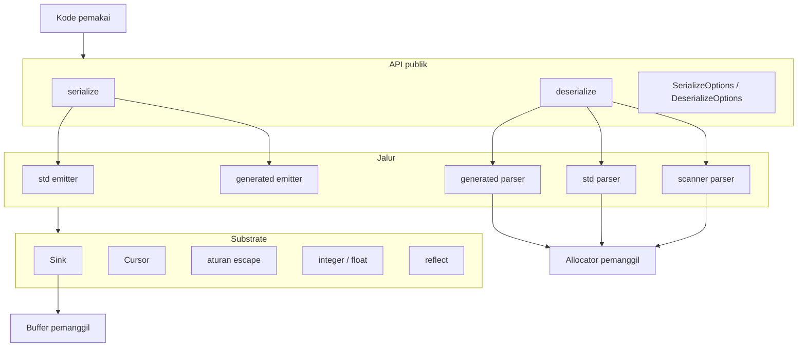
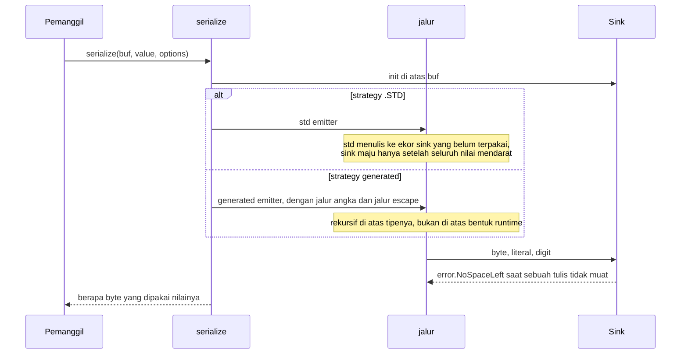
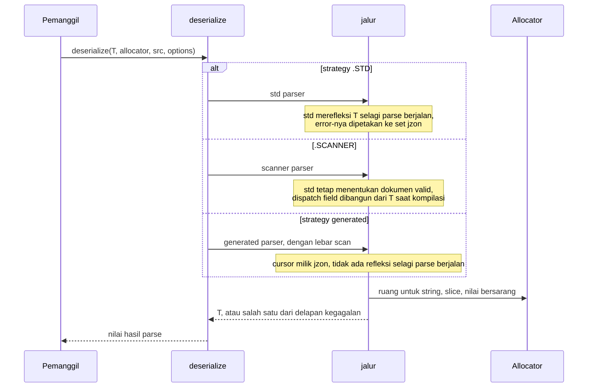

# Desain tingkat tinggi jzon

## Ruang lingkup

jzon adalah library JSON murni Zig, hanya memakai standard library. Ia membaca dan menulis grammar RFC 8259 secara langsung. Dokumen ini membahas bentuk library-nya: layer-nya, komponennya, kedua alurnya, dan bagaimana sebuah strategy memilih jalur. Detail tingkat byte ada di `lld-id.md`.

Desainnya berpegang pada satu gagasan: setiap jalur menghasilkan byte yang sama dan membaca dokumen yang sama, jadi pemanggil yang menukar satu dengan yang lain mengubah biaya panggilannya dan tidak lebih.

## Layer

- Layer API adalah dua fungsi dan dua struct options. Ia memiliki satu keputusan: jalur mana yang berjalan.
- Sebuah jalur memiliki cara sebuah nilai dirender atau dibaca. Ia tidak pernah melihat strategy mana yang menyebutnya.
- Substrate memiliki mekanismenya: ke mana byte berikutnya pergi, di mana sebuah token berakhir, bagaimana sebuah byte di-escape, bagaimana sebuah angka dieja, dan sedikit pertanyaan yang dijawab berbeda oleh dua versi Zig.
- Buffer dan allocator milik pemanggil. jzon tidak memegang keduanya.

## Komponen

| Komponen | Tanggung jawab |
| :- | :- |
| `lib.zig` | permukaan publik: dua panggilan, tipe options, set error |
| `sink.zig` | write cursor: ke mana byte berikutnya pergi dan apakah masih ada ruang |
| `cursor.zig` | read cursor: dari mana byte berikutnya datang dan di mana sebuah token berakhir |
| `cursor_vector.zig` | dua scan yang sama, satu lane sekaligus: skip whitespace, akhir string |
| `escape.zig` | aturan string RFC 8259 bagian 7, dua arah, satu pemilik |
| `escape_vector.zig` | encoding yang sama, dengan scan escape satu lane sekaligus |
| `integer.zig` | dua cara menulis integer, satu cara membacanya kembali dengan rentang ditegakkan |
| `float.zig` | bentuk angka JSON dari sebuah float, dua arah |
| `reflect.zig` | pertanyaan tipe yang dijawab berbeda oleh Zig 0.16 dan 0.17, ditanya di satu tempat |
| `serialize/options.zig` | apa yang diserahkan pemanggil ke render, dan apa yang bisa dikembalikan render |
| `serialize/serialize.zig` | entry point: pilih jalur tulis, jalankan, laporkan panjangnya |
| `serialize/std_emitter.zig` | render lewat `std.json.Stringify` ke buffer pemanggil |
| `serialize/generated_emitter.zig` | render lewat kode yang dibangun dari tipenya saat kompilasi |
| `deserialize/options.zig` | apa yang diserahkan pemanggil ke parse, dan satu set error yang dipakai semua jalur |
| `deserialize/deserialize.zig` | entry point: pilih jalur baca dan jalankan |
| `deserialize/std_parser.zig` | parse lewat refleksi `std.json`, dengan error std dipetakan ke set jzon |
| `deserialize/scanner_parser.zig` | token dari `std.json.Scanner`, dispatch dibangun dari tipenya |
| `deserialize/generated_parser.zig` | parse langsung di atas cursor milik jzon, dispatch dibangun dari tipenya |
| `deserialize/fields.zig` | field sasaran mana yang sudah diisi dokumen, dan apa yang terjadi pada sisanya |
| `deserialize/scan.zig` | scan baca mana dari dua yang dijalankan sebuah parse |
| `deserialize/skip.zig` | melangkahi satu nilai utuh tanpa membangun apa pun darinya |
| `deserialize/string_value.zig` | token string menjadi byte: slice dari dokumen, atau salinan |

## Alur tulis

Tidak ada yang mengalokasi. Nilai yang tidak muat melaporkan `error.NoSpaceLeft` tanpa panjang, jadi apa pun isi buffer setelahnya bukan nilai yang ter-render.

## Alur baca

Semua yang ditunjuk hasilnya berasal dari allocator pemanggil. Di bawah `strings = .BORROW` string tanpa escape menjadi slice dari dokumennya, jadi dokumen itu harus hidup lebih lama dari nilainya.

## Ke mana sebuah strategy mendarat

Strategy adalah nama untuk sebuah pasangan. Entry point menguraikannya dan jalur di bawahnya hanya diberi apa yang ia butuhkan.

Sisi tulis:

| Strategy | Jalur integer | Scan escape |
| :- | :- | :- |
| `.GENERATED_FMT` | `std.fmt` | satu byte sekali jalan |
| `.GENERATED` | digit langsung ke buffer | satu byte sekali jalan |
| `.GENERATED_VECTOR` | digit langsung ke buffer | satu vector lane sekaligus |

Sisi baca:

| Strategy | Lebar scan |
| :- | :- |
| `.GENERATED` | satu byte sekali jalan |
| `.GENERATED_VECTOR` | satu vector lane sekaligus |

Kedua sumbu di sisi tulis saling bebas, jadi setiap pasangan ada di emitter-nya. Empat strategy itu adalah pasangan yang layak dinamai, bukan satu-satunya yang bisa dijalankan emitter.

## Model alokasi

| Arah | Yang dialokasi | Pemiliknya |
| :- | :- | :- |
| serialize | tidak ada | buffer pemanggil memuat seluruh hasilnya |
| deserialize, `strings = .COPY` | setiap string, slice, dan nilai bersarang | allocator pemanggil |
| deserialize, `strings = .BORROW` | slice, nilai bersarang, dan string mana pun yang membawa escape | allocator pemanggil, dengan string bersih menunjuk ke dalam dokumen |

String ber-escape didekode ke allocator mode mana pun yang diminta, karena byte hasil dekodenya tidak muncul di mana pun dalam dokumen untuk ditunjuk.

## Model error

Satu set error per arah, dipakai bersama oleh setiap jalur.

Sisi tulis punya satu kegagalan, karena tidak ada yang dialokasi dan buffer-nya tetap. Sisi baca punya delapan, dan jalur yang tidak bisa membedakan dua di antaranya tetap melapor lewat set yang sama: `.STD` melaporkan escape rusak sebagai syntax error alih-alih `BadEscape`, karena std tidak memisahkan keduanya. Pemanggil menulis satu `catch` dan tidak perlu menengoknya lagi setelah mengganti strategy.

## Kenapa strategy-nya ada

Jalur berbasis std adalah yang paling mampu. Keduanya menerima setiap bentuk yang diterima std, termasuk bentuk yang tidak punya padanan JSON di jalur generated, dan itulah kenapa keduanya jadi default.

Jalur generated menguraikan bentuk tipenya saat kompilasi. Di sisi tulis itu berarti setiap key object, kutipnya, titik duanya, dan koma sebelumnya runtuh jadi satu literal, sehingga sebuah field berbiaya satu salinan berukuran tetap ditambah nilainya. Di sisi baca itu berarti tidak ada refleksi selagi parse berjalan dan tidak ada token yang dibangun untuk field yang tidak dimiliki tipenya.

Pertukaran itulah keseluruhan desainnya: kemampuan sebagai default, dan jalur yang diuraikan saat kompilasi yang dipilih pemanggil per call-site begitu bentuknya diketahui berupa record biasa. `benchmark-id.md` memberi angka untuk nilai pertukaran itu pada satu record.
