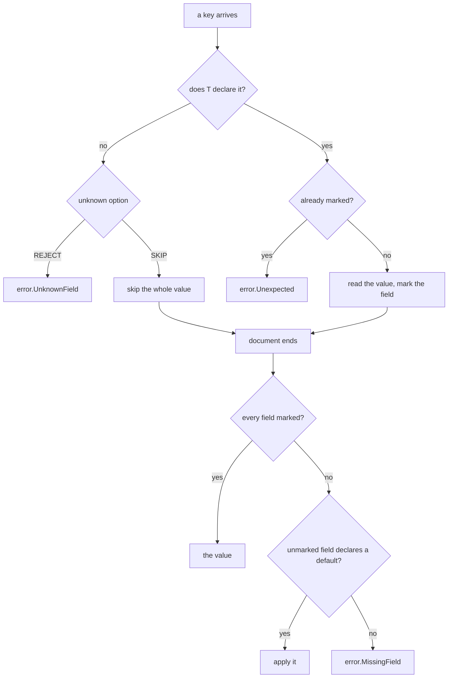

# jzon low-level design

This document covers the byte-level and internal detail. For the shape of the library read `hld-en.md` first.

## The write cursor

`Sink` is a bounds-checked cursor over a caller-owned buffer. It owns one thing: where the next byte goes and whether there is room for it.

| Call | What it does |
| :- | :- |
| `byte(value)` | write one byte |
| `bytes(source)` | copy a run of bytes |
| `literal(text)` | copy a comptime-known run, so the length is a constant at the copy |
| `reserve(len)` | take `len` bytes of room and hand back the slice to fill |
| `tail()` | the unwritten remainder, for a writer that formats straight into it |
| `commit(len)` | advance the position after something wrote into `tail()` |
| `filled()` / `written()` | what has landed so far |

One call is all-or-nothing: a write that does not fit reports `error.NoSpaceLeft` and leaves the position untouched, so a half-written value never lands. A *sequence* of calls is not all-or-nothing. When the fourth of five writes fails, the first three are still in the buffer.

That is why the two write paths leave different things behind on failure. The std emitter formats into `tail()` and only calls `commit` once the whole value has landed, so a value too large leaves the sink exactly as it found it. The generated emitter writes as it produces, so it leaves the prefix that fit. Neither result is a rendered value, so a caller that needs all-or-nothing keeps its own mark.

## The read cursor

`Cursor` is the mirror: a bounds-checked cursor over a caller-owned document. Every read either has the bytes it needs or fails, so a truncated document can never be read past its end.

Two failures, and the split matters:

- `Truncated` means the document ended early.
- `Unexpected` means the byte that is there cannot start what was asked for.

| Call | What it does |
| :- | :- |
| `peek()` / `take()` | the byte under the cursor, without and with advancing |
| `expect(wanted)` | take one byte and require it to be `wanted` |
| `accept(wanted)` | take one byte if it is `wanted`, report whether it was |
| `literal(text)` | require a comptime-known run, for `true`, `false`, `null` |
| `skipSpace()` | step over insignificant whitespace |
| `stringSpan()` | bound a string token, both quotes included |
| `numberSpan()` | bound a number token |

### Whitespace

RFC 8259 section 2 allows exactly four insignificant bytes between tokens: space, horizontal tab, line feed, carriage return. That list lives in one constant and one `isSpace` predicate, and every scan over a document asks it. A control byte outside the set is a token's problem, not a skip's, so it is left where it is.

### String spans

`stringSpan` hands back a `StringSpan`: the undecoded bytes between the quotes, plus whether any of them are part of an escape sequence.

When `escaped` is false, the raw bytes *are* the string value. That is the one fact borrowing rests on: a parser can hand back a slice of the document rather than copy it.

## Escape rules

`escape.zig` owns the RFC 8259 section 7 rules in both directions, so encoding and decoding can never drift apart.

Encoding matches `std.json.Stringify` at its default options byte for byte:

- `"` and `\` go out as `\"` and `\\`.
- Five control bytes have a two-character spelling: `\b`, `\t`, `\n`, `\f`, `\r`.
- Every other byte below `0x20` goes out as `\u00xx` with lowercase hex.
- Everything else goes out raw, so valid UTF-8 above `0x7f` is untouched.

The control table is built at compile time into a fixed `[0x20]` array of `{ text: [6]u8, len: u8 }`, so a lookup needs no pointer chase and no branch beyond the length.

Decoding reads every escape form `std.json` reads, and refuses an unpaired surrogate half the same way.

## The vector scan

Three scans repeat often enough to be worth a wider width, and each has a lane-at-a-time twin that lands the cursor in the same place and reports the same failures:

| Scalar | Vector twin | What it scans |
| :- | :- | :- |
| `cursor.skipSpace` | `cursor_vector.skipSpace` | the whitespace between tokens |
| `cursor.stringSpan` | `cursor_vector.stringSpan` | where a string token ends |
| `escape.encodeBody` | `escape_vector.encodeBody` | which bytes of a string need escaping |

`LANES` is 16, held there because that is the width the measurement was taken at and the widest vector every supported target lowers without splitting.

Two details keep the cost honest:

- The whitespace skip asks the byte already under the cursor before it loads a lane. A minified document answers there and never enters the lane loop, which is the case that would otherwise pay the most for nothing.
- The escape encoder only copies a run of clean bytes when an escape interrupts it or the text ends, so a string with no escape costs one copy however long it is.

The rules stay in the scalar file either way. A vector scan finds the bytes that matter and then spells each hit through the same `spell` the scalar path uses, so the two spellings cannot diverge.

This pays on long strings and on documents that arrive laid out. It costs on short fields, where the lane setup buys one comparison. That is why the width is a call-site choice. `benchmark-en.md` measures a case where it costs on the read side.

## Integers

Two write paths, identical bytes, different work around the same digit loop.

Both convert two digits per iteration out of `std.fmt.digits2`. What separates them:

| Path | Setup | Scratch | Return |
| :- | :- | :- | :- |
| `appendFmt` | builds a `std.Io.Writer` per call and runs the width and alignment pass | none, formats into `tail()` | an error union checked at the call site |
| `appendTable` | none | a stack array sized `maxDigits(T)` | plain, one copy into the sink |

`maxDigits` bounds the decimal length from the bit width: log10(2) is just under 1/3, so `bits/3 + 1` never under-counts.

`appendTable` handles two sharp cases. `@abs` on a signed value yields the unsigned type of the same width, so the most negative value converts without overflowing. The running value is held at 8 bits or wider whatever `T` is, so a narrow field type still compares against the 100 and 10 the loop needs.

Reading an integer back enforces the target type's range. A value the field cannot hold reports `BadNumber`, the same way malformed digits do: the text is not a number this field takes.

## Floats

The number form matches `std.json.Stringify` byte for byte, which means inheriting how std renders.

std renders through `f64`. A value that survives the cast is written as a number, one that does not is written as a JSON string carrying its full precision. So an `f32` comes out as the `f64` nearest it (`0.1` becomes `0.10000000149011612`), and an `f128` that `f64` cannot hold comes out quoted.

Two values have no JSON form at all. std writes a NaN as the string `"nan"` and an infinity as the bare word `inf`, which no JSON parser accepts. jzon writes both the same way rather than disagree with the default path, so a field that can hold either needs the caller to rule it out first.

Reading a float back checks the RFC 8259 section 6 grammar here rather than leaving it to `std.fmt`, which is looser than JSON.

## Version reflection

Zig 0.16 and 0.17 answer three type questions differently, and `reflect.zig` is the only file that knows:

| Question | Zig 0.16 | Zig 0.17 |
| :- | :- | :- |
| a struct's fields | `@typeInfo(T).@"struct".fields` | split into `field_names` and `field_attrs` |
| an enum's exhaustiveness | `is_exhaustive` | `mode` |
| a field's declared default | read off the field record | read off the attrs record |

The branch reading the field that is not there never reaches the compiler, because the condition choosing it is known at compile time. `std.meta.fieldNames` and `@FieldType` answer the same on both versions, so a caller walking fields uses those directly rather than through here.

`defaultOf` returns the field's type wrapped in an optional, one level deeper than the field itself. That is what keeps "declares no default" and "defaults to null" apart for a field spelled `note: ?[]const u8 = null`.

## Field bookkeeping

Every generated parser needs the same two answers, so `fields.zig` owns them: one bool per field sized at compile time, nothing allocated.



The same key twice is `Unexpected`, not a silent last-one-wins.

## Strings on the read side

`string_value.zig` makes the borrow decision once, for every generated parser:

| Token | `strings = .COPY` | `strings = .BORROW` |
| :- | :- | :- |
| no escape | copied into the allocator | a slice of the document |
| carries an escape | decoded into the allocator | decoded into the allocator |

An escaped token is decoded into the allocator whichever mode was asked for, because its decoded bytes appear nowhere in the document to point at.

Sizing that decode needs no second pass: every escape spells more bytes than the character it stands for, so the decoded form is never longer than the undecoded one. The room taken is the undecoded length and the slack is handed straight back.

Under `.BORROW` the document has to outlive the value. On a server that is free, since the request buffer already does.

## Skipping a value

`unknown = .SKIP` runs `skip.zig`, which walks past one whole JSON value however deep it nests, allocating nothing and decoding no string.

The walk validates rather than merely bounds. A malformed value fails whether the parse wanted it or not, so a document the std-backed path refuses is refused here too.

A document is untrusted, so the nesting a walk follows is capped at `MAX_DEPTH = 256`. Anything deeper is `Unexpected` rather than being allowed to grow the stack.

## The generated emitter

The shape of the type is resolved at compile time, so the emitter recurses over the *type* and not over any runtime shape.

The payoff is object keys. Every key's comma, quotes, escaped name and colon collapse into one comptime literal, so a field costs one fixed-size copy plus its value. Nothing at runtime assembles punctuation.

Two axes are picked by the caller and are independent, so every pairing is available: how integers reach the buffer (`FMT` or `TABLE`), and how strings are scanned for the bytes that need escaping (`SCALAR` or `VECTOR`). The four named strategies are the pairings worth naming, not the only ones the emitter runs.

A field type with no JSON form is a compile error naming the type: a tuple, a non-slice pointer, a non-exhaustive enum. A non-exhaustive enum is refused in both directions, because there is no name to write and no value to read a name into.

## The two generated parsers

Both build their field dispatch from the type at compile time, so nothing reflects while the parse runs. They differ in who decides what a valid document is:

| Parser | Tokens from | What it owns |
| :- | :- | :- |
| `scanner_parser` | `std.json.Scanner` | the dispatch and the value building, std still validates the grammar |
| `generated_parser` | jzon's own `Cursor` | the grammar, the scan width, the escape decoding, and the dispatch |

Because `generated_parser` decodes escapes itself, it is the only path that can say *which* of the two things went wrong in a broken escape.

## The three differences from the default path

Every serialize strategy writes bytes every deserialize strategy reads back, so no round trip crosses these. They only appear on a document written by something else. Each has an edge test pinning it.

| Document | `.STD` | `.SCANNER` | `.GENERATED` and `.GENERATED_VECTOR` |
| :- | :- | :- | :- |
| `[104,105]` into a `[]const u8` | fills it, giving `"hi"` | `error.Unexpected` | `error.Unexpected` |
| `-0` into an unsigned field | reads the digits, giving `0` | `error.BadNumber` | `error.BadNumber` |
| `"\q"` | `error.Unexpected`, a syntax error | `error.Unexpected`, a syntax error | `error.BadEscape` |

The reasoning in each case:

- In jzon a slice of bytes is a string and nothing else, so the one spelling always means the one JSON form. Both paths built from the type refuse it.
- A sign against an unsigned field is a type error whatever the digits after it are.
- Only the path that decodes escapes itself can name a bad one. `.SCANNER` leaves that to std, so on this one it answers alongside `.STD`.

## One shared surprise

Spelling a field `?T` says what it can hold, not that a document may leave it out. `= null` is what makes it omissible.

```zig
const Owed = struct {
    id: u8,
    note: ?[]const u8,        // still owed, an omission is MissingField
};

const Optional = struct {
    id: u8,
    note: ?[]const u8 = null, // may be left out
};
```

This holds on every strategy including `.STD`, so it is not a difference between paths. It is the one shape that surprises a reader most often, which is why it has its own edge test.
