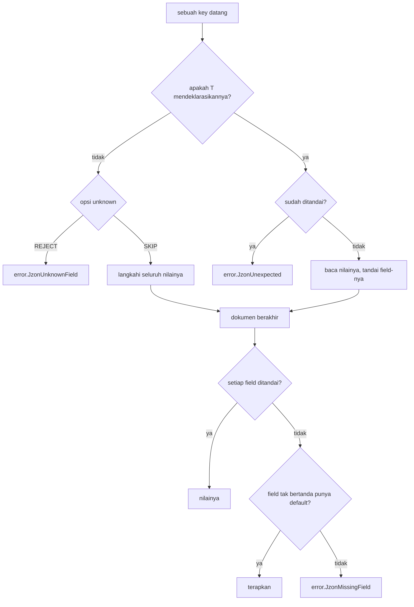

# Desain tingkat rendah jzon

Dokumen ini membahas detail tingkat byte dan internal. Untuk bentuk library-nya baca `hld-id.md` lebih dulu.

## Write cursor

`Sink` adalah cursor dengan pemeriksaan batas di atas buffer milik pemanggil. Ia memiliki satu hal: ke mana byte berikutnya pergi dan apakah masih ada ruang untuknya.

| Panggilan | Yang dilakukan |
| :- | :- |
| `byte(value)` | menulis satu byte |
| `bytes(source)` | menyalin serangkaian byte |
| `literal(text)` | menyalin rangkaian yang diketahui saat kompilasi, jadi panjangnya konstan saat penyalinan |
| `reserve(len)` | mengambil ruang `len` byte dan mengembalikan slice-nya untuk diisi |
| `tail()` | sisa yang belum ditulis, untuk writer yang memformat langsung ke sana |
| `commit(len)` | memajukan posisi setelah sesuatu menulis ke `tail()` |
| `filled()` / `written()` | apa yang sudah mendarat sejauh ini |

Satu panggilan bersifat semua-atau-tidak sama sekali: tulis yang tidak muat melaporkan `error.NoSpaceLeft` dan meninggalkan posisinya utuh, jadi nilai setengah tertulis tidak pernah mendarat. *Rangkaian* panggilan tidak begitu. Ketika tulis keempat dari lima gagal, tiga yang pertama tetap ada di buffer.

Itulah kenapa kedua jalur tulis meninggalkan hal berbeda saat gagal. std emitter memformat ke `tail()` dan baru memanggil `commit` setelah seluruh nilai mendarat, jadi nilai yang terlalu besar meninggalkan sink persis seperti saat ditemukan. generated emitter menulis sambil menghasilkan, jadi ia meninggalkan awalan yang muat. Keduanya bukan nilai yang ter-render, jadi pemanggil yang butuh semua-atau-tidak sama sekali memegang tandanya sendiri.

## Read cursor

`Cursor` adalah cerminnya: cursor dengan pemeriksaan batas di atas dokumen milik pemanggil. Setiap baca entah punya byte yang dibutuhkannya atau gagal, jadi dokumen terpotong tidak pernah bisa dibaca melewati ujungnya.

Dua kegagalan, dan pemisahannya penting:

- `Truncated` berarti dokumennya berakhir lebih awal.
- `Unexpected` berarti byte yang ada di sana tidak bisa mengawali apa yang diminta.

| Panggilan | Yang dilakukan |
| :- | :- |
| `peek()` / `take()` | byte di bawah cursor, tanpa dan dengan memajukan |
| `expect(wanted)` | mengambil satu byte dan mengharuskannya `wanted` |
| `accept(wanted)` | mengambil satu byte jika ia `wanted`, melaporkan apakah begitu |
| `literal(text)` | mengharuskan rangkaian yang diketahui saat kompilasi, untuk `true`, `false`, `null` |
| `skipSpace()` | melangkahi whitespace yang tidak bermakna |
| `stringSpan()` | membatasi token string, kedua kutipnya ikut |
| `numberSpan()` | membatasi token angka |

### Whitespace

RFC 8259 bagian 2 mengizinkan tepat empat byte tak bermakna di antara token: spasi, tab horizontal, line feed, carriage return. Daftar itu tinggal di satu konstanta dan satu predikat `isSpace`, dan setiap scan di atas dokumen menanyakannya. Byte kontrol di luar himpunan itu adalah urusan token, bukan urusan skip, jadi ia ditinggalkan di tempatnya.

### String span

`stringSpan` mengembalikan `StringSpan`: byte yang belum didekode di antara kedua kutip, ditambah apakah ada di antaranya yang merupakan bagian dari escape sequence.

Ketika `escaped` bernilai false, byte mentahnya *adalah* nilai string-nya. Itulah satu fakta yang menjadi tumpuan borrow: sebuah parser bisa mengembalikan slice dari dokumen alih-alih menyalinnya.

## Aturan escape

`escape.zig` memiliki aturan RFC 8259 bagian 7 untuk kedua arah, jadi encoding dan decoding tidak bisa saling menyimpang.

Encoding cocok dengan `std.json.Stringify` pada options default-nya, byte demi byte:

- `"` dan `\` keluar sebagai `\"` dan `\\`.
- Lima byte kontrol punya ejaan dua karakter: `\b`, `\t`, `\n`, `\f`, `\r`.
- Setiap byte lain di bawah `0x20` keluar sebagai `\u00xx` dengan hex huruf kecil.
- Sisanya keluar mentah, jadi UTF-8 valid di atas `0x7f` tidak disentuh.

Tabel kontrolnya dibangun saat kompilasi menjadi array tetap `[0x20]` berisi `{ text: [6]u8, len: u8 }`, jadi satu lookup tidak butuh pengejaran pointer dan tidak butuh cabang selain panjangnya.

Decoding membaca setiap bentuk escape yang dibaca `std.json`, dan menolak separuh surrogate yang tidak berpasangan dengan cara yang sama.

## Vector scan

Tiga scan cukup sering berulang sehingga lebar yang lebih besar sepadan, dan masing-masing punya kembaran per-lane yang mendaratkan cursor di tempat yang sama dan melaporkan kegagalan yang sama:

| Skalar | Kembaran vector | Yang dipindai |
| :- | :- | :- |
| `cursor.skipSpace` | `cursor_vector.skipSpace` | whitespace di antara token |
| `cursor.stringSpan` | `cursor_vector.stringSpan` | di mana token string berakhir |
| `escape.encodeBody` | `escape_vector.encodeBody` | byte string mana yang perlu di-escape |

`LANES` bernilai 16, dipertahankan di sana karena itulah lebar saat pengukuran diambil dan vector terlebar yang bisa diturunkan setiap target yang didukung tanpa dipecah.

Dua detail menjaga biayanya tetap jujur:

- Skip whitespace menanyakan byte yang sudah ada di bawah cursor sebelum memuat satu lane. Dokumen minified menjawab di sana dan tidak pernah masuk ke loop lane, dan itulah kasus yang kalau tidak begitu akan membayar paling banyak tanpa hasil.
- Encoder escape baru menyalin rangkaian byte bersih ketika sebuah escape menyelanya atau teksnya habis, jadi string tanpa escape berbiaya satu salinan sepanjang apa pun ia.

Aturannya tetap tinggal di file skalar. Scan vector menemukan byte yang penting lalu mengeja setiap temuan lewat `spell` yang sama dengan jalur skalar, jadi kedua ejaan itu tidak bisa berbeda.

Ini membayar pada string panjang dan pada dokumen yang datang ditata rapi. Ia jadi beban pada field pendek, di mana penyiapan lane hanya membeli satu perbandingan. Itulah kenapa lebarnya jadi pilihan per call-site. `benchmark-id.md` mengukur satu kasus di mana ia jadi beban di sisi baca.

## Integer

Dua jalur tulis, byte identik, kerja berbeda di sekitar loop digit yang sama.

Keduanya mengonversi dua digit per iterasi dari `std.fmt.digits2`. Yang memisahkan keduanya:

| Jalur | Penyiapan | Scratch | Kembalian |
| :- | :- | :- | :- |
| `appendFmt` | membangun `std.Io.Writer` per panggilan dan menjalankan pass lebar dan perataan | tidak ada, memformat ke `tail()` | error union yang diperiksa di setiap call site |
| `appendTable` | tidak ada | array stack berukuran `maxDigits(T)` | polos, satu salinan ke sink |

`maxDigits` membatasi panjang desimal dari lebar bit-nya: log10(2) sedikit di bawah 1/3, jadi `bits/3 + 1` tidak pernah kurang menghitung.

`appendTable` menangani dua kasus tajam. `@abs` pada nilai bertanda menghasilkan tipe unsigned selebar itu, jadi nilai paling negatif terkonversi tanpa overflow. Nilai berjalannya dipegang di 8 bit atau lebih apa pun `T`-nya, jadi tipe field yang sempit tetap bisa dibandingkan dengan 100 dan 10 yang dibutuhkan loop-nya.

Membaca integer kembali menegakkan rentang tipe sasarannya. Nilai yang tidak muat di field itu melaporkan `BadNumber`, sama seperti digit yang rusak: teksnya bukan angka yang diterima field ini.

## Float

Bentuk angkanya cocok dengan `std.json.Stringify` byte demi byte, yang berarti mewarisi cara std merender.

std merender lewat `f64`. Nilai yang selamat dari cast itu ditulis sebagai angka, yang tidak selamat ditulis sebagai string JSON yang membawa presisi penuhnya. Jadi `f32` keluar sebagai `f64` terdekatnya (`0.1` menjadi `0.10000000149011612`), dan `f128` yang tidak muat di `f64` keluar dalam kutip.

Dua nilai sama sekali tidak punya bentuk JSON. std menulis NaN sebagai string `"nan"` dan infinity sebagai kata telanjang `inf`, yang tidak diterima parser JSON mana pun. jzon menulis keduanya dengan cara yang sama alih-alih berbeda dari jalur default, jadi field yang bisa memuat salah satunya butuh pemanggil menyingkirkannya lebih dulu.

Membaca float kembali memeriksa grammar RFC 8259 bagian 6 di sini alih-alih menyerahkannya ke `std.fmt`, yang lebih longgar dari JSON.

## Refleksi versi

Zig 0.16 dan 0.17 menjawab tiga pertanyaan tipe secara berbeda, dan `reflect.zig` adalah satu-satunya file yang tahu:

| Pertanyaan | Zig 0.16 | Zig 0.17 |
| :- | :- | :- |
| field sebuah struct | `@typeInfo(T).@"struct".fields` | dipecah jadi `field_names` dan `field_attrs` |
| exhaustiveness sebuah enum | `is_exhaustive` | `mode` |
| default yang dideklarasikan sebuah field | dibaca dari record field-nya | dibaca dari record attrs-nya |

Cabang yang membaca field yang tidak ada tidak pernah sampai ke compiler, karena kondisi yang memilihnya diketahui saat kompilasi. `std.meta.fieldNames` dan `@FieldType` menjawab sama di kedua versi, jadi pemanggil yang menyusuri field memakai keduanya langsung, bukan lewat sini.

`defaultOf` mengembalikan tipe field-nya yang dibungkus optional, satu tingkat lebih dalam dari field-nya sendiri. Itulah yang menjaga "tidak mendeklarasikan default" dan "default-nya null" tetap terpisah untuk field yang dieja `note: ?[]const u8 = null`.

## Pembukuan field

Setiap generated parser butuh dua jawaban yang sama, jadi `fields.zig` yang memilikinya: satu bool per field, berukuran saat kompilasi, tidak ada yang dialokasi.



Key yang sama dua kali adalah `Unexpected`, bukan diam-diam yang terakhir menang.

## String di sisi baca

`string_value.zig` membuat keputusan borrow satu kali, untuk setiap generated parser:

| Token | `strings = .COPY` | `strings = .BORROW` |
| :- | :- | :- |
| tanpa escape | disalin ke allocator | slice dari dokumen |
| membawa escape | didekode ke allocator | didekode ke allocator |

Token ber-escape didekode ke allocator mode mana pun yang diminta, karena byte hasil dekodenya tidak muncul di mana pun dalam dokumen untuk ditunjuk.

Mengukur dekode itu tidak butuh pass kedua: setiap escape mengeja lebih banyak byte daripada karakter yang diwakilinya, jadi bentuk hasil dekode tidak pernah lebih panjang dari bentuk mentahnya. Ruang yang diambil adalah panjang mentahnya dan sisanya dikembalikan langsung.

Di bawah `.BORROW` dokumennya harus hidup lebih lama dari nilainya. Di sebuah server itu gratis, karena request buffer-nya sudah begitu.

## Melangkahi sebuah nilai

`unknown = .SKIP` menjalankan `skip.zig`, yang berjalan melewati satu nilai JSON utuh sedalam apa pun bersarangnya, tanpa mengalokasi apa pun dan tanpa mendekode string apa pun.

Jalannya memvalidasi, bukan sekadar membatasi. Nilai yang rusak gagal entah parse-nya menginginkannya atau tidak, jadi dokumen yang ditolak jalur berbasis std ditolak di sini juga.

Sebuah dokumen tidak tepercaya, jadi kedalaman bersarang yang diikuti dibatasi di `MAX_DEPTH = 256`. Apa pun yang lebih dalam adalah `Unexpected` alih-alih dibiarkan menumbuhkan stack.

## Generated emitter

Bentuk tipenya diuraikan saat kompilasi, jadi emitter-nya rekursif di atas *tipe* dan bukan di atas bentuk runtime apa pun.

Hasilnya ada di key object. Koma, kutip, nama ter-escape, dan titik dua setiap key runtuh jadi satu literal comptime, sehingga sebuah field berbiaya satu salinan berukuran tetap ditambah nilainya. Tidak ada yang merakit tanda baca saat runtime.

Dua sumbu dipilih pemanggil dan saling bebas, jadi setiap pasangan tersedia: bagaimana integer sampai ke buffer (`FMT` atau `TABLE`), dan bagaimana string dipindai untuk byte yang perlu di-escape (`SCALAR` atau `VECTOR`). Empat strategy bernama itu adalah pasangan yang layak dinamai, bukan satu-satunya yang dijalankan emitter.

Tipe field tanpa bentuk JSON adalah compile error yang menyebut tipenya: tuple, pointer non-slice, enum non-exhaustive. Enum non-exhaustive ditolak di kedua arah, karena tidak ada nama untuk ditulis dan tidak ada nilai untuk menerima sebuah nama.

## Dua generated parser

Keduanya membangun dispatch field-nya dari tipenya saat kompilasi, jadi tidak ada refleksi selagi parse berjalan. Bedanya ada pada siapa yang menentukan dokumen valid:

| Parser | Token dari | Yang dimilikinya |
| :- | :- | :- |
| `scanner_parser` | `std.json.Scanner` | dispatch dan pembangunan nilai, std tetap memvalidasi grammar-nya |
| `generated_parser` | `Cursor` milik jzon | grammar, lebar scan, decoding escape, dan dispatch |

Karena `generated_parser` mendekode escape sendiri, ia satu-satunya jalur yang bisa menyebut *yang mana* dari dua hal itu yang salah pada escape yang rusak.

## Tiga perbedaan dari jalur default

Setiap strategy serialize menulis byte yang dibaca kembali oleh setiap strategy deserialize, jadi tidak ada round trip yang melewati perbedaan ini. Semuanya hanya muncul pada dokumen yang ditulis sesuatu yang lain. Masing-masing punya edge test yang memakunya.

| Dokumen | `.STD` | `.SCANNER` | `.GENERATED` dan `.GENERATED_VECTOR` |
| :- | :- | :- | :- |
| `[104,105]` ke sebuah `[]const u8` | mengisinya, menghasilkan `"hi"` | `error.JzonUnexpected` | `error.JzonUnexpected` |
| `-0` ke field unsigned | membaca digitnya, menghasilkan `0` | `error.JzonBadNumber` | `error.JzonBadNumber` |
| `"\q"` | `error.JzonUnexpected`, sebuah syntax error | `error.JzonUnexpected`, sebuah syntax error | `error.JzonBadEscape` |

Alasannya masing-masing:

- Di jzon slice byte adalah string dan tidak lebih, jadi satu ejaan selalu berarti satu bentuk JSON. Kedua jalur yang dibangun dari tipenya menolaknya.
- Tanda di depan field unsigned adalah type error apa pun digit setelahnya.
- Hanya jalur yang mendekode escape sendiri yang bisa menyebut escape yang rusak. `.SCANNER` menyerahkannya ke std, jadi untuk yang satu ini ia menjawab bersama `.STD`.

## Satu kejutan bersama

Mengeja sebuah field `?T` menyatakan apa yang bisa dimuatnya, bukan bahwa dokumen boleh meninggalkannya. `= null` yang membuatnya boleh dihilangkan.

```zig
const Owed = struct {
    id: u8,
    note: ?[]const u8,        // masih terutang, penghilangan adalah MissingField
};

const Optional = struct {
    id: u8,
    note: ?[]const u8 = null, // boleh dihilangkan
};
```

Ini berlaku di setiap strategy termasuk `.STD`, jadi ini bukan perbedaan antar jalur. Ini bentuk yang paling sering mengejutkan pembaca, dan itulah kenapa ia punya edge test sendiri.
