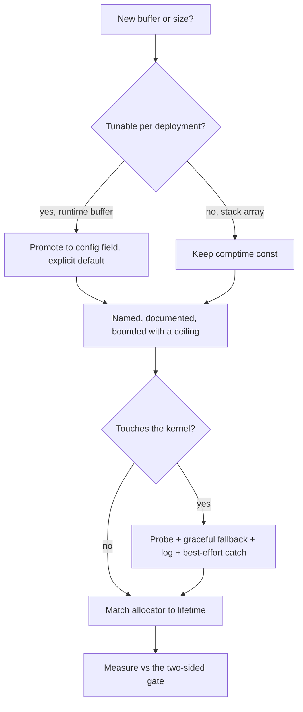

## Zix Systems-Thinking Guideline

How to reason about runtime cost, memory, and the kernel when writing zix code, derived from the existing implementation. Companion to coding-guideline-en.md: that one is about shape and style, this one is about what the machine actually does at runtime.

The one premise behind every rule: runtime allocation and memory growth are the troublesome parts, so the design is explicit. Expose what can be controlled up-front, bound what cannot, and be deliberate about every point where the kernel is involved. Nothing about cost is left implicit or discovered by surprise in production.

---

## 1. Be explicit about cost

Every size, buffer, and limit in the hot path is a named constant with a doc comment that states the number, the reason for the number, and the trade-off. A magic literal buried in a function is the anti-pattern.

```zig
/// Per-connection staged-response buffer. Since URING is fully async (unlike
/// EPOLL), each connection needs its own buffer. 16 KiB easily covers the max
/// response (~12 KiB for `/json`) plus a tiny pipelined burst. Dropping this
/// from EPOLL's 64 KiB saves 48 KiB/conn, which is critical for memory limits
/// at high concurrency. ...
const URING_SEND_BUF_SIZE: usize = 16 * 1024;
```

The comment carries the per-connection arithmetic (16 KiB vs 64 KiB = 48 KiB/conn saved) so the memory envelope is legible at the definition, not reconstructed from a profiler later.

> Name every hot-path size. In its doc comment, write the value, why that value, and the per-connection or per-worker cost it implies. If you cannot state the cost, you do not yet understand the allocation.

---

## 2. Expose what the deployment can control up-front

A size that a deployment might need to tune is a config field, not a buried `const`. The safe knobs are promoted to the flat config so the memory and throughput envelope is init-tunable without a rebuild: a memory-tight host dials the per-connection footprint down, a big-response host dials send headroom up.

```zig
/// Maximum payload bytes per frame. Frames exceeding this close the connection.
max_recv_buf: usize = 4096,
/// TCP listen backlog: pending connections queued by the kernel before accept().
kernel_backlog: u31 = 4096,
```

Not everything is promotable. A constant that sizes a fixed stack array must stay comptime (`EPOLL_MAX_EVENTS`, `URING_CQE_BATCH`), because making it runtime would move a stack array to the heap. The deciding question is the split: does the value size a runtime buffer (promote it) or a comptime stack array (keep it const)?

> Promote a tunable to a top-level config field with an explicit default. Keep a constant comptime when it sizes a fixed stack array. State the unit and the meaning of 0 in the field doc.

---

## 3. Bound everything, no unbounded growth on the hot path

Every buffer and table has a ceiling, so worst-case memory is computable and an attacker or a runaway client cannot drive it to OOM.

| Bound | Constant / field | What it caps |
| :- | :- | :- |
| Connection table size | `MAX_FD = 1 << 16` | slab virtual size is `MAX_FD * buf_size` per worker |
| Frame / request body | `max_recv_buf` | a frame larger than this closes the connection |
| Grown send buffer | `URING_SEND_BUF_MAX = 1 MiB` | a response past the cap falls back to a direct flush instead of growing without limit |
| Warm idle pool | `URING_IDLE_POOL_FLOOR`, derived `max(live, floor)` | how many closed connections stay warm |

A growable buffer (`send_buf` grows from `URING_SEND_BUF_SIZE` toward `URING_SEND_BUF_MAX`) always names the ceiling and the behavior past it. Growth is bounded and the fallback is explicit, never "keep reallocating until it fits".

> Give every buffer and table a hard ceiling. When a buffer grows, document the cap and what happens past it. Worst-case per-connection memory must be a number you can write down.

---

## 4. Let the kernel do the work, knowingly

The cheapest memory is memory the kernel manages for you, but only when you opt into it deliberately. Zix leans on demand-paging and kernel-managed buffers instead of allocating and zeroing up-front.

**Demand-paged slab.** The connection table is one `mmap` of `MAX_FD` slots, kernel-zeroed and demand-paged, so an untouched slot costs no physical memory and an empty slot is just `buf.len == 0`. No per-accept heap call on the hot path.

```zig
const slots = slab.mapZeroedSlots(?*UringConn, MAX_FD) catch return;
```

**Hand pages back on close.** A closed connection's slab pages are returned to the OS with `MADV_DONTNEED`, so resident memory tracks live connections, not the lifetime high-water of fd indices touched. The next first-touch on a reused fd faults a fresh zero page.

```zig
slab.releaseSlabPages(victim.buf);
slab.releaseSlabPages(victim.send_buf);
```

**Kernel-owned recv buffers.** The WebSocket provided-buffer ring means an idle connection holds no recv buffer at all: the kernel hands one over only when a frame actually arrives, and parsing in place out of the selected buffer keeps the common path zero-copy.

> Prefer demand-paged `mmap` over allocate-then-memset where a slot may be read before written. Return idle pages to the OS so RSS tracks live work. Let the kernel own the recv buffer when a connection can sit idle. Each of these is a deliberate choice with a comment, not a default.

---

## 5. Know exactly which syscalls run per request

On a kernel-bound workload the syscall count per request is the cost, so it is counted and minimized. This is the whole reason the `.URING` dispatch model exists: it batches the syscall transitions that `.EPOLL` pays per readiness event.

- Coalesce writes: stage the response in the per-connection buffer and send it as one on-ring send, instead of many small writes. A response past the send-buffer cap is the only one that takes a separate blocking flush.
- Avoid copies at the syscall boundary: the large-body drain uses `MSG_TRUNC` to discard in the kernel rather than copying into userspace.
- Tune the socket for the workload, best-effort: `setNoDelay` (TCP_NODELAY), `setBusyPoll` (SO_BUSY_POLL, spin before block on saturated loopback). Each is a silent no-op when unsupported.

> Before adding an I/O call, ask how many syscalls it adds per request and whether it copies at the boundary. Coalesce writes, drain in-kernel, and batch on the ring. The syscall budget is part of the design, not an afterthought.

---

## 6. Respect the kernel and the environment, fall back gracefully

Code probes for what the host actually permits and degrades instead of failing, because the kernel version, the cgroup, and the `RLIMIT_MEMLOCK` cap are not under the program's control.

**Feature flags with a flagless fallback.** The io_uring ring requests the single-issuer fast-path flags (kernel >= 6.1) and falls back to a flagless ring when `init_params` returns an error:

```zig
return IoUring.init_params(URING_ENTRIES, &params) catch return IoUring.init(URING_ENTRIES, 0);
```

**Runtime probe before committing.** `.URING` probes io_uring availability up-front (`uringUnavailableReason`) and folds to the EPOLL adapter when the ring is unusable (commonly the memlock cap too low), logging the reason, so the server never vanishes right after binding.

**cgroup-aware affinity.** `pinToCpu` and `getAvailableCpuCount` read the cgroup-allowed CPU mask via `sched_getaffinity`, so a worker is never pinned to a CPU the container cannot use and the default worker count matches the cores the process actually has.

**Best-effort kernel calls.** `setsockopt` for an optional optimization and `madvise` are `catch {}`: a failure is ignored because the slot or the socket works either way.

> Probe, do not assume. Gate a build-time fact at comptime, a host-time fact (memlock, kernel version, cgroup mask) at runtime. Always log a fallback. An optional kernel optimization is best-effort, never fatal.

---

## 7. Match allocation lifetime to data lifetime

The allocator is chosen by how long the data lives and who touches it, not by habit. Arena is the exception, not the default: it only fits a true single-owner scope with one bulk-reset point. Shared or long-lived state, which is most of the tree, uses the general-purpose thread-safe allocator.

| Lifetime / ownership | Strategy | Where |
| :- | :- | :- |
| Shared or long-lived, no single reset point | `std.heap.smp_allocator` (general-purpose, thread-safe), the default | every `dispatch/`, `core.zig` |
| True scope with one bulk reset, single owner | arena, freed in one reset | `zix.Http` per-connection arena, `utils/response_cache.zig` |
| Bounded hot-path table | demand-paged slab, no per-accept heap | `multiplexers/slab.zig` |
| Warm reuse across connections | idle-conn object pool, allocation-free reuse | `URING_IDLE_POOL_FLOOR` |
| Borrowed (`io`, `logger`) | never freed by zix, caller owns and must outlive | every config |

Arena does not fit when the data is shared across threads (arena is not thread-safe), or when objects are freed one at a time instead of all at once (a long-lived connection, the idle pool). Those are `smp_allocator`. A bulk reset beats a thousand frees, but only where a single reset point actually exists.

> Pick the allocator from the data's lifetime and ownership. Default to `smp_allocator` for shared or long-lived state, arena only at a genuine single-owner bulk-reset scope, slab for the bounded table, pool for warm reuse, caller-owned for anything passed in.

---

## 8. Squeeze idle, not active

The optimization target is the idle footprint, because active connections are doing real work and shrinking their buffers regresses throughput. An idle or closed connection should cost as close to nothing as possible.

- A closed connection hands its pages back (`MADV_DONTNEED`), an idle WebSocket connection holds no recv buffer (provided-buffer ring), an idle worker keeps only a warm floor of pooled connections.
- The active path keeps its full buffers. The send buffer is sized for the real max response, the recv buffer for the real frame size.

> Aim memory levers at idle and closed connections. Leave the active path's buffers alone. The goal is RSS that tracks live work, with no throughput given back.

---

## 9. Measure, and never regress silently

A performance change is not done until it is measured against the gate, and the gate is two-sided: a memory lever must not give back throughput, and a throughput lever must not give back memory.

- The hard rule on the raw engines: a regression of more than 1% on the URING benchmark is not acceptable, fix or revert.
- Loopback is about 85% kernel-bound, so RPS clusters and the honest engine-side signal is per-request cache behavior (L1-miss count) and memory-per-RPS, not a raw RPS headline.
- A change that bounds coverage (a cap, a sampling, a skipped path) says so in a log line. Silent truncation reads as "handled everything" when it did not.

> Measure every cost change against the two-sided gate before calling it done. Report what a change bounds or drops. A sub-1% claim needs a signal that can actually resolve sub-1%, not run-to-run noise on a development machine.

Store each result under `docs/benchmark/` with the environment it was taken on (CPU model, RAM, OS, kernel version) recorded as a reference, since the same change reads differently on an N-core development box than on the 64-core target. A `HttpArena-` filename prefix marks a result captured on the HttpArena harness end (for example `docs/benchmark/HttpArena-result-zix-uring-1.md`), not the local box, so the two sources stay distinguishable when compared.

---

## 10. Tools to check and measure

The two-sided gate is only as honest as the measurement behind it. A small, specific toolset answers the questions, each tool for one axis. Pick by what the change moves: throughput, per-request CPU and cache, memory footprint, or correctness.

| Question | Tool | How and caveat |
| :- | :- | :- |
| Throughput and latency (RPS) | `wrk -t<threads> -c<conns> -d<dur>s` | pin the server and the load generator to disjoint CPUs with `taskset -c`, warm once, then measure under a longer run. The bench protocol is c512 then c4096, twice each |
| io_uring or gRPC load at scale | `gcannon` | needs `ulimit -l unlimited` (the `RLIMIT_MEMLOCK` cap), otherwise it reports 0 req/s with ring allocation errors |
| Per-request CPU and cache (L1-miss, IPC, cycles, instructions) | `perf stat -x, -e <events> -p <pid> -- sleep <n>` | works without sudo at `perf_event_paranoid=2`, this is how the per-request table was measured. Put the perf window fully inside a longer `wrk` run. Per-request value = counter / RPS |
| Symbol attribution (which function stalls) | `perf record -e L1-dcache-load-misses -c 2000 -p <pid>` then `perf report --stdio` / `perf annotate` | needs sudo, and the agent sandbox kills `perf record` (signal)|
| Memory footprint (RSS, anon, MADV effect) | `/proc/<pid>/smaps` anon breakdown, cgroup RSS peak and steady | the memory axis of the gate. Watch anon RSS track live connections after close, proving `MADV_DONTNEED` returned the pages |
| Low-noise environment | `taskset` or cpuset pinning plus quiesce | a development box with 2-3% whole-run variance cannot resolve a sub-1% change, so quiesce first (the isolate bench) |
| Protocol conformance and handshake inspection | `curl -v`, and `curl --http3-only -v` for QUIC | the live behavioral oracle: `-v` narrates each step, so for HTTP/3 it pinpoints each handshake stage (Initial, ServerHello, certificate, 1-RTT, request) when a step regresses. needs curl built with an HTTP/3 backend (ngtcp2 / nghttp3), confirm with `curl --version` |
| Correctness and leaks | `zig build`, then `test-all` / `examples` / `test-runner-all`, and `std.testing.allocator` | the discovery and leak gate every change clears before any perf claim |

Ready-made runners live in the repo so the method is reproducible, not improvised: `perf-localize-http1.sh` (symbol attribution, hand-run), `perf-per-request-cell.sh` and `perf-per-request-matrix.sh` (per-request `perf stat` tables), `perf-http-epoll.sh` and `perf-http-uring.sh` (per-engine).

> Pick the tool by the axis the change moves. Derive a per-request metric as counter / RPS with the perf window inside a steady `wrk` load. `perf stat` runs in-sandbox at paranoid=2, `perf record` is hand-run with sudo. Clear the correctness and leak gate before making any perf claim, and quiesce before trusting a sub-1% number.

### Driving the engines over their wire protocol

`wrk` and `perf` answer the cost questions, but a protocol engine also has to be driven over the protocol it actually serves. One load generator fits each protocol shape: pick the tool that speaks the engine's wire protocol and match the invocation to what the engine expects, otherwise the result measures the wrong thing.

| Engine surface | Tool | Invocation shape | Caveat |
| :- | :- | :- | :- |
| HTTP/1 plaintext, upload, SSE | `gcannon` | `gcannon http://host:8080/path -c <conns> -d <dur>` | needs `ulimit -l unlimited` for its ring (the `RLIMIT_MEMLOCK` cap). The catch-all driver for the h1 shapes |
| HTTP/2 over TLS (baseline, static) | `h2load` | `h2load https://host:8443/path -c <conns> -m <streams> -t <threads> -D <dur>` | ALPN must negotiate h2. Counts a request done only on a 2xx, so a broken path serving 404 cannot inflate the number |
| HTTP/2 h2c cleartext | `h2load` | `h2load http://host:8082/path -p h2c -c .. -m .. -D ..` | `-p h2c` forces cleartext HTTP/2 framing from the first byte, so a silent HTTP/1.1 downgrade cannot pass |
| gRPC unary, h2c | `h2load` | `h2load http://host:8080/pkg.Svc/Method -d req.bin -H 'content-type: application/grpc' -H 'te: trailers' -c .. -m .. -D ..` | plain `http://`, no `-p h2c`. The body is a length-prefixed gRPC frame read from a file |
| gRPC unary, TLS | `h2load` | as above but `https://host:8443/...` | the TLS gRPC port, ALPN h2 |
| gRPC server-streaming (h2c or TLS) | `ghz` | `ghz --proto bench.proto --call pkg.Svc/Method -d '{...}' --connections <c> -c <workers> -z <dur> host:port` | `--insecure` for h2c, `--skipTLS` for the TLS port. h2load ships raw frames and cannot drive a real streaming RPC |
| HTTP/3 (baseline, static) | `h2load-h3` | `h2load` built with ngtcp2, `https://host:8443/path` over QUIC | a separate binary from the h2 `h2load` |

Two caveats decide whether a run measures the engine rather than its setup:

- Measure under a `-D` / `-z` duration, not a small `-n` request count. A short fixed-count run is dominated by connection setup (a TLS handshake costs hundreds of microseconds, an RSA-2048 one much more on a contended box), so it surfaces setup races that a sustained run amortizes away.
- Read the 2xx count, not the tool's headline req/s. `h2load`'s own req/s counts every completed request including 4xx and 5xx, so a server answering errors quickly looks like a throughput win. Compute RPS as 2xx divided by the wall duration instead.

> Drive each engine with the tool that speaks its wire protocol, matching what the engine expects (`-p h2c` for cleartext HTTP/2, `application/grpc` plus `te: trailers` for gRPC, `ghz` for streaming). Always measure over a duration, and score on 2xx, not the headline req/s.

---

## 11. Test in layers, vector to live client

A protocol engine is proven by a ladder of tests, each with its own oracle, climbed lowest first so a failure localizes to the rung just added rather than the whole stack.

| Layer | Proves | Oracle | How it ran here |
| :- | :- | :- | :- |
| Unit | one function is correct | the spec's published worked example | RFC vectors as in-file `test {}`, run by `zig build unit-test` |
| Edge | the reject paths hold | the spec's MUST-reject rules | negative tests: a flipped bit fails AEAD, truncation, wrong type, the length boundary |
| Round-trip | a codec is its own inverse | self-consistency | encode then decode, seal then open, assert the bytes return |
| Integration | composed modules agree | a known derived value | `init` derives the published Initial key from a connection id, the demux routes a crafted packet |
| Configuration | the config surface is honest | the documented defaults and rejects | default-field tests, `init` rejects a zero port and a missing certificate |
| Smoke | the binary launches and binds | the process and the socket | run the built example, confirm the UDP port is bound, kill it |
| Runner, live | the whole engine serves | a real client over the real wire | a native client in `test-runner-all` (for HTTP/3, one hand-rolled from `zix.Http3` primitives, the same way the HTTP/2 runner hand-rolls one from `zix.Http2`), asserting the response |

The vectors prove the pieces, the live client proves the whole. Only a real client catches an integration where every part is correct but the sequence is wrong: during HTTP/3 bring-up a live `curl --http3` surfaced that the handshake completed yet the connection never closed, because nothing acknowledged the client's packets. Once that was fixed, the round trip moved into a hermetic native client so the runner needs no external tool.

Three rules keep the ladder honest:

- Green on every supported toolchain, not just the default. Every change here was checked on Zig 0.16 and 0.17, because an API that exists in one and was renamed in the other is a build break a single-version run never sees.
- Build the shippable artifact, not only the test binary. `unit-test` does not compile a private or generic path until something instantiates it, so a `std.crypto.random` that does not exist on this toolchain compiled clean under `unit-test` and only failed the example build. The binary you ship is part of the gate.
- Climb the ladder and gate each rung. The work went vectors, then integration, then smoke (it binds), then live (handshake decrypt, then full round trip, then a clean exit). Each rung was green before the next, so every live failure pointed at one new thing.

> Prove each layer against its own oracle, lowest first: a published vector for a function, the reject paths for a parser, a round trip for a codec, a derived value for the wiring, the documented defaults for the config, a bound socket for the binary, and a real client over the real wire for the whole. Build the shippable artifact, not only the test binary, and keep every rung green on every toolchain before climbing the next.

---

## 12. The checklist

Before landing code that touches the runtime or memory, walk these:



- Is every new size named, documented with its cost, and bounded by a ceiling?
- Is a deployment-tunable value a config field, and a stack-array size still comptime?
- Does every kernel call probe, fall back, log, and stay best-effort where optional?
- Does the allocator match the data lifetime, and is borrowed memory left to the caller?
- Did the change get measured against the >1% two-sided gate before being called done?
