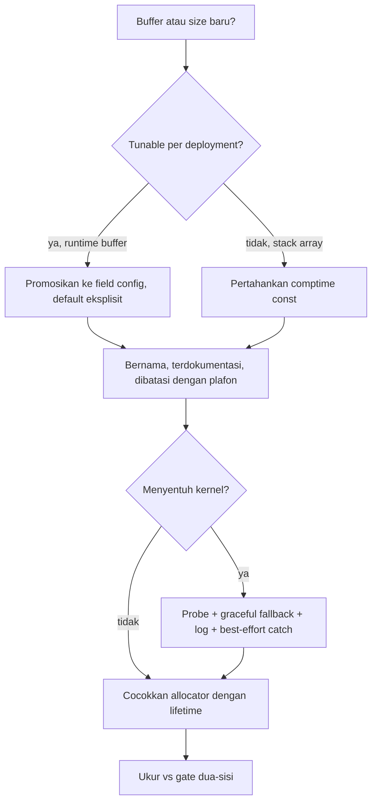

## Panduan Systems-Thinking Zix

Cara bernalar tentang biaya runtime, memory, dan kernel saat menulis kode zix, diturunkan dari implementasi yang sudah ada. Pendamping coding-guideline-id.md: yang itu tentang bentuk dan style, yang ini tentang apa yang benar-benar dilakukan mesin saat runtime.

Satu premis di balik setiap aturan: alokasi runtime dan pertumbuhan memory adalah bagian yang merepotkan, jadi desainnya eksplisit. Ekspos apa yang bisa dikontrol up-front, batasi apa yang tidak bisa, dan bersikap sengaja di setiap titik di mana kernel terlibat. Tidak ada biaya yang dibiarkan implisit atau ditemukan secara mengejutkan di production.

---

## 1. Eksplisit soal biaya

Setiap size, buffer, dan limit di hot path adalah konstanta bernama dengan doc comment yang menyatakan angkanya, alasan angkanya, dan trade-off-nya. Literal ajaib yang terkubur di dalam function adalah anti-pattern.

```zig
/// Per-connection staged-response buffer. Since URING is fully async (unlike
/// EPOLL), each connection needs its own buffer. 16 KiB easily covers the max
/// response (~12 KiB for `/json`) plus a tiny pipelined burst. Dropping this
/// from EPOLL's 64 KiB saves 48 KiB/conn, which is critical for memory limits
/// at high concurrency. ...
const URING_SEND_BUF_SIZE: usize = 16 * 1024;
```

Komentarnya membawa aritmetika per-connection (16 KiB vs 64 KiB = 48 KiB/conn dihemat) supaya envelope memory terbaca di definisinya, bukan direkonstruksi dari profiler belakangan.

> Beri nama setiap size hot-path. Di doc comment-nya, tulis nilainya, kenapa nilai itu, dan biaya per-connection atau per-worker yang ia implikasikan. Jika kamu tidak bisa menyatakan biayanya, kamu belum paham alokasinya.

---

## 2. Ekspos apa yang bisa dikontrol deployment up-front

Sebuah size yang mungkin perlu di-tune sebuah deployment adalah field config, bukan `const` terkubur. Knob yang aman dipromosikan ke flat config supaya envelope memory dan throughput bisa di-tune saat init tanpa rebuild: host yang ketat memory menurunkan footprint per-connection, host respons-besar menaikkan headroom send.

```zig
/// Maximum payload bytes per frame. Frames exceeding this close the connection.
max_recv_buf: usize = 4096,
/// TCP listen backlog: pending connections queued by the kernel before accept().
kernel_backlog: u31 = 4096,
```

Tidak semua bisa dipromosikan. Konstanta yang menentukan size sebuah fixed stack array harus tetap comptime (`EPOLL_MAX_EVENTS`, `URING_CQE_BATCH`), karena menjadikannya runtime akan memindahkan stack array ke heap. Pertanyaan penentunya adalah split: apakah nilai itu menentukan size runtime buffer (promosikan) atau comptime stack array (biarkan const)?

> Promosikan tunable ke field config top-level dengan default eksplisit. Pertahankan konstanta tetap comptime ketika ia menentukan size fixed stack array. Nyatakan unit dan arti 0 di doc field-nya.

---

## 3. Batasi semuanya, tanpa pertumbuhan tak-terbatas di hot path

Setiap buffer dan tabel punya plafon, sehingga memory worst-case bisa dihitung dan seorang attacker atau client liar tidak bisa mendorongnya ke OOM.

| Batas | Konstanta / field | Yang dibatasi |
| :- | :- | :- |
| Size connection table | `MAX_FD = 1 << 16` | virtual size slab adalah `MAX_FD * buf_size` per worker |
| Frame / request body | `max_recv_buf` | frame lebih besar dari ini menutup koneksi |
| Send buffer yang tumbuh | `URING_SEND_BUF_MAX = 1 MiB` | respons melewati cap jatuh ke direct flush alih-alih tumbuh tanpa batas |
| Warm idle pool | `URING_IDLE_POOL_FLOOR`, derived `max(live, floor)` | berapa banyak koneksi tertutup tetap warm |

Buffer yang bisa tumbuh (`send_buf` tumbuh dari `URING_SEND_BUF_SIZE` menuju `URING_SEND_BUF_MAX`) selalu menyebut plafonnya dan perilaku melewatinya. Pertumbuhan dibatasi dan fallback-nya eksplisit, tidak pernah "realokasi terus sampai muat".

> Beri setiap buffer dan tabel plafon keras. Ketika buffer tumbuh, dokumentasikan cap-nya dan apa yang terjadi melewatinya. Memory per-connection worst-case harus berupa angka yang bisa kamu tuliskan.

---

## 4. Biarkan kernel yang bekerja, dengan sengaja

Memory termurah adalah memory yang dikelola kernel untukmu, tapi hanya ketika kamu memilihnya secara sengaja. Zix bersandar pada demand-paging dan buffer yang dikelola kernel alih-alih mengalokasikan dan menge-zero di muka.

**Demand-paged slab.** Connection table adalah satu `mmap` dari `MAX_FD` slot, kernel-zeroed dan demand-paged, sehingga slot yang tak tersentuh tidak memakan memory fisik dan slot kosong hanyalah `buf.len == 0`. Tanpa heap call per-accept di hot path.

```zig
const slots = slab.mapZeroedSlots(?*UringConn, MAX_FD) catch return;
```

**Kembalikan page saat close.** Page slab sebuah koneksi tertutup dikembalikan ke OS dengan `MADV_DONTNEED`, sehingga memory resident melacak koneksi hidup, bukan high-water seumur hidup dari index fd yang tersentuh. First-touch berikutnya pada fd yang dipakai ulang mem-fault page zero yang baru.

```zig
slab.releaseSlabPages(victim.buf);
slab.releaseSlabPages(victim.send_buf);
```

**Recv buffer milik kernel.** Provided-buffer ring WebSocket berarti koneksi idle sama sekali tidak memegang recv buffer: kernel menyerahkannya hanya ketika sebuah frame benar-benar tiba, dan parsing in-place dari buffer terpilih menjaga jalur umum tetap zero-copy.

> Pilih demand-paged `mmap` alih-alih allocate-lalu-memset di mana sebuah slot mungkin dibaca sebelum ditulis. Kembalikan page idle ke OS supaya RSS melacak kerja hidup. Biarkan kernel memiliki recv buffer ketika sebuah koneksi bisa diam idle. Tiap pilihan ini sengaja dengan komentar, bukan default.

---

## 5. Tahu persis syscall mana yang jalan per request

Pada workload kernel-bound, jumlah syscall per request adalah biayanya, jadi ia dihitung dan diminimalkan. Ini adalah seluruh alasan kenapa dispatch model `.URING` ada: ia mem-batch transisi syscall yang dibayar `.EPOLL` per readiness event.

- Coalesce write: stage respons di buffer per-connection dan kirim sebagai satu on-ring send, alih-alih banyak write kecil. Respons melewati cap send-buffer adalah satu-satunya yang mengambil blocking flush terpisah.
- Hindari copy di boundary syscall: large-body drain memakai `MSG_TRUNC` untuk membuang di kernel alih-alih menyalin ke userspace.
- Tune socket untuk workload, best-effort: `setNoDelay` (TCP_NODELAY), `setBusyPoll` (SO_BUSY_POLL, spin sebelum block pada loopback yang jenuh). Masing-masing no-op senyap ketika tidak didukung.

> Sebelum menambah I/O call, tanya berapa syscall yang ia tambahkan per request dan apakah ia menyalin di boundary. Coalesce write, drain in-kernel, dan batch di ring. Budget syscall adalah bagian dari desain, bukan renungan belakangan.

---

## 6. Hormati kernel dan environment, fall back secara graceful

Kode memprobe apa yang benar-benar diizinkan host dan menurun alih-alih gagal, karena versi kernel, cgroup, dan cap `RLIMIT_MEMLOCK` tidak di bawah kendali program.

**Feature flag dengan flagless fallback.** io_uring ring meminta single-issuer fast-path flag (kernel >= 6.1) dan jatuh ke flagless ring ketika `init_params` mengembalikan error:

```zig
return IoUring.init_params(URING_ENTRIES, &params) catch return IoUring.init(URING_ENTRIES, 0);
```

**Runtime probe sebelum commit.** `.URING` memprobe ketersediaan io_uring up-front (`uringUnavailableReason`) dan melipat ke EPOLL adapter ketika ring tidak bisa dipakai (umumnya cap memlock terlalu rendah), mencatat alasannya, sehingga server tidak pernah hilang tepat setelah bind.

**Affinity yang cgroup-aware.** `pinToCpu` dan `getAvailableCpuCount` membaca CPU mask yang diizinkan cgroup lewat `sched_getaffinity`, sehingga sebuah worker tidak pernah di-pin ke CPU yang tidak bisa dipakai container dan worker count default cocok dengan core yang benar-benar dimiliki proses.

**Kernel call best-effort.** `setsockopt` untuk optimasi opsional dan `madvise` adalah `catch {}`: kegagalan diabaikan karena slot atau socket bekerja entah bagaimanapun.

> Probe, jangan asumsi. Gate fakta build-time saat comptime, fakta host-time (memlock, versi kernel, cgroup mask) saat runtime. Selalu catat fallback. Optimasi kernel opsional bersifat best-effort, tidak pernah fatal.

---

## 7. Cocokkan lifetime alokasi dengan lifetime data

Allocator dipilih berdasarkan berapa lama data hidup dan siapa yang menyentuhnya, bukan dari kebiasaan. Arena adalah pengecualian, bukan default: ia hanya cocok untuk scope single-owner sejati dengan satu titik bulk-reset. State shared atau long-lived, yang merupakan sebagian besar tree, memakai general-purpose allocator yang thread-safe.

| Lifetime / ownership | Strategi | Di mana |
| :- | :- | :- |
| Shared atau long-lived, tanpa titik reset tunggal | `std.heap.smp_allocator` (general-purpose, thread-safe), default-nya | setiap `dispatch/`, `core.zig` |
| Scope sejati dengan satu bulk reset, satu owner | arena, dibebaskan dalam satu reset | arena per-connection `zix.Http`, `utils/response_cache.zig` |
| Tabel hot-path terbatas | demand-paged slab, tanpa heap per-accept | `multiplexers/slab.zig` |
| Reuse warm antar koneksi | idle-conn object pool, reuse tanpa alokasi | `URING_IDLE_POOL_FLOOR` |
| Borrowed (`io`, `logger`) | tidak pernah dibebaskan zix, caller owns dan harus outlive | setiap config |

Arena tidak cocok ketika data di-share antar thread (arena tidak thread-safe), atau ketika objek dibebaskan satu per satu alih-alih sekaligus (koneksi long-lived, idle pool). Itu semua pakai `smp_allocator`. Satu bulk reset mengalahkan seribu free, tapi hanya di mana titik reset tunggal benar-benar ada.

> Pilih allocator dari lifetime dan ownership data. Default ke `smp_allocator` untuk state shared atau long-lived, arena hanya pada scope bulk-reset single-owner sejati, slab untuk tabel terbatas, pool untuk reuse warm, caller-owned untuk apa pun yang dioper masuk.

---

## 8. Peras yang idle, bukan yang aktif

Target optimasi adalah footprint idle, karena koneksi aktif sedang melakukan kerja nyata dan menyusutkan buffer-nya meregresi throughput. Sebuah koneksi idle atau tertutup harus memakan sedekat mungkin dengan nol.

- Koneksi tertutup mengembalikan page-nya (`MADV_DONTNEED`), koneksi WebSocket idle tidak memegang recv buffer (provided-buffer ring), worker idle hanya menyimpan warm floor dari koneksi yang di-pool.
- Jalur aktif menjaga buffer penuhnya. Send buffer di-size untuk respons maksimal nyata, recv buffer untuk frame size nyata.

> Arahkan lever memory ke koneksi idle dan tertutup. Biarkan buffer jalur aktif. Tujuannya adalah RSS yang melacak kerja hidup, tanpa throughput yang dikembalikan.

---

## 9. Ukur, dan jangan pernah regresi diam-diam

Sebuah perubahan performa belum selesai sampai diukur terhadap gate, dan gate-nya dua-sisi: lever memory tidak boleh mengembalikan throughput, dan lever throughput tidak boleh mengembalikan memory.

- Aturan keras pada raw engine: regresi lebih dari 1% pada benchmark URING tidak bisa diterima, fix atau revert.
- Loopback sekitar 85% kernel-bound, jadi RPS mengelompok dan sinyal engine-side yang jujur adalah perilaku cache per-request (jumlah L1-miss) dan memory-per-RPS, bukan headline RPS mentah.
- Perubahan yang membatasi cakupan (sebuah cap, sebuah sampling, sebuah jalur yang dilewati) menyatakannya di sebuah baris log. Truncation senyap terbaca sebagai "menangani semuanya" padahal tidak.

> Ukur setiap perubahan biaya terhadap gate dua-sisi sebelum menyebutnya selesai. Laporkan apa yang dibatasi atau dibuang sebuah perubahan. Klaim sub-1% butuh sinyal yang benar-benar bisa meresolusi sub-1%, bukan noise run-to-run dari mesin development.

Simpan tiap hasil di bawah `docs/benchmark/` dengan environment tempat ia diambil (model CPU, RAM, OS, versi kernel) dicatat sebagai reference, karena perubahan yang sama terbaca berbeda di development box N-core dibanding target 64-core. Prefix nama file `HttpArena-` menandai hasil yang ditangkap di ujung harness HttpArena (misal `docs/benchmark/HttpArena-result-zix-uring-1.md`), bukan box lokal, sehingga kedua sumber tetap bisa dibedakan saat dibandingkan.

---

## 10. Tools untuk check dan ukur

Gate dua-sisi hanya sejujur measurement di belakangnya. Toolset kecil yang spesifik menjawab pertanyaannya, tiap tool untuk satu axis. Pilih berdasarkan apa yang digerakkan perubahan: throughput, CPU dan cache per-request, footprint memory, atau correctness.

| Pertanyaan | Tool | Cara dan caveat |
| :- | :- | :- |
| Throughput dan latency (RPS) | `wrk -t<threads> -c<conns> -d<dur>s` | pin server dan load generator ke CPU yang terpisah dengan `taskset -c`, warm sekali, lalu ukur di bawah run yang lebih panjang. Protokol bench-nya c512 lalu c4096, dua kali masing-masing |
| Beban io_uring atau gRPC pada skala | `gcannon` | butuh `ulimit -l unlimited` (cap `RLIMIT_MEMLOCK`), kalau tidak ia melaporkan 0 req/s dengan error alokasi ring |
| CPU dan cache per-request (L1-miss, IPC, cycles, instructions) | `perf stat -x, -e <events> -p <pid> -- sleep <n>` | bekerja tanpa sudo pada `perf_event_paranoid=2`, ini cara tabel per-request diukur. Taruh window perf sepenuhnya di dalam run `wrk` yang lebih panjang. Nilai per-request = counter / RPS |
| Atribusi simbol (function mana yang stall) | `perf record -e L1-dcache-load-misses -c 2000 -p <pid>` lalu `perf report --stdio` / `perf annotate` | butuh sudo, dan sandbox agent mematikan `perf record` (signal), jadi manusia menjalankannya di terminal nyata |
| Footprint memory (RSS, anon, efek MADV) | `/proc/<pid>/smaps` anon breakdown, cgroup RSS peak dan steady | axis memory dari gate. Perhatikan anon RSS melacak koneksi hidup setelah close, membuktikan `MADV_DONTNEED` mengembalikan page-nya |
| Environment low-noise | `taskset` atau cpuset pinning plus quiesce | development box dengan variance 2-3% per-run tidak bisa meresolusi perubahan sub-1%, jadi quiesce dulu (isolate bench) |
| Conformance protokol dan inspeksi handshake | `curl -v`, dan `curl --http3-only -v` untuk QUIC | live behavioral oracle: `-v` menarasikan tiap langkah, jadi untuk HTTP/3 ia menunjukkan tiap tahap handshake (Initial, ServerHello, certificate, 1-RTT, request) saat sebuah langkah regresi. butuh curl yang dibangun dengan backend HTTP/3 (ngtcp2 / nghttp3), cek dengan `curl --version` |
| Correctness dan leak | `zig build`, lalu `test-all` / `examples` / `test-runner-all`, dan `std.testing.allocator` | gate discovery dan leak yang dilewati setiap perubahan sebelum klaim perf apa pun |

Runner siap-pakai ada di repo supaya metode-nya reproducible, bukan dadakan: `perf-localize-http1.sh` (atribusi simbol, hand-run), `perf-per-request-cell.sh` dan `perf-per-request-matrix.sh` (tabel `perf stat` per-request), `perf-http-epoll.sh` dan `perf-http-uring.sh` (per-engine).

> Pilih tool berdasarkan axis yang digerakkan perubahan. Turunkan metrik per-request sebagai counter / RPS dengan window perf di dalam beban `wrk` yang steady. `perf stat` jalan in-sandbox pada paranoid=2, `perf record` hand-run dengan sudo. Lewati gate correctness dan leak sebelum membuat klaim perf apa pun, dan quiesce sebelum mempercayai angka sub-1%.

### Menggerakkan engine lewat wire protocol-nya

`wrk` dan `perf` menjawab pertanyaan cost, tapi engine protokol juga harus digerakkan lewat protokol yang benar-benar ia layani. Satu load generator cocok untuk tiap bentuk protokol: pilih tool yang bicara wire protocol engine itu dan cocokkan invocation dengan yang engine harapkan, kalau tidak hasilnya mengukur hal yang salah.

| Permukaan engine | Tool | Bentuk invocation | Caveat |
| :- | :- | :- | :- |
| HTTP/1 plaintext, upload, SSE | `gcannon` | `gcannon http://host:8080/path -c <conns> -d <dur>` | butuh `ulimit -l unlimited` untuk ring-nya (cap `RLIMIT_MEMLOCK`). Driver catch-all untuk bentuk h1 |
| HTTP/2 over TLS (baseline, static) | `h2load` | `h2load https://host:8443/path -c <conns> -m <streams> -t <threads> -D <dur>` | ALPN harus menegosiasi h2. Menghitung request selesai hanya pada 2xx, jadi path rusak yang melayani 404 tidak bisa menggelembungkan angka |
| HTTP/2 h2c cleartext | `h2load` | `h2load http://host:8082/path -p h2c -c .. -m .. -D ..` | `-p h2c` memaksa framing HTTP/2 cleartext dari byte pertama, jadi downgrade diam-diam ke HTTP/1.1 tidak bisa lolos |
| gRPC unary, h2c | `h2load` | `h2load http://host:8080/pkg.Svc/Method -d req.bin -H 'content-type: application/grpc' -H 'te: trailers' -c .. -m .. -D ..` | `http://` biasa, tanpa `-p h2c`. Body-nya frame gRPC length-prefixed yang dibaca dari file |
| gRPC unary, TLS | `h2load` | sama seperti di atas tapi `https://host:8443/...` | port gRPC TLS, ALPN h2 |
| gRPC server-streaming (h2c atau TLS) | `ghz` | `ghz --proto bench.proto --call pkg.Svc/Method -d '{...}' --connections <c> -c <workers> -z <dur> host:port` | `--insecure` untuk h2c, `--skipTLS` untuk port TLS. h2load mengirim frame mentah dan tidak bisa menggerakkan streaming RPC sungguhan |
| HTTP/3 (baseline, static) | `h2load-h3` | `h2load` yang dibangun dengan ngtcp2, `https://host:8443/path` di atas QUIC | binary terpisah dari `h2load` h2 |

Dua caveat menentukan apakah satu run mengukur engine, bukan setup-nya:

- Ukur di bawah duration `-D` / `-z`, bukan request count `-n` kecil. Run fixed-count yang pendek didominasi connection setup (satu TLS handshake makan ratusan mikrodetik, yang RSA-2048 jauh lebih lama pada box yang contended), jadi ia memunculkan race setup yang justru di-amortize oleh run yang sustained.
- Baca jumlah 2xx, bukan headline req/s tool-nya. Angka req/s `h2load` sendiri menghitung setiap request yang selesai termasuk 4xx dan 5xx, jadi server yang menjawab error dengan cepat terlihat seperti menang throughput. Hitung RPS sebagai 2xx dibagi durasi wall.

> Gerakkan tiap engine dengan tool yang bicara wire protocol-nya, cocokkan dengan yang engine harapkan (`-p h2c` untuk HTTP/2 cleartext, `application/grpc` plus `te: trailers` untuk gRPC, `ghz` untuk streaming). Selalu ukur di atas duration, dan nilai dari 2xx, bukan headline req/s.

---

## 11. Test berlapis, dari vector ke live client

Sebuah protocol engine dibuktikan oleh tangga test, tiap lapis dengan oracle-nya sendiri, dinaiki dari yang paling bawah agar sebuah kegagalan ter-localize ke rung yang baru ditambah, bukan ke seluruh stack.

| Lapis | Membuktikan | Oracle | Cara jalannya di sini |
| :- | :- | :- | :- |
| Unit | satu function benar | worked example yang dipublikasi spec | RFC vector sebagai `test {}` in-file, dijalankan `zig build unit-test` |
| Edge | jalur reject berlaku | aturan MUST-reject dari spec | negative test: bit yang dibalik gagal AEAD, truncation, type salah, batas length |
| Round-trip | sebuah codec adalah inverse-nya sendiri | self-consistency | encode lalu decode, seal lalu open, assert byte-nya kembali |
| Integration | modul yang dikomposisi sepakat | sebuah derived value yang diketahui | `init` menurunkan Initial key terpublikasi dari connection id, demux me-route packet buatan |
| Configuration | permukaan config jujur | default dan reject yang didokumentasikan | test default-field, `init` menolak port nol dan certificate yang hilang |
| Smoke | binary launch dan bind | process dan socket | jalankan example yang sudah dibuild, pastikan UDP port ter-bind, kill |
| Runner, live | seluruh engine melayani | client nyata di atas wire nyata | client native di `test-runner-all` (untuk HTTP/3, satu yang hand-rolled dari primitive `zix.Http3`, cara yang sama runner HTTP/2 hand-roll satu dari `zix.Http2`), assert response |

Vector membuktikan bagian-bagiannya, live client membuktikan keseluruhannya. Hanya client nyata yang menangkap integration di mana tiap bagian benar tapi urutannya salah: saat bring-up HTTP/3 sebuah `curl --http3` live memunculkan bahwa handshake selesai tapi koneksi tidak pernah close, karena tidak ada yang meng-acknowledge packet client. Setelah itu diperbaiki, round trip-nya dipindah ke client native yang hermetic sehingga runner tidak butuh tool eksternal.

Tiga aturan menjaga tangga ini jujur:

- Hijau di tiap toolchain yang didukung, bukan hanya default. Tiap perubahan di sini dicek di Zig 0.16 dan 0.17, karena sebuah API yang ada di satu versi dan di-rename di versi lain adalah build break yang run satu-versi tidak pernah lihat.
- Build artifact yang dikirim, bukan hanya test binary. `unit-test` tidak meng-compile jalur private atau generic sampai sesuatu meng-instantiate-nya, jadi sebuah `std.crypto.random` yang tidak ada di toolchain ini compile bersih di bawah `unit-test` dan baru gagal di build example. Binary yang kamu kirim adalah bagian dari gate.
- Naiki tangga dan gate tiap rung. Pekerjaannya berjalan vector, lalu integration, lalu smoke (ter-bind), lalu live (decrypt handshake, lalu full round trip, lalu exit yang bersih). Tiap rung hijau sebelum yang berikutnya, jadi tiap kegagalan live menunjuk ke satu hal baru.

> Buktikan tiap lapis terhadap oracle-nya sendiri, dari yang paling bawah: vector terpublikasi untuk function, jalur reject untuk parser, round trip untuk codec, derived value untuk wiring, default terdokumentasi untuk config, socket ter-bind untuk binary, dan client nyata di atas wire nyata untuk keseluruhan. Build artifact yang dikirim, bukan hanya test binary, dan jaga tiap rung hijau di tiap toolchain sebelum menaiki yang berikutnya.

---

## 12. Checklist

Sebelum mendaratkan kode yang menyentuh runtime atau memory, telusuri ini:



- Apakah setiap size baru bernama, terdokumentasi dengan biayanya, dan dibatasi oleh plafon?
- Apakah nilai yang tunable-per-deployment berupa field config, dan size stack-array tetap comptime?
- Apakah setiap kernel call memprobe, fall back, mencatat, dan tetap best-effort di mana opsional?
- Apakah allocator cocok dengan lifetime data, dan memory borrowed dibiarkan untuk caller?
- Apakah perubahan diukur terhadap gate dua-sisi >1% sebelum disebut selesai?
