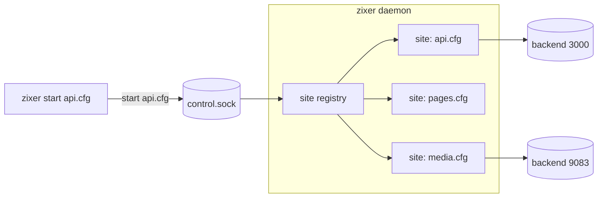
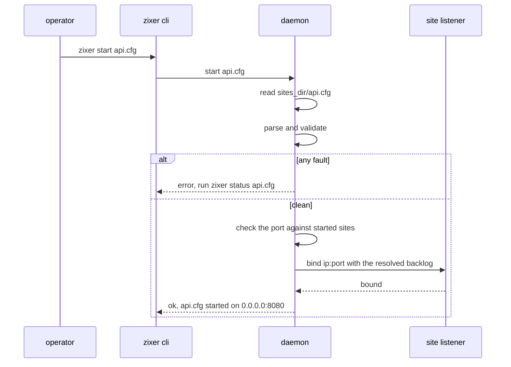
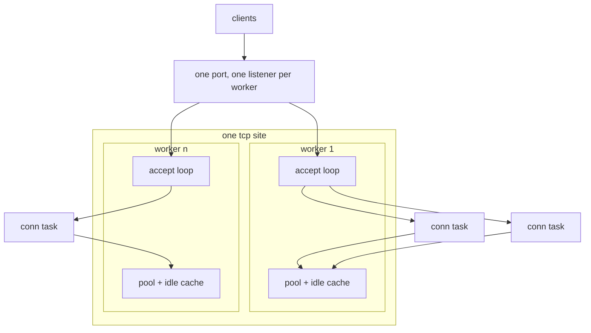
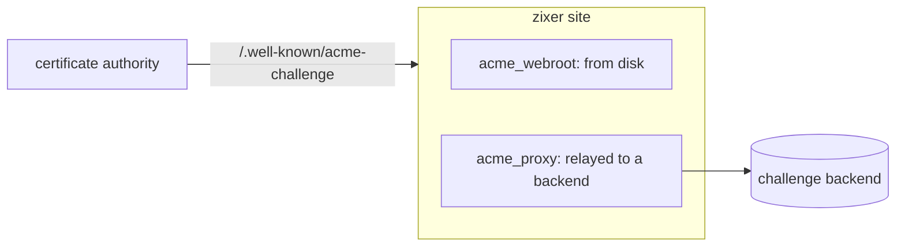

# zixer high-level design

## Scope

zixer is a proxy gateway executable built on the zix engines. It is a program an operator runs, not a library a program links: every behavior comes from plain text config files, and no code is written to put a service behind it. This document covers the shape of the gateway: the process model, the components, the site lifecycle, the edges, and the concurrency model. Key by key config detail is in `config-en.md`, wire level detail is in `lld-en.md`.

One binary carries everything. It ships from the same package as the zix engines and reports the same version, so `zixer version` names the engine build it was cut from.

<br>

## What it is, and what it is not

| it is | it is not |
| :- | :- |
| a config-driven edge in front of services you already run | a service mesh or a control plane |
| one daemon holding many independent sites | one process per site |
| protocol termination and re-origination at the edge | a passthrough load balancer at layer 4 (except the udp forward, which is exactly that) |
| validation first, with a fix hint on every refusal | a config language with variables, includes, or conditionals |

<br>

## The root dir

Everything zixer reads lives under one directory:

```
~/.zixer
|
|___/sites
|   |___example.cfg.sample             (written by init, inert)
|   |___my_service.cfg                 (one site per file)
|
|___/logs
|
|___main.cfg
|___control.sock                       (created by the daemon while it runs)
```

The root resolves as `--dir <path>`, then `ZIXER_DIR`, then `$HOME/.zixer`. `zixer init` scaffolds it, a bare `zixer` reports which source answered and whether that root is initialized, and `zixer status` validates what is inside it.

<br>

## Process model

The command line and the serving process are separate. Every command except `init`, `status`, `list`, and `version` is a one-line request over a unix socket to a daemon that owns the listeners.



- The first `start` spawns the daemon when the socket is silent, so an operator never starts it by hand.
- One request, one reply line, one connection. The control plane is not a data path, so requests are handled one at a time and the registry needs no lock.
- `daemon stop` unbinds every site and exits. Killing the process does the same, minus the tidy socket removal.

<br>

## Command surface

| command | what it does | needs the daemon |
| :- | :- | :- |
| `init` | scaffold the root dir | no |
| `status [name...]` | validate main.cfg and every site cfg, exit 1 on any fault | no |
| `list` | one line per site cfg | no |
| `start <site.cfg>` | bind and serve one site | yes, spawned when absent |
| `stop <site.cfg>` | unbind one site | yes |
| `restart <site.cfg>` | re-read the file from disk and rebind | yes, spawned when absent |
| `daemon` | run the control loop in the foreground | it is the daemon |
| `daemon stop` | unbind everything and exit | yes |
| `version` | package version, compiler version, target triplet | no |

`status` is the gate a deploy script should use: it reads the same parser the daemon reads, so a clean report means the daemon will accept the same files.

<br>

## Components

| file | responsibility |
| :- | :- |
| `zixer.zig` | argv split, `--dir` handling, command routing |
| `root_dir.zig` | root dir resolution and its source |
| `cfg_scanner.zig` | the flat `key: value` grammar, comments, comma lists |
| `cfg_math.zig` | integer expressions in numeric values |
| `fault.zig` | fault collection, every entry carries a fix hint |
| `main_cfg.zig` | main.cfg schema, defaults, validation |
| `site_cfg.zig` | site schema, engine rules, cross-field validation |
| `cmd_*.zig` | one file per command |
| `control.zig`, `control_client.zig` | socket location, the one-line request format, the client side |
| `daemon.zig` | the control loop and the started-site registry |
| `daemon_spawn.zig` | auto-spawn when the socket is silent |
| `site_runtime.zig` | what one started site owns: the listener, the acme companion |
| `port_probe.zig` | whether a listener outside this daemon already owns a port |
| `site_serve.zig` | what one serving tcp site owns: its workers, pools, and idle caches |
| `site_worker.zig` | one accept loop with its own listener and upstream leg |
| `worker_count.zig` | how many accept loops a site runs |
| `bind_options.zig` | the main.cfg values a site needs at bind time |
| `conn_buffer.zig` | the stream buffer block one edge connection holds |
| `http1_proxy.zig`, `http1_head.zig` | the http1 edge and its message parsing |
| `http2_edge.zig` and siblings | the h2 edge, frames, translation, the rfc 8441 websocket bridge |
| `grpc_edge.zig` and siblings | the grpc edge, h2 on both legs |
| `h3_edge.zig` and siblings | the QUIC and HTTP/3 edge, streams, QPACK |
| `udp_forward.zig`, `udp_flow_table.zig` | the per-flow datagram forward |
| `tls_edge.zig` | TLS termination and ALPN selection |
| `ws_tunnel.zig` | the rfc 6455 upgrade tunnel |
| `static_files.zig` | files from `public_dir`, precompressed siblings, the spa fallback |
| `acme_challenge.zig`, `acme_listener.zig` | the http-01 challenge plane and the port 80 companion |
| `upstream_pool.zig`, `upstream_conn.zig` | round-robin picking, availability, idle keep-alive |
| `upstream_deadline.zig`, `idle_reaper.zig` | the bound on one upstream read, the sweep that ages idle conns out |
| `proxy_headers.zig` | hop-by-hop stripping, `Via`, `Forwarded` |

<br>

## Site lifecycle



A site is re-read from disk on every `start` and `restart`, which is what a certificate renewal hook needs: drop the new files in place, call `restart`, and the site rebinds with the new certificate. `main.cfg` is read once per daemon, so a change there needs a `daemon stop` and a fresh start.

Ports are checked twice. The registry refuses a port another started site owns (the kernel would happily share it, because tcp sites bind with address reuse so a restart survives TIME_WAIT), and the kernel refuses a port outside zixer.

<br>

## Engines

`engine` in a site file picks the edge:

| engine | client side | upstream side | serves static | notes |
| :- | :- | :- | :- | :- |
| http1 | HTTP/1.1, optionally over TLS | HTTP/1.1, keep-alive, re-originated | yes | carries the websocket upgrade tunnel and streamed responses |
| http2 | h2, optionally over TLS, prior knowledge sniffed | HTTP/1.1 per stream | yes | rfc 8441 extended CONNECT bridges to an h1 websocket backend |
| grpc | h2 only | h2, multiplexed | no | end to end h2 so trailers survive the hop |
| http3 | QUIC and HTTP/3, TLS always | HTTP/1.1 | yes | one QUIC connection per client, streams translated to h1 |
| udp | raw datagrams | raw datagrams | no | per-flow relay, no inspection of any kind |

Every engine except udp re-originates: the request is parsed, rebuilt, and sent as a fresh message rather than forwarded byte for byte. That is what makes request smuggling a non-issue and what lets one protocol at the edge front a different one at the backend.

A site with `public_dir` and no `upstreams` is a static origin. A site with both serves `public_prefix` from disk and everything else from the pool.

<br>

## Concurrency model

zixer is thread-per-listener at the accept level and task-per-connection below it.



- Each started tcp site runs `workers` accept loops, one thread each, and each holds its own listener on the site's port. The kernel decides which listener takes an arriving connection, so accepting is not one thread's job. `workers: 1` is the default and gives the single loop zixer had before.
- Each accepted connection becomes a concurrent task in that worker's group, so a slow client never blocks its accept loop.
- A udp site is different: one up pump thread receives on the site socket, and each client flow gets its own ephemeral socket plus its own down pump, so an upstream sees one distinct peer per client. That is what ICE and DTLS state need. An http3 site is the same shape, one socket, so neither spends `workers`.
- The upstream pool and the idle connection cache belong to one worker, not to the site, and a short spinlock guards each because connection tasks run concurrently within a worker. Nothing is shared between workers except the TLS context, which is read-only after the site starts.
- The site's idle bound is divided between the workers, so a backend never loses more of its capacity because the edge runs more loops.
- `stop` and `daemon stop` set one flag and wake the loops until every worker has left, so teardown is bounded rather than abrupt.

<br>

## The overload valve

Accepting is per worker, but spending a backend is not. One site has one
admission gate, shared by every worker, and a request passes it at the moment
the edge decides to originate upstream. Nothing earlier reaches it: a static
answer, an acme challenge, and an https redirect are all served before the
gate is asked.

- `process_limit` is how many requests may be running upstream at once, `process_queue_len` is how many may wait, and `process_queue_timeout_ms` bounds that wait. All three default to off, see `config-en.md`.
- Site-wide rather than per worker on purpose. Splitting the count across workers would make one written number mean a different thing on every machine, because `workers: 0` follows the thread count, and a valve has to be sized by what the backend absorbs.
- The gate never blocks. A request that cannot proceed is handed a ticket and its own task waits on it, which is why the same structure serves a task-per-connection loop and would serve a single-threaded readiness or completion loop, where the loop would check tickets from its own ready pass instead.
- A full waiting room refuses in microseconds rather than holding the connection for the whole budget. Shedding early is the point: an unbounded line under a storm would pin every waiter's buffers and then fail all of them late.
- A long-lived exchange releases its slot at handover. A websocket tunnel and a grpc stream live as long as their client, so holding the slot for their whole life would let a handful of open sockets pin the site.
- grpc never queues. Its frame loop drives every live stream on the connection, so parking it would stall work already admitted, and a new stream is shed with a trailers-only `UNAVAILABLE` instead.

<br>

## Memory per connection

One connection is one thread and one buffer block, so both scale with how many
clients are open rather than with how many requests they send.

| what | where it comes from | size |
| :- | :- | :- |
| stream buffers | one allocation per connection, released when it ends | `max_recv_buf` per leg, 2 legs on a static site and 4 on a proxied one |
| head buffers | the stack of the request loop | 16 KiB each, three of them on a proxied http1 connection |
| TLS session | the stack of the TLS edge | about 58 KiB, of which the record buffer is a protocol limit |
| thread stack | the operating system, on demand | 16 MiB reserved, only the pages a connection touches become resident |

The buffers are the part an operator sets. The head buffers are protocol
limits: lowering `max_recv_buf` never shrinks what a request head may be, it
only changes how many bytes move per read.

Two things do not appear in that table and used to dominate it. The alternative
signal stack std gives every thread is off in this executable, because it was
256 KiB of resident memory per connection for a stack-overflow trace a
fixed-depth edge loop cannot produce. And the copy scratch the body pumps held
is gone: the reader and the writer move bytes between themselves.

Measured on this project's demo, resident memory per held connection at the
default `max_recv_buf`: 76.7 KiB on a static site and 140.8 KiB on a proxied
one, against 332.6 and 396.6 KiB before those two changes.

<br>

## TLS and ACME

TLS terminates at the edge over the zix TLS stack, and the upstream leg is cleartext. The site engine decides what the handshake advertises: `http/1.1` for an http1 site, `h2` then `http/1.1` for an http2 site, `h2` only for a grpc site. An http3 site is QUIC, where TLS is part of the transport.

The certificate is also an authority gate. A request whose `Host` (or `:authority`) is not covered by `tls_cert` is answered 421, on every TLS edge.

For http-01 renewal there are two shapes:



A cleartext http1 site answers the challenge path on its own listener. A TLS site on any port other than 80 also binds port 80 for the challenge, and that bind must succeed or the whole `start` fails, because a half-started site would silently break renewal.

<br>

## Header contract

The proxy edges follow the intermediary rules rather than passing everything through:

- Hop-by-hop headers never cross in either direction: `Connection`, `Keep-Alive`, `Proxy-Authenticate`, `Proxy-Authorization`, `TE`, `Trailer`, `Transfer-Encoding`, `Upgrade`, anything named in `Connection`, and `Content-Length`, because zixer frames the rebuilt message itself.
- `Via: 1.1 zixer` is appended on both legs.
- `Forwarded` carries the client address, the scheme, and the original host (rfc 7239). The scheme is written as `proto=http` on every edge today, including a TLS one, so a backend that trusts it cannot tell a terminated https request from a cleartext one.
- A failure zixer itself produced carries `Proxy-Status: zixer; error="..."`, so a 502 from the gateway is distinguishable from a 502 an upstream sent.

<br>

## Failure model

| situation | answer |
| :- | :- |
| no upstream is currently up | `503 no upstream available` |
| every attempt failed | `502 all upstreams failed` with a `Proxy-Status` reason |
| the request already streamed its body | no retry, the failure is reported as is |
| `Host` not covered by the certificate | `421 misdirected request` |
| static path missing and no `spa_fallback` | `404 not found` from the edge, no upstream involved |
| the site is at `process_limit` and the waiting room is full | `504 upstream queue full` with a `Proxy-Status` reason |
| a queued request waited out `process_queue_timeout_ms` | `504 upstream queue timeout` with the same reason |

An upstream that fails a connect is marked down and skipped by the round-robin picker for a cooldown window, then re-admitted and marked down again by the next failure. There is no health check thread and no probe: availability is learned from real traffic only.

<br>

## Design decisions

- Config is the whole interface. There is no plugin surface and no scripting, so what a site does is readable from one file.
- Validate everything before binding anything. A site with any fault never binds, and the report names the key and the fix.
- Fail loudly at start, never halfway. A missing certificate file, a taken port, or an unbindable challenge port fails the `start` instead of leaving a site partly up.
- Re-originate rather than forward. The edge owns the framing of what it sends.
- One file, one responsibility. Each edge, each translation layer, and each command lives in its own file, which is why the module list above reads as a map of the behavior.

<br>

## Not built yet

Being explicit about the gaps is part of the design:

- No log output. `logs_dir` must exist and nothing writes into it.
- No connect timeout, and no idle timeout on a websocket tunnel or an SSE stream. A blackholed upstream waits on the operating system. The wait for an upstream response head and for a `Content-Length` body is bounded by `upstream_timeout_ms`, see `config-en.md`.
- No read deadline on a grpc site. Its upstream leg is one h2 connection multiplexing every stream, which needs its own mechanism, so the key is refused there rather than accepted and ignored.
- No health checks, only failure learned from live traffic.
- No hot reload of `main.cfg`, and no reload of every site at once.
- No bound on how many connections one site accepts at once. The process gate bounds requests running against the backend, not sockets held open, so the accept ceiling is still what the operating system will give the process.
- No per-path routing, header rewriting, rate limiting, or caching.
- `dispatch` is validated and reported, and nothing reads it. See `config-en.md`.
