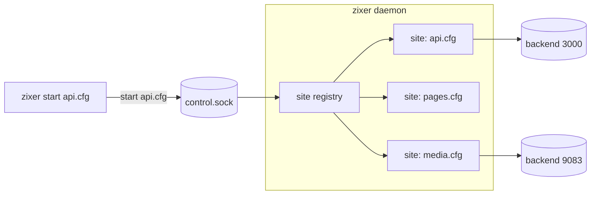
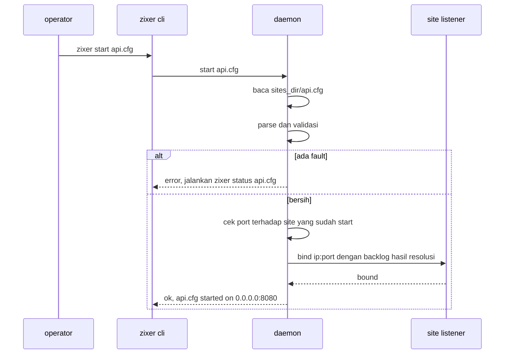
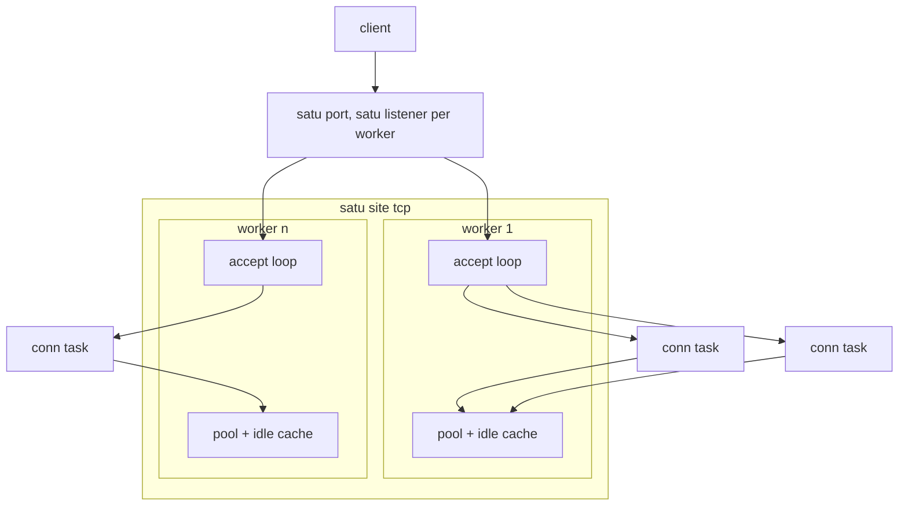
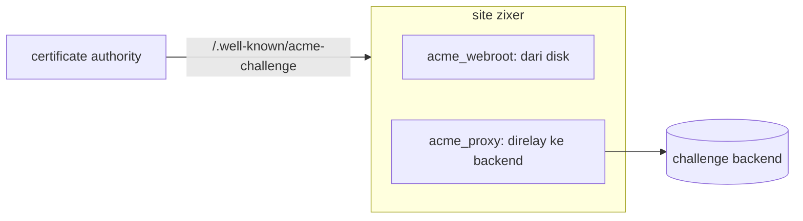

# Desain tingkat tinggi zixer

## Cakupan

zixer adalah executable proxy gateway yang dibangun di atas engine zix. Ia program yang dijalankan operator, bukan library yang di-link sebuah program: tiap perilaku datang dari file config teks biasa, dan tidak ada kode yang perlu ditulis untuk menaruh sebuah service di belakangnya. Dokumen ini membahas bentuk gateway-nya: process model, komponen, siklus hidup site, edge, dan concurrency model. Detail config per key ada di `config-id.md`, detail level wire ada di `lld-id.md`.

Satu binary membawa semuanya. Ia dikirim dari package yang sama dengan engine zix dan melaporkan versi yang sama, jadi `zixer version` menyebutkan build engine tempat ia dipotong.

<br>

## Apa ia, dan apa ia bukan

| ia adalah | ia bukan |
| :- | :- |
| edge yang dikendalikan config di depan service yang sudah Anda jalankan | service mesh atau control plane |
| satu daemon yang memegang banyak site independen | satu proses per site |
| terminasi protocol dan re-origination di edge | load balancer passthrough di layer 4 (kecuali udp forward, yang memang persis itu) |
| validasi dulu, dengan fix hint di tiap penolakan | bahasa config dengan variabel, include, atau kondisional |

<br>

## Root dir

Semua yang dibaca zixer ada di bawah satu direktori:

```
~/.zixer
|
|___/sites
|   |___example.cfg.sample             (ditulis init, tidak aktif)
|   |___my_service.cfg                 (satu site per file)
|
|___/logs
|
|___main.cfg
|___control.sock                       (dibuat daemon selama berjalan)
```

Root di-resolve sebagai `--dir <path>`, lalu `ZIXER_DIR`, lalu `$HOME/.zixer`. `zixer init` membuat kerangkanya, `zixer` polos melaporkan sumber mana yang menjawab dan apakah root itu sudah diinisialisasi, dan `zixer status` memvalidasi isinya.

<br>

## Process model

Command line dan proses yang melayani terpisah. Tiap command kecuali `init`, `status`, `list`, dan `version` adalah satu baris request lewat unix socket ke daemon yang memegang listener.



- `start` pertama akan spawn daemon saat socket-nya diam, jadi operator tidak pernah perlu menyalakannya manual.
- Satu request, satu baris reply, satu koneksi. Control plane bukan jalur data, jadi request ditangani satu per satu dan registry tidak butuh lock.
- `daemon stop` melepas semua site lalu keluar. Membunuh prosesnya melakukan hal sama, tanpa pembersihan socket yang rapi.

<br>

## Permukaan command

| command | apa yang dilakukan | butuh daemon |
| :- | :- | :- |
| `init` | membuat kerangka root dir | tidak |
| `status [name...]` | memvalidasi main.cfg dan tiap config site, keluar 1 bila ada fault | tidak |
| `list` | satu baris per config site | tidak |
| `start <site.cfg>` | bind dan melayani satu site | ya, di-spawn bila belum ada |
| `stop <site.cfg>` | melepas satu site | ya |
| `restart <site.cfg>` | membaca ulang file dari disk lalu bind lagi | ya, di-spawn bila belum ada |
| `daemon` | menjalankan control loop di foreground | ia adalah daemon-nya |
| `daemon stop` | melepas semuanya lalu keluar | ya |
| `version` | versi package, versi compiler, target triplet | tidak |

`status` adalah gerbang yang sebaiknya dipakai skrip deploy: ia membaca parser yang sama dengan daemon, jadi laporan bersih berarti daemon akan menerima file yang sama.

<br>

## Komponen

| file | tanggung jawab |
| :- | :- |
| `zixer.zig` | pemecahan argv, penanganan `--dir`, routing command |
| `root_dir.zig` | resolusi root dir dan sumbernya |
| `cfg_scanner.zig` | grammar flat `key: value`, comment, list koma |
| `cfg_math.zig` | ekspresi integer di nilai numerik |
| `fault.zig` | pengumpulan fault, tiap entri membawa fix hint |
| `main_cfg.zig` | skema main.cfg, default, validasi |
| `site_cfg.zig` | skema site, aturan engine, validasi lintas field |
| `cmd_*.zig` | satu file per command |
| `control.zig`, `control_client.zig` | lokasi socket, format request satu baris, sisi client |
| `daemon.zig` | control loop dan registry site yang sudah start |
| `daemon_spawn.zig` | auto-spawn saat socket diam |
| `site_runtime.zig` | apa yang dimiliki satu site yang start: listener, companion acme |
| `port_probe.zig` | apakah listener di luar daemon ini sudah memiliki sebuah port |
| `site_serve.zig` | apa yang dimiliki satu site tcp yang melayani: worker, pool, dan idle cache-nya |
| `site_worker.zig` | satu accept loop dengan listener dan leg upstream sendiri |
| `worker_count.zig` | berapa accept loop yang dijalankan sebuah site |
| `http1_proxy.zig`, `http1_head.zig` | edge http1 dan parsing pesannya |
| `http2_edge.zig` dan kerabatnya | edge h2, frame, translasi, bridge websocket rfc 8441 |
| `grpc_edge.zig` dan kerabatnya | edge grpc, h2 di kedua leg |
| `h3_edge.zig` dan kerabatnya | edge QUIC dan HTTP/3, stream, QPACK |
| `udp_forward.zig`, `udp_flow_table.zig` | forward datagram per flow |
| `tls_edge.zig` | terminasi TLS dan pemilihan ALPN |
| `ws_tunnel.zig` | tunnel upgrade rfc 6455 |
| `static_files.zig` | file dari `public_dir`, sibling terkompresi, fallback spa |
| `acme_challenge.zig`, `acme_listener.zig` | challenge plane http-01 dan companion port 80 |
| `upstream_pool.zig`, `upstream_conn.zig` | pemilihan round-robin, ketersediaan, keep-alive idle |
| `upstream_deadline.zig`, `idle_reaper.zig` | batas satu read upstream, sweep yang mengedaluwarsakan conn idle |
| `proxy_headers.zig` | pembuangan hop-by-hop, `Via`, `Forwarded` |

<br>

## Siklus hidup site



Site dibaca ulang dari disk pada tiap `start` dan `restart`, dan itulah yang dibutuhkan hook renewal certificate: taruh file baru di tempatnya, panggil `restart`, dan site bind ulang dengan certificate baru. `main.cfg` dibaca sekali per daemon, jadi perubahan di sana butuh `daemon stop` lalu start ulang.

Port diperiksa dua kali. Registry menolak port yang dimiliki site lain yang sudah start (kernel akan dengan senang hati membaginya, karena site tcp bind dengan address reuse supaya restart selamat dari TIME_WAIT), dan kernel menolak port yang dipakai di luar zixer.

<br>

## Engine

`engine` di file site memilih edge:

| engine | sisi client | sisi upstream | melayani static | catatan |
| :- | :- | :- | :- | :- |
| http1 | HTTP/1.1, opsional lewat TLS | HTTP/1.1, keep-alive, di-re-originate | ya | membawa tunnel upgrade websocket dan response yang di-stream |
| http2 | h2, opsional lewat TLS, prior knowledge disniff | HTTP/1.1 per stream | ya | extended CONNECT rfc 8441 di-bridge ke backend websocket h1 |
| grpc | h2 saja | h2, multiplexed | tidak | h2 ujung ke ujung supaya trailer selamat melewati hop |
| http3 | QUIC dan HTTP/3, TLS selalu | HTTP/1.1 | ya | satu koneksi QUIC per client, stream diterjemahkan ke h1 |
| udp | datagram mentah | datagram mentah | tidak | relay per flow, tanpa inspeksi apa pun |

Tiap engine kecuali udp melakukan re-origination: request di-parse, dibangun ulang, dan dikirim sebagai pesan baru alih-alih diteruskan byte per byte. Itulah yang membuat request smuggling bukan masalah dan yang memungkinkan satu protocol di edge menghadapi protocol berbeda di backend.

Site dengan `public_dir` tanpa `upstreams` adalah origin static. Site dengan keduanya menyajikan `public_prefix` dari disk dan sisanya dari pool.

<br>

## Concurrency model

zixer adalah thread-per-listener di level accept dan task-per-connection di bawahnya.



- Tiap site tcp yang start menjalankan `workers` accept loop, satu thread masing-masing, dan tiap loop memegang listener-nya sendiri di port site itu. Kernel yang memutuskan listener mana yang mengambil koneksi yang datang, jadi menerima koneksi bukan pekerjaan satu thread saja. `workers: 1` adalah default dan memberi satu loop seperti zixer sebelumnya.
- Tiap koneksi yang diterima menjadi task bersamaan di group worker itu, jadi client lambat tidak pernah memblokir accept loop-nya.
- Site udp berbeda: satu up pump thread menerima di socket site, dan tiap flow client mendapat socket ephemeral sendiri plus down pump sendiri, jadi upstream melihat satu peer berbeda per client. Itulah yang dibutuhkan state ICE dan DTLS. Site http3 bentuknya sama, satu socket, jadi keduanya tidak memakai `workers`.
- Upstream pool dan idle connection cache milik satu worker, bukan milik site, dan spinlock pendek menjaga masing-masing karena task koneksi berjalan bersamaan di dalam satu worker. Tidak ada yang dibagi antar worker kecuali context TLS, yang read-only setelah site start.
- Batas idle milik site dibagi di antara worker-nya, jadi backend tidak pernah kehilangan kapasitas lebih banyak karena edge menjalankan lebih banyak loop.
- `stop` dan `daemon stop` menyetel satu flag lalu membangunkan loop sampai tiap worker keluar, jadi pembongkaran berbatas, bukan mendadak.

<br>

## TLS dan ACME

TLS diterminasi di edge lewat stack TLS zix, dan leg upstream cleartext. Engine site menentukan apa yang ditawarkan handshake: `http/1.1` untuk site http1, `h2` lalu `http/1.1` untuk site http2, `h2` saja untuk site grpc. Site http3 adalah QUIC, di mana TLS bagian dari transport-nya.

Certificate juga menjadi gerbang authority. Request yang `Host`-nya (atau `:authority`) tidak dicakup `tls_cert` dijawab 421, di tiap edge TLS.

Untuk renewal http-01 ada dua bentuk:



Site http1 cleartext menjawab path challenge di listener-nya sendiri. Site TLS di port selain 80 juga bind port 80 untuk challenge, dan bind itu harus berhasil atau seluruh `start` gagal, karena site yang setengah start akan diam-diam merusak renewal.

<br>

## Kontrak header

Edge proxy mengikuti aturan intermediary, bukan meneruskan semuanya:

- Header hop-by-hop tidak pernah menyeberang di arah mana pun: `Connection`, `Keep-Alive`, `Proxy-Authenticate`, `Proxy-Authorization`, `TE`, `Trailer`, `Transfer-Encoding`, `Upgrade`, apa pun yang disebut di `Connection`, dan `Content-Length`, karena zixer sendiri yang membingkai pesan yang dibangun ulang.
- `Via: 1.1 zixer` ditambahkan di kedua leg.
- `Forwarded` membawa alamat client, scheme, dan host asli (rfc 7239). Scheme-nya ditulis `proto=http` di tiap edge hari ini, termasuk edge TLS, jadi backend yang memercayainya tidak bisa membedakan request https yang diterminasi dari request cleartext.
- Kegagalan yang dihasilkan zixer sendiri membawa `Proxy-Status: zixer; error="..."`, jadi 502 dari gateway bisa dibedakan dari 502 yang dikirim upstream.

<br>

## Model kegagalan

| situasi | jawaban |
| :- | :- |
| tidak ada upstream yang sedang up | `503 no upstream available` |
| semua percobaan gagal | `502 all upstreams failed` dengan alasan `Proxy-Status` |
| request sudah mulai men-stream body-nya | tidak ada retry, kegagalan dilaporkan apa adanya |
| `Host` tidak dicakup certificate | `421 misdirected request` |
| path static hilang dan tidak ada `spa_fallback` | `404 not found` dari edge, tanpa melibatkan upstream |

Upstream yang gagal connect ditandai down dan dilewati pemilih round-robin selama jendela cooldown, lalu diterima lagi dan ditandai down lagi oleh kegagalan berikutnya. Tidak ada thread health check dan tidak ada probe: ketersediaan hanya dipelajari dari trafik nyata.

<br>

## Keputusan desain

- Config adalah keseluruhan antarmuka. Tidak ada permukaan plugin dan tidak ada scripting, jadi apa yang dilakukan sebuah site terbaca dari satu file.
- Validasi semuanya sebelum bind apa pun. Site dengan fault apa pun tidak pernah bind, dan laporannya menyebut key-nya beserta perbaikannya.
- Gagal dengan lantang saat start, jangan setengah jalan. File certificate yang hilang, port yang terpakai, atau port challenge yang tak bisa di-bind menggagalkan `start`, bukan meninggalkan site setengah hidup.
- Re-originate, bukan forward. Edge memiliki framing dari apa yang ia kirim.
- Satu file, satu tanggung jawab. Tiap edge, tiap lapis translasi, dan tiap command ada di file-nya sendiri, itu sebabnya daftar modul di atas terbaca sebagai peta perilakunya.

<br>

## Belum dibangun

Menyebut celahnya secara eksplisit adalah bagian dari desain:

- Belum ada output log. `logs_dir` harus ada dan tidak ada yang menulis ke sana.
- Belum ada timeout untuk connect, dan belum ada idle timeout untuk tunnel websocket atau stream SSE. Upstream yang membuang trafik ditunggu sampai batas sistem operasi. Menunggu head response upstream dan body `Content-Length` dibatasi oleh `upstream_timeout_ms`, lihat `config-id.md`.
- Belum ada read deadline di site grpc. Leg upstream-nya satu koneksi h2 yang memultipleks semua stream, jadi butuh mekanisme sendiri, dan key-nya ditolak di sana alih-alih diterima lalu diabaikan.
- Belum ada health check, hanya kegagalan yang dipelajari dari trafik nyata.
- Belum ada hot reload `main.cfg`, dan belum ada reload semua site sekaligus.
- Belum ada routing per path, rewrite header, rate limit, atau caching.
- `dispatch` dan `max_recv_buf` divalidasi dan dilaporkan, dan tidak ada yang membacanya. Lihat `config-id.md`.
