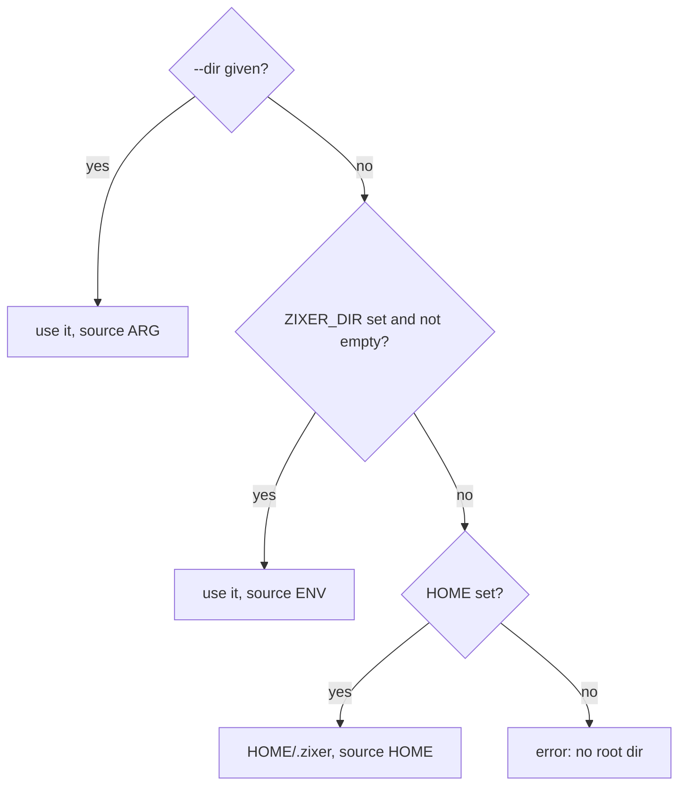
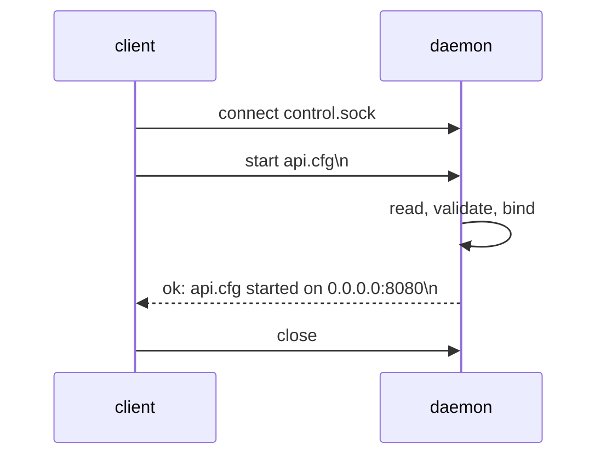
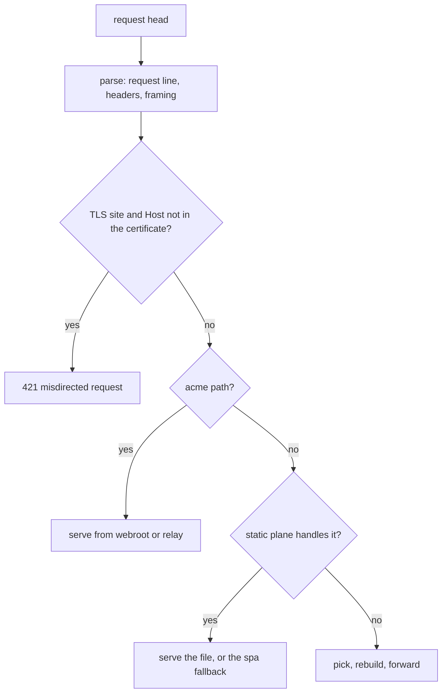
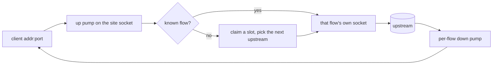

# zixer low-level design

This document covers the internals: the config grammar, the control wire, the registry rules, what each edge does on the wire, and the fixed limits. For the shape of the gateway read `hld-en.md` first. For key by key config guidance read `config-en.md`.

 

## Config scanning

One scanner reads both `main.cfg` and every site file. It allocates nothing: every key and value is a slice into the file content, which the caller keeps alive.

Per line:

1. Cut at the first `#`, so a trailing comment disappears and a comment-only line becomes empty.
2. Trim spaces, tabs, and `\r`, so CRLF files read the same as LF files.
3. Skip empty lines.
4. Split at the first `:` only. The value keeps any further colons, which is what makes `C:/certs/full.pem` and `::1:9000` work.
5. Trim both sides. An empty key or an empty value is a fault, not a skip.

A comma list value is iterated with the same no-allocation rule, and an empty item (`a,,b`, or a trailing comma) comes back as an empty string so the schema can fault it rather than quietly dropping a typo.

Booleans accept `true` and `false` only. `True`, `yes`, and `1` all fault, because a config that guesses is a config that surprises.

## Numeric values

Any numeric key runs through the expression evaluator: integers, `+ - * /`, and parentheses, with multiply and divide binding first, left to right, capped at 32 levels of nesting.

| rule | reason |
| :- | :- |
| division must be exact | `10 / 4` is a typo far more often than an intent, and silent truncation hides it |
| division by zero faults | same |
| overflow faults | the result must fit 64-bit math before it is cast to the field type |
| the whole value must be consumed | `1024 junk` faults rather than reading `1024` |

Each error maps to one hint: `not a number or integer math (i.e. 16 * 1024)`, `division by zero`, `division leaves a remainder, config values must be exact`, `number does not fit 64-bit integer math`.

## Faults

Validation never stops at the first problem. Every schema check appends to a fault list of `{ key, hint }` pairs, and the caller decides what to do with a non-empty list:

| caller | behavior |
| :- | :- |
| `zixer status` | prints every fault under the file's block, exits 1 |
| the daemon, on main.cfg | refuses to start, points at `zixer status` |
| the daemon, on a site | refuses that `start`, points at `zixer status <name>` |

A bad field keeps its default instead of poisoning the rest of the parse, so one report shows every problem in the file at once.

 

## Root dir resolution

`USERPROFILE` stands in for `HOME` on Windows. The source is kept beside the path so `zixer` with no command can report where it would work.

 

## main.cfg parse

Keys are matched by name against an enum, so an unknown key is a typo report rather than a silent extra. A duplicate key faults and the first value stands.

| key | check |
| :- | :- |
| workers | fits `usize`, at most the thread count this process may use, which `std.Thread.getCpuCount` reads from the affinity mask on Linux |
| dispatch | one of `async`, `epoll`, `uring`, and off Linux only `async` |
| logs_dir, sites_dir | taken as written, defaulted to `<root>/logs` and `<root>/sites` when absent |
| kernel_backlog | fits `u31`, at least 1 |
| max_recv_buf | fits `usize`, between 1024 and 262144 bytes |
| process_limit | fits `usize`, at most 65536, 0 turns the gate off |
| process_queue_len | fits `usize`, at most 65536, and above 0 it needs `process_limit` above 0 |
| process_queue_timeout_ms | fits `u32`, between 1 and 600000 ms |

`zixer status` adds an existence check on both directories after the parse.

## Site cfg parse

The same scan, then a cross-field pass over the whole file. The pass runs in a fixed order so the report reads the same way every time: missing required keys, TLS pairing, backend presence, static plane rules, acme pairing, then the per-engine rules. The full rule list with its exact fault text is in `config-en.md`.

`upstreams` splits into `{ host, port }` entries. The split is on the last colon, the port must parse as a non-zero `u16`, and each bad item faults on its own so a list of five names produces five hints. The host string itself is not checked here, which is why a name passes the config gate and fails later at connect time.

 

## Control plane

The daemon owns `<root>/control.sock`. A relative root is made absolute first, because Windows AF_UNIX rejects a relative bind path, and both sides derive the same string from the same working directory.

| property | value |
| :- | :- |
| transport | unix stream socket, one exchange per connection |
| request | one line, `verb [name]`, newline terminated |
| reply | one line, `ok: ...` or `error: ...` |
| max line | 512 bytes |
| max site name | 128 bytes |
| path limit | the platform unix socket limit, 108 bytes on Linux |

Verbs are `start`, `stop`, `restart`, `ping`, and `shutdown`. The three site verbs require a name, `ping` and `shutdown` refuse one, and anything else is answered with the usage line.

A site name on the wire must be a bare file name ending `.cfg`, with no `/`, no `\`, and no `..`. That rule is what keeps a control request from reaching outside `sites_dir`.

When the socket is silent, `start` and `restart` spawn the daemon from the same executable path the command ran from, wait for it to answer a `ping`, and then send the real request. A daemon that never answers is reported rather than retried forever.

 

## Registry rules

The daemon keeps one array of started sites. Every mutation is serial, so no lock is needed.

| rule | why |
| :- | :- |
| `start` on an already started site is refused | a silent rebind would hide a config edit that was never applied |
| `restart` on a stopped site starts it | a renewal hook must not fail because a site happened to be down |
| a port already owned by another started site is refused | tcp sites bind with address reuse, so the kernel would share the port instead of reporting the collision |
| a port a listener outside this daemon answers on is refused | the registry only sees sites in this process, a connect probe is what finds an owner in another one |
| the acme companion port counts as owned | the same collision applies to port 80, from the registry and from the probe alike |
| the listen backlog is the site value, else the main.cfg value | one default, per site override |

A config file larger than 256 KiB is refused rather than loaded.

 

## Site runtime

One started site owns one listener per accept loop, and one of these shapes:

| engine and config | what is held |
| :- | :- |
| http1, http2, or grpc with `upstreams` or `public_dir` | a serving proxy edge over a tcp listener |
| http1, http2, or grpc with neither | the bare tcp listener, so the port is owned and a collision is visible |
| http3 with `upstreams` or `public_dir` | the QUIC edge over a bound datagram socket |
| udp with `upstreams` | the per-flow forward over a bound datagram socket |
| http3 or udp with neither | the bare datagram socket |

Tcp listeners bind with address reuse, datagram sockets bind strict.

Address reuse is why a tcp bind is preceded by a probe. Std pairs the flag with `SO_REUSEPORT` on posix, and the Windows `SO_REUSEADDR` is permissive in the same way, so a second listener joins the port rather than failing and the kernel then splits arriving connections between the two. The probe connects to the address the site is about to listen on, loopback in place of a wildcard because Windows refuses a connect to `0.0.0.0`. A live listener answers and the start is refused with `AddressInUse`, while a socket left in TIME_WAIT refuses the connect, so a restart right after live traffic still rebinds. A datagram socket needs no probe: its bind is strict and reports the collision itself.

A TLS site with acme keys, on any port other than 80, also binds port 80, and the companion port is probed the same way. That bind is not optional: if it fails, the whole `start` fails with a message naming the challenge port.

 

## Workers

A serving tcp site runs `workers` accept loops, from `main.cfg`. The daemon
resolves the count once at start, so two sites can never disagree about it.

| configured | resolved |
| :- | :- |
| `0` | every thread this process may run on, which `std.Thread.getCpuCount` reads from the affinity mask on Linux |
| `n` | `n`, and `main.cfg` already refused a count above the available threads |
| anything, on Windows | `1` |

Windows is the exception because address reuse there is a takeover, not a join:
a second bind on the port would leave the first listener with no traffic. Every
other supported platform pairs the flag with `SO_REUSEPORT`, where the kernel
picks one listener per arriving connection.

What a worker owns, and what the site keeps:

| owned by one worker | kept by the site |
| :- | :- |
| its listener | the config strings and the static plane |
| its upstream pool | the TLS context, read-only once the site starts |
| its idle connection cache | the reaper thread, which sweeps every worker's cache |
| its connection task group | the stop flag, one store stops every loop |

The first worker takes the listener the site already bound, and the rest bind
their own on the same address. Those need no port probe: the site owns the port
by then, and joining it is the whole point.

Shutdown is where sharing a port costs something. One wake connection is not
one worker, because the kernel decides which listener takes it. A worker closes
its own listener as it leaves, which takes it out of the group, so the site
keeps waking until every worker has left and each retry reaches one that is
still blocked. The bound is 200 attempts per worker, one per millisecond, and
it only matters if a worker is wedged inside a connection rather than in
accept.

 

## Connection buffers

Every accepted connection allocates one block and slices it into the legs it
needs, then frees it when the connection ends. `conn_buffer.zig` owns the
sizes, and `max_recv_buf` (the site value, else the main.cfg one) is the size
of one leg.

| the site's shape | legs asked for | block |
| :- | :- | :- |
| static only | client read, client write | 2 legs |
| proxied http1 | the client pair, plus the upstream pair | 4 legs |
| TLS | the client pair carries ciphertext, the plaintext side is the session's own buffers | 2 legs, plus 2 more when the request loop reaches a pool |
| http2 or grpc over a handed-over reader and writer | the upstream pair alone | 2 legs |
| grpc | the client pair, plus a pair per upstream h2 connection that actually opens | 2 legs, plus 2 per open upstream |

Heap and not the stack, for two reasons. A stack array is sized at compile
time, so a site could not lower it. And an oversized one is not free: Zig
writes over an `undefined` local, so reserving 64 KiB to use 2 KiB costs the
whole 64 KiB in resident memory. Measured, two 64 KiB locals in place of two
8 KiB ones moved a held connection from 48.6 to 172.6 KiB.

An allocation that fails answers `503` off a small stack buffer and closes,
rather than dropping the socket with no status.

What stays on the stack, because it is a protocol limit rather than a tuning
choice: the request head buffer, the rebuilt upstream head, the response head
(16 KiB each), and the TLS session's record and plaintext buffers.

The body pumps hold no copy array at all. `pumpExact` and `pumpUntilClose`
both move bytes straight from the reader to the writer, and a zero return
means the reader buffered instead of writing, so the next pass drains it
rather than the pump treating it as a closed connection.

 

## The process gate

`process_gate.zig` owns one site's admission state, `process_wait.zig` owns
how a caller waits on it. They are split because the second one is
dispatch-specific and the first one is not.

The gate is a counter plus a fixed waiting room, all behind one short
spinlock:

| call | what it does |
| :- | :- |
| `enter` | takes a slot when `in_flight` is below the limit, else takes a room slot and returns a ticket, else refuses |
| `poll` | reports whether a ticket has been handed a slot, and consumes the ticket when it has |
| `abandon` | gives a ticket up, passing on a slot that arrived in the same moment rather than losing it |
| `leave` | hands the slot to the oldest waiter, or drops `in_flight` when nobody is in line |

The room is preallocated at site start and its slots are threaded into two
intrusive lists: a free list, and an arrival-ordered wait list with both links
so a slot can leave from the middle in constant time. That matters because
every one of those calls runs under the spinlock, and a request that gives up
partway is exactly the case a timeout produces.

A slot is never released and re-taken across a handover. `leave` moves it
straight to the head of the line, so `in_flight` does not dip and a third
arrival cannot cut ahead of a request that was already waiting.

Nothing here blocks, which is the whole point. `process_wait.admit` is the
task-per-connection waiter: it polls its ticket on the same 1 ms tick the grpc
and h3 relays already use, and abandons on the deadline. A readiness or
completion loop would drive the same tickets from its own ready pass instead,
with no change to the gate.

`process_wait.admitNow` is the shedding form, for a caller whose thread drives
other live streams. Only the grpc relay uses it.

`Held` is what a caller pairs with an admission. Its release is idempotent, so
an edge can hand the slot back early (the websocket and grpc handovers) and
still keep the deferred release for every other exit.

An unarmed gate (`process_limit: 0`) owns no memory and short-circuits every
call, so an edge never branches on whether its site configured one.

 

## The http1 edge

Head parsing is bounded: 16 KiB of head, at most 64 headers. The body framing decision follows rfc 9112, and because the edge re-originates, `Transfer-Encoding` and `Content-Length` never cross as they arrived. The rebuilt message carries a framing header the edge chose itself.

The static plane runs before the pool when the site has one, and `public_prefix` bounds it: without a prefix the whole path space is static-first, with a prefix only that subtree is. Path resolution rejects `..` outright rather than normalizing it, rejects an embedded NUL, maps a trailing slash to `index.html`, and caps the joined path at 512 bytes. Precompressed siblings are probed in `.br` then `.gz` order against `Accept-Encoding`, with identity as the floor, and `Vary: Accept-Encoding` rides on every static response.

With `public_dir_cache_ttl_ms` above 0 the shared table is asked first, and the same rules hold there: the sibling order and the identity floor were applied once when the entry was built, and the trailing slash maps to `index.html` before the lookup so a cached and an uncached answer resolve the same path. A miss falls straight through to the open above, including for the `spa_fallback` retry.

The response head is rendered by the edge in both cases rather than replayed from the entry's own prerendered bytes, so the two answers are byte-identical. The prerendered header advertises `Accept-Ranges`, which this edge does not honour, and hardcodes `Connection: keep-alive`, which this edge decides per request.

An exchange against the pool retries up to one attempt per upstream plus one spare, so a single stale idle connection never consumes a slot's only chance. Once a request body has started streaming, there is no retry: the body is not replayable.

A `101` from the upstream turns the connection into a raw tunnel in both directions for the rest of its life, with the upstream pick pinned for the tunnel.

## The http2 edge

Client h2 streams are served one at a time with the rest queued, and each stream is re-originated as an HTTP/1.1 request to the pool. The translation follows rfc 9113 section 8: pseudo-headers into a request line, connection-specific headers refused, the response status back into `:status`.

An extended CONNECT stream (rfc 8441) becomes a websocket bridge: DATA frames to raw bytes toward an h1 websocket upstream, and raw bytes back into DATA frames.

A response the upstream gave a length to leaves in one write. The header block stays staged until the first DATA frame joins it, so a small response costs one segment on the wire instead of two, and one record instead of two on a TLS site. Static files do the same, their size is known before the first read. A chunked or close-delimited response can be a live stream whose first event is seconds out, so its header block goes out on its own and each burst follows as it arrives.

Prior-knowledge h2 is sniffed on a cleartext listener, so a client that never negotiates ALPN still works.

## The grpc edge

gRPC is h2 on both legs, because trailers are the status channel and re-originating to h1 would lose them. The edge opens an h2 connection to the picked upstream, allocates stream ids on it, validates and re-encodes the header block, and multiplexes frames both ways. Local answers (an unroutable request, no upstream) are produced as grpc responses, not as http errors.

## The http3 edge

The edge terminates QUIC (rfc 9000 and 9001) and HTTP/3 (rfc 9114) itself: connection state, packet number spaces, flow control, stream assembly, and QPACK (rfc 9204) field sections. Each request stream is translated into an HTTP/1.1 message for the pool, and the response is translated back. Up to 64 concurrent QUIC connections are held per site.

As on the other TLS edges, an `:authority` the certificate does not cover is answered 421.

## The udp forward

No parsing of any kind. The site socket receives a datagram, and the flow table decides where it goes.

- A flow is one client address and port. It sticks to one upstream for its whole life, and new flows walk the upstreams round-robin.
- Each flow forwards through its own ephemeral socket, so an upstream sees one distinct peer per client. That is what ICE and DTLS state need.
- The table holds 64 flows. When all are taken, the stalest flow is marked closing and the triggering datagram is dropped, because every protocol a udp site fronts retransmits.
- A down pump only accepts datagrams from the upstream its flow picked, anything else at that ephemeral port is dropped.
- Recency is a claim counter, not a clock, so nothing here depends on time.
- Teardown is a stop flag plus a wake datagram at the site's own port, because closing a socket another thread is blocked on is not reliable across platforms.

Buffers are the full 65535 byte datagram bound in both directions, so nothing is ever truncated. This is why `max_recv_buf` changes nothing on a udp site today.

## The TLS edge

One handshake per connection over the zix TLS stack, with the ALPN preference list taken from the site engine. The negotiated protocol picks the serve path: `h2` runs the h2 edge, `http/1.1` runs the http1 edge, and no ALPN at all falls back to a preface sniff on an http2 site or plain http1 elsewhere. A close is a best-effort `close_notify` before the socket drops.

## The acme plane

Two shapes, both bound to `/.well-known/acme-challenge/`:

| key | behavior |
| :- | :- |
| `acme_webroot` | the token file is read from `<webroot>/.well-known/acme-challenge/<token>`, a miss answers `404 not found` |
| `acme_proxy` | the request is relayed to the configured backend and its reply is passed back as it came, including its own status and headers |

On a cleartext http1 site both run on the site's own listener. On a TLS site they run on the port 80 companion listener.

 

## Upstream pool

An O(1) round-robin over the upstreams currently up:

- `slots` holds every configured upstream, `ready` holds dense indexes of the ones up, so a pick never scans.
- Marking down is a swap-remove, marking up is an append.
- A connect failure marks the upstream down. Re-admission happens at pick time after a 3000 ms cooldown, and the sweep is gated to at most once per 200 ms so its cost never lands on every pick.
- A re-admitted upstream that is still dead is marked down again by the next failure. There is no probe thread.
- Idle keep-alive connections are cached per upstream slot, up to 4 each, and up to 32 across the whole site. Overflow is closed instead of grown.
- A cached connection also ages out after 5000 ms. Expiry runs when one is taken, and a sweep thread per site runs it every 2500 ms so a site with no traffic still hands its connections back. An idle pooled connection is capacity taken from the backend.

Each worker of a site owns its own pool and its own cache. A short spinlock
guards each, because connection tasks run concurrently within a worker, and
nothing is shared across workers. The 32 idle connections are a site bound, so
the workers divide it: 4 workers hold 8 each, never below 1. A worker learns on
its own that an upstream is down, so a dead backend costs one failed connect
per worker rather than one per site, and each copy re-admits on its own
cooldown.

 

## Fixed limits

None of these are configurable today.

| limit | value | where |
| :- | :- | :- |
| config file size | 256 KiB | main.cfg and each site file |
| control line | 512 bytes | control socket request and reply |
| site name | 128 bytes | control socket |
| control socket path | 108 bytes on Linux | the whole `<root>/control.sock` string |
| request head | 16 KiB | http1 edge, and the rebuilt upstream head and response head are the same size |
| headers per message | 64 | http1 edge |
| static path | 512 bytes | `public_dir` plus the request path, one constant shared with the cache table |
| static cache window | 0 to 3600000 ms | what `public_dir_cache_ttl_ms` may be set to, 0 is off |
| static cache entries | 1 to 1048576 files | what `public_dir_cache_max_entries` may be set to, then clamped to a quarter of the process descriptor limit |
| smallest body handed to the kernel | 64 KiB | cleartext http1 only, under it the body is written with its own head |
| idle upstream connections | 4 per upstream, 32 in total, divided between the workers | per site |
| idle upstream connection age | 5000 ms | per worker idle cache |
| idle sweep interval | 2500 ms | per site reaper thread, one for every worker cache |
| upstream cooldown | 3000 ms | per worker pool |
| concurrent QUIC connections | 64 | per http3 site |
| udp flows | 64 | per udp site |
| udp datagram | 65535 bytes | per udp site |
| consecutive accept failures before a loop gives up | 100 | control loop and each worker accept loop |
| shutdown wake attempts | 200 per worker, one per millisecond | per site, until every accept has left |
| stream buffer range | 1024 to 262144 bytes | what `max_recv_buf` may be set to |
| process gate counts | 0 to 65536 | what `process_limit` and `process_queue_len` may be set to |
| process queue wait | 1 to 600000 ms | what `process_queue_timeout_ms` may be set to |
| queued request poll tick | 1 ms | how often a waiting request looks at its ticket |
| bytes one body pump call may move | 16 KiB | http1 edge, the pump loops past it |
| alternative signal stack | off | the whole executable, `std_options` in `zixer.zig` |

 

## Testing

Every module carries its own tests beside the code, run with `zig build zixer-unit-test`. The config surface is covered at three levels:

| level | what it proves |
| :- | :- |
| scanner and math tests | the grammar, comments, lists, and every arithmetic rule |
| schema tests | every default, every fault text, and every cross-field rule |
| daemon and runtime tests | that a parsed value reaches the bind, i.e. the backlog a site resolves, the worker count a site starts with, and the buffer size its connections allocate |

The demo matrix under `examples/proxies` is the end-to-end layer: `zig build zixer-test-runner-all` starts each upstream, binds that demo's site in a throwaway root, drives a native client through the edge, and reports one line per demo.
