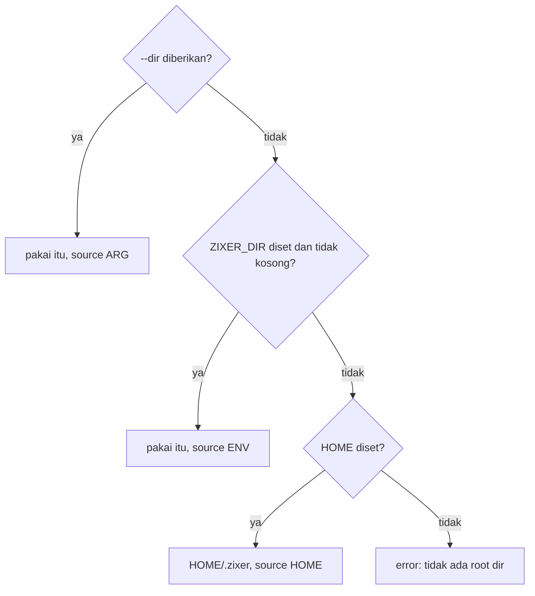
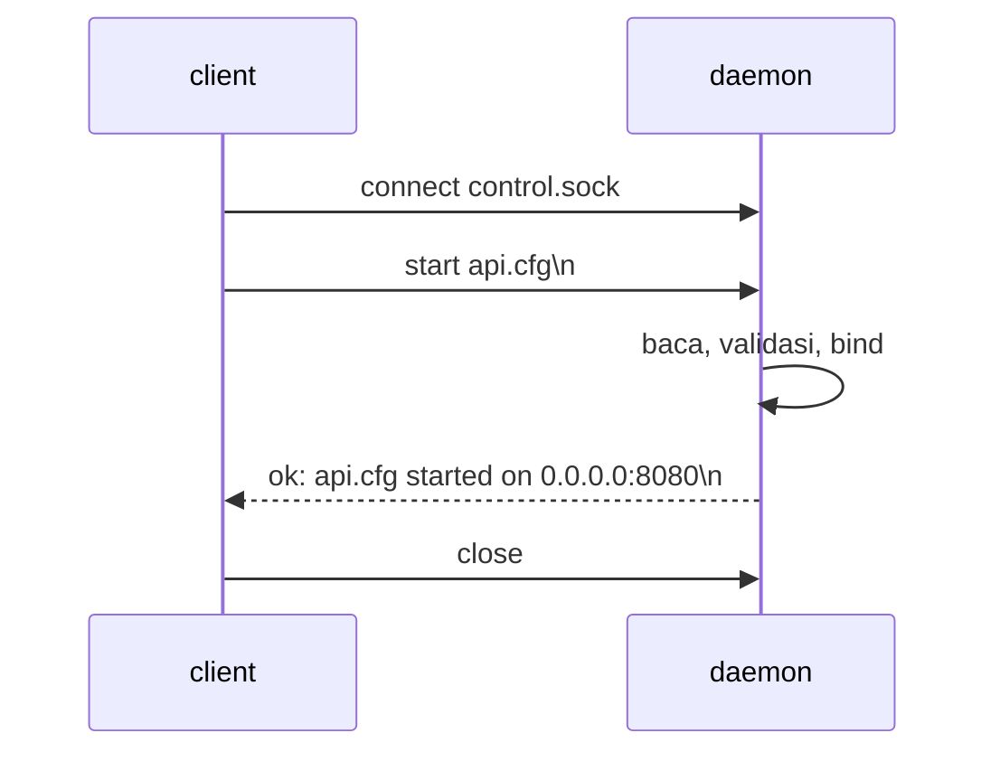
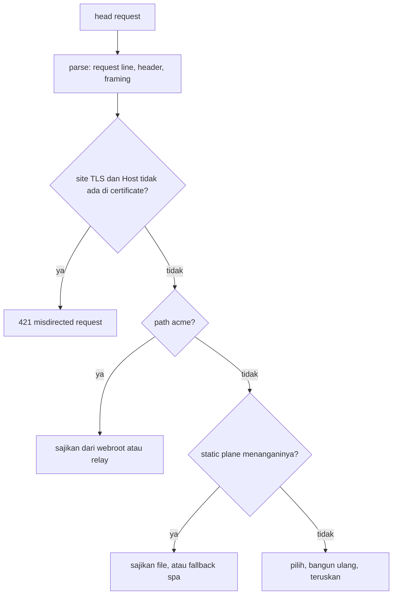
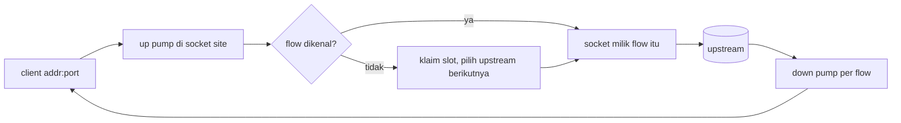

# Desain tingkat rendah zixer

Dokumen ini membahas internalnya: grammar config, wire control plane, aturan registry, apa yang dilakukan tiap edge di wire, dan batas-batas tetapnya. Untuk bentuk gateway-nya baca `hld-id.md` dulu. Untuk panduan config per key baca `config-id.md`.

 

## Pemindaian config

Satu scanner membaca `main.cfg` maupun tiap file site. Ia tidak mengalokasi apa pun: tiap key dan value adalah slice ke isi file, yang dijaga tetap hidup oleh pemanggilnya.

Per baris:

1. Potong di `#` pertama, jadi comment di ekor lenyap dan baris yang isinya hanya comment menjadi kosong.
2. Pangkas spasi, tab, dan `\r`, jadi file CRLF terbaca sama dengan file LF.
3. Lewati baris kosong.
4. Pisah hanya di `:` pertama. Nilainya menyimpan titik dua berikutnya, dan itulah yang membuat `C:/certs/full.pem` dan `::1:9000` bekerja.
5. Pangkas kedua sisi. Key kosong atau value kosong adalah fault, bukan lewatan.

Nilai berupa list koma diiterasi dengan aturan tanpa alokasi yang sama, dan item kosong (`a,,b`, atau koma di ujung) kembali sebagai string kosong supaya skema bisa mem-fault-kannya alih-alih diam-diam membuang salah ketik.

Boolean hanya menerima `true` dan `false`. `True`, `yes`, dan `1` semuanya fault, karena config yang menebak adalah config yang mengejutkan.

## Nilai numerik

Tiap key numerik melewati evaluator ekspresi: integer, `+ - * /`, dan tanda kurung, dengan perkalian dan pembagian mengikat lebih dulu, kiri ke kanan, dibatasi 32 tingkat kurung.

| aturan | alasan |
| :- | :- |
| pembagian harus pas | `10 / 4` jauh lebih sering salah ketik daripada disengaja, dan pemotongan diam-diam menyembunyikannya |
| pembagian nol fault | sama |
| overflow fault | hasilnya harus muat di math 64-bit sebelum di-cast ke tipe field |
| seluruh nilai harus terpakai | `1024 junk` fault alih-alih terbaca `1024` |

Tiap error dipetakan ke satu hint: `not a number or integer math (i.e. 16 * 1024)`, `division by zero`, `division leaves a remainder, config values must be exact`, `number does not fit 64-bit integer math`.

## Fault

Validasi tidak pernah berhenti di masalah pertama. Tiap pemeriksaan skema menambahkan ke daftar fault berisi pasangan `{ key, hint }`, dan pemanggilnya yang memutuskan apa yang dilakukan dengan daftar tidak kosong:

| pemanggil | perilaku |
| :- | :- |
| `zixer status` | mencetak tiap fault di bawah blok file itu, keluar 1 |
| daemon, pada main.cfg | menolak start, menunjuk ke `zixer status` |
| daemon, pada sebuah site | menolak `start` itu, menunjuk ke `zixer status <name>` |

Field yang salah tetap memakai default-nya alih-alih meracuni sisa parse, jadi satu laporan menampilkan semua masalah di file itu sekaligus.

 

## Resolusi root dir

`USERPROFILE` menggantikan `HOME` di Windows. Sumbernya disimpan bersama path-nya supaya `zixer` tanpa command bisa melaporkan di mana ia akan bekerja.

 

## Parse main.cfg

Key dicocokkan berdasarkan nama terhadap sebuah enum, jadi key tak dikenal menjadi laporan salah ketik alih-alih tambahan diam-diam. Key ganda fault dan nilai pertama yang berlaku.

| key | pemeriksaan |
| :- | :- |
| workers | muat di `usize`, paling banyak sebanyak thread mesin dari `std.Thread.getCpuCount` |
| dispatch | salah satu dari `async`, `epoll`, `uring`, dan di luar Linux hanya `async` |
| logs_dir, sites_dir | diambil apa adanya, di-default ke `<root>/logs` dan `<root>/sites` bila tidak ada |
| kernel_backlog | muat di `u31`, minimal 1 |
| max_recv_buf | minimal 1 |

`zixer status` menambahkan pemeriksaan keberadaan kedua direktori setelah parse.

## Parse config site

Pemindaian yang sama, lalu satu pass lintas field atas seluruh file. Pass-nya berjalan dalam urutan tetap supaya laporannya selalu terbaca sama: key wajib yang hilang, pasangan TLS, keberadaan backend, aturan static plane, pasangan acme, lalu aturan per engine. Daftar aturan lengkap beserta teks fault persisnya ada di `config-id.md`.

`upstreams` dipecah menjadi entri `{ host, port }`. Pemecahan terjadi di titik dua terakhir, port-nya harus terbaca sebagai `u16` bukan nol, dan tiap item buruk fault sendiri-sendiri sehingga list berisi lima nama menghasilkan lima hint. String host-nya sendiri tidak diperiksa di sini, itu sebabnya sebuah nama lolos gerbang config lalu gagal kemudian saat connect.

 

## Control plane

Daemon memegang `<root>/control.sock`. Root relatif dibuat absolut lebih dulu, karena AF_UNIX di Windows menolak path bind relatif, dan kedua sisi menurunkan string yang sama dari direktori kerja yang sama.

| properti | nilai |
| :- | :- |
| transport | unix stream socket, satu pertukaran per koneksi |
| request | satu baris, `verb [name]`, diakhiri newline |
| reply | satu baris, `ok: ...` atau `error: ...` |
| baris maksimum | 512 byte |
| nama site maksimum | 128 byte |
| batas path | batas unix socket platform, 108 byte di Linux |

Verb-nya adalah `start`, `stop`, `restart`, `ping`, dan `shutdown`. Tiga verb site butuh nama, `ping` dan `shutdown` menolak nama, dan selebihnya dijawab dengan baris usage.

Nama site di wire harus nama file polos berakhiran `.cfg`, tanpa `/`, tanpa `\`, dan tanpa `..`. Aturan itulah yang menjaga request control tidak menjangkau ke luar `sites_dir`.

Saat socket-nya diam, `start` dan `restart` men-spawn daemon dari path executable yang sama dengan command yang dijalankan, menunggu ia menjawab `ping`, lalu mengirim request sebenarnya. Daemon yang tidak pernah menjawab dilaporkan, bukan dicoba ulang selamanya.

 

## Aturan registry

Daemon menyimpan satu array site yang sudah start. Tiap mutasi berjalan serial, jadi tidak butuh lock.

| aturan | alasan |
| :- | :- |
| `start` pada site yang sudah start ditolak | bind ulang diam-diam akan menyembunyikan perubahan config yang tidak pernah diterapkan |
| `restart` pada site yang berhenti akan menyalakannya | hook renewal tidak boleh gagal hanya karena site kebetulan sedang mati |
| port yang sudah dimiliki site lain yang start ditolak | site tcp bind dengan address reuse, jadi kernel akan berbagi port alih-alih melaporkan tabrakan |
| port yang dijawab listener di luar daemon ini ditolak | registry hanya melihat site di proses ini, probe connect yang menemukan pemilik di proses lain |
| port companion acme dihitung sebagai dimiliki | tabrakan yang sama berlaku untuk port 80, baik dari registry maupun dari probe |
| listen backlog adalah nilai site, kalau tidak nilai main.cfg | satu default, satu override per site |

File config lebih besar dari 256 KiB ditolak alih-alih dimuat.

 

## Site runtime

Satu site yang start memegang satu listener, dengan salah satu bentuk berikut:

| engine dan config | apa yang dipegang |
| :- | :- |
| http1, http2, atau grpc dengan `upstreams` atau `public_dir` | proxy edge yang melayani di atas listener tcp |
| http1, http2, atau grpc tanpa keduanya | listener tcp telanjang, jadi port-nya dimiliki dan tabrakan terlihat |
| http3 dengan `upstreams` atau `public_dir` | edge QUIC di atas socket datagram yang di-bind |
| udp dengan `upstreams` | forward per flow di atas socket datagram yang di-bind |
| http3 atau udp tanpa keduanya | socket datagram telanjang |

Listener tcp bind dengan address reuse, socket datagram bind ketat.

Address reuse itulah alasan bind tcp didahului sebuah probe. Std memasangkan flag itu dengan `SO_REUSEPORT` di posix, dan `SO_REUSEADDR` di Windows sama permisifnya, jadi listener kedua ikut bergabung di port itu alih-alih gagal, lalu kernel membagi koneksi yang datang ke keduanya. Probe connect ke alamat yang akan didengarkan site, loopback sebagai ganti wildcard karena Windows menolak connect ke `0.0.0.0`. Listener yang hidup akan menjawab dan start ditolak dengan `AddressInUse`, sedangkan socket yang tertinggal di TIME_WAIT menolak connect itu, jadi restart tepat setelah trafik nyata tetap bisa bind ulang. Socket datagram tidak butuh probe: bind-nya ketat dan melaporkan tabrakannya sendiri.

Site TLS dengan key acme, di port selain 80, juga bind port 80, dan port companion itu diprobe dengan cara yang sama. Bind itu tidak opsional: bila gagal, seluruh `start` gagal dengan pesan yang menyebut port challenge-nya.

 

## Edge http1

Parsing head dibatasi: 16 KiB head, paling banyak 64 header. Keputusan framing body mengikuti rfc 9112, dan karena edge melakukan re-origination, `Transfer-Encoding` dan `Content-Length` tidak pernah menyeberang seperti saat datang. Pesan yang dibangun ulang membawa header framing yang dipilih edge sendiri.

Static plane berjalan sebelum pool bila site punya keduanya, dan `public_prefix` membatasinya: tanpa prefix seluruh ruang path static lebih dulu, dengan prefix hanya subtree itu. Resolusi path menolak `..` langsung alih-alih menormalkannya, menolak NUL yang tersisip, memetakan slash di akhir ke `index.html`, dan membatasi path gabungan di 512 byte. Sibling terkompresi diprobe berurutan `.br` lalu `.gz` terhadap `Accept-Encoding`, dengan identity sebagai lantai, dan `Vary: Accept-Encoding` ikut di tiap response static.

Satu pertukaran terhadap pool mencoba paling banyak satu kali per upstream plus satu cadangan, jadi satu koneksi idle yang basi tidak pernah menghabiskan satu-satunya kesempatan sebuah slot. Begitu body request mulai di-stream, tidak ada retry: body tidak bisa diulang.

`101` dari upstream mengubah koneksi menjadi tunnel mentah di kedua arah untuk sisa hidupnya, dengan pilihan upstream dipatok untuk tunnel itu.

## Edge http2

Stream h2 dari client dilayani satu per satu dengan sisanya diantre, dan tiap stream di-re-originate sebagai request HTTP/1.1 ke pool. Translasinya mengikuti rfc 9113 bagian 8: pseudo-header menjadi request line, header khusus koneksi ditolak, status response kembali menjadi `:status`.

Stream extended CONNECT (rfc 8441) menjadi bridge websocket: frame DATA menjadi byte mentah ke arah upstream websocket h1, dan byte mentah kembali menjadi frame DATA.

h2 prior knowledge disniff di listener cleartext, jadi client yang tidak pernah menegosiasi ALPN tetap bekerja.

## Edge grpc

gRPC adalah h2 di kedua leg, karena trailer adalah kanal status dan re-origination ke h1 akan kehilangannya. Edge membuka koneksi h2 ke upstream terpilih, mengalokasikan stream id di sana, memvalidasi dan meng-encode ulang blok header, lalu me-multiplex frame di kedua arah. Jawaban lokal (request tak terroutekan, tidak ada upstream) dihasilkan sebagai response grpc, bukan sebagai error http.

## Edge http3

Edge menerminasi sendiri QUIC (rfc 9000 dan 9001) dan HTTP/3 (rfc 9114): state koneksi, ruang packet number, flow control, perakitan stream, dan field section QPACK (rfc 9204). Tiap stream request diterjemahkan menjadi pesan HTTP/1.1 untuk pool, dan response-nya diterjemahkan balik. Paling banyak 64 koneksi QUIC bersamaan dipegang per site.

Seperti di edge TLS lain, `:authority` yang tidak dicakup certificate dijawab 421.

## Forward udp

Tidak ada parsing sama sekali. Socket site menerima datagram, dan flow table memutuskan ke mana ia pergi.

- Satu flow adalah satu alamat dan port client. Ia menempel ke satu upstream seumur hidupnya, dan flow baru menyusuri upstream secara round-robin.
- Tiap flow meneruskan lewat socket ephemeral-nya sendiri, jadi upstream melihat satu peer berbeda per client. Itulah yang dibutuhkan state ICE dan DTLS.
- Table menampung 64 flow. Saat semuanya terpakai, flow paling basi ditandai closing dan datagram pemicunya dibuang, karena tiap protocol yang dihadapi site udp melakukan retransmit.
- Down pump hanya menerima datagram dari upstream yang dipilih flow-nya, apa pun yang lain di port ephemeral itu dibuang.
- Kebaruan memakai penghitung klaim, bukan jam, jadi tidak ada bagian di sini yang bergantung pada waktu.
- Pembongkaran memakai flag stop plus wake datagram ke port site sendiri, karena menutup socket yang sedang diblokir thread lain tidak andal lintas platform.

Buffer memakai batas datagram penuh 65535 byte di kedua arah, jadi tidak ada yang pernah terpotong. Itu sebabnya `max_recv_buf` tidak mengubah apa pun di site udp hari ini.

## Edge TLS

Satu handshake per koneksi lewat stack TLS zix, dengan daftar preferensi ALPN diambil dari engine site. Protocol hasil negosiasi memilih jalur serving: `h2` menjalankan edge h2, `http/1.1` menjalankan edge http1, dan tanpa ALPN sama sekali jatuh ke sniff preface di site http2 atau http1 biasa di tempat lain. Penutupan adalah `close_notify` sebaik mungkin sebelum socket dilepas.

## Acme plane

Dua bentuk, keduanya terikat ke `/.well-known/acme-challenge/`:

| key | perilaku |
| :- | :- |
| `acme_webroot` | file token dibaca dari `<webroot>/.well-known/acme-challenge/<token>`, miss dijawab `404 not found` |
| `acme_proxy` | request direlay ke backend yang dikonfigurasi dan balasannya diteruskan apa adanya, termasuk status dan header-nya sendiri |

Di site http1 cleartext keduanya berjalan di listener site itu sendiri. Di site TLS keduanya berjalan di listener companion port 80.

 

## Upstream pool

Round-robin O(1) atas upstream yang sedang up:

- `slots` menyimpan tiap upstream yang dikonfigurasi, `ready` menyimpan indeks padat dari yang sedang up, jadi pemilihan tidak pernah memindai.
- Menandai down adalah swap-remove, menandai up adalah append.
- Kegagalan connect menandai upstream down. Penerimaan kembali terjadi saat pemilihan setelah cooldown 3000 ms, dan sapuannya dibatasi paling sering sekali per 200 ms supaya biayanya tidak pernah jatuh di tiap pemilihan.
- Upstream yang diterima kembali tapi masih mati ditandai down lagi oleh kegagalan berikutnya. Tidak ada thread probe.
- Koneksi keep-alive idle di-cache per slot upstream, sampai 4 per slot. Kelebihannya ditutup alih-alih ditumbuhkan.

Spinlock pendek menjaga pool dan cache, karena task koneksi berjalan bersamaan di dalam satu site.

 

## Batas tetap

Tidak satu pun dari ini yang bisa dikonfigurasi hari ini.

| batas | nilai | di mana |
| :- | :- | :- |
| ukuran file config | 256 KiB | main.cfg dan tiap file site |
| baris control | 512 byte | request dan reply control socket |
| nama site | 128 byte | control socket |
| path control socket | 108 byte di Linux | seluruh string `<root>/control.sock` |
| head request | 16 KiB | edge http1 |
| header per pesan | 64 | edge http1 |
| path static | 512 byte | `public_dir` plus path request |
| koneksi upstream idle | 4 per upstream | per site |
| cooldown upstream | 3000 ms | pool per site |
| koneksi QUIC bersamaan | 64 | per site http3 |
| flow udp | 64 | per site udp |
| datagram udp | 65535 byte | per site udp |
| kegagalan accept berturut-turut sebelum loop menyerah | 100 | control loop dan tiap accept loop site |

 

## Pengujian

Tiap modul membawa test-nya sendiri berdampingan dengan kodenya, dijalankan dengan `zig build zixer-unit-test`. Permukaan config tercakup di tiga tingkat:

| tingkat | apa yang dibuktikan |
| :- | :- |
| test scanner dan math | grammar, comment, list, dan tiap aturan aritmetika |
| test skema | tiap default, tiap teks fault, dan tiap aturan lintas field |
| test daemon dan runtime | bahwa nilai hasil parse benar-benar sampai ke bind, mis. backlog yang di-resolve sebuah site |

Matriks demo di bawah `examples/proxies` adalah lapisan ujung ke ujung: `zig build zixer-test-runner-all` menyalakan tiap upstream, mem-bind site demo itu di root sementara, menjalankan client native lewat edge, dan melaporkan satu baris per demo.
