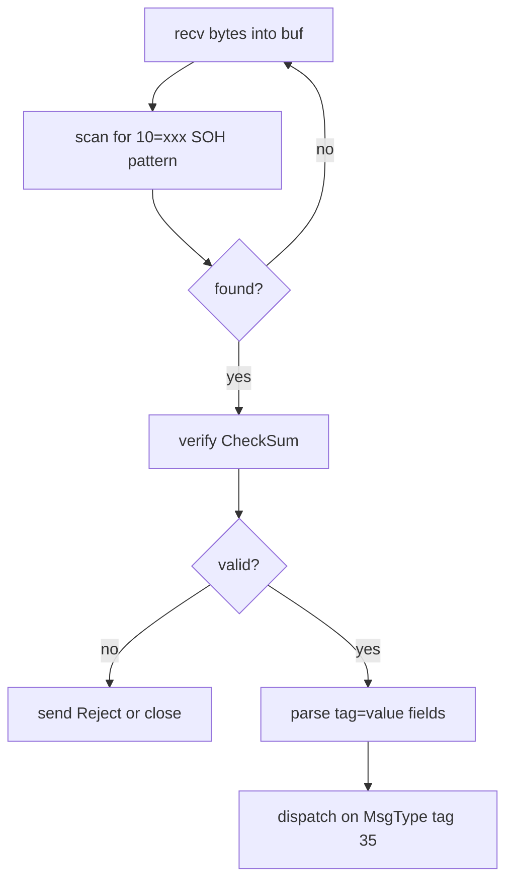
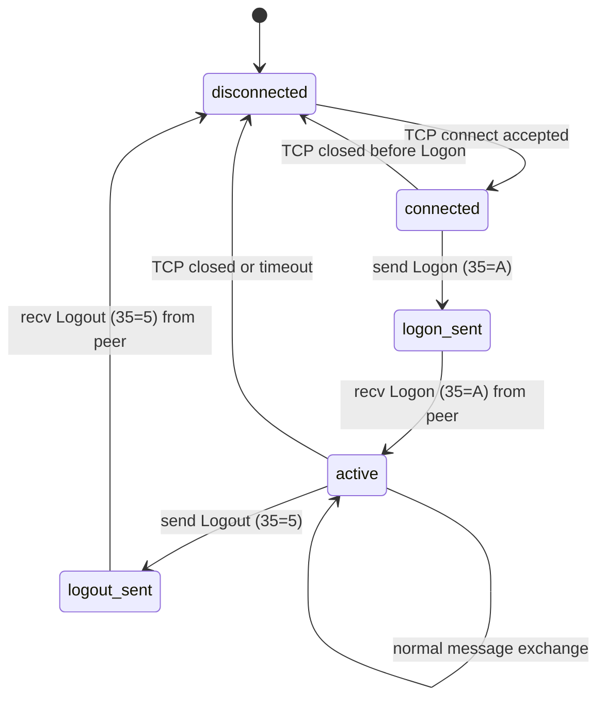
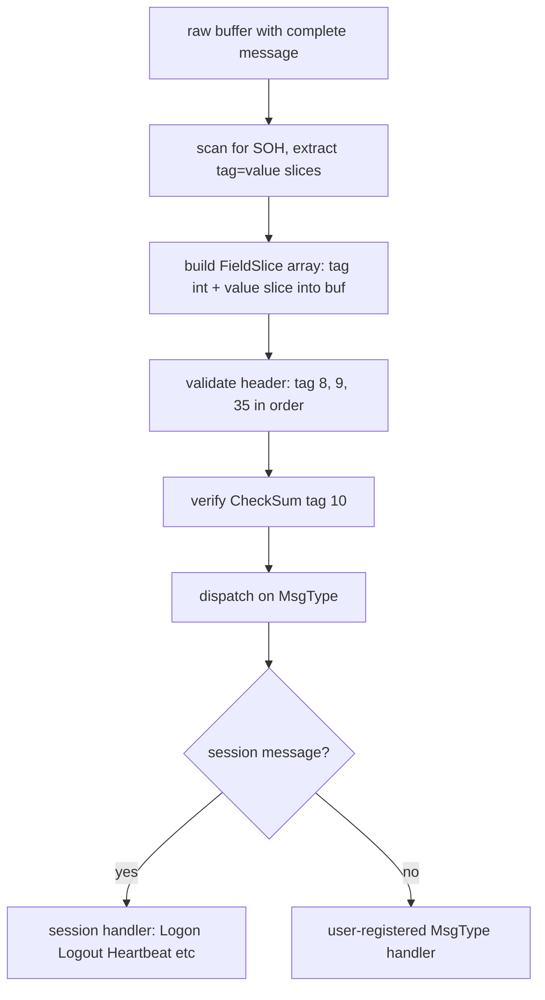
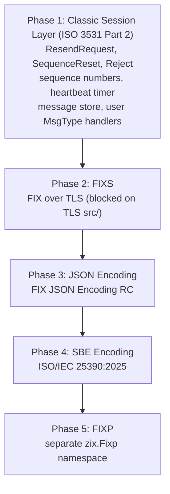

# FIX Protocol Specification — zix.Fix

## Overview

FIX (Financial Information eXchange) is a message-based protocol used in financial
markets for trade orders, executions, and market data. The wire format is a sequence
of tag=value pairs delimited by SOH (ASCII 0x01).

zix.Fix is a standalone FIX 4.x server and client. It is NOT built on top of
zix.Tcp.Server. It owns the session layer (Logon, Heartbeat, Logout) and provides
zero-copy field access to the handler.

This specification covers FIX 4.2, 4.4, and the common subset of 4.0 and 4.1.
FIX 5.0 and FIXT 1.1 (which split transport from application) are out of scope initially.

See also: rnd/tcp_server_specification.md for the underlying raw TCP primitives.

---

## Definition of Done

### PoC (rnd/)

- [x] SOH-delimited framing: parse and write tag=value pairs separated by 0x01
- [x] Standard header fields: BeginString (8), BodyLength (9), MsgType (35), SenderCompID (49), TargetCompID (56), MsgSeqNum (34), SendingTime (52)
- [x] Standard trailer: CheckSum (10) computed as sum of all bytes mod 256, 3-digit zero-padded
- [x] Session messages: Logon (35=A), Logout (35=5), Heartbeat (35=0), TestRequest (35=1)
- [x] Session state: Logon handshake, application message echo, Logout close
- [x] All 3 dispatch models: POOL, ASYNC, MIXED
- [x] FIX client: connect, Logon, send application messages, recv echo, Logout
- [x] All 4 test tiers pass (unit 15, integration 2, behaviour 3, edge 6 — 26 total)

PoC go/no-go passed (2026-05-20).

### src/ (src/tcp/fix/)

- [x] `zix.Fix` public namespace
- [x] `FixServer.run()` — ASYNC, POOL, MIXED dispatch (no handler param: session logic is internal)
- [x] `FixClient` — connect, logon, send, recv, logout
- [x] `FixServerConfig` and `FixClientConfig` with logger field
- [x] Zero-copy field helpers: `parseFields`, `buildMessage`, `getField`, `findMessageEnd`, `verifyChecksum`
- [x] Logger wiring: `system()` on server lifecycle, `session()` per message in `serveConn`
- [x] All 4 test tiers pass (2026-05-23)
- [ ] Session messages: ResendRequest (35=2), SequenceReset (35=4), Reject (35=3)
- [ ] Full session state machine: not connected, connected, logged on, logged out
- [ ] Sequence number management: inbound and outbound, gap detection, resend request
- [ ] Heartbeat timer: send Heartbeat at HeartBtInt (tag 108) interval, send TestRequest on missed heartbeat
- [ ] User handler registration per MsgType (tag 35)
- [ ] Performance: >= 200k messages/s throughput (server echo) at c10

src/ basic implementation complete (2026-05-23). Advanced session features (ResendRequest, SequenceReset, heartbeat timer) are pending.

---

## FIX Version Coverage

| Version | BeginString value | Notes |
| :- | :- | :- |
| FIX 4.0 | FIX.4.0 | baseline, rare today |
| FIX 4.1 | FIX.4.1 | adds ResendRequest and SequenceReset |
| FIX 4.2 | FIX.4.2 | most common legacy version |
| FIX 4.4 | FIX.4.4 | adds XmlData, no structural change |
| FIX 5.0 | FIXT.1.1 (transport) | separates transport from app layer, out of scope |

zix.Fix targets FIX 4.2 as primary. Tag values and session logic are compatible
with 4.0, 4.1, and 4.4 without structural changes.

---

## Wire Format

A FIX message is a sequence of tag=value pairs, each followed by SOH (0x01):

```
8=FIX.4.2<SOH>9=65<SOH>35=A<SOH>49=SENDER<SOH>56=TARGET<SOH>34=1<SOH>52=20240101-12:00:00<SOH>98=0<SOH>108=30<SOH>10=123<SOH>
```

Key structural rules:

- Tag 8 (BeginString) must be first
- Tag 9 (BodyLength) must be second: byte count from tag 35 up to and including the SOH before tag 10
- Tag 10 (CheckSum) must be last: sum of all bytes in the message (including all SOH) mod 256, formatted as 3 zero-padded decimal digits
- SOH (0x01) is the field delimiter, not a record separator — it appears after every value including the last field before tag 10

---

## Message Framing

FIX framing is delimiter-based, not length-prefix:



The BodyLength field (tag 9) is used as a sanity check, not for primary framing.
Primary framing relies on finding the tag 10 terminator pattern.

---

## Standard Header and Trailer Fields

### Header (must appear first, in order)

| Tag | Name | Type | Notes |
| :- | :- | :- | :- |
| 8 | BeginString | string | FIX.4.2 |
| 9 | BodyLength | int | bytes from tag 35 to SOH before tag 10 |
| 35 | MsgType | string | single character or short string |
| 49 | SenderCompID | string | sender identifier |
| 56 | TargetCompID | string | receiver identifier |
| 34 | MsgSeqNum | int | monotonically increasing per session |
| 52 | SendingTime | UTCTimestamp | YYYYMMDD-HH:MM:SS or with milliseconds |

### Trailer (must appear last)

| Tag | Name | Type | Notes |
| :- | :- | :- | :- |
| 10 | CheckSum | string | 3-digit decimal, sum of all bytes mod 256 |

---

## Session Message Types

| MsgType | Value | Direction | Purpose |
| :- | :- | :- | :- |
| Logon | A | both | establish session, exchange parameters |
| Logout | 5 | both | terminate session gracefully |
| Heartbeat | 0 | both | keepalive, echoes TestReqID if present |
| TestRequest | 1 | both | probe, receiver must respond with Heartbeat |
| ResendRequest | 2 | both | request retransmission of missed messages |
| SequenceReset | 4 | both | reset sequence to recover from gap |
| Reject | 3 | both | session-level reject of malformed message |

---

## Session State Machine



---

## Sequence Number Management

Both sides maintain two counters:

- MsgSeqNum sent: increments on every outbound message (including session messages)
- MsgSeqNum expected: the next expected inbound sequence number

On receiving a message with MsgSeqNum higher than expected:
send ResendRequest (tag 7 = BeginSeqNo, tag 16 = EndSeqNo = 0 for all missing).

On receiving a ResendRequest:
retransmit stored messages or send SequenceReset-GapFill for messages that cannot be replayed.

zix.Fix (when sequence number management is implemented) will store sent messages in a ring buffer for potential retransmission.
Application handlers must treat retransmitted messages idempotently.

---

## Heartbeat Timer

The Logon message carries HeartBtInt (tag 108), the interval in seconds.

zix.Fix (when heartbeat timer is implemented) will run a timer per connection:

- If no message received in HeartBtInt seconds: send TestRequest (tag 112 = TestReqID = timestamp)
- If no response to TestRequest within HeartBtInt: close the connection
- Send Heartbeat proactively when no application messages were sent in HeartBtInt seconds

---

## CheckSum Computation

```
checksum = 0
for each byte in message (before tag 10 value):
    checksum = (checksum + byte) mod 256
format as: "10=%03d<SOH>" % checksum
```

The sum includes all bytes in the message including all SOH delimiters,
from the first byte of tag 8 through and including the SOH after the tag 10 equals sign.

---

## Dispatch Model

All 3 dispatch models from DispatchModel (same enum, same backing values as zix.Tcp.Server):

| Model | Description |
| :- | :- |
| POOL | N accept threads push connections to ConnQueue, M session threads handle each connection |
| ASYNC | single accept thread, io.async per connection |
| MIXED | N accept threads each use io.async directly |

FIX sessions are long-lived and stateful (sequence numbers, heartbeat timer, message store).
POOL is the natural default because each pool thread owns a session for its lifetime.
ASYNC and MIXED work, session state is stack-allocated inside `serveConn` per connection.

---

## Message Parsing

Zero-copy field extraction: scan the raw buffer for SOH delimiters, record tag and value offsets.



No heap allocation during parsing. Field offsets point into the read buffer.
The user handler receives a FixMessage with zero-copy field access.

---

## User-Facing API

Server — session logic is entirely internal to `serveConn`. No handler registration needed:

```zig
var server = try zix.Fix.Server.init(.{
    .io             = process.io,
    .ip             = "0.0.0.0",
    .port           = 9400,
    .comp_id        = "SERVER",
    .dispatch_model = .ASYNC,
    .logger         = null,
});
defer server.deinit();
try server.run();
```

Client — connect, logon, exchange messages, logout:

```zig
var client = try zix.Fix.Client.init(io, .{
    .ip             = "127.0.0.1",
    .port           = 9400,
    .comp_id        = "CLIENT",
    .target_comp_id = "SERVER",
});
defer client.deinit(io);
const fields = [_]zix.Fix.BuildField{
    .{ .tag = 35,  .value = "D" },
    .{ .tag = 55,  .value = "AAPL" },
    .{ .tag = 38,  .value = "100" },
};
try client.send(io, &fields);
var buf: [4096]u8 = undefined;
const n = try client.recv(io, &buf);
_ = zix.Fix.parseFields(buf[0..n]);
```

Zero-copy field helpers (pub from `zix.Fix`):

```zig
zix.Fix.parseFields(buf)          // slice of Field{tag, value} pointing into buf
zix.Fix.getField(fields, tag)     // returns value slice or null
zix.Fix.buildMessage(out, fields) // writes tag=value<SOH>... into out
zix.Fix.findMessageEnd(buf)       // returns end offset when tag 10 terminator is found
zix.Fix.verifyChecksum(buf, n)    // returns true if checksum matches
```

Note: user handler registration per MsgType (tag 35) is not yet implemented. The current src/ handles Logon, Logout, Heartbeat, TestRequest, and echoes all other message types internally in `serveConn`.

---

## Implemented File Structure

| File | Contents | Status |
| :- | :- | :- |
| src/tcp/fix/Fix.zig | public namespace, all re-exports | done |
| src/tcp/fix/core.zig | parseFields, buildMessage, checksum, serveConn, inline unit tests | done |
| src/tcp/fix/server.zig | FixServer — ASYNC, POOL, MIXED dispatch | done |
| src/tcp/fix/client.zig | FixClient — connect, logon, send, recv, logout | done |
| src/tcp/fix/config.zig | FixServerConfig, FixClientConfig (includes logger field) | done |
| src/tcp/fix/session.zig | full session state machine, sequence numbers, heartbeat timer | not started |
| src/tcp/fix/message.zig | FixMessage with user-registered MsgType handlers | not started |

Note: `session.zig` and `message.zig` are pending (advanced session features). Current session logic is inline in `core.zig` / `serveConn`.

---

## Zig std Coverage

| std API | Available | Notes |
| :- | :- | :- |
| TCP connect and listen | yes | std.net, same as zix.Tcp.Server |
| SOH delimiter scanning | yes | std.mem.indexOfScalar(u8, buf, 0x01) |
| Integer parsing for tag values | yes | std.fmt.parseInt |
| UTCTimestamp formatting | yes | std.fmt with manual calendar math or std.time |
| Timer / sleep | yes | std.Io.sleep, std.Io.Clock |
| Mutex and Condition | yes | std.Io.Mutex, std.Io.Condition |
| Atomic values | yes | std.atomic.Value |

---

## What std Does Not Provide

| Gap | Must build |
| :- | :- |
| FIX message framing (SOH scan + tag 10 terminator) | small, in message.zig |
| CheckSum computation and verification | trivial byte-sum |
| FIX session state machine | session.zig |
| Sequence number tracking | session.zig |
| Heartbeat timer per session | session.zig with std.Io.sleep |
| Message store for retransmission | ring buffer in session.zig |
| BodyLength computation | byte count between tag 35 and tag 10 |
| UTCTimestamp parser (tag 52) | simple string scan |

---

## Performance Targets

FIX is a low-fan-out protocol: each session is one TCP connection, typically one sender.
Throughput is measured per session (single connection), not aggregate.

| Scenario | Target |
| :- | :- |
| Echo server (single session, POOL) | >= 200k msg/s |
| Parse and dispatch latency per message | < 5µs |
| CheckSum computation (1KB message) | < 500ns |
| Logon handshake round trip | < 1ms (loopback) |
| Heartbeat timer accuracy | within 100ms of configured interval |

---

## Not Yet Covered

| Topic | Notes |
| :- | :- |
| FIX 5.0 and FIXT 1.1 | separates BeginString FIX.5.0 (app) from FIXT.1.1 (transport) |
| FIX-over-TLS | encrypt the TCP connection, standard practice at many brokers |
| FIX-over-WebSocket | rare but used for browser-based trading tools |
| Market data (tag 35=W, X) | large repeating groups, needs group parser |
| Repeating groups | tag 454, 555, etc., group starts with delimiter tag and count |
| FIX Binary (FAST encoding) | FIXT binary transport, completely different framing |
| FIX Orchestra | machine-readable FIX spec, can drive code generation |
| Encryption within FIX (tag 98=1,2,3) | EncryptMethod field, not standard SSL, rarely used |
| FIX session persistence | store sent messages to disk for crash recovery and replay |
| Multi-session multiplexing | one TCP connection carrying multiple virtual sessions |
| PROXY protocol v1/v2 | parse PROXY header on accepted connections to recover real client IP when running behind nginx or haproxy TLS termination |

---

## Coverage Plan

Scope for zix as a network library covers the FIX Technical Standards only: encoding, session, framing, and transport. FIXatdl, MMT, and Processes/Templates are application-level or governance concerns outside library scope. Orchestra belongs in a separate code generation tool, not the runtime library.

### Layer 1: Classic Session Layer (ISO 3531 Part 2)

Current gap. zix.Fix implements the subset needed for PoC go/no-go. Completing ISO 3531 Part 2:

| Feature | Status | Notes |
| :- | :- | :- |
| Logon, Logout, Heartbeat, TestRequest | done | inline in serveConn |
| ResendRequest (35=2) | pending | request retransmission of missed messages |
| SequenceReset (35=4) | pending | reset sequence to recover from gap |
| Reject (35=3) | pending | session-level reject of malformed or out-of-sequence messages |
| Full session state machine | pending | not connected, connected, logged on, logged out |
| Sequence number management | pending | inbound expected counter, outbound counter, gap detection |
| Heartbeat timer | pending | send TestRequest on missed heartbeat, close on no reply |
| Message store | pending | ring buffer of sent messages for retransmission on ResendRequest |
| User handler registration per MsgType | pending | dispatch application messages to registered handlers |

### Layer 2: Transport Security (FIXS)

FIXS is FIX over TLS. Standard practice at most brokers. Blocked on TLS src/ implementation. No session layer changes required — the existing FIX session layer is wired on top of the TLS stream once TLS lands.

Until TLS lands in zix itself, TLS termination at a reverse proxy (nginx stream or haproxy mode tcp) is the standard interim path. In this configuration, zix.Fix sees the proxy IP instead of the real client IP. PROXY protocol v1/v2 header parsing on accepted connections recovers the original client IP for accurate session logging. Not started — depends on the proxy deployment scenario being confirmed first.

### Layer 3: Encoding Formats

TagValue (ISO 3531 Part 1) is implemented. Additional encodings in priority order by real-world demand:

| Encoding | Standard | Demand | Complexity | Status |
| :- | :- | :- | :- | :- |
| TagValue | ISO 3531 Part 1 | universal | low | done |
| JSON | FIX JSON Encoding RC | medium | low | not started |
| SBE | ISO/IEC 25390:2025 | high (market data) | high | not started |
| FAST | FIX FAST v1.1 | medium (streaming feeds) | high | not started |
| FIXML | FIXML v1.1 | low | high | not started |
| Protobuf | FIX Protobuf draft | low | medium | not started |
| ASN.1 | ISO-based | very low | very high | not started |

Realistic target for zix: TagValue (done), JSON, SBE. FAST and FIXML are specialist and rarely needed outside specific venue integrations.

### Layer 4: Alternative Session (FIXP)

FIXP is a lightweight high-performance session layer for demanding point-to-point scenarios. It is not ISO 3531 Part 2 and is a separate design from the Classic session. If pursued: separate `zix.Fixp` namespace, not an extension of `zix.Fix`.

### Out of Scope for the Library

| Standard | Reason |
| :- | :- |
| FIXatdl | GUI metadata for algo parameters, application layer concern |
| MMT | post-trade data flagging, application layer concern |
| Orchestra | machine-readable spec format, belongs in a separate code generation tool |
| SOFH | simple open framing header, follows automatically once multiple encodings coexist on one connection |
| FIX 5.0 / FIXT 1.1 | separates transport from app layer, not pursued until FIXP is in scope |

### Phased Roadmap



---

## PoC

Go/no-go passed 2026-05-20. All 4 test tiers complete.

### Files

| File | Tests | Contents |
| :- | :- | :- |
| `rnd/fix_poc_core.zig` | (library) | parseFields, buildMessage, computeChecksum, verifyChecksum, serveConn |
| `rnd/fix_poc_server.zig` | (binary) | echo server — `--model async\|pool\|mixed`, `--ip`, `--port` |
| `rnd/fix_poc_client.zig` | (binary) | Logon, NewOrderSingle, recv echo, Logout |
| `rnd/fix_unit_test.zig` | 15 pass | checksum, framing, parseFields, buildMessage, getField |
| `rnd/fix_integ_test.zig` | 2 pass | Logon handshake + echo round-trip, Logout |
| `rnd/fix_behav_test.zig` | 3 pass | session state transitions, Heartbeat response |
| `rnd/fix_edge_test.zig` | 6 pass | malformed message, bad checksum, truncated SOH, overflow |

All test files live in `rnd/` alongside `fix_poc_core.zig`. `zig test file.zig` treats the file's directory as the module root — `@import("fix_poc_core.zig")` only resolves locally.

### Go/no-go verification (two terminals)

Terminal 1 — start the echo server (ASYNC by default, port 9400):

```sh
zig run rnd/fix_poc_server.zig
```

Terminal 2 — connect with the client:

```sh
zig run rnd/fix_poc_client.zig
```

Expected client output: `sent Logon`, `recv Logon from server`, `sent NewOrderSingle`, `recv echo 35=D symbol=AAPL qty=100`, `sent Logout`, `recv Logout — session complete`.

### Key pitfall: readSliceShort blocks with a large buffer on live TCP

`std.Io.Reader.readSliceShort(buf)` loops internally calling `netRead` until the buffer is full or EOF. With a 16 KB buffer and a 200-byte FIX message, it reads the 200 bytes then calls `netRead` again — which blocks because the socket buffer is empty. Both sides end up waiting: deadlock.

Fix: use `takeByte` in a loop for delimiter-based framing. The reader's internal buffer absorbs the full TCP segment on the first syscall, subsequent `takeByte` calls drain from it with no additional syscalls.

```zig
while (true) {
    if (findMessageEnd(recv_buf[0..recv_len])) |end| break end;
    recv_buf[recv_len] = try rd.interface.takeByte();
    recv_len += 1;
}
```

This applies to any delimiter-based protocol on raw `std.Io.Reader`. `readSliceShort` is not "return after first available bytes" — it returns only after the provided buffer is full, or on EOF. Use `takeByte` (or `readSliceAll` with exact lengths) for framing.

### Session scope in PoC vs src/

The PoC implements the session message subset needed for go/no-go: Logon, Logout, Heartbeat, TestRequest, and application message echo. ResendRequest, SequenceReset, Reject, and the heartbeat timer are deferred to the src/ implementation.

### FIX Standard

Standards published and maintained by FIX Protocol Limited (fixtrading.org). Categories below summarize scope and relevance to zix.Fix.

---

#### 1. The FIX Protocol

https://fixtrading.org/standards/fix-protocol/

A global, open, application-layer standard for exchanging financial trading information. The protocol is independent of transport, network, and encoding. Business messages are composed from tag-identified fields, grouped into components (parties, instruments, allocations), and organized into functional message categories.

**Supported versions:**

| Version | BeginString | Status | Notes |
| :- | :- | :- | :- |
| FIX 4.0 | FIX.4.0 | archived | baseline, rare today |
| FIX 4.1 | FIX.4.1 | archived | adds ResendRequest, SequenceReset |
| FIX 4.2 | FIX.4.2 | legacy support | most common legacy version in production |
| FIX 4.4 | FIX.4.4 | legacy support | adds XmlData field, no structural change |
| FIX 5.0 SP2 | FIX.5.0SP2 | archived | separates transport (FIXT 1.1) from app layer |
| FIX Latest | (session version) | active | incremental Extension Packs (EP) since 2019, currently EP284+ |

Firms are strongly recommended to adopt FIX Latest. FIX 4.2 and 4.4 are retained for legacy interoperability only.

**Message categories:**

| Category | Purpose |
| :- | :- |
| Order handling | new orders, cancels, replaces, executions |
| Market data | quotes, snapshots, incremental updates |
| Trade reporting | trade capture and confirmation |
| Post-trade processing | allocations, confirmations, settlement |
| Infrastructure | session management (Logon, Logout, Heartbeat) |

**Extension packs (EP):**

Since 2019 the FIX standard uses backwards-compatible Extension Packs rather than discrete version releases. Each EP adds or modifies fields and messages without breaking existing implementations.

**Relevance to zix.Fix:** zix.Fix targets FIX 4.2 as primary. The tag set and session logic are compatible with 4.0, 4.1, and 4.4 without structural changes.

---

#### 2. FIX Algorithmic Trading Definition Language (FIXatdl)

https://fixtrading.org/standards/fix-algorithmic-trading-definition-language/

An XML-based vendor-neutral standard for describing user interfaces and parameters for algorithmic trading strategies. FIXatdl specifies how algorithm parameters (controls, constraints, defaults, validation rules) are expressed so that order management systems can automatically generate trader GUIs from broker-supplied XML files.

**Versions:**

| Version | Status | Notes |
| :- | :- | :- |
| 1.1 (Errata 20101221) | current release | stable |
| 1.2 RC1 | release candidate | in development |

**Key characteristics:**
- Requires zero changes to underlying FIX infrastructure
- Compatible with all FIX Protocol versions
- Preserves broker freedom to innovate in execution logic (only the interface definition is standardized)

**Relevance to zix.Fix:** not applicable. FIXatdl defines GUI metadata, not wire protocol or session layer.

---

#### 3. Market Model Typology (MMT)

https://fixtrading.org/standards/market-model-typology/

A protocol-agnostic standard for flagging post-trade data across venues and asset classes. Originated from a FESE (Federation of European Securities Exchanges) initiative in 2011. Maintained under FIX Protocol Limited Trust.

**Versions:**

| Version | Status | Notes |
| :- | :- | :- |
| 3.04 | superseded | earlier baseline with FAQ |
| 4.0 / 4.1 | superseded | addressed EU RTS 1 and RTS 2 (effective 2024-01-01) |
| 4.2 | superseded | released 2024-06-18 |
| 5.0 | active | effective 2025-12-01 (UK), 2026-03-02 (EU) |

**Regulatory context:** delivers operational solutions for MiFIR/MiFID II (RTS 1 and RTS 2) and UK FCA requirements (PS23/4, PS24/14).

**Asset classes covered:** equities (original scope), bonds, others via extension packs.

**FIX Extension Packs:** EP163, EP186, EP216, EP277, EP283, EP286, EP300.

**Relevance to zix.Fix:** not applicable. MMT is a post-trade data flagging standard, not a session or transport standard.

---

#### 4. Orchestra

https://fixtrading.org/standards/orchestra/

A standard for creating machine-readable definitions of messaging protocols. An Orchestra file (XML, Apache License 2.0) describes a protocol implementation: message inventory, field specifications, validation rules, alternative message layouts by scenario, permitted workflows, and network or session configuration.

**Key capabilities:**

| Capability | Description |
| :- | :- |
| Communication | parties exchange Orchestra files to unambiguously define rules of engagement |
| Normalization | handles variant FIX encodings and user-defined tags across counterparties |
| Validation | designates fields as mandatory, conditional, forbidden, or ignorable |
| Self-validation | tests internal systems against their own service specification |
| Provisioning | specifies full protocol stacks (application, session, encoding, transport) |
| FIXatdl integration | Orchestra files can reference FIXatdl configurations locally or remotely |

**Tools:**
- Log2Orchestra: converts FIX message logs to Orchestra XML
- Playlist: creates Orchestra files from manual selections

**Predecessor:** FIX Unified Repository served a similar role before Orchestra.

**Relevance to zix.Fix:** potential future use for code generation and validation tooling. Orchestra XML could drive automatic Tag enum and message-type generation.

---

#### 5. Technical Standards

https://fixtrading.org/standards/technical-standards/

Encoding, session, framing, and transport specifications. Most directly relevant to zix.Fix.

**Encoding standards:**

| Standard | Format | Status | Primary use |
| :- | :- | :- | :- |
| FIX TagValue (ISO 3531 Part 1) | ASCII tag=value SOH | ISO standard (2022) | universal. implemented by zix.Fix |
| FIXML | XML | v1.1 active | derivatives post-trade clearing and settlement |
| Simple Binary Encoding (ISO/IEC 25390:2025) | binary | ISO/IEC standard (2025) | high-performance market data and transactions |
| FAST (FIX Adapted for Streaming) | binary compressed | v1.1 active | market data bandwidth and latency reduction |
| JSON Encoding | JSON | release candidate | web-based applications and internal APIs |
| Google Protocol Buffers | binary | draft | internal company messaging |
| ASN.1 Encoding | binary | ISO-based | alternate encoding with multiple variant forms |

**Session standards:**

| Standard | Description | Notes |
| :- | :- | :- |
| Classic FIX Session Layer (ISO 3531 Part 2) | Logon, Heartbeat, sequence numbering, Logout, gap recovery | what zix.Fix implements |
| FIXP (High Performance Session Layer) | lightweight point-to-point for demanding environments | GitHub-hosted spec |

**Framing:**

| Standard | Description | Notes |
| :- | :- | :- |
| SOFH (Simple Open Framing Header) | length and type header prepended to any FIX message | enables mixed encoding on one connection |

**Transport:**

| Standard | Description | Notes |
| :- | :- | :- |
| FIXS (FIX over TLS) | TLS encryption for FIX connections | standard practice at many brokers |

**Relevance to zix.Fix:**
- Implements: FIX TagValue encoding (ISO 3531 Part 1), Classic FIX Session Layer (ISO 3531 Part 2)
- Pending: FIXS (blocked on TLS src/ implementation)
- Out of scope: SBE, FAST, FIXML, FIXP, SOFH (no current design)

---

#### 6. Processes and Templates

https://fixtrading.org/standards/processes-templates/

Governance documents for proposing and reviewing FIX standards. Not implementation specifications.

**Processes:**

| Document | Purpose |
| :- | :- |
| Recommended Practices/Guidelines Process | governs how best practice guidance is developed and approved |
| Gap Analysis Specification Proposal Process | formal procedure for proposing gaps against existing standards |
| Technical Standard Proposal Process | methodology for creating new technical standards |

**Templates:**

| Document | Latest | Purpose |
| :- | :- | :- |
| Gap Analysis Template | v3.3 (2023-02-28) | standardizes documentation of gaps in current standards |
| Recommended Practices/Guidelines Template | May 2020 | structure for developing implementation guidance |
| Technical Standard Proposal Template | May 2020 | framework for proposing new technical standards |

**Relevance to zix.Fix:** not applicable. These are governance materials for the FIX standards body.

