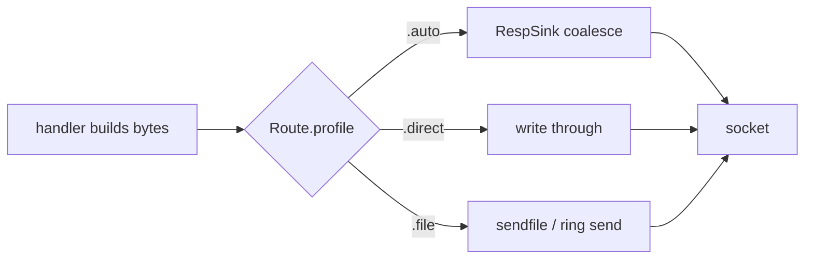

# ADR-041 increment 3 (proposal record): Route.profile write-strategy axis

> This is part of 0.4.x-rc3. Sub-record of [`ADR-041-draft.md`](ADR-041-draft.md) increment 3.

**Status:** Parked (2026-06-19). Kept as a design reference and may be refused. Do not implement until a `.file` / `.direct` write path actually exists (see Sequencing). Recorded so the decision and its rationale are not re-derived later.

## Objective
Decide what `Route.profile` should be, if it ships at all. The original ADR-041
increment 3 sketched a per-route comptime `profile` enum. This record fixes the
scope: a `Route.profile` should name a write-strategy (how a route emits its
response bytes), not a benchmark cell. It also records why this is an ergonomics
feature, not a performance lever, and what has to land before it has anything
real to select.

## Background
ADR-041 increment 3 originally proposed:

```
Route.profile: .auto | .baseline | .pipelined | .short_lived | .json | .static_file
```

That enum names HttpArena benchmark cells. The increment-3 note in
`ADR-041-draft.md` already flagged it as scaffolding: parsing happens before
routing (the path is needed to pick the route) and writing happens inside the
handler (which does not consult a route profile), so a standalone profile field
selects nothing today. This record resolves what the field should be instead.

## The problem with a benchmark-cell enum
A benchmark cell is not one behavior. Each cell conflates several orthogonal
axes, so an enum named after cells cannot map cleanly to a route:

| Cell | Response size | Conn lifetime | Pipelining | Body in | Static file |
| :- | :- | :- | :- | :- | :- |
| baseline | small | persistent | no | no | no |
| pipelined | small | persistent | yes | no | no |
| json | medium | medium (25 req/conn) | no | no | no |
| limited-conn | small | short (10 req/conn) | no | no | no |
| static | small to large | persistent | no | no | yes |
| upload | small | persistent | no | yes | no |

Three reasons this fails as an API:
- It couples zix's public surface to one external harness taxonomy. A real app
  has routes that are none of these cells (binary RPC, SSE, a redirect).
- The axes are independent. A route can be JSON-bodied, pipelined, and
  short-lived at once. A single cell-name cannot express that.
- Connection lifetime and pipelining are not route properties. They are decided
  by the client and the dispatch loop, not by the handler that owns one route.
  A route cannot honor `.short_lived` because it does not control churn. Hence
  `short_lived` is dropped.

## Proposed design: scope to the write-strategy axis
`Route.profile` names only the one axis a route actually controls: how the
engine should emit this route's response bytes.

```zig
pub const WriteStrategy = enum { auto, direct, file };

pub const Route = struct {
    path: []const u8,
    handler: HandlerFn,
    profile: WriteStrategy = .auto,
    // existing fields unchanged
};
```

| Value | Meaning | When |
| :- | :- | :- |
| `.auto` | Engine decides: stage through `RespSink` and coalesce per event (current default behavior). | Default. Small to medium responses, pipelined bursts. |
| `.direct` | Bypass staging, write the response straight through (one large `writev`/send), no coalescing buffer growth. | Single large responses or streaming where coalescing only adds a copy. |
| `.file` | Serve from a file descriptor via the zero-copy path (`sendfile` / ring `prep_send` of a cached fixture). | Static file routes. |

Body encoding (JSON, protobuf, plain) stays entirely in the handler. The profile
never touches what the bytes are, only how they leave. This keeps the handler the
single owner of content and the engine the single owner of transport.



## Benefit
- One honest, generalizable axis that maps to any route in any app, not a fixed
  list of harness cells.
- Comptime selection: the strategy is known at compile time per route, so the
  write path specializes with no runtime branch on the hot path.
- It gives the static-file and large-response paths a named home (`.file`,
  `.direct`) instead of handlers reaching for `fdWriteAllDirect` by hand.

## Pros and cons
| | Pro | Con |
| :- | :- | :- |
| API | small, orthogonal, generalizes beyond HttpArena | one more field on `Route` to document and default |
| Perf | comptime-specialized, zero hot-path branch | not a composite mover (see trade-off), so the perf payoff is marginal |
| Scope | handler keeps content, engine keeps transport | needs `.direct` and `.file` write paths to actually exist first |
| Clarity | names a real decision (how to write) | risk of users expecting it to tune throughput, which it does not |

## Trade-off: this is ergonomics, not performance
The 64-core composite is churn-gated, not write-path gated (see
`ADR-041-draft.md` pivot: the deficit was connection setup and teardown, fixed by
the ring close, and the write-path cell `static` already tied `.EPOLL`). So
`Route.profile` does not move the composite. Its value is ergonomic and
structural:
- It gives the existing write behaviors a named, per-route selector instead of
  ad-hoc handler code.
- `.file` is the one that could carry a real win (zero-copy static), but that
  win is the `sendFile` work that ADR-041 already deprioritized because static
  ties. So even `.file` is quality, not a composite mover, on the current box.

Treating it as a perf feature would oversell it. Treating it as an ergonomics
and code-organization feature is honest.

## Sequencing: it needs a behavior to select
A profile field is behaviorally neutral until the behaviors it selects exist.
Today only `.auto` (the `RespSink` path) is real. So the order is:
1. Land a behavior-bearing increment first (the `.file` zero-copy write path, or
   an explicit `.direct` bypass that is more than what `fdWriteAllDirect` already
   gives).
2. Only then add `Route.profile` to select over real, distinct behaviors at
   comptime.

Shipping the field before step 1 adds API surface that does nothing, the exact
scaffolding the increment-3 note warned against.

## Open questions (for the user)
1. Sketch this as its own accepted ADR, or park it until a `.file` / `.direct`
   write path is actually built? It cannot ship usefully before that path
   exists.
2. Did the intent all along lean to the machine-profile (increment 5: per-machine
   recv-buffer profile, an app-level comptime knob over `max_recv_buf`) rather
   than this route-profile? The two are different axes (deployment tuning versus
   per-route write strategy) and only one may be wanted.

## Recommendation
Park `Route.profile` until the `.file` (zero-copy static) write path is built,
then introduce it as a 3-value `WriteStrategy` axis (`.auto` / `.direct` /
`.file`), not a benchmark-cell enum, and document it as ergonomics, not a
throughput knob. Drop `short_lived` permanently (a route cannot control
connection lifetime). If only one of route-profile or machine-profile is wanted,
prefer machine-profile (increment 5), it is already app-level and needs no engine
change.

---
