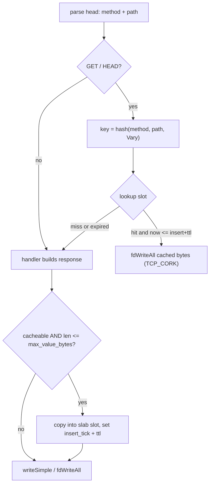
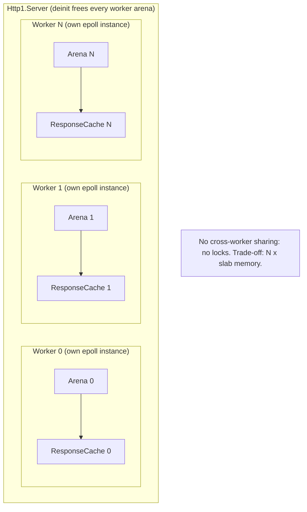
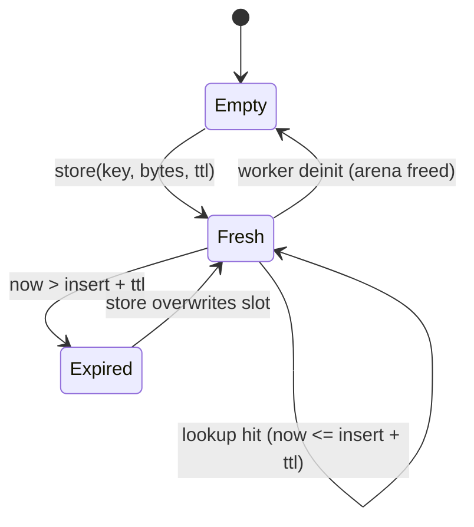

# Request-Response Cache Awareness

Local design note. Do not commit. Scratch concept for the per-key precomputed response cache, scoped to the principles that rated 7/10 and above.

## Status

PoC complete and measured (scratch, uncommitted): `rnd/0.4.x/server_response_cache.zig`. Gate is GO (crossover ~4 KiB). ADR-036 is the next step. See PoC results below.

## Goal

An opt-in, per-worker response cache that, on a key hit, writes precomputed bytes directly with zero serialization and zero per-entry allocation on the hot path. When disabled, behavior is byte-identical to today and costs nothing.

Target order: Http1 first, then Http, WS-broadcast, gRPC-unary.

## Scope (7+ only)

In:

- Per-key precomputed response, hashed exact key from `method` + `path` + `Vary`.
- Opt-in write path. The handler decides cacheability. Default off.
- Comptime slot geometry (known `N` and `max_value_bytes`), runtime TTL contents.
- DoD structure-of-arrays slab, one cache per worker (lock-free under shared-nothing EPOLL).
- Arena allocates the slab once at init, freed at deinit.
- Lazy on-access TTL expiry. No background timer thread.
- `TCP_CORK` plus a single `writev` of the cached slice.
- Explicit max sizes: `max_recv_buf` (request in, already exists) and `cache_max_value_bytes` (response out, new).

Out (explicit non-goals):

- Fuzzy 50 percent byte-compare matching. Rejected: O(N) per request, defeats the parse it skips, and "50 percent same" is meaningless for HTTP.
- Global-timeout-times-2 eviction. Http1 has no timer thread to read from.
- gRPC streaming. Stream errors are flow-control, already solved, not cacheable.
- Auto-sizing from available system memory. Use an explicit ceiling instead.
- POST or any non-idempotent method.

## Principles kept (score 7 and above)

| Principle | Score | Applied form |
| :- | :- | :- |
| Core idea: per-key precomputed response | 7 | scoped to Http1/Http + WS-broadcast + gRPC-unary |
| Opt-in write path | 9 | handler asserts cacheability, default off |
| Comptime + zero-copy | 8 | comptime slot geometry, runtime contents, `fdWriteAll` the slice |
| DoD SoA slab, per-worker root | 8 | open-addressed keys/meta/slab, one per worker |
| Explicit max sizes | 8 | `max_recv_buf` (in) + `cache_max_value_bytes` (out) |
| TCP_CORK + single writev | 8 | house style |

Substitutions that come free with the above (the rejected low scorers replaced, not reintroduced): hashed exact key instead of fuzzy compare, lazy on-access TTL instead of timer-times-2, arena allocates the slab once instead of per-entry churn, gRPC unary only.

## Approach (hot path)



## Ownership (per-worker, lock-free)



## DoD memory layout

One arena allocation per worker at init:

| Array | Type | Note |
| :- | :- | :- |
| keys | `[]u64` | open-addressed, 0 means empty |
| meta | `[]Meta` | `{ insert_tick_ms: u64, len: u32, ttl_ms: u32 }` |
| payload | `[N * max_value_bytes]u8` | slot i at `i * max_value_bytes` |

## Eviction (lazy, no timer thread)



Expired slots are not zeroed on lookup (that would truncate an open-addressing probe chain). They are reused in place by the next `store` whose probe reaches them, which is the eviction.

## Config additions

| Field | Type | Default | Meaning |
| :- | :- | :- | :- |
| `response_cache` | `bool` | `false` | master opt-in |
| `cache_max_entries` | `u32` | TBD (PoC) | slot count, power-of-two |
| `cache_max_value_bytes` | `u32` | TBD (PoC) | per-slot cap, larger responses bypass |
| `cache_ttl_ms` | `u32` | TBD (PoC) | default freshness, overridable per store |
| `cache_max_total_bytes` | `usize` | 0 | optional ceiling, validated vs `entries * value_bytes` |

## API surface

```zig
// explicit pair
if (zix.Http1.cacheLookup(cache, key)) |bytes| {
    try zix.Http1.fdWriteAll(fd, bytes);
    return;
}

const resp = try buildResponse(arena, head, body);

zix.Http1.cacheStore(cache, key, resp, .{ .ttl_ms = 1000 });
try zix.Http1.fdWriteAll(fd, resp);

// or fused: writeWithCache does lookup, on-miss produce, store, write
```

When `response_cache = false` the lookup is a no-op and behavior matches today (`writeSimple` / `fdWriteAll`).

## Per-protocol applicability

| Target | What cache means here | Strong when | Not applicable when |
| :- | :- | :- | :- |
| Http1 / Http | precomputed full response by key | repeated idempotent GET | per-request unique bodies |
| WS | build frame once, broadcast to N clients | broadcast / pub-sub rooms | per-client unique frames |
| gRPC unary | cache full reply frame by key | identical unary replies | streaming (separate, already correct) |

## Benchmark protocol

Tools by protocol: `wrk` for Http1/Http, `gcannon` for Http load variants, `ghz` for gRPC follow-up.

Fixed parameters:

- threads: 6
- connections: 512 and 4096 (two points)
- duration: 5 seconds
- runs: twice per point
- server: waits 2 seconds after start before any bench
- output: a `.txt` file in `rnd/0.4.x/`, machine specs recorded in the header

Routes (all under `rnd/0.4.x/server_response_cache.zig`, comparable to `server_hello_epoll.zig`):

- `/` `/echo` `/about`: byte-identical to the hello servers (cross-file reference).
- `/nocache` vs `/cache`: trivial 13-byte response.
- `/heavy-nocache` vs `/heavy-cache`: ~32 KiB JSON built per request (expensive serialization).
- `/sized-nocache?bytes=N` vs `/sized-cache?bytes=N`: parametrized body for the crossover sweep (query is part of the cache key).
- `/static-nocache` vs `/static-cache`: ~32 KiB response read from a file in `rnd/0.4.x/` on every request (page-cached file source).

Harnesses (all save `.txt` with machine specs into `rnd/0.4.x/`):

- `rnd/0.4.x/server_response_cache_bench`: light + heavy + static, c512 and c4096.
- `rnd/0.4.x/server_response_cache_sweep`: body-size crossover, c512 default (`CONN=4096` to override).

## PoC results (2026-06-15)

AMD Ryzen 5 5600H, 12 logical cores, kernel 7.0.11, zig 0.16.0, wrk 4.2.0, loopback. Avg of 2 runs, Requests/sec.

Fixed responses, c512 and c4096:

| Response | Conns | nocache | cache | Delta |
| :- | :- | :- | :- | :- |
| light (13 B) | 512 | 614,551 | 611,758 | -0.5% |
| light (13 B) | 4096 | 453,328 | 449,565 | -0.8% |
| heavy (~32 KiB built) | 512 | 171,821 | 230,844 | +34.4% |
| heavy (~32 KiB built) | 4096 | 137,516 | 163,116 | +18.6% |
| static (~32 KiB file) | 512 | 209,590 | 225,058 | +7.4% |
| static (~32 KiB file) | 4096 | 158,803 | 163,997 | +3.3% |

Body-size crossover sweep (`/sized-*`, c512):

| Bytes | nocache | cache | Delta |
| :- | :- | :- | :- |
| 256 | 616,420 | 617,515 | +0.2% |
| 512 | 602,045 | 611,020 | +1.5% |
| 1024 | 584,495 | 595,705 | +1.9% |
| 2048 | 547,245 | 567,670 | +3.7% |
| 4096 | 486,823 | 548,315 | +12.6% |
| 8192 | 364,670 | 438,104 | +20.1% |
| 16384 | 264,134 | 342,482 | +29.7% |
| 32768 | 167,699 | 223,536 | +33.3% |
| 65536 | 92,730 | 126,753 | +36.7% |

Reading:

- Crossover sits near **4 KiB**. Below ~2 KiB the delta stays inside the run-to-run noise (~1.5%). At 4 KiB it jumps to +12.6% and climbs steadily, reaching +37% at 64 KiB.
- Trivial responses are a wash: kernel-bound on loopback, hash + lookup roughly equals the serialization skipped, zero regression.
- Expensive serialization is the strong case (+34% c512). The cache skips the whole rebuild.
- Static file source is only a **modest** win (+7.4% c512, +3.3% c4096), and `/static-nocache` (209 k) is already faster than `/heavy-nocache` (172 k) because the OS page cache serves the file cheaply. The in-process cache here saves only the open + read syscalls and the userspace copy. For file-backed responses the bigger lever is `sendfile`/`splice` (true zero-copy), not this cache. Note worth carrying into the design: do not oversell the cache for static files.

Gate result: GO, conditioned on response cost (crossover ~4 KiB), opt-in so cheap handlers pay nothing, and scoped to compute-heavy serialization rather than page-cached file reads.

Files: `server_response_cache_bench-20260615-005339.txt` (light), `-005949.txt` (light + heavy), `-012259.txt` (light + heavy + static), `server_response_cache_sweep-c512-20260615-011854.txt` (sweep), all in `rnd/0.4.x/`.

## Open questions

| # | Question | Leaning |
| :- | :- | :- |
| 1 | Default `cache_max_entries` / `cache_max_value_bytes`? | PoC ran 32 slots x 128 KiB. For src, lean small default value cap (~16 KiB) so only responses past the ~4 KiB crossover are worth caching, oversize bypasses. |
| 2 | Fused `writeWithCache` only, or ship the explicit pair too? | ship both |
| 3 | Does the hashed-key lookup actually beat the parse it skips on repeated GET? | ANSWERED 2026-06-15: yes above the ~4 KiB crossover (+12.6% at 4 KiB, +34% at 32 KiB, c512). Wash below it (kernel-bound, zero regression). Static/page-cached files only modest (+7%). GO, opt-in, scoped to compute-heavy serialization. |
| 4 | Per-worker memory multiplier acceptable at high worker counts? | yes, bounded and predictable |
| 5 | File-backed responses: cache or sendfile? | sendfile/splice is the better lever for static files. The in-process cache adds little over the OS page cache. Do not oversell. |

## Acceptance criteria

- Disabled path byte-identical to current output, no measurable regression.
- Repeated-GET workload shows a clear throughput win over the no-cache path, numbers captured in `rnd/0.4.x/*.txt`.
- Tests first: unit (hash, probe, slot reuse), edge (oversize bypass, ttl=0, full table), behaviour (hit returns identical bytes, expired refetches), integration (worker serves from cache, deinit leak-clean).
- No background thread introduced.

## Task checklist

- [x] Local design note
- [x] PoC `ResponseCache` in `rnd/0.4.x/server_response_cache.zig` (11 unit tests pass)
- [x] `wrk` harnesses `rnd/0.4.x/server_response_cache_bench` and `server_response_cache_sweep`, results as `.txt` with machine specs
- [x] Go / no-go review against open question 3: GO, crossover ~4 KiB, opt-in
- [x] ADR-036 drafted with measured numbers: `rnd/0.4.x/ADR-036-draft.md` (Status: Proposed, fold into docs/adr-en.md + -id mirror on landing)
- [x] Land in `src/tcp/http1/` with full test matrix
- [x] Follow-ups: Http, WS-broadcast, gRPC-unary

###### end of request-response-cache-awareness
