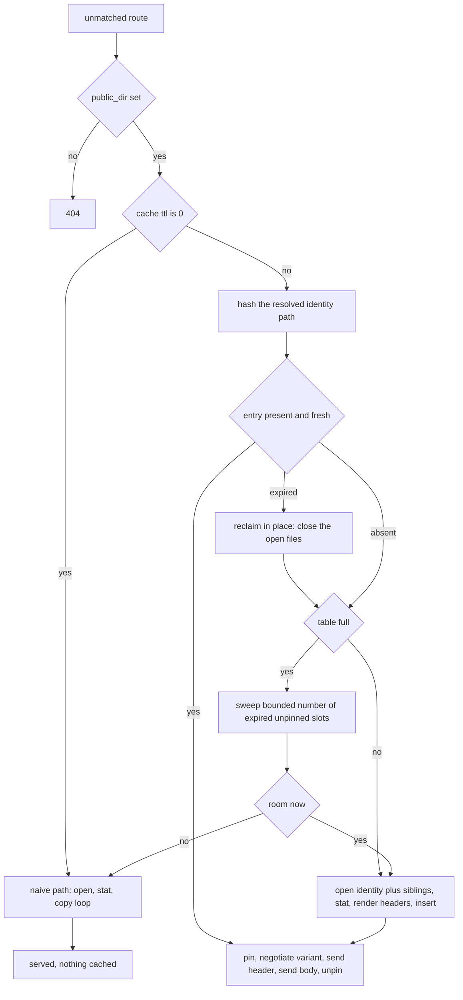

# ADR-064 Draft: public_dir static cache across all four HTTP engines

Working draft. All work happens on the `rework_public_dir` branch (off `main`), in the fixed order static_cache -> Http1 -> Http -> Http2 -> Http3. This file is the living tracker: checkpoints below are updated in place as each engine lands. All four engines have landed. Promotes to `docs/adr-*.md` after the isolate-bench gate passes.

## ADR-064: public_dir static cache across all four HTTP engines

**Status:** Draft

**Context:** Static file serving is half-built, and slow where it exists.

| Engine | `public_dir` field | static file | how the body goes out today |
| :- | :- | :- | :- |
| zix.Http | yes, `src/tcp/http/config.zig:94` | `src/tcp/http/static.zig` | per-request `openFile` + `stat` + 8 KiB read/write copy loop |
| zix.Http1 | yes, `src/tcp/http1/config.zig:89` | `src/tcp/http1/static.zig` | same naive loop, writes through `core.writeAllFD` |
| zix.Http2 | no | none | not built at all |
| zix.Http3 | no | none | not built at all |

Every request for the same file pays 2 syscalls to locate it (`open`, `stat`), then `ceil(size / 8 KiB)` reads and the same number of writes, plus a full userspace copy of every byte. Nothing is remembered between requests. The two existing implementations are near duplicates of each other: same buffer constants, same range parse, same copy loop.

The shipped `cache_ttl_ms` and `cache_max_entries` pair cannot be reused here. Those fields drive `src/utils/response_cache.zig` (ADR-036), a per-worker keyed response slab whose key is `hashKeyEncoded(method, path, query, encoding)`, deliberately coupled to compression and to handler-produced responses. Static files have a different owner, a different lifetime, and a different body source (an fd, not a byte slice), so they need their own knobs.

**Decision:** One shared cache module plus one thin per-engine static file, behind two new flat config fields present on all four engines.

- New module `src/utils/static_cache.zig`. It owns the name index, TTL stamps, the open file, the file size, the prerendered response header bytes, pin counts, and reclaim. It knows nothing about HTTP versions.
- New module `src/utils/static_send.zig`. It owns one thing: moving a byte range of an open file to a socket, either with `sendfile` or by copying through the engine's own write function. Every engine writes to a socket the same way, so this does not belong in any one of them.
- Each engine's `static.zig` owns encoding negotiation, framing for its own wire format, and the send. Only the framing differs between engines, so only the framing is duplicated.
- Two new flat fields, mirroring the shipped `cache_*` naming: `public_dir_cache_ttl_ms: u32 = 0` and `public_dir_cache_max_entries: u32 = 256`. `zix.Http2` and `zix.Http3` also gain `public_dir` itself.
- `public_dir_cache_ttl_ms = 0` means never cached, and it is the default. That leg runs today's code path byte for byte, so an existing deployment cannot regress by upgrading.
- The cache is process-wide, not per-worker: one fd per cached variant instead of one per worker, lock-free acquire-ordered reads, and a spinlock only on the rare insert. This is a deliberate exception to the shared-nothing idiom used elsewhere in the tree, taken because the cached value is a kernel object (an fd) rather than per-worker state. Duplicating it per worker multiplies the fd cost by the worker count for no gain.
- Cache key is the resolved identity path, and one slot holds all three variants of that file. Keying on the base name rather than on (name, encoding) means a client that accepts brotli for a file with no `.br` sibling shares the identity entry instead of consuming a second slot, and it means a sibling is probed once at insert rather than on every request that could have used it.
- Precompressed siblings are picked up from disk only: `foo.js.br` and `foo.js.gz` are opened once at insert, and per request `compression.negotiate` (`src/utils/compression/compression.zig:86`) picks among the variants that actually exist. No on-the-fly compression, so the hot path spends no CPU on bytes. When no sibling exists, identity is served. Every variant header carries `Vary: Accept-Encoding`, including the identity one, so an intermediary cannot hand a brotli body to a client that did not ask for one.
- A miss is never cached. A flood of unknown paths costs one failed open each and leaves the table untouched, rather than evicting the entries actually being served.
- Fill is lazy, on first request. There is no startup walk of `public_dir`.
- `zix.Http3` takes its body from a SNAPSHOT the cache holds, not from the descriptor and not from a mapping of the file. Its response outlives the handler: a body too large for one packet is parked in a send-stream slot and re-read for every packet and every retransmission until acknowledged. The snapshot is bounded by `SNAPSHOT_MAX_BYTES` (8 MiB), taken on the first request that needs it, and the cache pin is held for the whole response rather than for the handler call. Because the body can only come from the cache, `public_dir_cache_ttl_ms = 0` disables static serving on that engine entirely rather than merely turning the cache off.
- One table serves the whole process, installed by the first server that enables static caching. A later server asking for a different size or window keeps running under the installed policy and is told so through the return value, since two tables would double the descriptor cost for the same files.
- Range requests (RFC 7233) use the cached entry. `sendfile` already takes an offset and a count, so the body costs nothing extra, and only the 206 header is rendered per request because the prerendered header is a 200 with a fixed `Content-Length`. Http1 uses `parser.parseRange`, Http a local `parseRangeHeader`. `zix.Http2` first landed 200 full-body only, and that gap was closed afterwards with `src/utils/http_range.zig`, a shared parser that splits reading the header from clamping it against the length, so a malformed header can be ignored (200) while a well-formed unsatisfiable one is answered 416.
- Overflow never fails a request. Three tiers: reclaim first (a full insert sweeps a bounded number of slots, 8, freeing any that are expired and unpinned), then serve uncached through the existing naive path, and never allocate on the hot path (arrays are sized once at init). A full table is a slower response, not an error return and not an out-of-memory.
- Clean-up has no timer thread and no background reaper. Two amortized triggers cover it: a lookup landing on an expired entry reclaims it in place (closing its open files) and reports a miss, and a full insert sweeps as above. Bounded means no lookup ever pays for a full-table scan, which is what keeps the tail latency flat.
- Expiry doubles as the staleness window. An expired hit becomes a miss, and the miss re-opens and re-stats, so a file changed on disk is picked up within one TTL with no inotify machinery.
- An entry whose bytes back an in-flight send is pinned, and reclaim skips it. A `sendfile` of a large file over a slow socket can outlive the TTL, and closing the fd underneath it would truncate a live response.
- `public_dir_cache_max_entries` is clamped at init against the process descriptor budget, since one entry holds up to three open files:

```zig
// One descriptor per cached variant, so the table is clamped against the process
// budget rather than trusting the configured value blindly. rlim_t is signed on
// the BSDs and unsigned on Linux, so it is normalized before the divide.
const limit = std.posix.getrlimit(.NOFILE) catch return FD_CEILING_FALLBACK;
if (limit.cur <= 0) return FD_CEILING_FALLBACK;

const budget = @as(u64, @intCast(limit.cur)) / FD_BUDGET_DIVISOR;
```

Request path, with the overflow leg included:



**Body path per engine:** `sendfile` is not universally applicable, so the entry keeps the file open always and the paths that need bytes read them positionally (`readPositionalAll`, a `pread`) instead of mapping. A positional read needs no lifetime management, works on every target, and is safe on a descriptor shared by every worker, since it never moves the file offset.

| Engine | header | body | why |
| :- | :- | :- | :- |
| zix.Http cleartext | prerendered bytes | `sendfile` | thread per connection, blocking fd, the simplest case |
| zix.Http1 cleartext | prerendered bytes | `sendfile` | fd to socket, no userspace copy |
| zix.Http1 with TLS | staged into the record path | positional read, then encrypt | records are built in userspace, `sendfile` cannot apply |
| zix.Http2 cleartext | HPACK HEADERS frame | write the 9-byte DATA header, then `sendfile` the payload, capped by peer `SETTINGS_MAX_FRAME_SIZE` and the flow-control window | the payload bytes are prefixed, not transformed |
| zix.Http2 with TLS | HPACK HEADERS frame | positional read into the record | same TLS constraint |
| zix.Http3 | QPACK HEADERS | snapshot of the file held by the cache, pinned for the whole response | QUIC encrypts every packet, and the body is re-read for every packet and every retransmission |

zix.Http1 and zix.Http on cleartext never read the bytes at all, so the file never enters resident memory on the fast path.

Portability: `sendfile` here is the Linux shape. FreeBSD and macOS take a different signature, and Windows has `TransmitFile`. The existing read/write loop stays as the portable fallback under the same comptime split the tree already uses for its other fast paths, so no platform loses static serving.

**Rationale:** The four things that make the proven-fast path fast are all cache properties, not protocol properties, which is why they belong in one shared module. Resolved name to open fd is remembered, so `open` and `stat` happen once per file instead of once per request. The response header is rendered once at insert and replayed as bytes. The body goes out with `sendfile`, one syscall, kernel to kernel, no userspace copy and no RSS growth, since the bytes stay in the page cache. Sibling selection is resolved at insert, not probed per request. Steady state per request becomes one hash lookup, one header send, and one `sendfile`.

Sizing is runtime rather than comptime because the library cannot know how many files sit under someone's `public_dir`, so a baked-in `[N]Entry` would be wrong for nearly every user. A comptime array also does not make the limit safer, it only moves where the limit is written down. The no-crash property comes from the overflow policy, not from where the array lives. `ResponseCache` already proves the runtime pattern in this tree (`slab_mem.mapZeroedSlots`, kernel-zeroed, demand-paged, one mapping at init), so reusing it keeps one idiom instead of two.

The default of 256 entries covers 256 distinct files, each holding its own identity, `.br`, and `.gz` variants in one slot. Memory is not the scarce resource: a slot is a 256 B path buffer plus three variants of roughly 290 B each (an open file, a size, a content type, and a 256 B prerendered header), near 1.1 KiB, so the table is about 290 KiB of address space for the whole process. That is virtual, not resident: the table is one demand-paged mapping, so an untouched slot costs no physical memory and a server with 12 cached files pays for 12 slots. Open descriptors are the real per-entry cost, up to three per file, which is why the init clamp exists. Measured on the development box, `ulimit -n` is 1048576 soft and hard, so exhaustion is not a practical risk there, but a container with a 1024 soft limit is a different story and the clamp is five lines.

Precompressed siblings land in the same pass rather than a later one for a structural reason and a value reason. Structurally, the key has to carry the encoding either way, so adding the pickup later would mean rewriting the index instead of extending it. By value, once caching removes the syscalls, the only lever left is sending fewer bytes, and a cached `sendfile` of a 70 KB brotli sibling costs the same syscalls as a cached `sendfile` of the 300 KB original.

Range uses the cached entry rather than falling through because a client that sends one Range request usually sends many against the same file (video scrub, resumable download, a document viewer pulling one page). Falling through would make exactly that pattern re-`open` and re-`stat` on every request, which is the cost the cache exists to remove, and the 206 header code already exists in both engines.

**Consequences:**

- Default behavior is unchanged. With `public_dir_cache_ttl_ms = 0` the cache is never consulted, so both the fast path and the fallback path are dead code for anyone who does not opt in.
- One process-wide mutable structure now exists in a tree that is otherwise shared-nothing. Reads are lock-free with acquire ordering, and the spinlock is held only across an insert, but the exception is real and is documented here so it is not copied by default into unrelated work.
- Files served from cache reflect disk state up to one TTL late. A deployment that swaps assets in place should either keep the TTL short or leave caching off during the swap.
- `public_dir_upload` is not added to `zix.Http2`. It has no upload handler convention today, and adding one alongside net-new static serving would mix two concerns in one pass.
- The cached path emits `Vary: Accept-Encoding` and the uncached path does not. That is deliberate: only the cached path negotiates, so only it has something to vary on.

**Guardrails:**

- No perf and no memory regression on the raw engine path. zix.Http1 leads the benchmark, so the `public_dir_cache_ttl_ms = 0` leg must stay byte for byte identical to today.
- Must build clean on both `zig-0.16` and `zig-0.17`, and across the full `scripts/build-all-targets.sh` matrix.
- No allocation on the request path. Every array is sized once at init.
- Out of scope for this ADR: `Cache-Control`, `ETag`, and `Last-Modified` response headers. Those are the user's concern, not the engine's, in this pass.

## Checkpoints

Order is fixed: static_cache -> Http1 -> Http -> Http2 -> Http3, then docs. A checkpoint is done only when it builds clean on both compilers, tests cover the new surface, and its examples are migrated. Each phase is its own commit set, one file per commit, and each new function lands with its tests in the same phase.

### 1. static_cache, done 2026-07-29

- `src/utils/static_cache.zig` plus `src/utils/static_send.zig`, nothing wired into any engine yet
- name index, TTL stamps from `response_cache.nowMillis()` (coarse monotonic from the vDSO, no syscall), open files, sizes, prerendered header bytes, pin counts, bounded reclaim
- one atomic word per slot carries both the live flag and the pin count, so a reader pins with a compare-and-swap that only succeeds while the slot is live, and reclaim clears the live flag with a compare-and-swap that only succeeds at zero pins. Two separate words would have raced: a reclaim could pass its pin check between a reader's key match and its pin
- init clamp against `RLIMIT_NOFILE`, reported back through an `InstallResult` rather than logged, so this module never writes to stderr on a caller's behalf
- registered in `src/lib.zig` via `refAllDecls` so its tests are discovered
- 16 unit tests plus 9 edge tests: full table, expired hit, pinned entry skipped by reclaim, clamp applied, sibling resolution, missing sibling falling back to identity, zero-byte file, directory refused, traversal refused, exact expiry boundary

### 2. Http1, done 2026-07-29

- `public_dir_cache_ttl_ms` and `public_dir_cache_max_entries` on `Http1ServerConfig`, installed from `Server.run`
- `static.zig` reworked: cache path first, the original open-stat-copy path kept as the fallback
- Range served from the cached file with a freshly rendered 206 header
- zero copy is refused when `fd` is negative or a TLS stream sink is installed. Both TLS paths (`tls_serve` and `tls_mux`) run the handler with `fd = -1` and capture the plaintext into a buffer they encrypt afterwards, so a direct `sendfile` there would have put plaintext on the wire
- `example-http1_static_cached` (port 9077), 5 integration tests, 3 behaviour tests
- verified by hand with curl against the running example: 200 with `Vary`, 206 from the cached file, `.br` and `.gz` sibling selection, identity fallback, and 404 for an absent file
- OPEN: no RPS or memory regression on the isolate bench, which is the user's to run

### 3. Http, done 2026-07-29

- same two config fields, same rework shape as Http1, installed from `Server.run`
- `response.flushPending` added, so a caller writing the socket directly can drain the coalescing sink first without uninstalling it
- 416 for an unsatisfiable range, matching what the uncached path already did
- 6 unit tests, 2 behaviour tests

### 4. Http2, done 2026-07-29

- `public_dir` plus the two cache fields on `Http2ServerConfig`
- `Context` gained `public_dir` and `max_frame_size`, threaded through `ServeOpts` and the 3 `invokeHandler` call sites, so the router reaches them without a threadlocal
- new `src/tcp/http2/static.zig`: one HEADERS frame, then DATA frames capped at the peer `SETTINGS_MAX_FRAME_SIZE`, the last flagged END_STREAM. An empty file closes the stream on HEADERS
- router hook ahead of the 404
- both paths built, not just the cached one: `public_dir` behaves the same on Http2 as on the other engines whether or not caching is enabled
- zero copy is refused while `frame.write_hook` is installed, since a mux worker is coalescing that batch and a direct write would put the body ahead of frames already staged
- Range served: 206 with `Content-Range` for a satisfiable single range, 416 for a well-formed range past the end, whole file for anything malformed. Multi-range answers the first range only.
- flow control: static uses the same unmetered send `Response.send` already uses (`frame.sendResponseFD`), not the window-paced `mux.sendResponseStreamFD`. Consistent with the engine, and worth revisiting alongside that path rather than separately
- 5 unit tests, 2 behaviour tests

### 5. Http3, done 2026-07-29

This engine needed a different body source, and the reason is worth keeping. On the other three the
response is written inside the handler call, so a body can come from a descriptor that is only open
for that call. Http3 does not: `Response` is a value holder, and a body too large for one packet is
parked in a send-stream slot (`slot.body = res.body`) and fragmented by the pump across many
packets, held until every range is acknowledged, and rewound and re-sent on loss or on a probe
timeout. So the body has to be stable, randomly readable memory that outlives the handler.

Five ways to be that source were measured rather than argued, at the engine's own constants (1040 B
chunk from a 1200 B datagram minus the 160 B frame reserve, 256 KiB body, one retransmit per 50
packets). `rnd/0.5.x/http3_body_source_poc.zig`, ReleaseFast, this box:

| strategy | ns per packet | vs baseline | held per worker |
| :- | :- | :- | :- |
| resident bytes, memcpy | 15.7 | 1.00x | depends on what holds them |
| mmap the file, memcpy | 16.1 | 1.02x | none |
| 64 KiB block read, memcpy | 120 | 7.2x | 64 KiB |
| raw pread per packet | 567 | 34x | none |
| std.Io readPositionalAll per packet | 668 | 40x | none |

Per-packet reads are out: the syscall floor on this box is 324 ns, so they add a syscall to a path
that already pays one sendmsg per packet. Per-stream buffers are also out on arithmetic alone: 256
connections per worker times 64 send streams is 16,384 concurrent large bodies, so even a 64 KiB
buffer each is 1 GiB per worker.

That left mmap, which measured essentially free. It was implemented, and then rejected on a hazard
the tests found rather than the benchmark. A file rewritten IN PLACE, which is exactly what copying
a new build over a served file does, changes under a mapping that a response is still reading:
verified directly, an in-place rewrite showed the new bytes through an existing mapping while an
atomic rename left the mapping on the old inode untouched. So an in-flight response would serve the
new file's bytes, and a file that shrank would fault past its own end and take the process with it.
Being able to crash a server by copying a file into its own public_dir is not an acceptable trade
for 0.4 ns per packet.

The landed design is therefore a SNAPSHOT: the cache reads the file once into a demand-paged
anonymous mapping, bounded by `SNAPSHOT_MAX_BYTES` (8 MiB), and hands out that. It cannot be changed
underneath a response, which is the property the body source has to have here. It also measured
marginally faster than mmap, since there is no page-fault path.

- `public_dir` plus the two cache fields on `Http3ServerConfig`
- `Context` gained `public_dir` and `static_slot`, threaded through `invokeHandler`, which now
  returns the pinned slot so the engine can release it
- new `src/udp/http3/static.zig`: resolve, set content type and coding, `res.send(snapshot)`
- `SendStream` gained `static_slot`, released at the only two points a body's life ends: the single
  `stream.active = false` in `Connection.onAckFrame`, and the connection going idle in
  `dispatch/common.zig`. A single-packet response releases immediately, since its bytes are already
  copied into the packet
- router hook ahead of the 404
- 200 full-body only, no Range, recorded as a deliberate gap
- `public_dir_cache_ttl_ms = 0` disables static serving here rather than just disabling the cache,
  because there is no other safe body source. `Server.run` warns when public_dir is set without it
- `example-http3_static` (port 9078), 5 integration tests, 7 edge tests, 3 behaviour tests, 9 unit tests

Verified on the wire with real `curl --http3-only` against the running example, not just compiled:

| check | result |
| :- | :- |
| small file | 200, correct body |
| `.br` sibling negotiated | 200 with `content-encoding: br` |
| identity when nothing accepted | 200, plain body |
| multi-packet 256 KiB body | 262144 bytes, byte-identical to the fixture |
| absent file | 404 |
| routed path ahead of the fallback | routed handler wins |
| 30 further multi-packet fetches | 30 / 30 at full size |
| in-place truncate to 4 KiB mid-serve | 20 / 20 still full size, server alive |

The last row is the one that matters: under a file mapping that same test would have served
corrupted bytes or killed the process.

### 6. Docs, done 2026-07-29

- `docs/zix-config-en.md` and `docs/zix-config-id.md`: both new fields on all four engines, plus `public_dir` on Http2 and Http3
- the `0` default spelled out as never cached, and as no static serving at all on Http3
- the descriptor cost stated where the entry count is described
- `docs/hld-http-*.md`, `docs/hld-http1-*.md`, `docs/lld-http-*.md`: the cached path added alongside the original one
- `docs/hld-http2-*.md` and `docs/lld-http2-*.md`: `static.zig` in the source layout, the three new config fields, a Static File Serving section covering the peer frame cap and the Range answers, and the `peer_max_frame_size` plumbing table
- `docs/hld-http3-*.md` and `docs/lld-http3-*.md`: the same shape, plus why this engine needs a snapshot and why `public_dir_cache_ttl_ms = 0` turns static serving off entirely here
- `docs/adr-en.md` and `docs/adr-id.md`: ADR-064 promoted
- `README-en.md` and `README-id.md`, `docs/changelog/CHANGELOG-2026-*.md`, `docs/tests-*.md`

### Closing gate

- `zig fmt` clean, `test-all` green on `zig-0.16` and `zig-0.17` (1395 tests), `examples` green, and all 7 targets of the cross-build matrix compiling clean
- OPEN: isolate-bench result recorded, no regression against the last submitted baseline. The
  reference run to compare against is `logs/benchmark/http3/isolate-full-results-zix-http3-20260729-004655.txt`:
  baseline-h3 1,127,888 req/s at 76.5% CPU, static-h3 127,358 req/s at 1.93 GB/s, 44 MiB both
- promoted to `docs/adr-en.md` and `docs/adr-id.md` as ADR-064, right after ADR-063, done 2026-07-29
