# zix.Http1 EPOLL dispatch: request to complete (0.4.x)

End-to-end path of one connection through the `.EPOLL` dispatch model as it ships
in 0.4.x, from kernel ingress to teardown, at fine grain: every syscall, every
cache touch, the request parse sub-steps, and the response byte assembly. Source:
`src/tcp/http1/server.zig` (epoll worker), `src/tcp/http1/core.zig` (parse, sink,
caches, header build), `src/multiplexers/slab.zig` (demand-paging). The `.ASYNC`,
`.POOL`, and `.MIXED` fallback models are out of scope here.

```mermaid
flowchart LR
    subgraph ingress["Ingress and per-worker setup"]
        CL["client load (wrk or gcannon)"]
        NIC["kernel TCP stack: loopback, accept queue, socket recv and send buffers"]
        PIN["pinToCpu: sched_getaffinity then sched_setaffinity"]
        LIS["SO_REUSEPORT listener, epoll_ctl ADD listener EPOLLIN"]
        TBL["ConnTable.init: mmap slots (demand-paged) plus contiguous recv slab"]
    end

    subgraph loop["Event loop (pinned worker thread)"]
        EW["epoll_wait(epfd, 4096 events, adaptive timeout)"]
        DR{"for each ready event"}
        ISLIS{"fd is the listener?"}
        T0["set timeout 0 for next pass, then -1 when idle"]
    end

    subgraph accept["Accept path"]
        AA["acceptAll: loop accept4(NONBLOCK, CLOEXEC) to EAGAIN"]
        OPT["setNoDelay TCP_NODELAY and setBusyPoll SO_BUSY_POLL 50us"]
        ALLOC["table.alloc(fd): conn.buf is a slab slice, no heap call"]
        CTLADD["epoll_ctl ADD: EPOLLIN, EPOLLRDHUP"]
    end

    subgraph state["Per-fd state branch"]
        GET["table.get(fd): inline Conn from contiguous demand-paged slots"]
        BR{"connection state?"}
        HUP["HUP or ERR"]
        WR["serveEpollWrite: write write_pending, disarm EPOLLOUT on drain"]
        DRN["serveEpollDrain: recvfrom MSG_TRUNC, kernel drops body bytes"]
        WSE["serveEpollWs: read to EAGAIN, ws.pump, coalesced echo write"]
    end

    subgraph parsep["Read and parse"]
        SINK0["install RespSink over out_buf (tl_resp_sink)"]
        RD["read(fd, conn.buf[filled..]) once, first touch faults a zero slab page"]
        PLOOP{"parse loop while consumed less than filled"}
        HE["indexOf CRLF CRLF (header end), else 431 when buffer full"]
        FP1{"readInt u32 equals GET space?"}
        FP2{"find CR, readInt u64 equals HTTP 1.1, no close?"}
        FP3["split path and query on question mark, keep_alive true, len 0"]
        PH1["parseHeadAt: split request line into method, target, version"]
        PH2["version compare HTTP 1.1 or 1.0, split path and query"]
        PH3["framing loop: tokenize only lines starting c, t, or e"]
        PH4["set content-length, connection, transfer-encoding, expect"]
        BODY{"body: content-length, chunked, or oversized?"}
        CHK["decodeChunkedInBuf into body_buf"]
        OVR["oversized: respond empty now, set conn.drain for later events"]
    end

    subgraph respond["Handler, cache, response byte assembly"]
        HAND["handler_fn(head, body, fd), comptime-baked direct call"]
        CLU["cacheLookup: hashKey(method, path, query) plus nowMillis, c.lookup"]
        CACHED["cache hit: fdWriteAll cached bytes (sink.append)"]
        WSF["miss: writeSimple, or writeWithCache (prebuilt)"]
        QBUILD{"build mode?"}
        STORE["writeWithCache: cacheStore hashKey plus c.store(ttl)"]
        DEST["dest is sink.buf in place when header plus body fits, else hdr_buf 256"]
        STL["status line: baked statusLine table, else appendStatusCode plus statusPhrase"]
        CLN["appendBytes Content-Type, then Content-Length via appendDec (reverse digits)"]
        DTQ{"tl_send_date set?"}
        DTH["appendBytes Date colon space"]
        DATEC["cachedDate: tick gate 1 in 256, clock_gettime REALTIME on change, formatHttpDate"]
        ENDC["appendBytes final CRLF"]
        BODYCP["memcpy body after header"]
        APP["RespSink: on overflow EPOLL flushes the staged batch, then memcpy, advance sink.len"]
    end

    subgraph egress["Write, backpressure, teardown"]
        FLUSH["fdWriteNonBlock: loop write(fd) until done or EAGAIN, return partial"]
        EAG{"EAGAIN partial write?"}
        STAGE["stage remainder in write_pending (heap), epoll_ctl MOD EPOLLOUT"]
        OUT{"outcome is close?"}
        DEL["epoll_ctl DEL, table.free(fd)"]
        MAD["releaseSlabPages: madvise(MADV_DONTNEED), return pages to OS"]
        CLOSE["close(fd)"]
        KA["keep-alive: slot stays resident, await next event"]
    end

    CL -->|"TCP SYN or data"| NIC
    NIC -->|"readiness"| EW
    PIN --> EW
    LIS --> EW
    TBL --> GET

    EW -->|"ready fds"| DR
    DR --> ISLIS
    ISLIS -->|"yes"| AA
    AA --> OPT --> ALLOC --> CTLADD --> EW
    ISLIS -->|"no"| GET
    GET --> BR
    BR -->|"HUP or ERR"| HUP --> OUT
    BR -->|"write_pending set"| WR --> OUT
    BR -->|"drain not empty"| DRN --> OUT
    BR -->|"ws set"| WSE --> OUT
    BR -->|"http"| SINK0

    SINK0 --> RD --> PLOOP --> HE --> FP1
    FP1 -->|"yes"| FP2
    FP1 -->|"no"| PH1
    FP2 -->|"yes"| FP3
    FP2 -->|"no"| PH1
    FP3 --> BODY
    PH1 --> PH2 --> PH3 --> PH4 --> BODY
    BODY -->|"chunked"| CHK --> HAND
    BODY -->|"oversized"| OVR --> OUT
    BODY -->|"inline or none"| HAND

    HAND --> CLU
    CLU -->|"hit"| CACHED --> APP
    CLU -->|"miss or cache off"| WSF
    WSF --> QBUILD
    QBUILD -->|"writeSimple"| DEST
    QBUILD -->|"writeWithCache prebuilt"| STORE --> APP
    DEST --> STL --> CLN --> DTQ
    DTQ -->|"yes"| DTH --> DATEC --> ENDC
    DTQ -->|"no"| ENDC
    ENDC --> BODYCP --> APP
    APP -->|"next pipelined request"| PLOOP
    PLOOP -->|"loop done"| FLUSH

    FLUSH --> EAG
    EAG -->|"yes"| STAGE --> OUT
    EAG -->|"no, fully written"| OUT
    OUT -->|"yes"| DEL --> MAD --> CLOSE --> T0
    OUT -->|"no"| KA --> T0
    T0 --> EW
```

## Kernel and cache touchpoints

| Step | Kernel syscall | Cache or memory touch |
| :- | :- | :- |
| accept | accept4(NONBLOCK, CLOEXEC), setsockopt TCP_NODELAY, setsockopt SO_BUSY_POLL | table.alloc hands a slab slice, no heap |
| register | epoll_ctl ADD (EPOLLIN, EPOLLRDHUP) | slot write into mmap demand-paged slots |
| wait | epoll_wait(4096, timeout -1 then 0 adaptive) | none |
| read | read(fd) once per event | first touch faults a zero slab page (demand-paging) |
| parse | none (user space) | parseGetFastPath integer compare, contiguous buf scan in L1 |
| header lookup | none | cacheLookup ResponseCache per worker (hashKey plus nowMillis) |
| header build | none | buildSimpleHeaderInto, Date via cachedDate (tick-gated clock_gettime) |
| stage | none | RespSink.append coalesces N responses into out_buf |
| flush | write(fd), looped to EAGAIN | one syscall for a whole pipelined burst |
| backpressure | epoll_ctl MOD (EPOLLOUT), deferred write | write_pending heap stage, worker never parked |
| drain | recvfrom MSG_TRUNC | kernel drops oversized body bytes, no copy |
| close | epoll_ctl DEL, close(fd) | releaseSlabPages madvise(MADV_DONTNEED) returns pages to OS |
