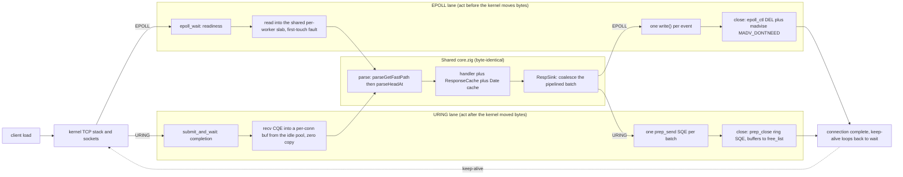

# zix.Http1 dispatch overview: EPOLL and URING side by side (0.4.x)

A simple, high-level view of the two native Linux event loops in 0.4.x, drawn as
two lanes from the same client. The detail lives in the per-model graphs
(`dgraph-0.4.x-epoll.md`, `dgraph-0.4.x-uring.md`). This one is for seeing where
the two diverge and where they run the exact same code.

The before and after framing: EPOLL acts on readiness, it is told a socket is
ready and then issues the read or write itself (it runs before the kernel moves
the bytes). URING acts on completion, it asks the kernel to do the read or write
and is told once the bytes have already moved (it runs after). The request
parse, the handler, the response cache, the Date cache, and the coalescing sink
are byte-identical between the two lanes, that whole middle band is shared
`core.zig` code.

## The divergence in one table

| Stage | EPOLL (readiness, before) | URING (completion, after) |
| :- | :- | :- |
| wait | epoll_wait tells you a fd is ready | submit_and_wait tells you an op finished |
| read | you issue read() into a shared slab slice | the kernel already filled a per-conn buf |
| parse and handle | shared code | shared code |
| respond | RespSink coalesces, you issue write() | RespSink coalesces, you queue prep_send |
| memory on churn | slab slice plus madvise on close | idle-conn pool plus ring close |
| WS recv memory | per-conn slab slice resident | buffer ring, held only mid-frame |
