# zix.Http1 URING dispatch: request to complete (0.4.x)

End-to-end path of one connection through the `.URING` (io_uring) dispatch model
as it ships in 0.4.x, from kernel ingress to teardown, at fine grain: every SQE
and CQE, every cache touch, the request parse sub-steps, the response byte
assembly, and the send completion handling. Source: `src/tcp/http1/server.zig`
(UringWorker), `src/tcp/http1/core.zig` (parse, sink, caches, header build),
`src/multiplexers/ring.zig` (user_data codec), `src/multiplexers/slab.zig`
(demand-paged slots). The `.ASYNC`, `.POOL`, and `.MIXED` fallback models are out
of scope here.

The loop is half-duplex per connection: at most one recv or one send in flight,
so a sink flush never interleaves with an outstanding send.

```mermaid
flowchart LR
    subgraph ingress["Ingress and per-worker setup"]
        CL["client load (wrk or gcannon)"]
        NIC["kernel TCP stack plus io_uring SQ and CQ rings, mmap shared with kernel"]
        PIN["pinToCpu: sched_setaffinity"]
        RINGINIT["initUringRing: SINGLE_ISSUER, DEFER_TASKRUN, CQSIZE, CLAMP, flagless fallback"]
        SLOTS["slots: mmap pointer slots (demand-paged), gen-tagged"]
        POOL["free_list idle-conn pool: reuse struct plus recv buf plus 16KiB send_buf"]
        BG["ws_bufs provided buffer ring: idle WS conn ties up no recv buffer"]
        ARMA["armAccept: prep_multishot_accept SQE, user_data accept"]
    end

    subgraph loop["Completion loop"]
        SAW["submit_and_wait(1): io_uring_enter, submit SQEs and wait for at least one CQE"]
        COPY["copy_cqes (up to 512): reap from CQ ring, no syscall"]
        DEC["unpackUserData: op, gen, fd from the user_data top byte"]
        SW{"op?"}
        NOP["close or timeout CQE: slot already cleared, no-op"]
    end

    subgraph acc["Accept completion"]
        HA["handleAccept: re-arm multishot when F_MORE is clear"]
        ACQ["acquireConn: pop free_list, else allocate struct plus recv buf plus send_buf"]
        SETSLOT["gen_counter plus 1, slots[fd] equals conn"]
        NDLY["setNoDelay TCP_NODELAY"]
        ARMR["armRecv: prep_recv(conn.buf[filled..]) zero-copy SQE, user_data recv gen fd"]
    end

    subgraph rcv["Recv completion"]
        HR["handleRecv"]
        LK["lookup: slot plus gen check, guards fd reuse"]
        HASBUF{"buffer-ring delivery (WS)?"}
        WSBUF["wsHandleBuf: parse in place from selected buffer (zero copy), bg.put recycle"]
        RESLE{"cqe.res not positive?"}
        ISDRAIN{"conn.drain not empty?"}
        DRAINCD["count down drain, armDrainRecv prep_recv MSG_TRUNC, kernel drops bytes"]
        FILL["conn.filled plus equals cqe.res, data already in conn.buf"]
        ISWS{"conn.ws set?"}
        WSPUMP["wsPump: ws.pumpRing, stage echoes after send_buf bytes"]
        DISP["dispatch(conn)"]
    end

    subgraph parsep["Dispatch parse"]
        SINK0["install RespSink over conn.send_buf, grow_allocator, cap 1MiB"]
        PLOOP{"parse loop while consumed less than filled"}
        HE["indexOf CRLF CRLF (header end), else 431 when buffer full"]
        FP1{"readInt u32 equals GET space?"}
        FP2{"find CR, readInt u64 equals HTTP 1.1, no close?"}
        FP3["split path and query on question mark, keep_alive true, len 0"]
        PH1["parseHeadAt: split request line into method, target, version"]
        PH2["version compare HTTP 1.1 or 1.0, split path and query"]
        PH3["framing loop: tokenize only lines starting c, t, or e"]
        PH4["set content-length, connection, transfer-encoding, expect"]
        BODY{"body: content-length, chunked, or oversized?"}
        CHK["decodeChunkedInBuf into body_buf"]
        OVR["oversized: respond empty, set conn.drain"]
    end

    subgraph respond["Handler, cache, response byte assembly"]
        HAND["handler_fn(head, body, fd), comptime-baked"]
        CLU["cacheLookup: hashKey(method, path, query) plus nowMillis, c.lookup"]
        CACHED["cache hit: fdWriteAll cached bytes (sink.append)"]
        WSF["miss: writeSimple, or writeWithCache (prebuilt)"]
        QBUILD{"build mode?"}
        STORE["writeWithCache: cacheStore hashKey plus c.store(ttl)"]
        DEST["dest is sink.buf in place when header plus body fits, else hdr_buf 256"]
        STL["status line: baked statusLine table, else appendStatusCode plus statusPhrase"]
        CLN["appendBytes Content-Type, then Content-Length via appendDec (reverse digits)"]
        DTQ{"tl_send_date set?"}
        DTH["appendBytes Date colon space"]
        DATEC["cachedDate: tick gate 1 in 256, clock_gettime REALTIME on change, formatHttpDate"]
        ENDC["appendBytes final CRLF"]
        BODYCP["memcpy body after header"]
        APP["RespSink: on overflow grow (realloc doubling to 1MiB cap), else direct flush, advance sink.len"]
        ADOPT["adopt grown send_buf, conn.staged equals sink.len"]
        POSTWS{"just upgraded and filled not empty?"}
    end

    subgraph snd["Send completion and teardown"]
        AFTER["afterDrain: staged then submitSend, else close then beginClose, else armRecv"]
        SUBSEND["submitSend: prep_send(send_buf[0..staged], MSG_NOSIGNAL) SQE, inflight equals staged"]
        BCLOSE["beginClose: defer while inflight, else flush staged or finish"]
        HS["handleSend: lookup slot plus gen"]
        SHORT{"short send (sent less than staged)?"}
        SHIFT["shift remainder to front, submitSend again"]
        CLOSING{"conn.closing?"}
        DRAIN2{"conn.drain not empty?"}
        FCLOSE["finishClose: slots[fd] null, releaseConn to free_list, prep_close SQE (async ring close)"]
    end

    CL -->|"TCP"| NIC
    NIC --> SAW
    PIN --> ARMA
    RINGINIT --> ARMA
    SLOTS --> LK
    POOL --> ACQ
    BG --> HASBUF
    ARMA --> SAW

    SAW --> COPY --> DEC --> SW
    SW -->|"accept"| HA
    SW -->|"recv"| HR
    SW -->|"send"| HS
    SW -->|"close or timeout"| NOP --> SAW

    HA --> ACQ --> SETSLOT --> NDLY --> ARMR --> SAW

    HR --> LK
    LK -->|"gen mismatch, stale CQE"| SAW
    LK -->|"live"| HASBUF
    HASBUF -->|"yes (WS)"| WSBUF --> AFTER
    HASBUF -->|"no"| RESLE
    RESLE -->|"yes"| BCLOSE
    RESLE -->|"no"| ISDRAIN
    ISDRAIN -->|"yes"| DRAINCD --> SAW
    ISDRAIN -->|"no"| FILL --> ISWS
    ISWS -->|"yes"| WSPUMP --> AFTER
    ISWS -->|"no"| DISP

    DISP --> SINK0 --> PLOOP --> HE --> FP1
    FP1 -->|"yes"| FP2
    FP1 -->|"no"| PH1
    FP2 -->|"yes"| FP3
    FP2 -->|"no"| PH1
    FP3 --> BODY
    PH1 --> PH2 --> PH3 --> PH4 --> BODY
    BODY -->|"chunked"| CHK --> HAND
    BODY -->|"oversized"| OVR --> ADOPT
    BODY -->|"inline or none"| HAND

    HAND --> CLU
    CLU -->|"hit"| CACHED --> APP
    CLU -->|"miss or cache off"| WSF
    WSF --> QBUILD
    QBUILD -->|"writeSimple"| DEST
    QBUILD -->|"writeWithCache prebuilt"| STORE --> APP
    DEST --> STL --> CLN --> DTQ
    DTQ -->|"yes"| DTH --> DATEC --> ENDC
    DTQ -->|"no"| ENDC
    ENDC --> BODYCP --> APP
    APP -->|"next pipelined request"| PLOOP
    PLOOP -->|"loop done"| ADOPT --> POSTWS
    POSTWS -->|"yes"| WSPUMP
    POSTWS -->|"no"| AFTER

    AFTER -->|"staged"| SUBSEND --> SAW
    AFTER -->|"close"| BCLOSE
    AFTER -->|"else"| ARMR
    BCLOSE -->|"staged"| SUBSEND
    BCLOSE -->|"idle"| FCLOSE --> SAW

    HS --> SHORT
    SHORT -->|"yes"| SHIFT --> SUBSEND
    SHORT -->|"no"| CLOSING
    CLOSING -->|"yes"| FCLOSE
    CLOSING -->|"no"| DRAIN2
    DRAIN2 -->|"yes"| DRAINCD
    DRAIN2 -->|"no"| ARMR
```

## Kernel and cache touchpoints

| Step | Ring op or syscall | Cache or memory touch |
| :- | :- | :- |
| ring setup | io_uring_setup via init_params (SINGLE_ISSUER, DEFER_TASKRUN, CQSIZE, CLAMP) | SQ and CQ rings mmap shared with kernel, slots mmap demand-paged |
| accept | prep_multishot_accept SQE, setsockopt TCP_NODELAY | acquireConn reuses free_list, no heap on churn |
| submit and reap | submit_and_wait(1) is io_uring_enter, copy_cqes is no syscall | gen-tagged user_data guards fd reuse |
| recv | prep_recv into conn.buf | zero copy, data lands directly in conn.buf |
| ws recv | provided buffer ring recv | idle WS conn ties up no recv buffer, parse in place |
| parse | none (user space) | parseGetFastPath integer compare, contiguous buf scan in L1 |
| header lookup | none | cacheLookup ResponseCache per worker (hashKey plus nowMillis) |
| header build | none | buildSimpleHeaderInto, Date via cachedDate (tick-gated clock_gettime) |
| stage | none | RespSink over send_buf, grows to 1MiB cap, no off-ring blocking write |
| send | prep_send MSG_NOSIGNAL SQE | one coalesced send per readable batch |
| short send | prep_send again on the remainder | shift remainder to front of send_buf |
| drain | prep_recv MSG_TRUNC (len overridden) | kernel drops oversized body bytes |
| close | prep_close SQE (async ring close) | destroyConn returns struct and buffers to free_list |

## How this differs from EPOLL (same engine)

| Aspect | EPOLL | URING |
| :- | :- | :- |
| readiness vs completion | epoll_wait then read or write | submit_and_wait then CQE, data already moved |
| recv buffer | one shared per-worker slab, sliced per fd | per-conn recv buf from the idle pool |
| send buffer | one shared 64KiB out_buf, re-used per event | per-conn 16KiB send_buf, grows to 1MiB cap |
| coalescing | RespSink over out_buf, one write per event | RespSink over send_buf, one prep_send per batch |
| churn allocation | slab slice, no heap, madvise on close | free_list idle-conn pool, ring close on teardown |
| WS recv memory | per-conn slab slice always resident | provided buffer ring, buffer only while a frame is in flight |
| fd-reuse guard | private slot, freed before reuse | gen-tagged user_data checked on every CQE |
