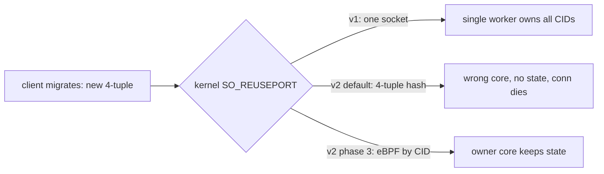

# HTTP/3 QUIC: v1 and v2 dispatch, plus the ADR-049 edits

Review note for Layer I. Not for commit. Decides how HTTP/3 maps onto the five dispatch models and
what ADR-049 needs. Companion to `http3-plan.md`.

## Decision

- v1 (Layer I now): HTTP/3 runs the single-worker recv shape and demuxes connections by Destination
  Connection ID inside `src/udp/http3/`. Migration is safe by construction. No shared-code change.
- v2 (deferred): per-core SO_REUSEPORT with a steering hook so each core owns a CID shard. This is
  the only part that touches the shared UDP engine.
- ADR-049: add a short addendum now (per-core is stateless fan-out), file the steering hook as
  phase 3. Mechanism in `zix.Udp`, policy (the CID parser) in `src/udp/http3/`.

## The seam, in one picture

A QUIC connection is keyed by Connection ID, not by the UDP 4-tuple. When a client migrates (NAT
rebind or network change) the 4-tuple changes but the CID does not. Plain SO_REUSEPORT hashes by
4-tuple, so a migrated datagram can land on a core that holds no state for that connection.



## v1 vs v2 trade-off

| Axis | v1 single worker + internal demux | v2 per-core + steering |
| :- | :- | :- |
| Scaling | one recv thread (recvmmsg, later GSO / GRO mitigate) | one thread per core, near-linear |
| Migration | safe by construction (one recv point) | needs eBPF CID steering, else breaks |
| Blast radius | new files only | touches `UdpServerConfig` + `runPerCore` + an eBPF asset |
| Portability | pure Zig, any Linux | eBPF path is kernel-version sensitive |
| When | Layer I v1 (now) | deferred phase 3 |

The five `dispatch_model` values still all resolve: `.ASYNC` / `.POOL` / `.MIXED` use the v1 shape,
`.EPOLL` / `.URING` fold to v1 with a logged notice until v2 lands. Same fold pattern `zix.Http2` and
the UDP raw layer already use.

## Blast radius by file

| Change | v1 | v2 |
| :- | :- | :- |
| `src/udp/http3/*` (new) | yes | yes |
| `src/udp/datagram.zig` | reuse as-is | reuse as-is |
| `src/udp/config.zig` | untouched | add `steering` field |
| `src/udp/dispatch/common.zig` | untouched | attach eBPF in `runPerCore` |
| `examples/` + runners | add 1 example (port 9063) | unchanged |
| `ADR-049-draft.md` | addendum paragraph only | phase 3 section |

Key point: v1 is additive. It builds on `datagram.zig` (the recvmmsg / sendmmsg primitives), not on
`Raw(handler)`, because `Raw` binds a stateless comptime handler with no context slot and QUIC needs
to own a connection table. So v1 parallels `Raw`, it does not modify it.

## Proposed file structure

```
src/udp/http3
|
|___/dispatch
|   |___common.zig            (shared recv-loop helpers: runSingle / runPerCore)
|   |___async.zig             (single core, one demux loop, v1)
|   |___pool.zig              (multi core, demux + worker pool, v1)
|   |___mixed.zig             (multi core, hybrid demux, v1)
|   |___epoll.zig             (multi core, per-core, v2 attempt, folds to v1)
|   |___uring.zig             (multi core, per-core, v2 attempt, folds to v1)
|
|___config.zig               (Http3ServerConfig: UDP knobs flat + QUIC fields)
|___http3.zig                (Server(routes) facade + run() switch)
|___connection.zig           (per-connection state: CID, keys, streams)
|___demux.zig                (CID to *Connection table)
|___crypto.zig               (Layer C: initial / retry / keyupdate / aead-limits)
|___transport.zig            (Layer Q: frames, flow control, close)
|___tls.zig                  (Layer T: CRYPTO handshake, reuses src/tls)
|___qpack.zig                (Layer P: header compression)
|___h3.zig                   (Layer H: streams, SETTINGS, semantics)
|___loss.zig                 (Layer L: RTT, loss, congestion)
```

The crypto / transport / tls / qpack / h3 / loss files are where the existing `rnd/0.5.x` PoCs land
as real modules. demux.zig + connection.zig + the dispatch files are the genuinely new Layer I code.

## v1 sketch (illustrative)

One worker, one socket, owns the whole CID table. A 4-tuple change is just a new peer address on an
existing CID, so migration needs no special routing.

```zig
// src/udp/http3/dispatch/async.zig (single-core v1 path)
pub fn run(server: *Http3Server) !void {
    const fd = try datagram.open(server.config.ip, server.config.port, false);
    defer datagram.close(fd);

    var rx = try datagram.RecvBatch.init(server.config.allocator, server.config.recv_batch, mtu);
    defer rx.deinit();

    while (true) {
        const count = rx.recv(fd) catch continue;

        for (0..count) |i| {
            const dg = rx.get(i);
            const cid = quic.peekDcid(dg.data) orelse continue;

            const conn = try server.table.getOrInit(cid, dg.from);
            conn.onDatagram(dg.data, dg.from); // updates peer addr on migration
        }

        // flush coalesced replies with sendmmsg
    }
}
```

## v2 sketch (illustrative, phase 3)

Per-core workers each own a CID shard. The steering knob points the kernel at a byte range to hash
instead of the 4-tuple. zix.Udp stays protocol-agnostic: it hashes an opaque range, it never learns
what a CID is.

```zig
// src/udp/config.zig (phase 3 addition)
pub const Steering = struct {
    /// Byte range used as the SO_REUSEPORT routing key, replacing the 4-tuple hash.
    /// HTTP/3 points this at its fixed-length Destination Connection ID.
    key_offset: usize,
    key_len: usize,
};

// new optional field on UdpServerConfig:
/// Per-core routing override for connection-oriented protocols. Null means stateless
/// 4-tuple fan-out (the default, correct for echo / DNS / telemetry).
steering: ?Steering = null,
```

No-eBPF fallback if the kernel path is not wanted: a per-core worker that receives a non-owned CID
forwards the datagram to the owner worker over an in-process queue. Simpler and pure Zig, costs one
extra hop plus cross-core cache traffic per misroute. Either way the policy stays out of zix.Udp.

## How the HTTP/3 config relates to the UDP config

It restates the UDP substrate knobs flat (no nested sub-config, per the flat-config rule) and adds
the QUIC fields. The TLS context is the sanctioned by-pointer exception.

```zig
// src/udp/http3/config.zig (illustrative)
pub const Http3ServerConfig = struct {
    io: std.Io,
    allocator: std.mem.Allocator,
    ip: []const u8,
    port: u16,

    // UDP substrate knobs, restated flat:
    dispatch_model: DispatchModel = .ASYNC, // v1 path, per-core needs steering (v2)
    recv_batch: usize = 32,
    send_batch: usize = 32,

    // QUIC / HTTP-3 knobs:
    tls: *Tls.Context, // cert + keys, by pointer (sanctioned exception)
    cid_len: u8 = 8, // fixed DCID length, enables v2 steering
    disable_active_migration: bool = false, // RFC 9000 transport param
    max_idle_ms: u32 = 30000,
    max_streams: u32 = 128,
};
```

So "the HTTP/3 config modifies the UDP config" is true only for binding knobs. Migration survival is
not a new UDP field, it is the choice of recv shape (v1) plus, later, the steering hook (v2).

## Cross-platform dispatch (0.6.x / 0.7.x)

### The fd-keyed engines extend linearly

For `zix.Http`, `zix.Http1`, `zix.Http2`, `zix.Grpc`, and `zix.Udp` (typed), per-connection state is
keyed by the connection fd. Supporting macOS and Windows is then a mechanical backend swap: add two
`dispatch_model` arms and two `dispatch/` files per engine (`kqueue.zig`, `iocp.zig`) behind the same
`run()` switch (ADR-043). The per-connection logic above the poller does not change.

| dispatch_model | Role | OS |
| :- | :- | :- |
| ASYNC / POOL / MIXED | portable threading over std.Io | all |
| EPOLL | readiness poller | Linux |
| KQUEUE (new) | readiness poller | macOS / BSD |
| IOCP (new) | completion poller | Windows |
| URING | completion ring | Linux |

EPOLL, KQUEUE, and IOCP fill the same role per OS: wake a worker when this fd is ready or its
operation completed. Because state is fd-keyed, the engine code above the poller is identical. That
is what makes the family linear.

### HTTP/3 splits one axis into two

The enum above bundles two things that travel together for TCP but separate for QUIC:

1. I/O backend: datagrams arrived on the socket (epoll / kqueue / iocp / uring).
2. Work distribution: which worker owns this connection (the CID routing).

A QUIC server has no per-connection fd: one UDP socket carries every connection, demuxed by CID in
user space. So the backend covers only axis 1, and the CID demux is a separate step. That decouples
them:

| Path | Backend axis | Distribution axis | OS |
| :- | :- | :- | :- |
| v1 single / pooled | any (epoll / kqueue / iocp / uring) | one demux point to a CID table (+ worker pool) | all |
| v2 per-core | Linux poller + SO_REUSEPORT | per-core CID shard via eBPF steering | Linux only |

So for HTTP/3 the enum maps like this:

- ASYNC / POOL / MIXED -> v1, portable.
- EPOLL / KQUEUE / IOCP -> v1 recv backend for that OS, still a single or pooled demux.
- URING -> v1 recv backend on Linux, and the door to v2.
- v2 per-core steering is gated on Linux + eBPF no matter which arm is chosen. On macOS, Windows, or
  Linux without eBPF it folds to the v1 demux path with a logged notice (same fold pattern in use
  today).

The upshot: KQUEUE and IOCP make HTTP/3's recv side portable for free (v1 runs under any backend).
Only v2's per-core CID steering stays Linux-bound, and it folds gracefully, so HTTP/3 is never
blocked on a platform.

### The user-facing ladder

| Tier | Shape | Best for |
| :- | :- | :- |
| A: v1 single | one recv point, inline handling | dev boxes, any OS |
| B: v1 pooled | recv point + CID to worker-pool dispatch | macOS / Windows scaling, mid Linux |
| C: v2 per-core | per-core SO_REUSEPORT + eBPF CID steering | big Linux (64c class) |

Same engine, the tier follows the machine: a 12-core dev box or any non-Linux host lands on A or B,
the 64-core Linux box engages C. The user pins it through `dispatch_model` plus the steering knob,
and zix folds down a tier when the platform cannot honor the request.

### Splitting the dispatch models

The models are kept split, one real path each, so the user tunes the exact model their environment
needs and never guesses what is running underneath. Today the split is only skin-deep: five files,
two behaviors.

| File | Body today |
| :- | :- |
| `dispatch/async.zig` / `pool.zig` / `mixed.zig` | all `return common.runSingle(...)`, byte-identical |
| `dispatch/epoll.zig` / `uring.zig` | both `return common.runPerCore(...)` (uring logs first) |

So the per-model files exist (ADR-043) but alias to two shared helpers. The refinement: give each
model a genuinely distinct, independently tunable path. Two collapses are conflated here, and only
one is a wart.

| Collapse | Example | Verdict |
| :- | :- | :- |
| Aliasing distinct concepts | ASYNC = POOL = MIXED, all `runSingle` | a wart, split them |
| Platform-impossible | EPOLL on Windows, IOCP on Linux | physics, cannot run there |

Splitting on environment need, the rules:

1. Concurrency shapes carry real bodies: ASYNC (single async loop), POOL (thread pool), MIXED
   (hybrid). Not three names for one helper. This is where per-model tuning lives.
2. One tuned file per I/O backend (EPOLL / KQUEUE / IOCP / URING), each owning its knobs (epoll
   batch size, kqueue changelist, URING SQ depth). The shared loop body stays one comptime
   parameterized helper, so a patch to one backend does not touch the others and there is no
   copy-paste.
3. Two kinds of fold, made to look different (this is the less-guessing part):
   - Category error (`.IOCP` on a Linux build): compile-time reject. `builtin.os.tag` is comptime,
     so a nonsensical combo never builds. No runtime surprise.
   - Capability gap (`.URING` on an old kernel, eBPF steering absent): graceful runtime fold with a
     notice. The machine genuinely cannot, but the server still runs.

   There is no auto-select keyword. Portable code picks a portable shape (`.POOL` / `.MIXED`) or its
   own one-line comptime switch on `builtin.os.tag`, nothing hidden.
4. v1 vs v2 (single demux vs per-core shard) is its own explicit dimension, not an implied upgrade
   hidden inside `.URING`. Selecting a model never silently decides the steering strategy.

Scope: this taxonomy is whole-family, not HTTP/3 only. The moment KQUEUE / IOCP land, every engine
(`Http` / `Http1` / `Http2` / `Grpc` / `Tcp` / `Udp`) inherits the same enum and the same two-fold
rule. It deserves its own ADR (dispatch-model taxonomy + platform matrix), with ADR-049 and HTTP/3
as one consumer, so the policy lives in one place instead of being re-litigated per engine.

### The contract: core behavior + file layout

Pin the meaning so it never has to be guessed. The OS swaps the backend, never the single-vs-multi
nature.

| Model | Core behavior | OS | File |
| :- | :- | :- | :- |
| ASYNC | single | all | `async.zig` |
| POOL | multi (thread pool) | all | `pool.zig` |
| MIXED | multi (hybrid) | all | `mixed.zig` |
| EPOLL | multi (per-core) | Linux | `epoll.zig` |
| URING | multi (per-core) | Linux | `uring.zig` |
| KQUEUE | multi (per-core) | macOS / BSD | planned, 0.6.x / 0.7.x |
| IOCP | multi (per-core) | Windows | planned, 0.6.x / 0.7.x |

Every engine's `dispatch/` carries the same built set, so the folder is self-documenting: open it,
see every model, each file header states its core behavior + OS in one line. `pool.zig` / `mixed.zig`
aliasing `runSingle` today is the bug this contract fixes (POOL and MIXED must be multi).

KQUEUE and IOCP are reserved in the table above only. They are not created as files yet.

### Where developers find it

Three layers, so the answer is the same for any engine and never a guess.

| Layer | Home | Role |
| :- | :- | :- |
| 1 | the cross-engine taxonomy ADR | authoritative record: the contract, the mapping, the platform matrix |
| 2 | a user-facing reference table in `docs/` | where a developer picks a `dispatch_model`, same table as above |
| 3 | each `dispatch/<model>.zig` header line | in-code, one line: core behavior + OS |

On reserving KQUEUE / IOCP as empty stub files: not recommended. A file holding only
`//! Reserved: future plan` rots (it gets committed and forgotten), adds tree noise, and works
against keeping the built set honest. Reserve them in the documentation instead (the contract table
marks them planned), which is discoverable and stays maintained. The file is created with real
content when the OS work starts.

## Proposed ADR-049 edits (exact wording for review)

### Addendum, to sit under the phase 1 dispatch table

> ### Per-core model is stateless fan-out
> The `.EPOLL` / `.URING` per-core mapping uses plain SO_REUSEPORT, so the kernel routes datagrams by
> 4-tuple hash. This is correct only when any worker can handle any datagram (echo, DNS-style,
> telemetry). It is not safe for connection-oriented protocols that need datagram-to-owner affinity:
> a QUIC connection migration changes the 4-tuple, so a migrated datagram can hash to a worker that
> does not hold the connection state. Such protocols either run the single-worker shape and demux
> internally (HTTP/3 v1), or use the phase 3 steering hook. The per-core model never inspects the
> payload, the affinity policy lives in the upper layer.

### New phase 3 section

> ## Phase 3 (deferred): connection-affinity steering
> Adds an optional `steering` knob to `UdpServerConfig` so the per-core models route by a
> protocol-supplied byte-range key instead of the 4-tuple hash. The mechanism is an SO_REUSEPORT
> eBPF program parameterized by `(key_offset, key_len)`. zix.Udp stays protocol-agnostic: it hashes
> an opaque byte range, it never learns what a Connection ID is. HTTP/3 supplies the range pointing
> at its fixed-length DCID, which keeps the existing boundary that CID demux lives in
> `src/udp/http3/`. No-eBPF fallback: per-core workers forward a non-owned datagram to the owner
> worker over an in-process queue (one extra hop per misroute). On macOS, Windows, or Linux without
> eBPF the per-core models fold to the v1 demux path with a logged notice. Independent of phase 2.

## Open items for your call

- Confirm phase 3 over a separate ADR (recommended: phase 3, the hook is reusable for any CID-like
  UDP protocol and must live where the socket is owned).
- v2 default mechanism: eBPF reuseport (faster, kernel-version sensitive) or in-process forwarding
  (simpler, portable). Not needed until v2 is built.
</content>
</invoke>
