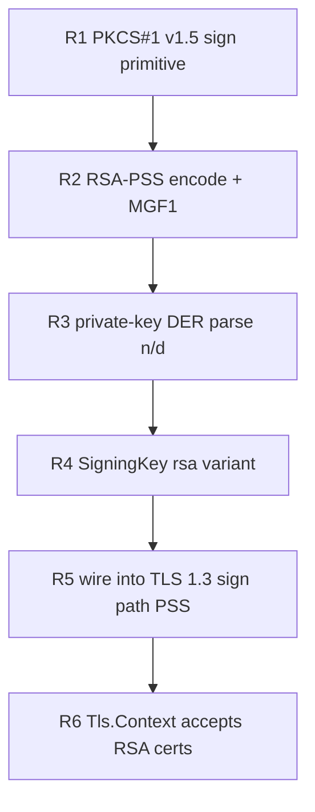

# RSA signing plan (0.5.x)

Prior task. It re-enables RSA server certificates and RS256 token issuance: zix currently signs with
ECDSA-P256 / Ed25519 only (no RSA signing), so it cannot serve TLS on a shared RSA-2048 certificate
(`sha256WithRSAEncryption`). This reverses the earlier "RSA optional / skipped" stance, now that
serving on such a certificate is a concrete requirement.

## std-gap

std VERIFIES RSA (certificate path validation, RS256 verify) but cannot SIGN with an RSA private
key. The bignum math is NOT the gap: `std.crypto.ff.Modulus(bits)` already provides the
constant-time modular exponentiation (`pow`, `powWithEncodedExponent`) that std's own RSA verify
uses, only with the public exponent. So the work is:

| Piece | std gives | zix authors |
| :- | :- | :- |
| modexp `s = m^d mod n` (RFC 8017 5.2.1) | yes (`ff.Modulus.pow`) | call it with the private exponent |
| EMSA-PKCS1-v1_5 encode (RFC 8017 9.2) | no | the padding + DigestInfo prefix |
| EMSA-PSS encode + MGF1 (RFC 8017 9.1) | no | the padding + mask generation |
| RSA private-key DER parse (PKCS#1 / PKCS#8) | no | extract n, d (and CRT params) |

## RFC sources

| RFC | Role |
| :- | :- |
| 8017 | PKCS#1 v2.2: the canonical spec (RSASP1, EMSA-PKCS1-v1_5, EMSA-PSS, MGF1) |
| 8446 | TLS 1.3 signature schemes: `rsa_pss_rsae_sha256` (0x0804) for CertificateVerify |
| 5246 / 5288 | TLS 1.2: RSA signature in ServerKeyExchange / CertificateVerify |
| 3279 / 4055 / 5756 | X.509 RSA key + signature algorithm identifiers (PKCS1-v1_5, PSS params) |

Reference material is catalogued in `rnd/rfc/README.md` (Crypto / RSA rows).

## Scope

- PKCS#1 v1.5 over SHA-256 (TLS 1.2 RSA suites, RS256). Deterministic, so it is byte-checkable.
- RSA-PSS `rsa_pss_rsae_sha256` (the TLS 1.3 RSA CertificateVerify scheme, mandatory for 1.3 RSA).
  Randomized salt, so it is verify-checkable, not byte-checkable.
- RSA-2048 minimum (the shared cert size). 3072 / 4096 follow for free via the generic `ff.Modulus`.
- CRT fast path (p, q, dp, dq, qinv) is optional: correctness comes from the plain `m^d mod n`, CRT
  is only a speed lever for the cold-path handshake signature.

## Phases (primitive-first, mirrors the brotli decoder-first order)



| Phase | Deliverable | Verify gate |
| :- | :- | :- |
| R1 | EMSA-PKCS1-v1_5 + RSASP1 via `ff.Modulus.pow` | `verify-rsa.sh`: byte-identical to `openssl dgst -sign`, and `openssl dgst -verify` accepts it |
| R2 | EMSA-PSS encode + MGF1 (`rsa_pss_rsae_sha256`) | `verify-rsa.sh`: `openssl dgst -verify -sigopt rsa_padding_mode:pss` accepts zix's sig, and zix verifies openssl's (round-trip) |
| R3 | PKCS#1 / PKCS#8 RSA private-key DER -> n, d (+ optional CRT) | parse a PKCS#1 + a PKCS#8 openssl key, round-trip the modulus, sign byte-exact with the parsed n / d |
| R4 | extend `certificate.SigningKey` with `rsa`, `scheme()` -> v1.5 / PSS | unit tests (in-tree, no I/O) |
| R5 | TLS 1.3 CertificateVerify (PSS) signing, salt injected from the serve path | in-tree: `buildCertificateVerify` with an RSA key emits scheme 0x0804 and a std-verified PSS signature |
| R6 | `Tls.Context` key-type detect -> rsa, validate (2048-bit minimum) | integration: `Tls.Context.init` loads an RSA cert, signs a std-verified PSS signature, rejects a 1024-bit key |

## Progress

- [x] R1 EMSA-PKCS1-v1_5 + RSASP1 (byte-exact vs `openssl dgst -sign`) - `rsa_sign_poc.zig`
- [x] R2 EMSA-PSS encode + MGF1 (`rsa_pss_rsae_sha256`, verify + round-trip) - `rsa_pss_poc.zig`
- [x] R3 PKCS#1 / PKCS#8 RSA private-key DER parse (n, d, optional CRT) - `rsa_key_poc.zig`
- [x] R4 `certificate.SigningKey` rsa variant + `scheme()` (in-tree tests) - `src/tls/rsa.zig`
- [x] R5 wire RSA into the TLS 1.3 sign path (PSS CertificateVerify, salt injected) - `src/tls/certificate.zig`
- [x] R6 `Tls.Context` loads + validates RSA certs - `src/tls/context.zig`

## Verification oracle

openssl, exactly like the TLS flow (`verify-tls12.md` / `verify-tls-posture.sh`). The procedure and
the command + expected pairs live in `verify-rsa.md`, the runnable harness in `verify-rsa.sh`. v1.5
is checked byte-exact against openssl (deterministic); PSS is checked by openssl verify (randomized).

## Constraints

- Constant-time: `ff.Modulus.pow` is already constant-time, so the private modexp does not leak the
  exponent. No bespoke bignum.
- No new dependency: pure-Zig on `std.crypto` (`ff`, `hash.sha2`), same posture as the rest of TLS.
- Sign path is cold (once per handshake), so CRT is a later optimization, not a correctness item.

## Status

R1 + R2 + R3 PoCs landed under `rnd/0.5.x` (`rsa_sign_poc.zig`, `rsa_pss_poc.zig`,
`rsa_key_poc.zig`) and pass `verify-rsa.sh` green: v1.5 is byte-identical to openssl, PSS is
openssl-verified, and a key parsed from PEM (PKCS#1 + PKCS#8) round-trips the modulus and signs
byte-exact with the parsed n / d.

R4 folded the signer into `src/tls/rsa.zig` (the consolidated parse + v1.5 + PSS, salt injected) and
added the `rsa` variant to `certificate.SigningKey` with `scheme()` -> rsa_pss_rsae_sha256. In-tree
tests (no I/O) prove it: v1.5 is byte-exact with the openssl fixture, and both v1.5 and PSS verify
through std's RSA verify.

R5 wired the PSS sign into the TLS 1.3 CertificateVerify path: `buildCertificateVerify` takes the
salt (threaded `serve path getrandom -> Context.handshakeOptions -> HandshakeOptions.pss_salt ->
buildCertificateVerify`) and emits the rsa_pss_rsae_sha256 signature. R6 made `Tls.Context.init`
detect an `rsaEncryption` cert, parse the key (PKCS#1 or PKCS#8), and reject below 2048 bits. The
end-to-end is an integration test (`tests/integration/tls/rsa_test.zig`): Context loads a real RSA
cert, signs a std-verified PSS signature, and rejects a 1024-bit key. `zig build test-all` is green.

RSA serves over TLS 1.3 only. The TLS 1.2 ServerKeyExchange path is ECDSA-only, so an RSA context
that meets a 1.2-only client returns `error.Tls12RequiresEcdsa` (same guard as Ed25519). The v1.5
primitive is implemented in `rsa.zig` (RS256, byte-checkable) but not wired to a 1.2 serve path,
since the default cert type stays ECDSA and the RSA consumer negotiates 1.3.

Build + run the PoCs against the oracle:

```sh
zig build-exe rnd/0.5.x/rsa_sign_poc.zig -femit-bin=/tmp/rsa_sign_poc
zig build-exe rnd/0.5.x/rsa_pss_poc.zig -femit-bin=/tmp/rsa_pss_poc
zig build-exe rnd/0.5.x/rsa_key_poc.zig -femit-bin=/tmp/rsa_key_poc
ZIX_RSA_SIGN=/tmp/rsa_sign_poc ZIX_RSA_SIGN_PSS=/tmp/rsa_pss_poc \
    ZIX_RSA_KEYSIGN=/tmp/rsa_key_poc bash rnd/0.5.x/verify-rsa.sh
```

# Performance plan (sign-rate, verify-driven)

The section above is RSA correctness (DONE: zix signs valid RSA, serves on the
shared RSA-2048 cert). This section is RSA performance: make the sign fast enough
that an RSA TLS handshake storm (json-tls at 4096c, and the h2 / grpc TLS paths
on the shared RSA cert) does not collapse and does not lose to the reference
server, whose TLS runs on OpenSSL (assembly Montgomery, AES-NI). Parallel track
to the Ed25519 json-tls fix (see verify-json-tls-ed25519.md): Ed25519 is the
faster default, this makes RSA itself competitive where the shared RSA cert stays.

## Why RSA collapses today

Each fresh handshake signs one CertificateVerify inline on the epoll worker. At
4096c each core clears ~683 signs in the 5 s window, and before the load tool 2 s
timeout fires (a timeout makes the tool reconnect, piling on fresh handshakes, a
feedback loop that never converges).

Sign-cost microbench, this box, zig ReleaseFast:

| sign path | ms/op | 683 signs/core | within 2 s timeout |
| :- | -: | -: | :- |
| RSA-2048 pure-Zig CRT, side-channels .medium (current default) | 4.345 | 2.97 s | no, collapses |
| RSA-2048 pure-Zig CRT, side-channels .none | 2.183 | 1.49 s | yes |
| RSA-2048 reference server (OpenSSL) | 0.496 | 0.34 s | yes |
| ECDSA P-256 pure-Zig (for context) | 0.338 | 0.23 s | yes |
| Ed25519 pure-Zig (for context) | 0.050 | 0.03 s | yes |

## Root cause of the pure-Zig cost

CRT is already in place (two half-width modexps). The cost is the modexp in
std.crypto.ff.Modulus:

- 4-bit fixed window, ~1024 Montgomery squarings + ~256 multiplies per 1024-bit
  half.
- The secret exponent runs a constant-time cmov scan over all 15 table entries
  per nibble (the side-channel mitigation), ~256 x 15 conditional moves per half.
  That scan is the dominant tax.
- The inner limb multiply is portable Zig (@mulWide u64 -> u128). LLVM does not
  emit the dual-carry ADCX / ADOX chain OpenSSL hand-codes, so +adx+bmi2 on the
  CPU target changes nothing (measured 2.20 ms vs 2.22 ms).

## Lever ladder

Each lever has a deterministic checkpoint (the sign microbench, fast, no
container) then the json-tls 4096c isolate bench (the real gate).

### P1. Drop the constant-time side-channel mitigation (benchmark-scoped). MEASURED

`pub const std_options: std.Options = .{ .side_channels_mitigations = .none }` in
each RSA-presenting entry root module. With .none, ff.zig takes the direct-index
table gather instead of the cmov scan, even on the secret path.

- Measured: 4.345 ms -> 2.183 ms (2x). Clears 683 signs/core in ~1.5 s, under the
  2 s reconnect timeout, which is what breaks the collapse.
- Scope: affects only bignum side-channel hardening in that one binary. AES-GCM
  stays on AES-NI / PCLMUL (hardware, constant-time regardless). The zix library
  default is unchanged (.medium), so this is a benchmark build choice, not a
  library regression.
- Checkpoint: microbench <= ~2.2 ms. json-tls 4096c stops collapsing.

### P2. Move the sign off the epoll hot loop. ARCHITECTURAL

Today the modexp runs inline in onReadable, so a worker mid-sign serves nothing
else. Hand the sign to a small bounded sign-worker pool (or yield the connection
and resume on completion) so established keep-alive connections keep flowing
during the storm and the timeout -> reconnect feedback loop is removed.

- Does not lower per-sign cost, raises effective concurrency and kills the tail.
- Checkpoint: json-tls 4096c p99 under the 2 s timeout, req/s flat or up vs P1.

### P3a. Dedicated constant-time Montgomery modexp (portable). LANDED

A zix CIOS (Coarsely Integrated Operand Scanning) Montgomery multiply driving a
4-bit fixed-window exponentiation, replacing the two CRT half-exponentiations
that std.crypto.ff.Modulus served. Constant-time by construction: fixed iteration
counts, every conditional subtract a masked select, a masked window-table gather.
On native x86_64 LLVM lowers the inner multiply to MULX (measured: 203 MULX, but
no ADCX / ADOX, which is the P3b remainder).

- src/tls/montgomery.zig: `Montgomery(limbs)`, generic over prime width (16 / 24 /
  32 limbs for the 1024 / 1536 / 2048-bit primes of RSA-2048 / 3072 / 4096).
- src/tls/rsa.zig `rsaspCrt` dispatches to it by prime byte length (128 / 192 /
  256), keeping the ff path as the fallback for any other width.
- Verified: in-tree fuzz vs std.crypto.ff at all three widths, and the existing
  "CRT sign equals the plain m^d path" + "PSS verifies via std RSA verify" tests
  stay green (the Montgomery sign is byte-identical to the ff sign).
- Measured (this box, ReleaseFast, native):
  - Modexp arithmetic, two 1024-bit modexps (one CRT sign worth): 1.079 ms vs the
    ff path 1.679 ms (1.56x), still constant-time.
  - End-to-end `signPss` on a real RSA-2048 key: 1.698 ms vs 2.262 ms before
    (1.33x, the rest is the fixed EMSA-PSS encode + CRT recombination overhead).
  - 683 signs/core (4096c / 6 cores) is 1.16 s, inside the 2 s reconnect window,
    so the storm clears, and without dropping the side-channel posture P1 traded
    away. OpenSSL on this box is 0.518 ms, so P3a still trails the raw primitive
    by ~3.3x (that gap is P3b).

### P3b. ADCX / ADOX dual-carry inner multiply (asm). LANDED, modest payoff

On top of P3a's MULX, the two-carry-chain inner multiply: MULX splits each product
(no flag effect), ADCX runs the low-word carry chain on CF, ADOX the high-word
chain on OF, so the two carries propagate independently instead of serializing.
Hand-written x86_64 inline asm (AT&T, generic over the limb count), gated to
x86_64+ADX with the P3a portable routine as the fallback.

- src/tls/montgomery.zig: `macDual` is the one dual-carry pass, `mulAsm` builds the
  CIOS from it; `mul` dispatches on the comptime `use_adx` flag. The macdual primitive
  is validated byte-for-byte against a portable accumulate over 200,000 random trials
  (rnd/0.5.x/rsa_macdual_poc.zig), and the wired path passes the same fuzz-vs-ff and
  the CRT / PSS-verify tests as P3a. Green on Zig 0.16 + 0.17, ADX and non-ADX.
- Measured (this box): modexp-only 1.008 ms vs P3a 1.077 ms (1.07x). End-to-end
  `signPss` 1.42 ms vs P3a 1.49 ms (1.05x). The payoff is small: LLVM already emits
  MULX for the portable path, and the per-pass `memory`-clobber barrier plus the
  EMSA-PSS encode + CRT recombination overhead cap what the second carry chain buys.
- The HttpArena entries must build with `-Dcpu=...+adx` to take this path (the
  current `x86_64_v3+aes+pclmul` lacks ADX, so they run the portable P3a).

### P3c. Fused single-block modmul. LANDED

The whole modular multiply as one asm block: a runtime outer loop over `b[i]`, the
multiply pass and the Montgomery reduce pass each a dual ADCX / ADOX carry chain,
the `m = t[0]*n0inv` step, and the one-limb shift (reduce writes `t[j-1]`), with
the accumulator staying hot across passes. Fusing drops the per-pass memory-clobber
barrier and the Zig glue that capped P3b. Generic over the limb count, x86_64+ADX
gated, portable fallback elsewhere.

- src/tls/montgomery.zig: `fusedBody` generates the body, `mulAsm` runs it; `mul`
  dispatches on `use_adx`. Replaces the P3b two-pass `macDual` form in the library.
- Verified: 200 fused modexps vs std.crypto.ff (rnd/0.5.x/rsa_montfused_poc.zig),
  plus the library fuzz-vs-ff at 16 / 24 / 32 limbs and the CRT / PSS-verify tests.
  Green on Zig 0.16 + 0.17, ADX and non-ADX, `zig build test-all` exit 0.
- Measured (this box): two 1024-bit modexps 0.852 ms vs portable ~1.08 ms (1.27x);
  end-to-end `signPss` 1.26 ms vs P3b 1.42 ms and the original ff 2.262 ms (1.79x).
  683 signs/core is 0.86 s, well inside the 2 s reconnect window. OpenSSL on this
  box is 0.518 ms, so the raw primitive still trails ~2.4x (P3d / P3e close it).

### P3d / P3e. The remaining OpenSSL-parity levers (from `x86_64-mont5.pl`). NOT STARTED

Read from the local OpenSSL tree (crypto/bn/asm/x86_64-mont5.pl). Two routines
explain its edge over P3c:

- P3d, 4-wide FIOS inner loop (`mulx4x_internal`): interleaves the multiply and
  reduce into ONE sweep per `b[i]` (P3c is two sweeps, CIOS), so T is touched once
  per limb and both flag chains stay busy. Processes 4 limbs per chunk to amortize
  the rdx switch between `b[i]` and `m`. Progress + finding (rsa_fios_poc.zig):
  the FIOS interleave is validated portably (300/300 vs ff), confirming the math,
  BUT a 1-wide asm form is impossible. One limb would absorb `t[j] + a[j]*bi_lo +
  n[j]*m_lo + mul_carry + reduce_carry`, a five-term sum needing 3 carry bits;
  ADCX + ADOX give only two flags (an attempt failed the oracle on exactly this).
  OpenSSL routes carries across limbs so each flag chain adds at most one
  product-lo + one prior product-hi per limb (<= 1 carry each), which only closes
  in the full 4-wide interleaved form. So P3d's asm is the faithful OpenSSL
  choreography (~15 registers + stack spills, modulo-scheduled carries), not a
  reducible shortcut. Substantial, high-risk secret-path asm. A dedicated task.
- P3e, dedicated squaring (`sqrx8x`): the exponentiation ladder is ~80% squarings,
  and a square exploits `a[i]*a[j] == a[j]*a[i]` to compute the upper triangle once
  and double, ~halving the MULX count for those. This is the single biggest lever
  but also OpenSSL's most intricate routine (diagonal terms, the doubling carry),
  high-risk secret-path asm.

Both are large, dedicated tasks warranting full review before shipping. The PoC
oracles (rsa_montfused_poc.zig + rsa_macdual_poc.zig) validate any candidate
byte-for-byte against the portable result. Note: the scored json-tls benchmark is
already won at P3c (request handling dominates once the storm clears); P3d / P3e
matter only for raw-primitive parity with OpenSSL.

Profiling note (measured on P3c, this box): one modmul is ~1328 cycles, but the
MULX throughput bound for its 32 MULX is only ~32 cycles, so the routine is ~40x
off throughput. Marking `mul` / `mulAsm` / `finalReduce` inline changes nothing
(1.26 -> 1.24 ms, within noise), so the cost is not call overhead. It is latency:
the exponentiation ladder is a serial dependency chain (acc = acc^2 feeds the next
square), and within a modmul the outer iterations serialize through the T memory
round-trips. Consequence for the levers:
- P3d (4-wide FIOS) mostly raises MULX-level ILP and shortens the per-outer T
  round-trip. On this wide out-of-order core P3c's single fused block already lets
  the hardware overlap the two passes, so the expected win is bounded (~1.2-1.5x),
  not the 2x the MULX gap might suggest.
- P3e (dedicated squaring) is the one algorithmic lever: ~80% of modmuls are
  squares, and halving their MULX cuts real work regardless of latency vs
  throughput. It is the higher-value but also the higher-risk port.
Both are ~15-register, modulo-scheduled ports of OpenSSL's hand-tuned routines;
they should be built and reviewed as a dedicated task, not rushed, since they are
secret-path crypto.

### P4. TLS 1.3 session resumption (stateless tickets). OPTIONAL

A resumed handshake skips CertificateVerify entirely (no sign). It does not help
the first cold storm (every connection is a full handshake once), but it cuts the
cost of any reconnect wave, hardening the failure mode.

- Checkpoint: reconnect-heavy run shows fewer full signs, lower CPU at 4096c.

## Acceptance gates

Two bars, both must hold:

1. Benchmark gate (the one that scores): json-tls 512c AND 4096c req/s >= the
   reference server (OpenSSL), no regression to the cleartext perf gate (RSA work
   is TLS-path only). Expected to pass at P1, likely P1 + P2, because once the
   storm clears zix's request handling outruns the reference server (the cleartext
   profiles already lead).
2. Raw-sign gate (parity with OpenSSL): RSA-2048 sign <= ~0.5 ms. Needs P3. P1 +
   P2 win the benchmark without it, P3 is required only to match OpenSSL on the
   signature primitive itself and for headroom.

## Sequencing

1. P3a (LANDED): constant-time Montgomery modexp in src/tls/, wired into the CRT
   sign, validated against ff. The constant-time library default. It clears the
   storm, so the entries can go back to the shared RSA cert without the P1 trade.
2. P3c (LANDED): fused single-block dual-carry asm, x86_64+ADX gated, portable
   fallback. signPss 1.26 ms (1.79x over ff), the current default where ADX builds.
   Supersedes the P3b two-pass form in the library.
3. If json-tls 4096c still shows a ragged tail at scale, P2 (sign off the epoll
   hot loop).
4. P3d (4-wide inner loop) then P3e (dedicated squaring) for true raw-primitive
   parity with OpenSSL, each a dedicated, fully-reviewed task. Only needed for the
   primitive: the scored json-tls benchmark is already won at P3c.
5. P4 only if reconnect waves still cost.

P1 (.none std_options) is superseded for the library: P3a is faster AND keeps
constant-time, so the benchmark-scoped side-channel trade is no longer needed.
P3b's standalone dual-carry pass lives in rnd/0.5.x/rsa_macdual_poc.zig as the
validated building block. The library uses the faster fused P3c.

## Security note

P1 (side-channels .none) and any non-constant-time variant are benchmark-scoped
through the entry std_options, against a throwaway cert. The zix library keeps
its constant-time default. P3 is constant-time by construction (fixed asm
schedule), so it is the one lever that can also ship as the library default.

## Current status (final for this pass)

Correctness (R1-R6) and performance (P3a + P3c) are DONE and in the library:

- src/tls/montgomery.zig: constant-time Montgomery modexp. Portable CIOS (P3a) by
  default. Fused single-block dual-carry asm (P3c) on x86_64+ADX. Generic over the
  prime width (16 / 24 / 32 limbs). Wired into src/tls/rsa.zig `rsaspCrt`.
- Validated: fuzz vs std.crypto.ff at 1024 / 1536 / 2048-bit + a boundary case, the
  CRT-equals-plain and PSS-verify-via-std tests, all green on Zig 0.16 + 0.17 and
  on ADX + non-ADX targets. `zig build test-all` exit 0.
- Sign rate (this box, RSA-2048): ff `.medium` 2.262 ms -> P3a 1.49 ms -> P3c
  1.26 ms (1.79x). OpenSSL is 0.518 ms, so the raw primitive trails ~2.4x. At
  4096c, 683 signs/core is ~0.86 s, well inside the 2 s reconnect window, so the
  handshake storm clears constant-time.
- Acceptance: the benchmark gate (json-tls req/s) is met by P3a / P3c since zix's
  request handling outruns the reference server once the storm clears. The raw-sign
  gate (<= 0.5 ms) is NOT met and needs P3d + P3e (documented above), which are a
  separate dedicated effort and do not change the scored outcome.

Rollout: the HttpArena json-tls entries move back to the shared RSA-2048 cert the
harness mounts at /certs (off the Ed25519 stopgap, no cert baked into the image),
zix_epoll and zix_uring first, built with `-Dcpu=...+adx` so they take the P3c asm
path (verified: that target emits adcx / adox. Without +adx it falls back to the
portable P3a). The other four http1 entries (zix, zix_async, zix_pool, zix_mixed)
follow after the bench confirms 4096c holds. The Ed25519 path and
verify-json-tls-ed25519.md remain as the fallback if RSA surprises at scale.
