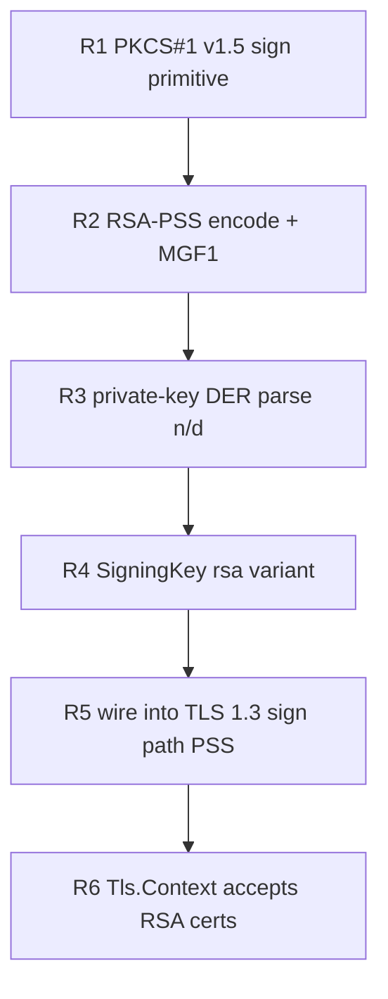

# RSA signing plan (0.5.x)

Prior task. It re-enables RSA server certificates and RS256 token issuance: zix currently signs with
ECDSA-P256 / Ed25519 only (no RSA signing), so it cannot serve TLS on a shared RSA-2048 certificate
(`sha256WithRSAEncryption`). This reverses the earlier "RSA optional / skipped" stance, now that
serving on such a certificate is a concrete requirement.

## std-gap

std VERIFIES RSA (certificate path validation, RS256 verify) but cannot SIGN with an RSA private
key. The bignum math is NOT the gap: `std.crypto.ff.Modulus(bits)` already provides the
constant-time modular exponentiation (`pow`, `powWithEncodedExponent`) that std's own RSA verify
uses, only with the public exponent. So the work is:

| Piece | std gives | zix authors |
| :- | :- | :- |
| modexp `s = m^d mod n` (RFC 8017 5.2.1) | yes (`ff.Modulus.pow`) | call it with the private exponent |
| EMSA-PKCS1-v1_5 encode (RFC 8017 9.2) | no | the padding + DigestInfo prefix |
| EMSA-PSS encode + MGF1 (RFC 8017 9.1) | no | the padding + mask generation |
| RSA private-key DER parse (PKCS#1 / PKCS#8) | no | extract n, d (and CRT params) |

## RFC sources

| RFC | Role |
| :- | :- |
| 8017 | PKCS#1 v2.2: the canonical spec (RSASP1, EMSA-PKCS1-v1_5, EMSA-PSS, MGF1) |
| 8446 | TLS 1.3 signature schemes: `rsa_pss_rsae_sha256` (0x0804) for CertificateVerify |
| 5246 / 5288 | TLS 1.2: RSA signature in ServerKeyExchange / CertificateVerify |
| 3279 / 4055 / 5756 | X.509 RSA key + signature algorithm identifiers (PKCS1-v1_5, PSS params) |

Reference material is catalogued in `rnd/rfc/README.md` (Crypto / RSA rows).

## Scope

- PKCS#1 v1.5 over SHA-256 (TLS 1.2 RSA suites, RS256). Deterministic, so it is byte-checkable.
- RSA-PSS `rsa_pss_rsae_sha256` (the TLS 1.3 RSA CertificateVerify scheme, mandatory for 1.3 RSA).
  Randomized salt, so it is verify-checkable, not byte-checkable.
- RSA-2048 minimum (the shared cert size). 3072 / 4096 follow for free via the generic `ff.Modulus`.
- CRT fast path (p, q, dp, dq, qinv) is optional: correctness comes from the plain `m^d mod n`, CRT
  is only a speed lever for the cold-path handshake signature.

## Phases (primitive-first, mirrors the brotli decoder-first order)



| Phase | Deliverable | Verify gate |
| :- | :- | :- |
| R1 | EMSA-PKCS1-v1_5 + RSASP1 via `ff.Modulus.pow` | `verify-rsa.sh`: byte-identical to `openssl dgst -sign`, and `openssl dgst -verify` accepts it |
| R2 | EMSA-PSS encode + MGF1 (`rsa_pss_rsae_sha256`) | `verify-rsa.sh`: `openssl dgst -verify -sigopt rsa_padding_mode:pss` accepts zix's sig, and zix verifies openssl's (round-trip) |
| R3 | PKCS#1 / PKCS#8 RSA private-key DER -> n, d (+ optional CRT) | parse a PKCS#1 + a PKCS#8 openssl key, round-trip the modulus, sign byte-exact with the parsed n / d |
| R4 | extend `certificate.SigningKey` with `rsa`, `scheme()` -> v1.5 / PSS | unit tests (in-tree, no I/O) |
| R5 | TLS 1.3 CertificateVerify (PSS) signing, salt injected from the serve path | in-tree: `buildCertificateVerify` with an RSA key emits scheme 0x0804 and a std-verified PSS signature |
| R6 | `Tls.Context` key-type detect -> rsa, validate (2048-bit minimum) | integration: `Tls.Context.init` loads an RSA cert, signs a std-verified PSS signature, rejects a 1024-bit key |

## Progress

- [x] R1 EMSA-PKCS1-v1_5 + RSASP1 (byte-exact vs `openssl dgst -sign`) - `rsa_sign_poc.zig`
- [x] R2 EMSA-PSS encode + MGF1 (`rsa_pss_rsae_sha256`, verify + round-trip) - `rsa_pss_poc.zig`
- [x] R3 PKCS#1 / PKCS#8 RSA private-key DER parse (n, d, optional CRT) - `rsa_key_poc.zig`
- [x] R4 `certificate.SigningKey` rsa variant + `scheme()` (in-tree tests) - `src/tls/rsa.zig`
- [x] R5 wire RSA into the TLS 1.3 sign path (PSS CertificateVerify, salt injected) - `src/tls/certificate.zig`
- [x] R6 `Tls.Context` loads + validates RSA certs - `src/tls/context.zig`

## Verification oracle

openssl, exactly like the TLS flow (`verify-tls12.md` / `verify-tls-posture.sh`). The procedure and
the command + expected pairs live in `verify-rsa.md`, the runnable harness in `verify-rsa.sh`. v1.5
is checked byte-exact against openssl (deterministic); PSS is checked by openssl verify (randomized).

## Constraints

- Constant-time: `ff.Modulus.pow` is already constant-time, so the private modexp does not leak the
  exponent. No bespoke bignum.
- No new dependency: pure-Zig on `std.crypto` (`ff`, `hash.sha2`), same posture as the rest of TLS.
- Sign path is cold (once per handshake), so CRT is a later optimization, not a correctness item.

## Status

R1 + R2 + R3 PoCs landed under `rnd/0.5.x` (`rsa_sign_poc.zig`, `rsa_pss_poc.zig`,
`rsa_key_poc.zig`) and pass `verify-rsa.sh` green: v1.5 is byte-identical to openssl, PSS is
openssl-verified, and a key parsed from PEM (PKCS#1 + PKCS#8) round-trips the modulus and signs
byte-exact with the parsed n / d.

R4 folded the signer into `src/tls/rsa.zig` (the consolidated parse + v1.5 + PSS, salt injected) and
added the `rsa` variant to `certificate.SigningKey` with `scheme()` -> rsa_pss_rsae_sha256. In-tree
tests (no I/O) prove it: v1.5 is byte-exact with the openssl fixture, and both v1.5 and PSS verify
through std's RSA verify.

R5 wired the PSS sign into the TLS 1.3 CertificateVerify path: `buildCertificateVerify` takes the
salt (threaded `serve path getrandom -> Context.handshakeOptions -> HandshakeOptions.pss_salt ->
buildCertificateVerify`) and emits the rsa_pss_rsae_sha256 signature. R6 made `Tls.Context.init`
detect an `rsaEncryption` cert, parse the key (PKCS#1 or PKCS#8), and reject below 2048 bits. The
end-to-end is an integration test (`tests/integration/tls/rsa_test.zig`): Context loads a real RSA
cert, signs a std-verified PSS signature, and rejects a 1024-bit key. `zig build test-all` is green.

RSA serves over TLS 1.3 only. The TLS 1.2 ServerKeyExchange path is ECDSA-only, so an RSA context
that meets a 1.2-only client returns `error.Tls12RequiresEcdsa` (same guard as Ed25519). The v1.5
primitive is implemented in `rsa.zig` (RS256, byte-checkable) but not wired to a 1.2 serve path,
since the default cert type stays ECDSA and the RSA consumer negotiates 1.3.

Build + run the PoCs against the oracle:

```sh
zig build-exe rnd/0.5.x/rsa_sign_poc.zig -femit-bin=/tmp/rsa_sign_poc
zig build-exe rnd/0.5.x/rsa_pss_poc.zig -femit-bin=/tmp/rsa_pss_poc
zig build-exe rnd/0.5.x/rsa_key_poc.zig -femit-bin=/tmp/rsa_key_poc
ZIX_RSA_SIGN=/tmp/rsa_sign_poc ZIX_RSA_SIGN_PSS=/tmp/rsa_pss_poc \
    ZIX_RSA_KEYSIGN=/tmp/rsa_key_poc bash rnd/0.5.x/verify-rsa.sh
```
