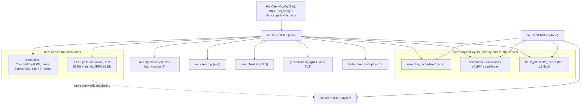

# zix.Tls client plan (zix 0.5.x)

The native client-side TLS handshake. It is the mirror of the server (`connection.zig` /
`tls12_connection.zig`): same crypto, opposite role. Decision + policy are ADR-045 / ADR-046, the
1.2 detail is `tls12-plan.md`. This is the lean plan, not a full spec.

## Why it exists

`zix.Http.Client` wraps `std.http.Client`, which is HTTP/1-only and CANNOT offer ALPN, so h2 client
requests return `error.UnsupportedVersion`. The zix.Tls client is the ALPN-capable backend, and it
adds the part the server never needed: verifying the peer certificate.

## Scope

- TLS 1.3 preferred, TLS 1.2 floor (same version policy as the server, ADR-045).
- Offers ALPN (h2 / http/1.1), verifies the server cert chain (RFC 5280) + identity (RFC 6125).
- Configured from the EXISTING flat `HttpClientConfig`: an `https://` URL opts in, plus
  `tls_verify: bool = true`, `tls_ca_path` (custom root, already added), `tls_alpn`.
- Additive. The cleartext client path stays default and untouched.

## Relations

- Reuses (shared with the server): wire, key_schedule + tls12_prf, record + tls12_record, handshake,
  extensions (ALPN), certificate. No crypto is re-implemented.
- Adds: the client flow + cert verification. The verification module is reused by server mTLS
  (Layer V), validating a CLIENT cert is the same machinery as validating the SERVER cert.
- Plugs into: `zix.Http.Client` as the ALPN-capable TLS backend, which unblocks h2 client requests.
- Consumed by: the deferred h2 runner (#15), ws_client (wss), sse_client, grpc client over TLS.

## What to build (de-risk bottom-up, PoC-first like the server)

| Layer | What | Reuses |
| :- | :- | :- |
| CH | build ClientHello: supported_versions, key_share (x25519 + secp256r1), signature_algorithms, server_name, ALPN | handshake, extensions, wire |
| SH | parse ServerHello + the server flight, derive client-side keys | key_schedule, record, wire |
| FIN | client Finished, switch to app keys | key_schedule, certificate |
| VER | verify the server cert chain (RFC 5280) + DNS-ID (RFC 6125) | certificate (new path-validation code) |
| 12 | the 1.2 client variant (PRF schedule, ServerKeyExchange verify, ClientKeyExchange) | tls12_prf, tls12_record |
| INT | plug into zix.Http.Client, then the h2 runner | client.zig, zix.Http2 frames |

## Status

CH + SH + FIN + VER LANDED in `src/tls/client.zig` (sans-I/O `start` / `finish` + `ClientConnection`),
green Zig 0.16 + 0.17:
- CH+SH+FIN: full 1.3 handshake against connection.serverHandshake (RFC 8448 oracle), server Finished
  verified, client Finished accepted, app-data round trip both directions.
- VER: finish verifies the server CertificateVerify (RFC 8446 4.4.3, proves the peer holds the
  end-entity cert key), lifting the pubkey via std.crypto.Certificate. The cert chain + hostname
  (RFC 5280 / 6125) are verified with std X.509 in a test (parsed.verify + verifyHostName on the
  self-signed fixture). That trust step is the CALLER's job at INT (it owns the trust store /
  tls_ca_path Bundle), so finish does the handshake binding and the caller does the chain/hostname.

The 1.2 client variant LANDED too (`src/tls/tls12_client.zig`, mirror of tls12_connection): start /
finish + ClientConnection, verifies the ServerKeyExchange signature (RFC 5246 7.4.3) via the
end-entity cert key, full handshake against the zix 1.2 server in-memory + app-data round trip,
green Zig 0.16 + 0.17.

INT in progress:
- the 1.3 client now OFFERS ALPN (ClientHello) and parses the server's selection from
  EncryptedExtensions (FinishResult.alpn), so it is h2-ready.
- proven over a REAL socketpair: the sans-I/O client drives a full https/1.1 request (handshake +
  CertVerify + GET + 200) against the zix server over real read/write + record framing.

Next: the h2 runner #15 (the client offering ALPN h2 + zix.Http2 frames, connecting to
example-tls_http2_basic over a TCP socket), then the broader zix.Http.Client transport wiring.

## Order

CH + SH + FIN first (a 1.3 client that completes a handshake against the zix server, no verify), then
VER (the new, security-critical path validation), then the 1.2 client variant, then INT. Each layer
verified against the zix server (loopback) and openssl s_server, green on Zig 0.16 + 0.17 before the
next. Public-tool checks recorded as verify-*.md.
