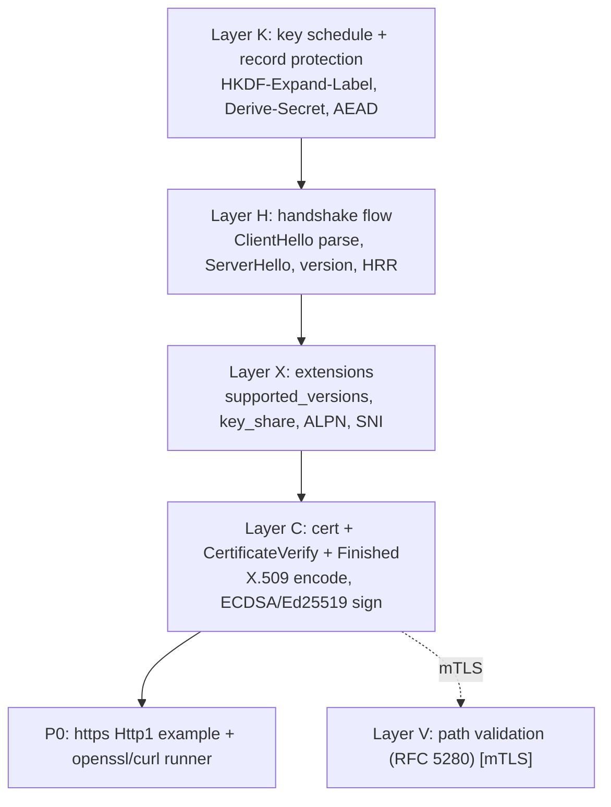

# TLS 1.3 server PoC plan (zix 0.5.x)

Decoder-first de-risking for the std-gap, the analog of `brotli-plan.md`. RFC MUST detail is
`rnd/rfc/tls-conformance-must-checklist.md`.

## Decision: pure-Zig, no C bind

zix authors the TLS 1.3 server handshake in pure Zig. No BoringSSL / quictls / OpenSSL.

Formalized as ADR-045 (pure-Zig TLS + version policy, with TLS 1.2 the required minimum) and
ADR-046 (TLS wired as a layer, gated serve paths over the unchanged engines) in docs/adr-*.md.

| Factor | Finding |
| :- | :- |
| Primitives | std.crypto has all of them: AES-128/256-GCM, ChaCha20-Poly1305, HKDF-SHA256/384, X25519, secp256r1 ECDSA, Ed25519, SHA-256/384 |
| Reference client | std ships `std/crypto/tls/Client.zig`, a working TLS 1.3 client to mirror and cross-test against |
| The gap | only the server-side handshake state machine plus X.509 path validation (RFC 5280), which is glue over those primitives, not new crypto |
| Cost of binding C | a C TLS lib drags ABI, build, and a foreign memory model across the shared-nothing engine, against the perf/memory hard rule |
| HTTP/3 reuse | the same handshake and key schedule feed QUIC-TLS (RFC 9001), so a pure-Zig schedule is reused, a C bind would have to be reused too and QUIC packet protection is pure-Zig regardless |

This matches the proposal-features feasibility pass: TLS server is reachable pure-Zig with an
ECDSA / Ed25519 cert, no RSA needed. RSA signing stays optional and off this path.

## Layer map (de-risk bottom-up)



| Layer | PoC file | Oracle | Status |
| :- | :- | :- | :- |
| K | `tls_keyschedule_poc.zig` | RFC 8448 byte trace (deterministic) | DONE, 24/24 vectors, Zig 0.16 + 0.17 |
| H | `tls_handshake_poc.zig` | RFC 8448 messages (byte-exact ServerHello) | DONE, parse + negotiate + serialize + flight order + negative MUSTs, Zig 0.16 + 0.17 |
| X | `tls_extensions_poc.zig` | RFC 8448 EncryptedExtensions (byte-exact) | DONE, EE + ALPN select/emit + no_application_protocol + SNI dup-reject, Zig 0.16 + 0.17 |
| C | `tls_cert_poc.zig` | RFC 8448 Finished + ECDSA P-256 fixture | DONE, Certificate msg + CertificateVerify + Finished (byte-exact), Zig 0.16 + 0.17 |
| P0 | `tls_server_poc.zig` | RFC 8448 + ECDSA fixture, self-deprotect | DONE, in-memory compose of K+H+X+C (real ECDHE, byte-exact SH/EE, AEAD encrypt round trip), Zig 0.16 + 0.17 |
| P0 | `tls_server_live.zig` | live openssl s_client + curl | DONE, full TLS 1.3 handshake over a socket (fresh ephemeral key, CertificateVerify + Finished accepted, app data), gate 2 |
| A | `src/tls/alert.zig` | emit-side condition -> alert matrix | DONE (emit): fatal alert record + alertForError map wired into http1/http2 tls_serve, unit-tested. Inbound alert + post-handshake encrypted alert pending |
| V | `src/tls/cert_verify.zig` | self-signed fixture + std X.509 | DONE (mTLS server side): verifyCertChain (RFC 5280) + verifyCertHostname (RFC 6125) + peerEcdsaP256PublicKey; connection.zig request_client_cert -> CertificateRequest + verifyClientCertFlight (split) / verifyClientAuthFlight (coalesced), round-trip + tamper-reject unit-tested. Remaining: multi-cert chains (std Bundle.verify) + engine tls_serve wiring |

Landed in src/ (no longer PoC-only): K + H + X + C + V + connection + Tls.zig + the 1.2 engine, the
Http1 https path and the Http2 h2-over-TLS terminator, plus Layer A emit. serverHandshake routes
through negotiate() (version / cipher / group selection enforced live), both X25519 and secp256r1
ECDHE are wired, and Layer C selects the CertificateVerify signature scheme (ECDSA P-256 / Ed25519)
from the client signature_algorithms (no-overlap -> handshake_failure). TLS 1.2 (the minimum floor,
ADR-045) is DONE and wire-validated, see tls12-plan.md. The A+ grade is measured on-box (testssl,
Final Score 92), see rnd/0.5.x/verify-tls-posture.sh.

## P0 remaining (live handshake works, src + receive side next)

The in-memory composition (`tls_server_poc.zig`) and the live server (`tls_server_live.zig`,
green against openssl s_client + curl) prove the send path end to end. What is left:

1. receive side: read + verify the client Finished, the record-layer read loop (Layer K decrypt
   for inbound application records), and a close_notify on teardown
2. move into `src/`: a TLS module wrapping the handshake + record layer, the per-connection state
3. https Http1 example on a unique port (the engine under https), registered in
   zix-build-examples.zig + tests/runner + zix-build-test_runner.zig
4. green under `zig build examples` + `test-runner-all` on Zig 0.16 and 0.17
5. ALPN wired live (h2 / http/1.1) once the example serves real requests

## src/ structure + config (P0 target)

TLS is a LAYER, not a dispatch engine, so it gets a top-level `src/tls/` (sibling to `tcp/`,
`udp/`), exposed as `zix.Tls`. Top-level because the handshake, key schedule, certificate, and
extensions are shared by Http1 (https) and Http2 (h2), and HTTP/3 later reuses all of it except
`record.zig` (QUIC swaps the record layer for packet protection). It has no `dispatch/` folder,
it hands the engines a `Connection`.

```
src
|
|___/tls                     (new, zix.Tls)
|   |___Tls.zig              (public namespace, accept() entry point)
|   |___config.zig           (TlsConfig, built from the engine's flat fields, holds Alpn enum)
|   |___connection.zig       (per-conn state: drive handshake, then read/write plaintext)
|   |___handshake.zig        (parse ClientHello, negotiate, emit the server flight)
|   |___key_schedule.zig     (HKDF-Expand-Label, the secret tree, traffic keys)
|   |___record.zig           (AEAD protect/deprotect, sequence, size limits)
|   |___certificate.zig      (Certificate msg, CertificateVerify sign, Finished, PEM load)
|   |___extensions.zig       (ALPN, SNI, extension codec)
|   |___alert.zig            (alert codec + error-to-alert mapping)
```

Each file ports one verified PoC: key_schedule + record from tls_keyschedule_poc.zig, handshake
from tls_handshake_poc.zig, extensions from tls_extensions_poc.zig, certificate from
tls_cert_poc.zig, connection from tls_server_live.zig.

LANDED in src/tls/ (unit-tested, green under `zig build unit-test` on Zig 0.16 + 0.17, additive,
cleartext engines untouched): `wire.zig`, `key_schedule.zig`, `record.zig`, `alert.zig`,
`handshake.zig`, `extensions.zig`, `certificate.zig`, `connection.zig`, `Tls.zig` (Layer K + H +
X + C + the sans-I/O server Connection). `zix.Tls` is now a public export in lib.zig
(`Connection`, `serverHandshake`, `Alpn`, ...). connection.zig is sans-I/O: `serverHandshake`
consumes a ClientHello and returns the bytes to send + a Connection (read/write app data,
close_notify, verify client Finished), so the engine owns the socket loop. Convention settled:
enums with UPPER_CASE values throughout src/tls/ (`ContentType`, `Alert`, `HandshakeType`,
`CipherSuite`, `NamedGroup`, `ExtensionType`, `SignatureScheme`, `Alpn`), matching
`Content.Type` / `Code`, non-exhaustive (`_`) for unknown wire values. Remaining: the Http1 wiring
(flat tls_* config + a serveConnTls path that drives the sans-I/O Connection over the fd) + the
examples/tls/tls_http1_basic.zig example + runner.

Integration is additive and gated on `tls_cert_path != null`. The cleartext EPOLL / URING hot
loop is NOT edited, https is a parallel `serveConnTls` path on its own perf band. Touched files:
`src/tcp/http1/config.zig` (flat fields), `src/tcp/http1/server.zig` (wrap fd on accept),
`src/tcp/http1/dispatch/{epoll,uring}.zig` (parallel https path), `src/lib.zig` (export + tests).

### Flat config (decided)

```zig
// https - opt-in, cleartext is the default (cert_path null => plain HTTP, hot path untouched)
tls_cert_path: ?[]const u8 = null,         // ECDSA P-256 (or Ed25519) PEM
tls_key_path:  ?[]const u8 = null,
tls_alpn:      []const zix.Tls.Alpn = &.{}, // &.{.HTTP_1_1} now, later &.{ .H2, .HTTP_1_1 }
hsts_max_age_s: u32 = 0,                    // RFC 6797 max-age in SECONDS (not the zix _ms norm,
                                            // the spec is seconds), 0 => no header, default policy
```

`Alpn` is an `enum(u8) { HTTP_1_1, H2 }` with a `token()` method returning the wire ProtocolName
(`"http/1.1"`, `"h2"`), mirroring `compression.Encoding`. Closed set is correct, h3 is QUIC ALPN
(separate). The valid set depends on the engine the TLS fronts (Http1 => `.HTTP_1_1` only).

HSTS policy: `hsts_max_age_s` is the listener default, emitted by the response helper on https
responses when > 0 (the same mechanism that emits `Date`), and the handler may OVERRIDE it
per-response (different max-age, or suppress). Not silent auto-inject, a config default with a
handler escape hatch. Seconds, since RFC 6797 max-age is seconds (15552000 = 180d SSL Labs A+
minimum, 31536000 = 1y recommended).

### Example naming: examples/tls/tls_<engine>_basic.zig

Every TLS example lives in examples/tls/ and is prefixed `tls_` then the engine it fronts, so the
filename marks which zix engine is under TLS:

| File | Engine | Port |
| :- | :- | :- |
| `examples/tls/tls_http1_basic.zig` | zix.Http1 (https/1.1) | 9060 |
| `examples/tls/tls_http_basic.zig` | zix.Http (https/1.1) | next free |

First file is `tls_http1_basic.zig`:

| Aspect | Value |
| :- | :- |
| config | `tls_cert_path` / `tls_key_path` => ECDSA P-256 PEM, `tls_alpn = &.{.HTTP_1_1}`, `hsts_max_age_s = 31536000` |
| handshake (openssl / curl) | TLSv1.3, TLS_AES_128_GCM_SHA256, x25519, ECDSA P-256 |
| response | `HTTP/1.1 200 OK` + body + `Strict-Transport-Security: max-age=31536000; includeSubDomains` |
| ALPN no overlap | TLS alert no_application_protocol(120), no HTTP |
| TLS 1.2-only / cleartext to https port | handshake / record parse aborts, no plaintext served |

Registration: create `examples/tls/` + `examples/tls/certs/` (ECDSA PEM + README), register in
zix-build-examples.zig, add tests/runner/tls_http1_basic_runner.zig (openssl + curl asserting
handshake + 200 + HSTS), add a row in zix-build-test_runner.zig with port 9060. A+ note: the
fixture is self-signed (SSL Labs needs a CA cert + public host), testssl.sh is the offline grade.

## Oracle strategy

- Deterministic, offline: RFC 8448 (vendored `rnd/rfc/rfc8448.txt`) gives byte-level
  known-answer traces for the whole 1-RTT handshake. Layer K is verified entirely against it,
  the analog of decoding real `brotli` CLI output.
- Live interop: `openssl s_client` (full TLS 1.3), `curl` (ALPN h2 / http/1.1 negotiation),
  and the std `crypto.tls.Client` as an independent Zig peer.
- Posture / adversarial (fetch when needed): testssl.sh, sslyze, nmap `ssl-enum-ciphers`,
  tlsfuzzer, and SSL Labs online for the A+ grade.
- Driver: `rnd/0.5.x/tls-conformance.sh` runs the deterministic gate on both toolchains now
  and activates the interop gate once an https server binary exists.

## Cert fixtures

`rnd/0.5.x/tls-certs/`, self-signed, `CN=localhost` + SAN `DNS:localhost,IP:127.0.0.1`,
10-year validity. ECDSA P-256 (`ecdsa_p256_*.pem`) is the conformance + A+ default. Ed25519
(`ed25519_*.pem`) is the interop second algorithm. No RSA fixture (optional, off the path).

## Perf / memory

Per the hard rule, cleartext stays the default and untouched, https is an opt-in parallel
path held to its own band, not the strict 1% gate. The
levers are session resumption (PSK tickets) and lean per-connection key state.
