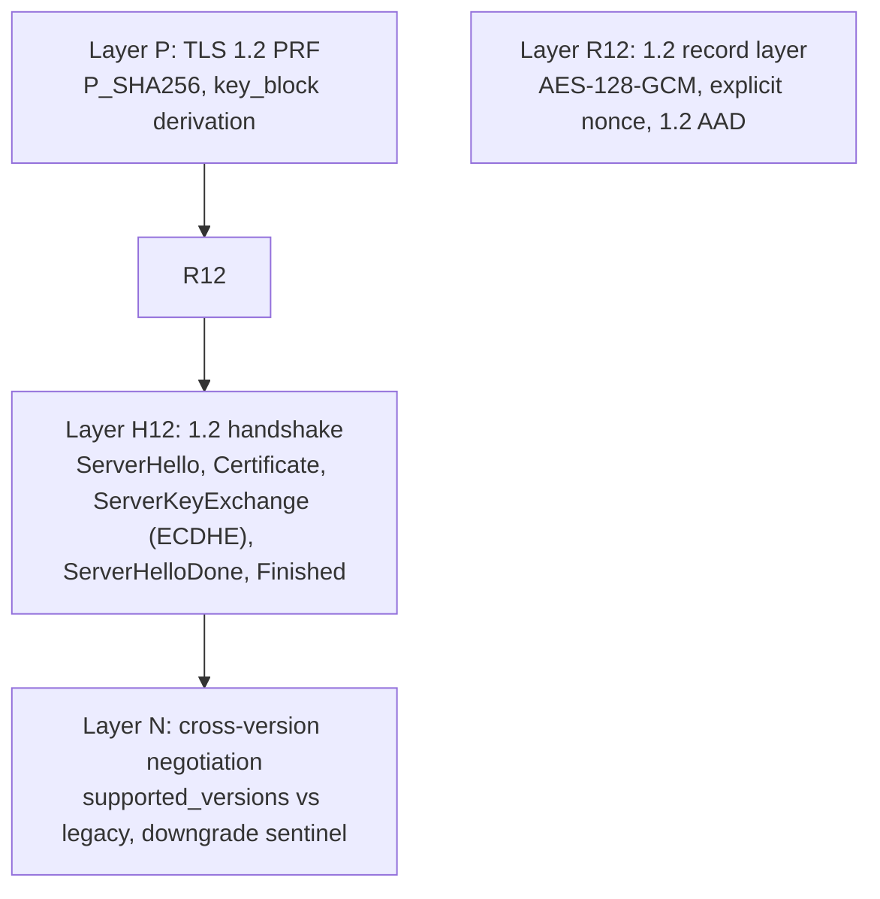

# TLS 1.2 server plan (zix 0.5.x)

TLS 1.2 is the REQUIRED MINIMUM (floor), TLS 1.3 preferred (ADR-045). The 1.3 server is landed
(see `tls-plan.md`). This plan de-risks 1.2 bottom-up, the same PoC-first approach: each layer is
proven against a deterministic oracle in `rnd/0.5.x` before it moves into `src/tls/`. Tracker rows
live here for now (the 1.3 layers are in `tls-plan.md`).

## Scope and constraints

- Offer TLS 1.2 AND 1.3, prefer 1.3, never below 1.2. 1.0 / 1.1 / SSL never offered (RFC 8996).
- 1.2 suites restricted to ECDHE-AEAD, no static-RSA key exchange, no CBC. This keeps forward
  secrecy and the SSL Labs A+ posture (ADR-045), and reuses the AES-GCM AEAD already in `record`.
- Mandatory 1.2 suite target: `TLS_ECDHE_ECDSA_WITH_AES_128_GCM_SHA256` (0xC02B), matching the
  ECDSA P-256 cert. (`TLS_ECDHE_RSA_*` only if/when RSA signing lands, which stays optional.)
- Additive only: 1.2 is a sibling path, the 1.3 path and the cleartext engines stay untouched.
  https stays on its own perf band.

## Layer map (de-risk bottom-up)

| Layer | PoC file | Oracle | Status |
| :- | :- | :- | :- |
| P | `tls12_prf_poc.zig` | the canonical TLS 1.2 PRF SHA-256 known-answer vector (100 bytes) | DONE, P_SHA256 + PRF byte-exact vs the 100-byte vector, Zig 0.16 + 0.17 |
| R12 | `tls12_record_poc.zig` | AES-128-GCM 1.2 AEAD (explicit nonce + 1.2 AAD), openssl cross-check | pending |
| H12 | `tls12_handshake_poc.zig` | openssl s_client (ECDHE-ECDSA), the master-secret + Finished | pending |
| N | (in `src/tls`) | openssl `-tls1_2` and `-tls1_3`, downgrade sentinel checked by a 1.3 client | pending |

## Key differences from 1.3 (what is genuinely new)

- Key schedule is the PRF (HMAC-based P_hash), NOT HKDF. master_secret = PRF(pre_master, "master
  secret", client_random + server_random), then key_block = PRF(master_secret, "key expansion",
  server_random + client_random). Distinct from the 1.3 HKDF-Expand-Label schedule in
  `key_schedule.zig`, so it is a separate module.
- Record layer: 1.2 AES-GCM uses an explicit 8-byte nonce on the wire and a different AAD
  (seq_num + type + version + length), versus 1.3's implicit nonce and inner-content-type AAD.
- Handshake shape: ServerHello (no EncryptedExtensions), Certificate, ServerKeyExchange (the ECDHE
  params signed with the cert key), ServerHelloDone, then the client flight, then a 1.2 Finished
  (verify_data = PRF(master_secret, "server finished", hash(handshake_messages)), 12 bytes).
- Negotiation: a 1.3-capable ClientHello carries supported_versions (0x0304 + 0x0303). When 1.3 is
  not offered, fall back to 1.2 via legacy_version 0x0303, and set the downgrade sentinel in
  ServerHello.random (RFC 8446 4.1.3) so a 1.3-capable client detects the downgrade.

## Oracle strategy

No RFC 8448 analog exists for 1.2, so: Layer P uses the published PRF known-answer vector
(deterministic), Layers R12 / H12 cross-check against `openssl s_client -tls1_2`, and the
cross-version + downgrade-sentinel behavior is checked with both `openssl -tls1_2` and a 1.3 client.

## Order

P (PRF) first, since both the master secret and the Finished verify_data ride on it. Then R12
(record), then H12 (handshake), then fold version negotiation + the downgrade sentinel into
`src/tls`. Each layer green on Zig 0.16 and 0.17 before the next.
