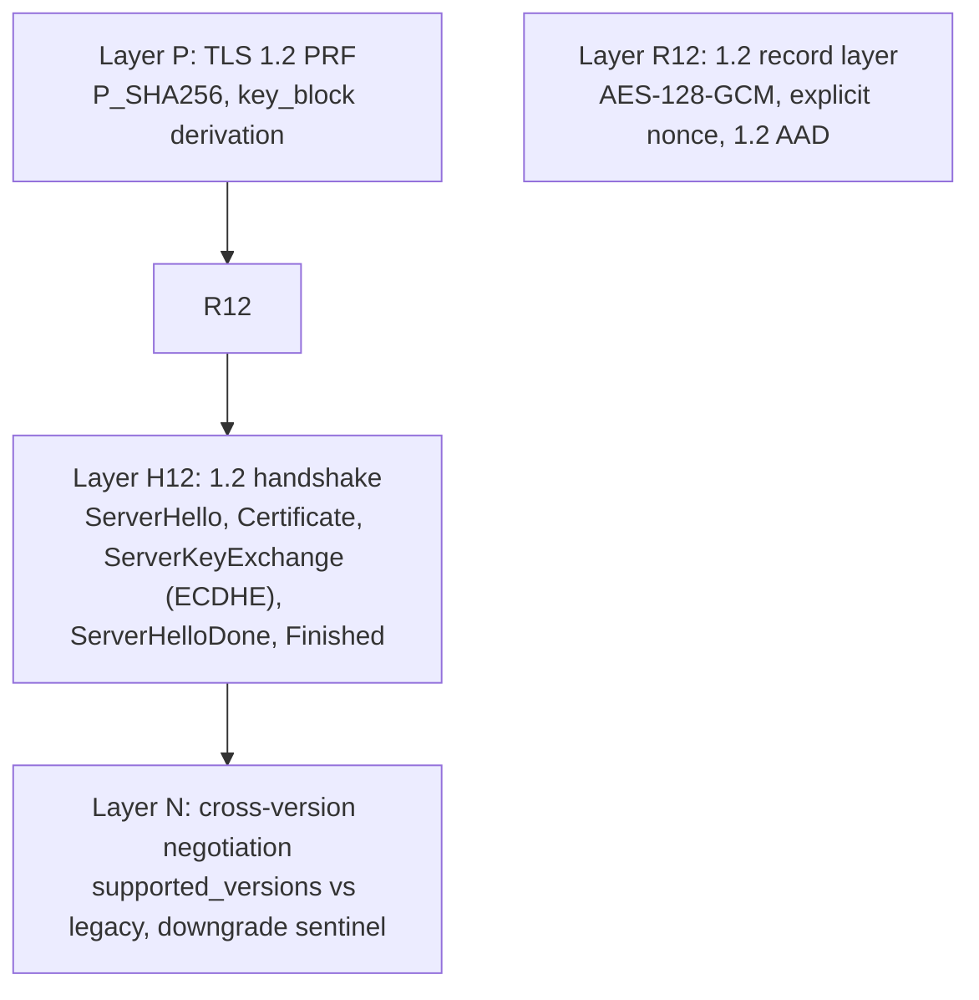

# TLS 1.2 server plan (zix 0.5.x)

TLS 1.2 is the REQUIRED MINIMUM (floor), TLS 1.3 preferred (ADR-045). The 1.3 server is landed
(see `tls-plan.md`). This plan de-risks 1.2 bottom-up, the same PoC-first approach: each layer is
proven against a deterministic oracle in `rnd/0.5.x` before it moves into `src/tls/`. Tracker rows
live here for now (the 1.3 layers are in `tls-plan.md`).

## Scope and constraints

- Offer TLS 1.2 AND 1.3, prefer 1.3, never below 1.2. 1.0 / 1.1 / SSL never offered (RFC 8996).
- 1.2 suites restricted to ECDHE-AEAD, no static-RSA key exchange, no CBC. This keeps forward
  secrecy and the SSL Labs A+ posture (ADR-045), and reuses the AES-GCM AEAD already in `record`.
- Mandatory 1.2 suite target: `TLS_ECDHE_ECDSA_WITH_AES_128_GCM_SHA256` (0xC02B), matching the
  ECDSA P-256 cert. (`TLS_ECDHE_RSA_*` only if/when RSA signing lands, which stays optional.)
- Additive only: 1.2 is a sibling path, the 1.3 path and the cleartext engines stay untouched.
  https stays on its own perf band.

## Layer map (de-risk bottom-up)

| Layer | PoC file | Oracle | Status |
| :- | :- | :- | :- |
| P | `tls12_prf_poc.zig` | the canonical TLS 1.2 PRF SHA-256 known-answer vector (100 bytes) | DONE, P_SHA256 + PRF byte-exact vs the 100-byte vector, Zig 0.16 + 0.17 |
| R12 | `tls12_record_poc.zig` | NIST AES-128-GCM KAT + byte-exact 1.2 framing | DONE, protect/deprotect (salt+explicit nonce, 13-byte AAD, explicit-nonce layout), round trip + tamper + NIST case 4, Zig 0.16 + 0.17. openssl wire cross-check at integration |
| H12 | `tls12_handshake_poc.zig` | deterministic crypto (sign/verify, ECDHE, PRF schedule); openssl wire at integration | DONE, ServerKeyExchange sign/verify + tamper, ECDHE pre_master both-sides-agree, master_secret/key_block/Finished, AEAD round trip on derived keys, Zig 0.16 + 0.17 |
| N | `tls12_negotiate_poc.zig` | byte-exact sentinel + selection logic; openssl `-tls1_2`/`-tls1_3` at integration | DONE, version select (1.3 pref, 1.2 floor, reject below) + DOWNGRD\x01 sentinel plant + client-side detect, Zig 0.16 + 0.17 |

## Key differences from 1.3 (what is genuinely new)

- Key schedule is the PRF (HMAC-based P_hash), NOT HKDF. master_secret = PRF(pre_master, "master
  secret", client_random + server_random), then key_block = PRF(master_secret, "key expansion",
  server_random + client_random). Distinct from the 1.3 HKDF-Expand-Label schedule in
  `key_schedule.zig`, so it is a separate module.
- Record layer: 1.2 AES-GCM uses an explicit 8-byte nonce on the wire and a different AAD
  (seq_num + type + version + length), versus 1.3's implicit nonce and inner-content-type AAD.
- Handshake shape: ServerHello (no EncryptedExtensions), Certificate, ServerKeyExchange (the ECDHE
  params signed with the cert key), ServerHelloDone, then the client flight, then a 1.2 Finished
  (verify_data = PRF(master_secret, "server finished", hash(handshake_messages)), 12 bytes).
- Negotiation: a 1.3-capable ClientHello carries supported_versions (0x0304 + 0x0303). When 1.3 is
  not offered, fall back to 1.2 via legacy_version 0x0303, and set the downgrade sentinel in
  ServerHello.random (RFC 8446 4.1.3) so a 1.3-capable client detects the downgrade.

## Oracle strategy

No RFC 8448 analog exists for 1.2, so: Layer P uses the published PRF known-answer vector
(deterministic), Layers R12 / H12 cross-check against `openssl s_client -tls1_2`, and the
cross-version + downgrade-sentinel behavior is checked with both `openssl -tls1_2` and a 1.3 client.

## Order

P (PRF) first, since both the master secret and the Finished verify_data ride on it. Then R12
(record), then H12 (handshake), then fold version negotiation + the downgrade sentinel into
`src/tls`. Each layer green on Zig 0.16 and 0.17 before the next.

## In src/ (additive, 1.3 path untouched, tests via lib.zig)

- `tls12_prf.zig` (PRF + master_secret + key_block + Finished)
- `tls12_record.zig` (AES-128-GCM record protect/deprotect)
- `tls12_version.zig` (version select + downgrade sentinel)
- `tls12_connection.zig` (the sans-I/O handshake ENGINE): `serverFlight1` (ServerHello + Certificate
  + ServerKeyExchange ECDHE-ECDSA + ServerHelloDone) and `serverFinish` (ClientKeyExchange -> master
  -> verify client Finished -> ChangeCipherSpec + server Finished), plus a `Connection` for app data.
  An in-memory self-test plays an honest client end to end (flight, CKE, both Finished, app-data
  round trip). This proves INTERNAL consistency, not RFC wire-correctness.

Serve-loop wiring DONE for http1 (src/tcp/http1/tls_serve.zig): the TLS path reads the ClientHello,
tries 1.3, and on error.UnsupportedTlsVersion (no 1.3 offer) branches to serveConnTls12 (the 1.2
two-phase handshake + one request). It is gated by config.tls_cert_path in server.zig, so the
cleartext EPOLL / URING path is byte-identical when TLS is off (test-runner-all 57 green, both
toolchains). The 1.2 branch is dormant for 1.3 clients (std client, curl), so it is not yet
exercised on the wire.

`ServerHello` extensions DONE: serverFlight1 now emits renegotiation_info (RFC 5746) + ec_point_
formats (RFC 8422), what openssl expects for a 1.2 ECDHE handshake (self-test still green). The
openssl `-tls1_2` command is in verify-tls12.md.

http2 1.2 branch DONE: the 1.2 engine now negotiates + emits ALPN h2 (tls12_connection serverFlight1
+ state.alpn, unit-tested), and src/tcp/http2/tls_serve.zig branches to serveConnTls12 (require
ALPN h2, then the SAME inline-mux driver over the resumable h2 state machine, no socketpair, per
ADR-052). Gated, dormant for 1.3 clients, test-runner-all 57 green both toolchains.
Note: the multiplexed `.EPOLL` / `.URING` path (tls_epoll.zig) is TLS 1.3 only, so the 1.2 h2
fallback is served by the thread-per-conn `.ASYNC` / `.POOL` / `.MIXED` path.

WIRE-VALIDATED (verify-tls12.md, user-run): openssl -tls1_2 completed the http1 handshake (cert
verified, HTTP/1.1 200 + body), curl --http2 --tls-max 1.2 got h2 ver=2 + 200, and the TLS 1.3
regression stayed clean. Fixed: the 1.2 Connection now sends close_notify (Connection.closeNotify,
wired into both serve paths) so the peer sees a clean shutdown, openssl had logged "unexpected eof"
without it. TLS 1.2 (the minimum) is now wire-proven on both engines.
