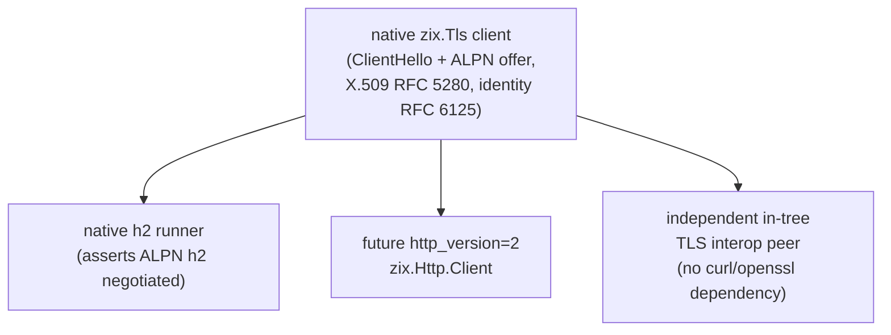

# Why zix Needs a Native TLS Client

Status: milestone (promoted 2026-06-23), part of the 0.5.x TLS work.

## Summary

zix has been a server-only TLS stack. The TLS 1.3 server handshake landed and is
verified end to end against external clients (openssl s_client, curl) and against the
standard library client (std.crypto.tls.Client). The next step, a native zix TLS
**client**, is now its own milestone. The trigger is concrete: verifying ALPN h2
negotiation needs a client that **offers** ALPN, and no available client gives zix one.

## The blocking reason: ALPN cannot be offered by what we have

The h2-over-TLS server is done: the handshake captures the client ProtocolNameList,
serverHandshake selects from `alpn_prefs`, emits the chosen protocol in
EncryptedExtensions, and the Http2 terminator hands a decrypted stream to the unchanged
h2c engine. To prove that path with an automated runner, zix needs a client that sends
`application_layer_protocol_negotiation` with `h2` in its ClientHello. Neither option provides one:

| Candidate | Can it offer ALPN h2 | Why not |
| :- | :- | :- |
| `std.crypto.tls.Client` | No | Its ClientHello is a fixed `++` extension list (supported_versions, signature_algorithms, supported_groups, psk_key_exchange_modes, key_share, server_name). There is no ALPN extension and no option to add one. |
| zix itself | No | zix is server-only today: it parses a ClientHello and replies, it does not build one. |
| curl | Yes (manual) | Works for interop, but it is an external dependency, not part of `test-runner-all`. The native h2 runner cannot depend on it. |

So the native h2 runner is **deferred** until zix can construct its own ClientHello with an
ALPN offer. That client is the missing piece, hence the promotion to a milestone.

## What the client unblocks beyond ALPN

The ALPN gap is the immediate trigger, but a verifying TLS client is needed for the wider
0.5.x scope. The current `zix.Http.Client` can already connect over TLS by trusting a
fixture cert through `HttpClientConfig.tls_ca_path` (lazy `ca_bundle.rescan`). What is
missing is a client that **verifies the chain end to end**:

1. Client-side handshake: build a ClientHello (with the ALPN offer), drive the key
   schedule, send Finished, deprotect the server flight.
2. X.509 path validation (RFC 5280): verify the certificate chain to a trust anchor.
3. Identity check (RFC 6125): match the server name against the certificate.

It reuses the shared `src/tls` primitives already built for the server (wire,
key_schedule, record, certificate), and it is configured from the existing flat
`HttpClientConfig` (an `https://` URL plus `tls_verify` / `tls_ca_path` / `tls_alpn`).

## Reuse: one client serves several callers

A single native client removes the external-tool dependency from the test runners and
gives zix an in-tree peer to cross-test the server against, the same role
`std.crypto.tls.Client` plays today for the no-ALPN paths.

## Constraints carried into the milestone

- Cleartext stays the default and the benchmark-leading path. The client is a separate
  path, it does not touch the cleartext hot path or the 1% URING perf gate. See
  the TLS decisions doc for the cleartext-default rule and the separate https perf band.
- Flat config only: trust and ALPN fields live directly on `HttpClientConfig`, no nested
  sub-config.
- Pure Zig, no C FFI: the client mirrors and cross-tests against `std.crypto.tls.Client`,
  reusing the server primitives.
