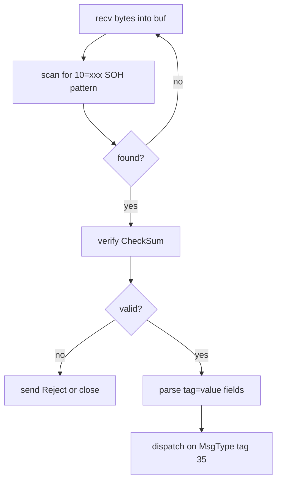
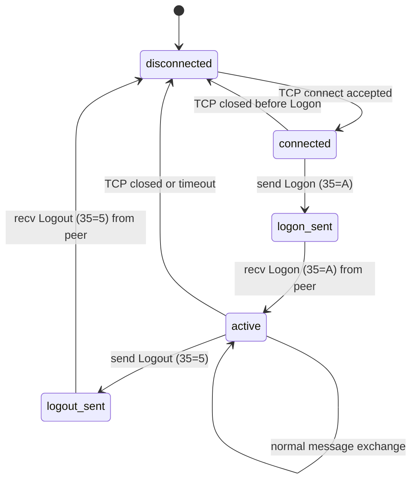
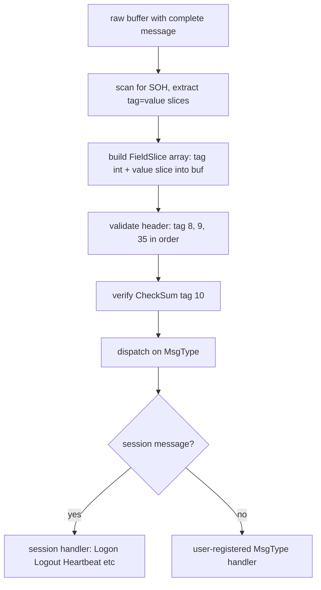

# FIX Protocol Specification — zix.Fix

## Overview

FIX (Financial Information eXchange) is a message-based protocol used in financial
markets for trade orders, executions, and market data. The wire format is a sequence
of tag=value pairs delimited by SOH (ASCII 0x01).

zix.Fix is a standalone FIX 4.x server and client. It is NOT built on top of
zix.Tcp.Server. It owns the session layer (Logon, Heartbeat, Logout) and provides
zero-copy field access to the handler.

This specification covers FIX 4.2, 4.4, and the common subset of 4.0 and 4.1.
FIX 5.0 and FIXT 1.1 (which split transport from application) are out of scope initially.

See also: rnd/tcp_server_specification.md for the underlying raw TCP primitives.

---

## Definition of Done

### PoC (rnd/)

- [x] SOH-delimited framing: parse and write tag=value pairs separated by 0x01
- [x] Standard header fields: BeginString (8), BodyLength (9), MsgType (35), SenderCompID (49), TargetCompID (56), MsgSeqNum (34), SendingTime (52)
- [x] Standard trailer: CheckSum (10) computed as sum of all bytes mod 256, 3-digit zero-padded
- [x] Session messages: Logon (35=A), Logout (35=5), Heartbeat (35=0), TestRequest (35=1)
- [x] Session state: Logon handshake, application message echo, Logout close
- [x] All 3 dispatch models: POOL, ASYNC, MIXED
- [x] FIX client: connect, Logon, send application messages, recv echo, Logout
- [x] All 4 test tiers pass (unit 15, integration 2, behaviour 3, edge 6 — 26 total)

PoC go/no-go passed (2026-05-20).

### src/ (src/tcp/fix/)

- [x] `zix.Fix` public namespace
- [x] `FixServer.run()` — ASYNC, POOL, MIXED dispatch (no handler param: session logic is internal)
- [x] `FixClient` — connect, logon, send, recv, logout
- [x] `FixServerConfig` and `FixClientConfig` with logger field
- [x] Zero-copy field helpers: `parseFields`, `buildMessage`, `getField`, `findMessageEnd`, `verifyChecksum`
- [x] Logger wiring: `system()` on server lifecycle, `session()` per message in `serveConn`
- [x] All 4 test tiers pass (2026-05-23)
- [ ] Session messages: ResendRequest (35=2), SequenceReset (35=4), Reject (35=3)
- [ ] Full session state machine: not connected, connected, logged on, logged out
- [ ] Sequence number management: inbound and outbound, gap detection, resend request
- [ ] Heartbeat timer: send Heartbeat at HeartBtInt (tag 108) interval; send TestRequest on missed heartbeat
- [ ] User handler registration per MsgType (tag 35)
- [ ] Performance: >= 200k messages/s throughput (server echo) at c10

src/ basic implementation complete (2026-05-23). Advanced session features (ResendRequest, SequenceReset, heartbeat timer) are pending.

---

## FIX Version Coverage

| Version | BeginString value | Notes |
| :- | :- | :- |
| FIX 4.0 | FIX.4.0 | baseline, rare today |
| FIX 4.1 | FIX.4.1 | adds ResendRequest and SequenceReset |
| FIX 4.2 | FIX.4.2 | most common legacy version |
| FIX 4.4 | FIX.4.4 | adds XmlData, no structural change |
| FIX 5.0 | FIXT.1.1 (transport) | separates transport from app layer; out of scope |

zix.Fix targets FIX 4.2 as primary. Tag values and session logic are compatible
with 4.0, 4.1, and 4.4 without structural changes.

---

## Wire Format

A FIX message is a sequence of tag=value pairs, each followed by SOH (0x01):

```
8=FIX.4.2<SOH>9=65<SOH>35=A<SOH>49=SENDER<SOH>56=TARGET<SOH>34=1<SOH>52=20240101-12:00:00<SOH>98=0<SOH>108=30<SOH>10=123<SOH>
```

Key structural rules:

- Tag 8 (BeginString) must be first
- Tag 9 (BodyLength) must be second: byte count from tag 35 up to and including the SOH before tag 10
- Tag 10 (CheckSum) must be last: sum of all bytes in the message (including all SOH) mod 256, formatted as 3 zero-padded decimal digits
- SOH (0x01) is the field delimiter, not a record separator — it appears after every value including the last field before tag 10

---

## Message Framing

FIX framing is delimiter-based, not length-prefix:



The BodyLength field (tag 9) is used as a sanity check, not for primary framing.
Primary framing relies on finding the tag 10 terminator pattern.

---

## Standard Header and Trailer Fields

### Header (must appear first, in order)

| Tag | Name | Type | Notes |
| :- | :- | :- | :- |
| 8 | BeginString | string | FIX.4.2 |
| 9 | BodyLength | int | bytes from tag 35 to SOH before tag 10 |
| 35 | MsgType | string | single character or short string |
| 49 | SenderCompID | string | sender identifier |
| 56 | TargetCompID | string | receiver identifier |
| 34 | MsgSeqNum | int | monotonically increasing per session |
| 52 | SendingTime | UTCTimestamp | YYYYMMDD-HH:MM:SS or with milliseconds |

### Trailer (must appear last)

| Tag | Name | Type | Notes |
| :- | :- | :- | :- |
| 10 | CheckSum | string | 3-digit decimal, sum of all bytes mod 256 |

---

## Session Message Types

| MsgType | Value | Direction | Purpose |
| :- | :- | :- | :- |
| Logon | A | both | establish session, exchange parameters |
| Logout | 5 | both | terminate session gracefully |
| Heartbeat | 0 | both | keepalive; echoes TestReqID if present |
| TestRequest | 1 | both | probe; receiver must respond with Heartbeat |
| ResendRequest | 2 | both | request retransmission of missed messages |
| SequenceReset | 4 | both | reset sequence to recover from gap |
| Reject | 3 | both | session-level reject of malformed message |

---

## Session State Machine



---

## Sequence Number Management

Both sides maintain two counters:

- MsgSeqNum sent: increments on every outbound message (including session messages)
- MsgSeqNum expected: the next expected inbound sequence number

On receiving a message with MsgSeqNum higher than expected:
send ResendRequest (tag 7 = BeginSeqNo, tag 16 = EndSeqNo = 0 for all missing).

On receiving a ResendRequest:
retransmit stored messages or send SequenceReset-GapFill for messages that cannot be replayed.

zix.Fix (when sequence number management is implemented) will store sent messages in a ring buffer for potential retransmission.
Application handlers must treat retransmitted messages idempotently.

---

## Heartbeat Timer

The Logon message carries HeartBtInt (tag 108), the interval in seconds.

zix.Fix (when heartbeat timer is implemented) will run a timer per connection:

- If no message received in HeartBtInt seconds: send TestRequest (tag 112 = TestReqID = timestamp)
- If no response to TestRequest within HeartBtInt: close the connection
- Send Heartbeat proactively when no application messages were sent in HeartBtInt seconds

---

## CheckSum Computation

```
checksum = 0
for each byte in message (before tag 10 value):
    checksum = (checksum + byte) mod 256
format as: "10=%03d<SOH>" % checksum
```

The sum includes all bytes in the message including all SOH delimiters,
from the first byte of tag 8 through and including the SOH after the tag 10 equals sign.

---

## Dispatch Model

All 3 dispatch models from DispatchModel (same enum, same backing values as zix.Tcp.Server):

| Model | Description |
| :- | :- |
| POOL | N accept threads push connections to ConnQueue; M session threads handle each connection |
| ASYNC | single accept thread, io.async per connection |
| MIXED | N accept threads each use io.async directly |

FIX sessions are long-lived and stateful (sequence numbers, heartbeat timer, message store).
POOL is the natural default because each pool thread owns a session for its lifetime.
ASYNC and MIXED work; session state is stack-allocated inside `serveConn` per connection.

---

## Message Parsing

Zero-copy field extraction: scan the raw buffer for SOH delimiters, record tag and value offsets.



No heap allocation during parsing. Field offsets point into the read buffer.
The user handler receives a FixMessage with zero-copy field access.

---

## User-Facing API

Server — session logic is entirely internal to `serveConn`. No handler registration needed:

```zig
var server = try zix.Fix.Server.init(.{
    .io             = process.io,
    .ip             = "0.0.0.0",
    .port           = 9400,
    .comp_id        = "SERVER",
    .dispatch_model = .ASYNC,
    .logger         = null,
});
defer server.deinit();
try server.run();
```

Client — connect, logon, exchange messages, logout:

```zig
var client = try zix.Fix.Client.init(io, .{
    .ip             = "127.0.0.1",
    .port           = 9400,
    .comp_id        = "CLIENT",
    .target_comp_id = "SERVER",
});
defer client.deinit(io);
const fields = [_]zix.Fix.BuildField{
    .{ .tag = 35,  .value = "D" },
    .{ .tag = 55,  .value = "AAPL" },
    .{ .tag = 38,  .value = "100" },
};
try client.send(io, &fields);
var buf: [4096]u8 = undefined;
const n = try client.recv(io, &buf);
_ = zix.Fix.parseFields(buf[0..n]);
```

Zero-copy field helpers (pub from `zix.Fix`):

```zig
zix.Fix.parseFields(buf)          // slice of Field{tag, value} pointing into buf
zix.Fix.getField(fields, tag)     // returns value slice or null
zix.Fix.buildMessage(out, fields) // writes tag=value<SOH>... into out
zix.Fix.findMessageEnd(buf)       // returns end offset when tag 10 terminator is found
zix.Fix.verifyChecksum(buf, n)    // returns true if checksum matches
```

Note: user handler registration per MsgType (tag 35) is not yet implemented. The current src/ handles Logon, Logout, Heartbeat, TestRequest, and echoes all other message types internally in `serveConn`.

---

## Implemented File Structure

| File | Contents | Status |
| :- | :- | :- |
| src/tcp/fix/Fix.zig | public namespace, all re-exports | done |
| src/tcp/fix/core.zig | parseFields, buildMessage, checksum, serveConn, inline unit tests | done |
| src/tcp/fix/server.zig | FixServer — ASYNC, POOL, MIXED dispatch | done |
| src/tcp/fix/client.zig | FixClient — connect, logon, send, recv, logout | done |
| src/tcp/fix/config.zig | FixServerConfig, FixClientConfig (includes logger field) | done |
| src/tcp/fix/session.zig | full session state machine, sequence numbers, heartbeat timer | not started |
| src/tcp/fix/message.zig | FixMessage with user-registered MsgType handlers | not started |

Note: `session.zig` and `message.zig` are pending (advanced session features). Current session logic is inline in `core.zig` / `serveConn`.

---

## Zig std Coverage

| std API | Available | Notes |
| :- | :- | :- |
| TCP connect and listen | yes | std.net, same as zix.Tcp.Server |
| SOH delimiter scanning | yes | std.mem.indexOfScalar(u8, buf, 0x01) |
| Integer parsing for tag values | yes | std.fmt.parseInt |
| UTCTimestamp formatting | yes | std.fmt with manual calendar math or std.time |
| Timer / sleep | yes | std.Io.sleep, std.Io.Clock |
| Mutex and Condition | yes | std.Io.Mutex, std.Io.Condition |
| Atomic values | yes | std.atomic.Value |

---

## What std Does Not Provide

| Gap | Must build |
| :- | :- |
| FIX message framing (SOH scan + tag 10 terminator) | small, in message.zig |
| CheckSum computation and verification | trivial byte-sum |
| FIX session state machine | session.zig |
| Sequence number tracking | session.zig |
| Heartbeat timer per session | session.zig with std.Io.sleep |
| Message store for retransmission | ring buffer in session.zig |
| BodyLength computation | byte count between tag 35 and tag 10 |
| UTCTimestamp parser (tag 52) | simple string scan |

---

## Performance Targets

FIX is a low-fan-out protocol: each session is one TCP connection, typically one sender.
Throughput is measured per session (single connection), not aggregate.

| Scenario | Target |
| :- | :- |
| Echo server (single session, POOL) | >= 200k msg/s |
| Parse and dispatch latency per message | < 5µs |
| CheckSum computation (1KB message) | < 500ns |
| Logon handshake round trip | < 1ms (loopback) |
| Heartbeat timer accuracy | within 100ms of configured interval |

---

## Not Yet Covered

| Topic | Notes |
| :- | :- |
| FIX 5.0 and FIXT 1.1 | separates BeginString FIX.5.0 (app) from FIXT.1.1 (transport) |
| FIX-over-TLS | encrypt the TCP connection; standard practice at many brokers |
| FIX-over-WebSocket | rare but used for browser-based trading tools |
| Market data (tag 35=W, X) | large repeating groups; needs group parser |
| Repeating groups | tag 454, 555, etc.; group starts with delimiter tag and count |
| FIX Binary (FAST encoding) | FIXT binary transport; completely different framing |
| FIX Orchestra | machine-readable FIX spec; can drive code generation |
| Encryption within FIX (tag 98=1,2,3) | EncryptMethod field; not standard SSL; rarely used |
| FIX session persistence | store sent messages to disk for crash recovery and replay |
| Multi-session multiplexing | one TCP connection carrying multiple virtual sessions |

---

## PoC

Go/no-go passed 2026-05-20. All 4 test tiers complete.

### Files

| File | Tests | Contents |
| :- | :- | :- |
| `rnd/fix_poc_core.zig` | (library) | parseFields, buildMessage, computeChecksum, verifyChecksum, serveConn |
| `rnd/fix_poc_server.zig` | (binary) | echo server — `--model async\|pool\|mixed`, `--ip`, `--port` |
| `rnd/fix_poc_client.zig` | (binary) | Logon, NewOrderSingle, recv echo, Logout |
| `rnd/fix_unit_test.zig` | 15 pass | checksum, framing, parseFields, buildMessage, getField |
| `rnd/fix_integ_test.zig` | 2 pass | Logon handshake + echo round-trip, Logout |
| `rnd/fix_behav_test.zig` | 3 pass | session state transitions, Heartbeat response |
| `rnd/fix_edge_test.zig` | 6 pass | malformed message, bad checksum, truncated SOH, overflow |

All test files live in `rnd/` alongside `fix_poc_core.zig`. `zig test file.zig` treats the file's directory as the module root — `@import("fix_poc_core.zig")` only resolves locally.

### Go/no-go verification (two terminals)

Terminal 1 — start the echo server (ASYNC by default, port 9400):

```sh
zig run rnd/fix_poc_server.zig
```

Terminal 2 — connect with the client:

```sh
zig run rnd/fix_poc_client.zig
```

Expected client output: `sent Logon`, `recv Logon from server`, `sent NewOrderSingle`, `recv echo 35=D symbol=AAPL qty=100`, `sent Logout`, `recv Logout — session complete`.

### Key pitfall: readSliceShort blocks with a large buffer on live TCP

`std.Io.Reader.readSliceShort(buf)` loops internally calling `netRead` until the buffer is full or EOF. With a 16 KB buffer and a 200-byte FIX message, it reads the 200 bytes then calls `netRead` again — which blocks because the socket buffer is empty. Both sides end up waiting: deadlock.

Fix: use `takeByte` in a loop for delimiter-based framing. The reader's internal buffer absorbs the full TCP segment on the first syscall; subsequent `takeByte` calls drain from it with no additional syscalls.

```zig
while (true) {
    if (findMessageEnd(recv_buf[0..recv_len])) |end| break end;
    recv_buf[recv_len] = try rd.interface.takeByte();
    recv_len += 1;
}
```

This applies to any delimiter-based protocol on raw `std.Io.Reader`. `readSliceShort` is not "return after first available bytes" — it returns only after the provided buffer is full, or on EOF. Use `takeByte` (or `readSliceAll` with exact lengths) for framing.

### Session scope in PoC vs src/

The PoC implements the session message subset needed for go/no-go: Logon, Logout, Heartbeat, TestRequest, and application message echo. ResendRequest, SequenceReset, Reject, and the heartbeat timer are deferred to the src/ implementation.
