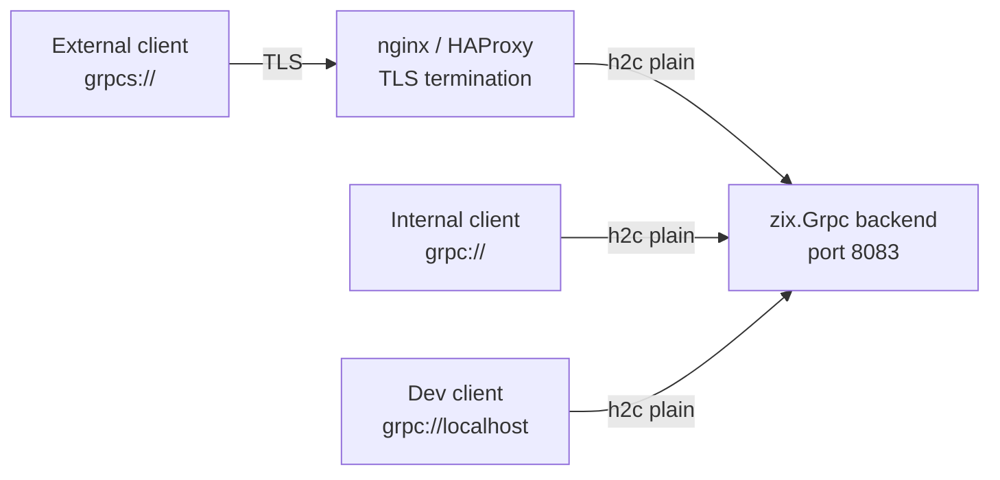
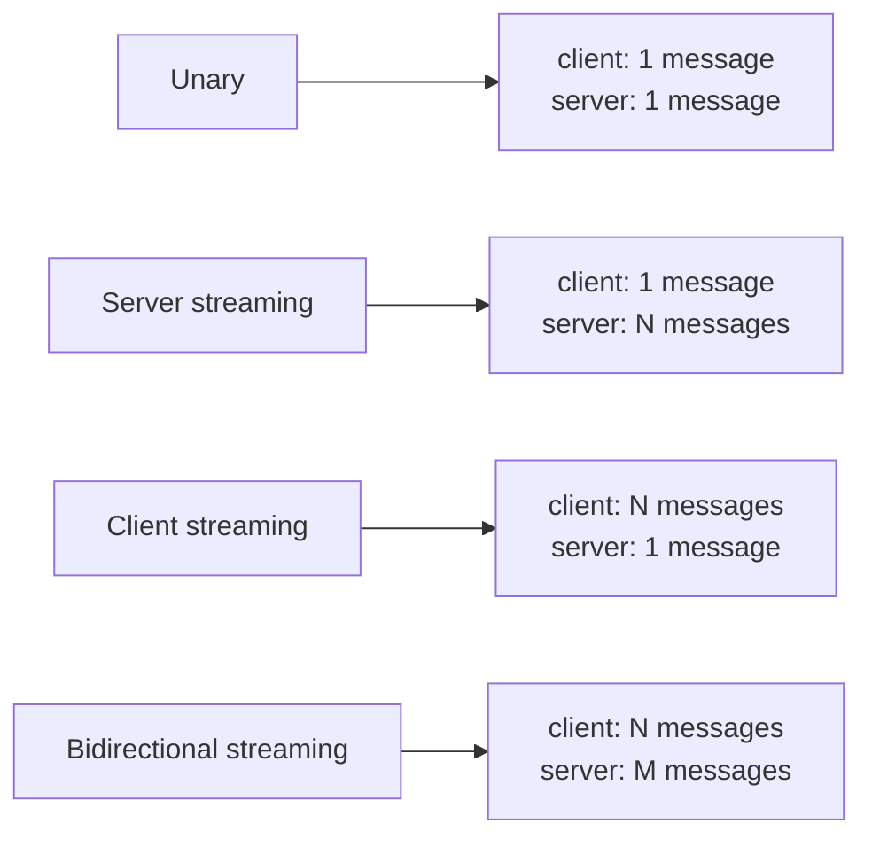
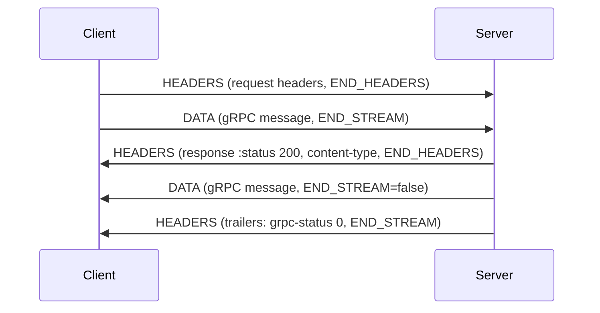
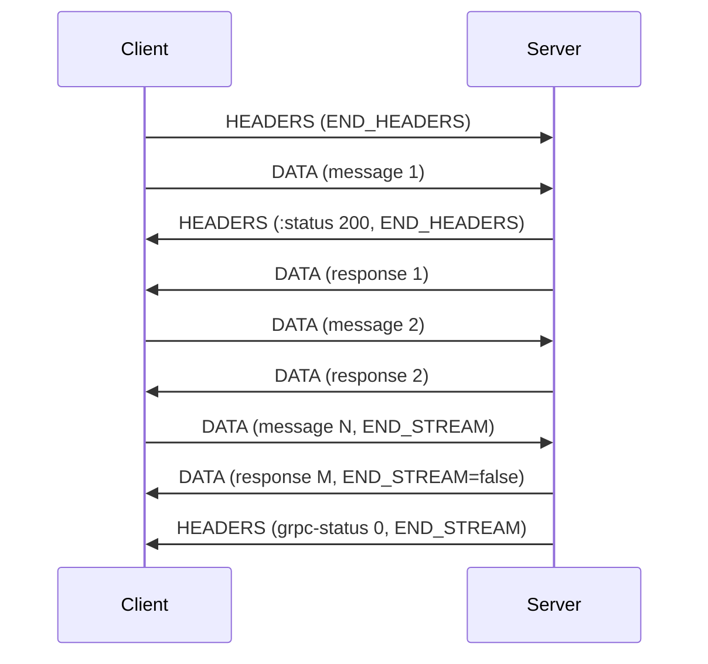
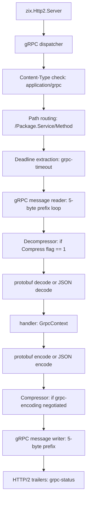

# gRPC Specification — zix.Grpc

## Overview

gRPC is an RPC framework built on HTTP/2 (RFC 7540 / RFC 9113). It uses Protocol
Buffers (protobuf) for serialization by default and HTTP/2 for transport.

gRPC requires HTTP/2. It cannot run over HTTP/1.1 except via the gRPC-Web adaptation
(a restricted subset for browser use). zix.Grpc is built on top of zix.Http2.

In production, gRPC uses TLS (ALPN "h2"). For internal services and development,
gRPC can run over h2c (cleartext HTTP/2). zix.Grpc must support both.

HTTP/2 PoC prerequisite is complete (2026-05-22): h2c direct, HPACK+Huffman, all frame types, 29 tests pass. HPACK dynamic table eviction closed 2026-05-22.
`zix.Http2` src/ implemented (2026-05-24): standalone public API at `src/tcp/http2/`. gRPC src/ imports it for h2c transport.
gRPC PoC can proceed now — h2c only, TLS src/ not required for PoC.

---

## Definition of Done

PoC scope (covered by `rnd/grpc_poc_*.zig`):

- [x] h2c unary RPC server (no client needed for PoC)
- [x] gRPC framing: 5-byte length-prefix read and write (compress flag + big-endian message length)
- [x] Content-Type detection: `application/grpc+proto` vs `application/grpc+json`
- [x] Path routing: `/Package.Service/Method` parsing
- [x] grpc-status and grpc-message HTTP/2 trailers (HEADERS frame with END_STREAM)
- [x] Protobuf minimal codec: varint encode/decode, string and int32 field encode/decode
- [x] JSON-over-gRPC via std.json
- [x] Error path: trailers-only response (grpc-status != 0, no DATA frame)
- [x] All 4 test tiers pass (unit 22, integration 3, behaviour 3, edge 5 — 33 total)

src/ implementation scope (`src/tcp/http2/grpc/`, done 2026-05-25):

Architecture: `src/tcp/http2/grpc/` imports `zix.Http2` for h2c transport. h2 (TLS) mode is internal under `src/tcp/http2/grpc/h2/` (blocked on tls_specification). Public namespace exposed as `zix.Grpc` from `src/zix.zig`.

- [x] h2c (cleartext) gRPC server and client (full, imports `zix.Http2`)
- [ ] h2 (TLS) gRPC server and client (blocked on tls_specification, not started)
- [x] All 4 RPC types: unary, server streaming, client streaming, bidirectional streaming (buffered design: all client DATA buffered before handler call)
- [ ] Deadline propagation: grpc-timeout header parsed via `parseTimeout`, but not yet wired to a handler deadline or `ctx.timedOut()` equivalent
- [ ] Compression: compress flag always 0 (no grpc-encoding negotiation)
- [x] Full error mapping: `GrpcStatus` enum OK=0 to UNAUTHENTICATED=16; trailers-only error pattern
- [x] Minimal protobuf codec: varint encode/decode, string and int32 fields, `MessageReader` (`proto.zig`); full generated-code codec not provided
- [x] All 4 test tiers pass (unit ~30, integration 7, behaviour 7, edge 12)
- [ ] Performance benchmark: >= 80k unary RPC/s at c100 (not yet measured)

---

## RFC and Specification Reference

| Document | Scope |
| :- | :- |
| gRPC Core Concepts (grpc.io) | service model, streaming types, deadlines |
| gRPC over HTTP/2 (grpc.io/docs/guides/wire) | wire protocol, framing, headers, trailers |
| RFC 9113 | HTTP/2 transport |
| RFC 7541 | HPACK header compression |
| RFC 9110 | HTTP semantics (methods, status codes) |
| Protocol Buffers Language Guide v3 | serialization format |

---

## Deployment Topology

gRPC does not mandate TLS. The choice depends on where clients are relative to the server.

### When to use grpcs:// vs grpc://

| Scenario | Transport | Notes |
| :- | :- | :- |
| Internet-facing API (mobile, external partners) | `grpcs://` (TLS) | Mandatory — network is untrusted |
| Internal microservices (same cluster, same DC) | `grpc://` h2c | Standard in Kubernetes + service mesh |
| Local development / testing | `grpc://` h2c | Simplest; no cert management |
| Public port with no proxy in front | `grpcs://` (TLS) | Requires TLS src/ implementation |

**Rule:** implement TLS src/ only if you need a public-facing gRPC port with no proxy. For everything else, let the proxy handle TLS and keep the backend h2c.

### Reverse proxy: nginx (grpc_pass)

nginx 1.13.10+ supports the `grpc_pass` directive. It terminates TLS from clients (`grpcs://`) and forwards to the backend over h2c:

```nginx
server {
    listen 443 ssl http2;
    ssl_certificate     /path/to/cert.pem;
    ssl_certificate_key /path/to/key.pem;

    location / {
        grpc_pass grpc://127.0.0.1:8083;
    }
}
```

The client connects with `grpcs://your-domain:443`. The backend (zix.Grpc) speaks plain h2c on port 8083 and never sees TLS.

For h2c-only (no TLS at nginx either):

```nginx
server {
    listen 8080 http2;

    location / {
        grpc_pass grpc://127.0.0.1:8083;
    }
}
```

### Reverse proxy: HAProxy

HAProxy 1.9+ supports gRPC via HTTP/2 frontend + backend:

```
frontend grpc_front
    bind *:443 ssl crt /path/to/cert.pem alpn h2,http/1.1
    default_backend grpc_back

backend grpc_back
    server app1 127.0.0.1:8083 proto h2
```

HAProxy terminates TLS using ALPN `h2`, then forwards plain HTTP/2 frames to the backend.

### Direct connection (no proxy)

Connect directly to the server with `--plaintext` (no TLS):

```sh
grpcurl -plaintext 127.0.0.1:8083 list
grpcurl -plaintext 127.0.0.1:8083 helloworld.Greeter/SayHello
```

From a Go client:
```go
conn, _ := grpc.Dial("127.0.0.1:8083", grpc.WithTransportCredentials(insecure.NewCredentials()))
```

From curl (JSON-over-gRPC with 5-byte prefix):
```sh
printf '\x00\x00\x00\x00\x0f{"name":"world"}' | \
  curl --http2-prior-knowledge -s -X POST \
    -H "content-type: application/grpc+json" \
    --data-binary @- \
    http://127.0.0.1:8083/helloworld.Greeter/SayHello | xxd
```

### Topology diagram



---

## gRPC Transport Layer

gRPC maps onto HTTP/2 streams:

- One HTTP/2 stream per RPC call
- Request: client sends HEADERS then zero or more DATA frames
- Response: server sends HEADERS, zero or more DATA frames, then HEADERS (trailers)
- Each DATA frame carries one or more gRPC messages, each length-prefixed

### Required HTTP/2 headers (request)

| Header | Value |
| :- | :- |
| :method | POST |
| :scheme | http (h2c) or https (h2) |
| :path | /PackageName.ServiceName/MethodName |
| :authority | host:port |
| content-type | application/grpc (must start with application/grpc) |
| grpc-timeout | optional: timeout in format NUnit (e.g. 5S, 100m) |
| grpc-encoding | optional: compression (gzip or identity) |
| grpc-accept-encoding | optional: accepted compression schemes |

### Required HTTP/2 headers (response)

| Header | Value | Frame type |
| :- | :- | :- |
| :status | 200 | HEADERS |
| content-type | application/grpc | HEADERS |
| grpc-status | 0..16 | HEADERS (trailers, END_STREAM) |
| grpc-message | UTF-8 error message | HEADERS (trailers, optional) |

---

## gRPC Message Frame

Each gRPC message is prefixed by a 5-byte header:

```
+----------+-------------------------------+
| Compress | Message Length (4 bytes, BE)  |
|  Flag(1) |                               |
+----------+-------------------------------+
| Message payload (protobuf bytes)         |
+------------------------------------------+
```

Compress flag: 0 = no compression, 1 = compressed (algorithm in grpc-encoding header).

Multiple gRPC messages may appear back-to-back within a single HTTP/2 DATA frame,
or a single message may span multiple DATA frames. The receiver must handle both cases.

---

## RPC Types



All 4 types use the same HTTP/2 stream. The difference is in how many DATA frames
each side sends before setting END_STREAM.

### Unary RPC lifecycle



### Bidirectional streaming lifecycle



---

## gRPC Status Codes

| Code | Value | Meaning |
| :- | :- | :- |
| OK | 0 | success |
| CANCELLED | 1 | client cancelled the call |
| UNKNOWN | 2 | unknown error |
| INVALID_ARGUMENT | 3 | client sent invalid argument |
| DEADLINE_EXCEEDED | 4 | timeout before completion |
| NOT_FOUND | 5 | entity not found |
| ALREADY_EXISTS | 6 | entity already exists |
| PERMISSION_DENIED | 7 | caller lacks permission |
| RESOURCE_EXHAUSTED | 8 | out of capacity |
| FAILED_PRECONDITION | 9 | invalid state for operation |
| ABORTED | 10 | concurrency conflict |
| OUT_OF_RANGE | 11 | value out of range |
| UNIMPLEMENTED | 12 | method not implemented |
| INTERNAL | 13 | internal server error |
| UNAVAILABLE | 14 | service temporarily unavailable |
| DATA_LOSS | 15 | unrecoverable data loss |
| UNAUTHENTICATED | 16 | missing or invalid credentials |

---

## Deadline Propagation

The client sends a grpc-timeout header with a value like "5S" (5 seconds) or "100m" (100 milliseconds).

Format: integer followed by unit character:
- H: hours
- M: minutes
- S: seconds
- m: milliseconds
- u: microseconds
- n: nanoseconds

The server parses this and sets a deadline on the handler context.
The handler checks `ctx.timedOut()` between steps and returns DEADLINE_EXCEEDED if elapsed.

---

## Compression

gRPC compression works per-message (not per-stream):

- Client advertises supported algorithms in grpc-accept-encoding
- Server selects algorithm and announces in grpc-encoding
- Each compressed message sets the Compress flag to 1 in the gRPC frame header
- Uncompressed messages set it to 0 (both sides can mix within a stream)

For zix: implement gzip (std.compress.flate) as the only non-identity algorithm initially.

---

## Protobuf

Protocol Buffers (proto3) is the default serialization format for gRPC.
The wire format is a binary tag-length-value encoding.

| Wire type | Value | Used for |
| :- | :- | :- |
| VARINT | 0 | int32, int64, uint32, uint64, sint32, sint64, bool, enum |
| I64 | 1 | fixed64, sfixed64, double |
| LEN | 2 | string, bytes, embedded messages, repeated fields |
| I32 | 5 | fixed32, sfixed32, float |

No std support for protobuf. Options:

Option A: generate Zig code from .proto files (requires a protoc plugin or standalone generator)
Option B: provide a minimal runtime encoder/decoder for fixed schemas
Option C: use JSON serialization with content-type application/grpc+json (non-standard but simpler)

For the PoC phase, Option C (JSON) removes the protobuf dependency and allows testing
the gRPC transport layer before building the serialization layer.

---

## Zig std Coverage

| std API | Available | Notes |
| :- | :- | :- |
| HTTP/2 transport | no | must build (see http_2_specification) |
| gRPC framing | no | must build |
| gRPC status codes | no | must build |
| protobuf encoder/decoder | no | must build or generate |
| std.compress.flate | yes | gzip compression for messages |
| std.json | yes | for JSON-over-gRPC PoC |

---

## What std Does Not Provide

| Gap | Must build |
| :- | :- |
| HTTP/2 connection and stream management | prerequisite |
| gRPC framing layer (5-byte prefix) | small, on top of HTTP/2 DATA frames |
| HPACK header encoding/decoding | part of HTTP/2 |
| grpc-timeout parser | small utility |
| gRPC status code type | small enum |
| Trailer-only response (error before body) | special HTTP/2 HEADERS with END_STREAM |
| Protobuf v3 encoder and decoder | significant; can defer with JSON PoC |
| .proto file parser and Zig codegen | optional; manual struct definitions work for small schemas |

---

## Implementation Components



Planned file structure:

| File | Contents | Status |
| :- | :- | :- |
| `src/tcp/http2/grpc/Grpc.zig` | public namespace — re-exports all public types | done (2026-05-25) |
| `src/tcp/http2/grpc/config.zig` | `GrpcServerConfig`, `GrpcClientConfig` | done (2026-05-25) |
| `src/tcp/http2/grpc/server.zig` | `GrpcServer` — ASYNC, POOL, MIXED dispatch; standalone serveGrpcConn loop | done (2026-05-25) |
| `src/tcp/http2/grpc/client.zig` | `GrpcClient` — openStream, sendMessage, endStream, recvResponse, unary | done (2026-05-25) |
| `src/tcp/http2/grpc/frame.zig` | 5-byte prefix read/write; sendGrpcHeaders/Data/Trailer/Error | done (2026-05-25) |
| `src/tcp/http2/grpc/core.zig` | `GrpcContext`, `HandlerFn`, `serveGrpcConn`, `parsePath`, `detectContentType` | done (2026-05-25) |
| `src/tcp/http2/grpc/proto.zig` | varint encode/decode, `encodeString`, `encodeInt32`, `encodeDouble`, `decodeDouble`, `MessageReader` | done (2026-05-25) |
| `src/tcp/http2/grpc/status.zig` | `GrpcStatus` enum (OK=0 to UNAUTHENTICATED=16) | done (2026-05-25) |
| `src/tcp/http2/grpc/timeout.zig` | `parseTimeout` — grpc-timeout header parser | done (2026-05-25) |
| `src/tcp/http2/grpc/h2/` | h2 TLS internals — blocked on tls_specification, do not start | blocked |
| `src/proto/` | full protobuf generated-code encoder and decoder (separate module) | not started |

---

## Performance Targets

| Scenario | Target |
| :- | :- |
| Unary RPC (h2c, c100) | >= 80k RPC/s |
| Unary RPC (h2c, c1000) | >= 120k RPC/s |
| Server streaming (large payload, c10) | >= 800 MB/s aggregate |
| gRPC message framing overhead | < 100ns per message |
| grpc-timeout parse | < 50ns |

---

## PoC

Complete (2026-05-22). h2c direct, no TLS needed. Builds on `rnd/http2_poc_core.zig`.

### Files

| File | Purpose |
| :- | :- |
| `rnd/grpc_poc_core.zig` | gRPC status codes, 5-byte prefix, path parser, content-type, send functions, protobuf codec |
| `rnd/grpc_poc_server.zig` | SayHello (proto + JSON), EchoJSON (JSON echo); default 127.0.0.1:8083 |
| `rnd/grpc_unit_test.zig` | 22 tests: varint, proto fields, MessageReader, prefix, path, content-type |
| `rnd/grpc_integ_test.zig` | 3 tests: proto round-trip, JSON round-trip, UNIMPLEMENTED |
| `rnd/grpc_behav_test.zig` | 3 tests: :status=200, grpc-status=0 in trailer, content-type header |
| `rnd/grpc_edge_test.zig` | 5 tests: bad content-type, short body, zero-length message, unknown path, truncated body |

All 33 tests pass.

### What the PoC reuses from the HTTP/2 PoC

| From `http2_poc_core.zig` | Purpose |
| :- | :- |
| `writeFrameHeader`, `fdWriteAll`, `recvExact` | raw frame I/O |
| `HpackEncoder` | encode response headers and trailers |
| `serveConn`, `HandlerFn` | connection loop entry point |
| `FT_*`, `FLAG_*`, `ERR_*` constants | frame type and flag values |

### Key pitfall: sendResponse is NOT usable for gRPC

`sendResponse` sends `content-length` and sets `FLAG_END_STREAM` on the DATA frame — which closes the stream immediately. gRPC requires three separate steps:

1. HEADERS frame (no END_STREAM): `:status 200`, `content-type: application/grpc+proto`
2. DATA frame (no END_STREAM): 5-byte gRPC prefix + message body
3. HEADERS frame (FLAG_END_STREAM): `grpc-status: 0`, `grpc-message` (trailers)

The gRPC PoC provides its own `sendGrpcHeaders`, `sendGrpcData`, `sendGrpcTrailer` built from `writeFrameHeader` + `fdWriteAll` directly.

### Key pitfall: varint decodeVarint shift overflow

`shift: u6` overflows at runtime when doing `shift += 7` while shift = 63 (63 + 7 = 70 > 63 max), before the overflow guard fires.

Fix — check before incrementing:
```zig
if (shift > 56) return error.VarintOverflow;
shift += 7;
```

This matches the pattern used in `http2_poc_core.zig decodeInt` and caps max shift at 56 (supports 9-byte varints = values up to 2^63).

### Key pitfall: main() signature and allocator in Zig 0.16

`std.heap.GeneralPurposeAllocator` does not exist in Zig 0.16. `std.process.argsAlloc` is not available either.

Use the pattern from `http2_poc_server.zig`:

```zig
pub fn main(process: std.process.Init) !void {
    var args = std.process.Args.Iterator.init(process.minimal.args);
    _ = args.next();
    const io = process.io;
    // ...
}
```

Use `std.heap.smp_allocator` for one-off allocations (e.g. `std.json.parseFromSlice`).

### What the PoC does NOT cover

| Missing | Notes |
| :- | :- |
| gRPC client | only server in PoC |
| Streaming RPCs | only unary; server/client/bidirectional streaming deferred to src/ |
| grpc-timeout header | deadline propagation not implemented |
| Compression (compress flag = 1) | all messages use compress = 0 (uncompressed) |
| gRPC reflection | needed for grpcurl without a .proto file |
| h2c upgrade path | HTTP/1.1 Upgrade: h2c available in http2_poc_core.zig; gRPC server uses h2c direct only |

### Go/no-go verification

Terminal 1 — start the server (any model):
```sh
zig run rnd/grpc_poc_server.zig                   # ASYNC (default)
zig run rnd/grpc_poc_server.zig -- --model pool   # POOL
zig run rnd/grpc_poc_server.zig -- --model mixed  # MIXED
```

Terminal 2 — integration tests double as go/no-go:
```sh
zig test rnd/grpc_integ_test.zig
```

Or verify JSON-over-gRPC directly with curl (5-byte prefix must be present):
```sh
printf '\x00\x00\x00\x00\x0f{"name":"world"}' | \
  curl --http2-prior-knowledge -s -X POST \
    -H "content-type: application/grpc+json" \
    --data-binary @- \
    http://127.0.0.1:8083/helloworld.Greeter/SayHello | xxd
```

grpcurl requires server reflection or a .proto file — not supported in this PoC.

---

## Not Yet Covered

| Topic | Notes |
| :- | :- |
| gRPC reflection (grpc.reflection.v1) | exposes proto descriptors at runtime; needed by grpcurl |
| gRPC health check (grpc.health.v1) | standard health probe for Kubernetes and load balancers |
| gRPC-Web | HTTP/1.1 compatible subset for browser clients; different framing |
| gRPC transcoding | mapping REST/JSON requests to gRPC handlers (googleapis annotations) |
| Client-side and server-side interceptors | middleware chain for gRPC; similar to zix.Http.middleware |
| Retry policy and hedging | client retries on transient failures with backoff |
| Metadata: binary headers (-bin suffix) | base64-encoded binary metadata headers |
| gRPC over TLS (h2) | blocked on tls_specification |
| Protobuf well-known types | Timestamp, Duration, Any, Struct (google.protobuf.*) |
| Proto3 optional fields | field presence tracking |
| Service config (name resolution) | load balancing policy, retry config via DNS TXT |
