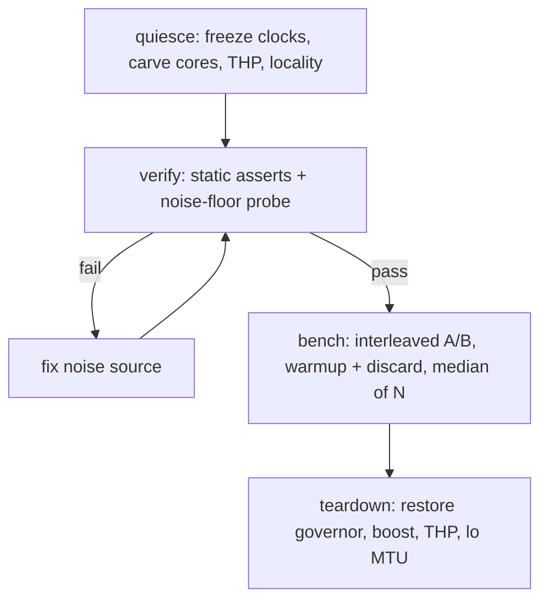

# Isolate Benchmark (low-noise local benchmarking)

> This is a methodology note for `rnd`, not an engine doc.

## Concept

A loopback micro-benchmark measures two things at once: the engine under test
and the machine's own jitter. On a quiet path the engine signal can be only a
few percent, while uncontrolled jitter is easily larger. The jitter has named
sources: frequency drift, scheduler migration, idle-wakeup latency, THP and
page-fault stalls, IRQ and softirq steal, and shared L3 eviction. When the
jitter band is wider than the engine difference, a real result hides inside the
noise and two runs of the same binary disagree.

Two goals follow:

1. Variance reduction: shrink the noise band so the engine signal clears it.
2. Normalization: keep the method portable so a 12-CPU laptop and a 64-CPU
   server produce comparable numbers, not just internally consistent ones.

Important ceiling: loopback is roughly 85% kernel-bound, so even a perfectly
quiet box measures the kernel TCP stack more than the engine. Quiescing tightens
variance, it does not lift the loopback ceiling (see the caveat at the end).

## Noise sources and fixes

| Source | Symptom | Fix |
| :- | :- | :- |
| Turbo / boost + freq scaling | cores jump clock mid-run, throughput drifts | governor performance, boost off, pin min equal to max |
| Deep C-states | wake-from-idle latency spikes in the p99 tail | `cpupower idle-set -D 0`, or `idle=poll` on cmdline |
| Scheduler load balance | server and loadgen threads migrate, cache thrash | `isolcpus` plus explicit pinning |
| Timer tick + RCU callbacks | periodic per-core stall | `nohz_full` + `rcu_nocbs` on the isolated set |
| IRQ balancing | softirq steals benchmark cores | stop `irqbalance`, pin IRQs off the set |
| THP / khugepaged | random latency cliffs from background defrag | THP set to `never` |
| NUMA remote memory | variable memory latency | `numactl` local bind |
| Shared L3 / CCX | cross-CCX eviction adds variance | keep the server inside whole CCXs |
| `perf_event_paranoid` | kernel counters blocked | sysctl to `-1`, only while measuring |
| loopback MTU 1500 | per-segment kernel cost dominates the signal | `lo` mtu 65536 |

## Approach

### Step 1: freeze the clocks (single biggest win)

Boost and C-states cause more variance than anything else, because cores
opportunistically change frequency mid-run.

```bash
# fixed governor
sudo cpupower frequency-set -g performance

# kill boost (AMD acpi-cpufreq / amd_pstate)
echo 0 | sudo tee /sys/devices/system/cpu/cpufreq/boost

# pin a fixed freq so cores cannot drift (use the base clock of the box)
sudo cpupower frequency-set -d 2.9GHz -u 2.9GHz

# shallow C-states only, removes the wake-from-idle latency tail
sudo cpupower idle-set -D 0
```

Hard version: add `idle=poll processor.max_cstate=1` to the kernel cmdline. It
costs power and removes the wake-latency tail entirely.

### Step 2: carve the cores out of the scheduler

Pinning alone is not enough. The kernel still schedules its own work onto the
pinned cores unless told otherwise. On the kernel cmdline:

```
isolcpus=<server+loadgen set> nohz_full=<same set> rcu_nocbs=<same set>
```

`isolcpus` keeps the load balancer off them, `nohz_full` stops the periodic
tick, `rcu_nocbs` moves RCU callbacks elsewhere. Then stop the IRQ shuffler so
softirq work does not migrate back onto the set:

```bash
sudo systemctl stop irqbalance
```

Caution: once `isolcpus` is set, an unpinned process is confined to the
housekeeping cores and starves. Anything benchmarked must be pinned explicitly
onto the isolated set (see the portable split below).

### Step 3: THP and memory locality

khugepaged defrag shows up as random latency cliffs.

```bash
echo never | sudo tee /sys/kernel/mm/transparent_hugepage/enabled
```

Bind memory local even on a single NUMA node (NPS1), to remove allocation-site
variance:

```bash
numactl --cpunodebind=0 --membind=0 ./server ...
```

### Step 4: measurement methodology

This is where loopback bites, so counter it at the measurement layer:

- Interleave A/B back-to-back inside one script, not all-A then all-B, so any
  residual drift cancels between the two arms.
- Warm up, then discard the first run. Take the median of N (>= 5) and report
  the IQR or stddev alongside it. If stddev is more than a few percent, the
  result is not real yet.
- Bump the loopback MTU: `sudo ip link set lo mtu 65536`. Fewer segments per
  request means less per-packet kernel cost dominating the signal you care
  about.
- For hardware counters: `sudo sysctl kernel.perf_event_paranoid=-1` (this box
  defaults to 2, which is why kernel cycles were blocked before).

## Portability: 12 CPU to 64 CPU

The principle: never hardcode cpusets. Derive everything from `nproc` and the
SMT topology, normalize the metric per server core, and hold load density
constant. Then the laptop and the 64-CPU box land on the same axis.

### Rule 1: half-split by physical core, SMT-aware

Split the physical cores in half. Each physical core contributes all of its
logical threads to the same side, so an SMT pair is never split across the
server and loadgen halves. On the 3995WX a physical core is logical `N` and
`N+64`, so the server half becomes `0-31,64-95` automatically. On a 6-core
laptop the pairs are `0/6, 1/7, ...`, so the server half becomes `0,6,1,7,2,8`.

```bash
derive_split() {
    # Build SERVER_CPUS and LOADGEN_CPUS honoring SMT siblings.
    # Each physical core sends all its logical threads to one side.
    local -A core_to_siblings
    local order=()

    for d in /sys/devices/system/cpu/cpu[0-9]*; do
        local siblings
        siblings=$(<"$d/topology/thread_siblings_list")
        local key=${siblings%%,*}

        if [ -z "${core_to_siblings[$key]+set}" ]; then
            order+=("$key")
        fi
        core_to_siblings[$key]="$siblings"
    done

    local total=${#order[@]}
    local half=$((total / 2))

    local server=() loadgen=() index=0
    for key in $(printf '%s\n' "${order[@]}" | sort -n); do
        if [ "$index" -lt "$half" ]; then
            server+=("${core_to_siblings[$key]}")
        else
            loadgen+=("${core_to_siblings[$key]}")
        fi
        index=$((index + 1))
    done

    SERVER_CPUS=$(IFS=,; echo "${server[*]}")
    LOADGEN_CPUS=$(IFS=,; echo "${loadgen[*]}")
}
```

### Rule 2: constant load density

Hold connections-per-server-CPU constant instead of a fixed connection count,
so the offered pressure scales with the box. Pick a density `K` and let the
machine size set the rest:

```bash
server_logical=$(taskset -c "$SERVER_CPUS" nproc)   # logical CPUs on the server half
conns=$(( K * server_logical ))
threads=$(taskset -c "$LOADGEN_CPUS" nproc)
```

### Rule 3: normalize the metric

Report `req/s per server logical CPU` and `L1-miss per request`. Both are
core-count independent, so a 12-CPU and a 64-CPU result are directly comparable.
Raw throughput is not.

### Mapping (K = 64)

| Box | nproc | physical cores | SERVER_CPUS | LOADGEN_CPUS | conns (K*server_logical) |
| :- | :- | :- | :- | :- | :- |
| laptop | 12 | 6 | `0,6,1,7,2,8` | `3,9,4,10,5,11` | 6 * 64 = 384 |
| server | 128 | 64 | `0-31,64-95` | `32-63,96-127` | 64 * 64 = 4096 |

The 64-CPU column reproduces the documented 3995WX split, and the 4096 cap
matches the existing high-conn runs. The same `derive_split` produces both.

## Verify test before benching

Never trust a number until the box has passed a gate. Two parts: cheap static
assertions that fail fast, then a dynamic noise-floor probe that proves the box
is actually quiet.

### Part A: static assertions

```bash
fail=0
note() { printf '%-14s %s\n' "$1" "$2"; }

# governor must be performance on every core
if grep -qvx performance /sys/devices/system/cpu/cpu*/cpufreq/scaling_governor; then
    note governor "FAIL (not all performance)"; fail=1
else
    note governor "ok"
fi

# boost must be off
if [ -r /sys/devices/system/cpu/cpufreq/boost ] && \
   [ "$(cat /sys/devices/system/cpu/cpufreq/boost)" != 0 ]; then
    note boost "FAIL (still on)"; fail=1
else
    note boost "ok/na"
fi

# THP must be never
if ! grep -q '\[never\]' /sys/kernel/mm/transparent_hugepage/enabled; then
    note thp "FAIL (not never)"; fail=1
else
    note thp "ok"
fi

# irqbalance must not be running
if pgrep -x irqbalance >/dev/null; then
    note irqbalance "FAIL (running)"; fail=1
else
    note irqbalance "ok"
fi

# loopback MTU should be raised
mtu=$(cat /sys/class/net/lo/mtu)
if [ "$mtu" -ge 65536 ]; then note lo_mtu "ok ($mtu)"; else note lo_mtu "WARN ($mtu)"; fi

# gcannon needs unlimited memlock
if [ "$(ulimit -l)" != unlimited ]; then note memlock "WARN ($(ulimit -l))"; fi

[ "$fail" -eq 0 ] || { echo "preflight FAILED, do not bench"; exit 1; }
```

### Part B: noise-floor probe (machine-independent)

A fixed compute kernel pinned to one server core, run many times. The same
binary on the laptop and the server makes the variance directly comparable. If
the run-to-run spread is tight the box is quiet, if not the bench is untrustable.

```bash
cat > /tmp/spin.c <<'EOF'
#include <stdint.h>
int main(void) {
    volatile uint64_t acc = 0;
    for (uint64_t i = 0; i < 3000000000ULL; i++) acc += i * 2654435761ULL;
    return (int)acc;
}
EOF
cc -O2 -o /tmp/spin /tmp/spin.c

probe_core=${SERVER_CPUS%%,*}

# task-clock is a software event, so it works even at perf_event_paranoid=2
taskset -c "$probe_core" perf stat -r 20 /tmp/spin 2>&1 | \
    awk '/task-clock/ { for (i = 1; i <= NF; i++) if ($i == "+-") print "variance: " $(i + 1) }'
```

Fallback without perf:

```bash
for run in $(seq 20); do
    /usr/bin/time -f %e taskset -c "$probe_core" /tmp/spin
done 2>&1 | awk '{ sum += $1; sumsq += $1 * $1; n++ }
    END { mean = sum / n; sd = sqrt(sumsq / n - mean * mean);
          printf "mean=%.4f stddev=%.4f rel=%.2f%%\n", mean, sd, 100 * sd / mean }'
```

Pass criteria:

| Relative stddev | Verdict |
| :- | :- |
| under 0.5% | trust the bench |
| 0.5% to 1% | marginal: raise repeats, report median of more runs |
| over 1% | abort: the box is not quiet, fix noise then re-verify |

## Flow



<br>

Everything above tightens variance. It does not change the fact that loopback
measures the kernel TCP stack more than the engine, which is why a
URING-versus-EPOLL difference keeps landing inside the noise band. For a clean
engine-level signal the real levers are: a 2-host setup over a real NIC, or
per-request microarchitecture (`perf stat -p <pid>` for L1-miss per request on
pinned cores), which is what actually separated the engines last time.

## Applying to HttpArena lite

The lite path defeats pinning by default: `benchmark-lite.sh` sets
`GCANNON_CPUS` to all cores and the lite profiles leave `cpu_limit` empty, so the
server and the load generator both float over every core and contend. Before
trusting any lite number, run `derive_split`, then:

- export `GCANNON_CPUS="$LOADGEN_CPUS"` so the load generator pins to one half
- set the framework container cpuset to `$SERVER_CPUS` (the wrapper already
  rewrites the profile fields, so the `cpu_limit` field is the place to inject it)

Because the cpusets come from `derive_split`, the same lite invocation is
correct on both the 12-CPU laptop and the 64-CPU server.

## Tooling

The methodology above is automated and verified by two companions:

- `benchmark-httparena-lite-isolate` (repo root): wraps `benchmark-httparena-lite`
  without modifying it. It saves host state, quiesces, pins via `derive_split`,
  runs the bench, settles, then restores every global knob from an EXIT trap.
  Results go to `logs/benchmark/` (override with `--out-dir`).
- `rnd/isolate_benchmark-check.md`: the apply-time gate. Where the preflight here
  proves the box is quiet BEFORE a run, the check doc also confirms isolation held
  DURING the run and the box was fully restored AFTER it, plus the result
  pass-rule (a delta counts only against the `spin.c` noise band).
