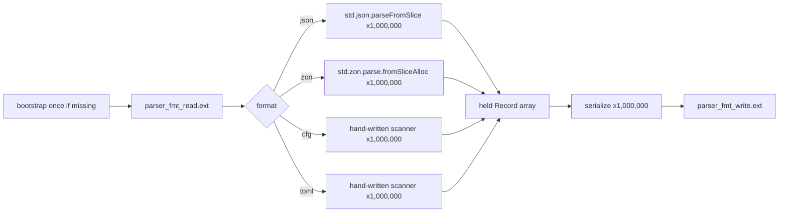

# Parser PoC Results

One record (`id:u64`, `name:str`, `score:f64`, `active:bool`, `tags:[]str`) held on
disk at `rnd/parser_<fmt>_read.<ext>`, opened, read, and parsed 1,000,000 times
(real file I/O every iteration, not a cached in-memory reparse), then serialized
and written back out, one record at a time, to `rnd/parser_<fmt>_write.<ext>`
(also real file I/O, truncated every iteration). Read and write are timed
separately. This replaces the earlier version of this PoC, which bulk-parsed one
big file holding all 1,000,000 records at once.

Peak mem is the high-water mark of one arena spanning the whole 1,000,000-iteration
loop (never freed until the loop ends), so it reflects the cumulative retained set
(all 1,000,000 held records for read, all 1,000,000 serialization buffers for
write), not a single iteration's footprint.

## Debug

Compile: `zig run rnd/parser_<fmt>.zig` (no optimize flag)

### Read

| Format | Records | Bytes | Time | Throughput | Peak mem |
| :- | :- | :- | :- | :- | :- |
| json | 1,000,000 | 83.0 MiB | 10974.87 ms | 8 MiB/s | 976.3 MiB |
| cfg | 1,000,000 | 71.5 MiB | 9764.09 ms | 7 MiB/s | 570.8 MiB |
| zon | 1,000,000 | 80.1 MiB | 36158.36 ms | 2 MiB/s | 2497.2 MiB |
| toml | 1,000,000 | 92.5 MiB | 11895.61 ms | 8 MiB/s | 570.8 MiB |

### Write

| Format | Records | Bytes | Time | Throughput | Peak mem |
| :- | :- | :- | :- | :- | :- |
| json | 1,000,000 | 83.0 MiB | 54125.38 ms | 2 MiB/s | 160.6 MiB |
| cfg | 1,000,000 | 71.5 MiB | 53965.01 ms | 1 MiB/s | 164.0 MiB |
| zon | 1,000,000 | 80.1 MiB | 53792.58 ms | 1 MiB/s | 160.6 MiB |
| toml | 1,000,000 | 92.5 MiB | 53884.29 ms | 2 MiB/s | 233.2 MiB |

## ReleaseFast

Compile: `zig run -O ReleaseFast rnd/parser_<fmt>.zig`

### Read

| Format | Records | Bytes | Time | Throughput | Peak mem |
| :- | :- | :- | :- | :- | :- |
| json | 1,000,000 | 83.0 MiB | 5373.31 ms | 15 MiB/s | 976.3 MiB |
| cfg | 1,000,000 | 71.5 MiB | 4831.37 ms | 15 MiB/s | 570.8 MiB |
| zon | 1,000,000 | 80.1 MiB | 7215.72 ms | 11 MiB/s | 2497.2 MiB |
| toml | 1,000,000 | 92.5 MiB | 4955.44 ms | 19 MiB/s | 570.8 MiB |

### Write

| Format | Records | Bytes | Time | Throughput | Peak mem |
| :- | :- | :- | :- | :- | :- |
| json | 1,000,000 | 83.0 MiB | 52041.13 ms | 2 MiB/s | 160.6 MiB |
| cfg | 1,000,000 | 71.5 MiB | 51789.27 ms | 1 MiB/s | 164.0 MiB |
| zon | 1,000,000 | 80.1 MiB | 51797.59 ms | 2 MiB/s | 160.6 MiB |
| toml | 1,000,000 | 92.5 MiB | 51718.84 ms | 2 MiB/s | 233.2 MiB |

Write cost is flat across every format and both build modes (~52-54 seconds
regardless): it is syscall-bound (open, truncate, write, close, every iteration),
not parser-bound, so optimization level and serialization complexity barely move
it. Read cost is the opposite: it tracks each format's parse cost directly. zon's
Debug read is far slower than the rest (36.2s) because it rebuilds a full
`std.zig.Ast` on every one of the 1,000,000 reads, that cost nearly disappears
under ReleaseFast (7.2s) but still leaves zon's read peak memory the highest by a
wide margin (2497.2 MiB vs 570-976 MiB for the others), the AST dominates zon's
memory the same way it dominated the old bulk-parse benchmark.

## File Structure and Parsing

All four formats carry the same record (`id`, `name`, `score`, `active`, `tags`).
Every one of the 1,000,000 iterations touches the real file on disk, no in-memory
shortcut.



### JSON (.json)

One JSON object per file.

```json
{"id":1,"name":"foo_0","score":0.5,"active":true,"tags":["urgent","verified","retail"]}
```

Parsed by `std.json.parseFromSlice(common.Record, ...)`. std.json reflects
`tags: [][]const u8` the same way it reflects `name: []const u8`, a JSON array of
strings maps straight to the slice field, no custom array handling needed. Every
string (including each tag) is duped, so the parsed record owns its bytes
independent of the file buffer.

### ZON (.zon)

One anonymous struct per file.

```zig
.{.id=1,.name="foo_0",.score=0.5,.active=true,.tags=.{"urgent","verified","retail"}}
```

Parsed by `std.zon.parse.fromSliceAlloc(common.Record, ...)`. The whole source is
first turned into an AST (`std.zig.Ast`) on every read, the cost that dominates
this format. The `tags` tuple is walked into `[][]const u8` the same way the whole
record is walked into `common.Record`, ZON's array handling is just its normal
struct-field reflection, one level deeper. Each string is duped into a fresh owned
slice. The source must be sentinel-terminated (`[:0]const u8`), read via
`readFileAllocOptions` with a `0` sentinel, the file on disk holds plain text, no
physical trailing `0` byte.

### CFG (.cfg)

INI style. One `[record]` header, then `key=value` lines.

```ini
[record]
id=1
name=foo_0
score=0.5
active=true
tags=urgent,verified,retail
```

Parsed by the hand-written `parse()` in `parser_cfg.zig`. Plain INI has no array
literal, so `tags` uses the one convention it can: a comma-separated value on a
single `key=value` line, split and duped into `[][]const u8` after the normal
`key=value` split.

### TOML (.toml)

One `[record]` table, `key = value` lines, quoted strings, a native array literal
for `tags`.

```toml
[record]
id = 1
name = "foo_0"
score = 0.5
active = true
tags = ["urgent", "verified", "retail"]
```

There is no std TOML parser, so `parser_toml.zig` is a hand-written scanner scoped
to exactly this record shape (no nested tables, no dates, no multi-line strings,
not spec-complete). Unlike cfg, TOML's own grammar has a real array literal
(`[...]`), so `tags` parses by stripping the brackets and splitting on `,`, each
item further stripped of its surrounding quotes, rather than cfg's comma-line
convention. `name` and every tag are duped into the parse allocator.
