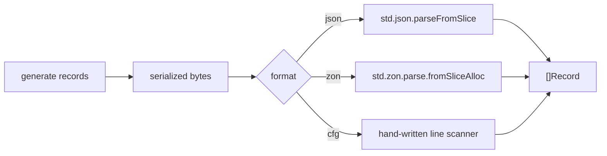

# Parser PoC Results

1,000,000 records (`id:u64`, `name:str`, `score:f64`, `active:bool`).

## Debug

Compile: `zig run rnd/parser_<fmt>.zig` (no optimize flag)

| Format | Records | Input | Parse | Throughput | Peak mem |
| :- | :- | :- | :- | :- | :- |
| json | 1,000,000 | 59.3 MiB | 2568 ms | 23 MiB/s | 183.5 MiB |
| cfg | 1,000,000 | 57.4 MiB | 2550 ms | 23 MiB/s | 322.8 MiB |
| zon | 1,000,000 | 56.4 MiB | 14702 ms | 4 MiB/s | 1094.0 MiB |

## ReleaseFast

Compile: `zig run -O ReleaseFast rnd/parser_<fmt>.zig`

| Format | Records | Input | Parse | Throughput | Peak mem |
| :- | :- | :- | :- | :- | :- |
| json | 1,000,000 | 59.3 MiB | 297 ms | 200 MiB/s | 183.5 MiB |
| cfg | 1,000,000 | 57.4 MiB | 161 ms | 356 MiB/s | 322.8 MiB |
| zon | 1,000,000 | 56.4 MiB | 1140 ms | 50 MiB/s | 995.3 MiB |

## File Structure and Parsing

All three formats carry the same record (`id`, `name`, `score`, `active`). The
shared pipeline is the same. Only the file shape and the parse step differ.



### JSON (.json)

One JSON array. Each record is an object, fields keyed by name.

```json
[{"id":1,"name":"foo_0","score":0.5,"active":true},{"id":2,"name":"foo_1","score":1.5,"active":false}]
```

Parsed by `std.json.parseFromSlice([]Record, ...)`:

- A token scanner reads the whole array.
- Each object maps to a `Record` by matching field names.
- Every string value is duped, so the result owns its `name`.
- The parser builds its own internal arena for the result.

### ZON (.zon)

One anonymous tuple. Each record is an anonymous struct with `.field = value`
syntax. The source must end with a `0` byte (sentinel terminated).

```zig
.{.{.id=1,.name="foo_0",.score=0.5,.active=true},.{.id=2,.name="foo_1",.score=1.5,.active=false}}
```

Parsed by `std.zon.parse.fromSliceAlloc([]Record, ...)`:

- The whole source is first turned into an AST (`std.zig.Ast`), the memory and
  time cost that dominates this format.
- The AST tuple is walked into `[]Record`, fields matched by `.name`.
- Each string is duped into a fresh owned slice.

### CFG (.cfg)

INI style. One `[record]` header per record, then `key=value` lines, with a
blank line between records.

```ini
[record]
id=1
name=foo_0
score=0.5
active=true

[record]
id=2
name=foo_1
score=1.5
active=false
```

Parsed by the hand-written `parse()` in `parser_cfg.zig`:

- The input is split on `\n`, blank lines are skipped.
- A `[record]` line flushes the record being built and starts a new one.
- A `key=value` line splits on the first `=`, matches the key, then converts the
  value: `parseInt` for `id`, `parseFloat` for `score`, `true`/`false` for
  `active`, and a dupe for `name`.
- The last record is flushed at end of input.
