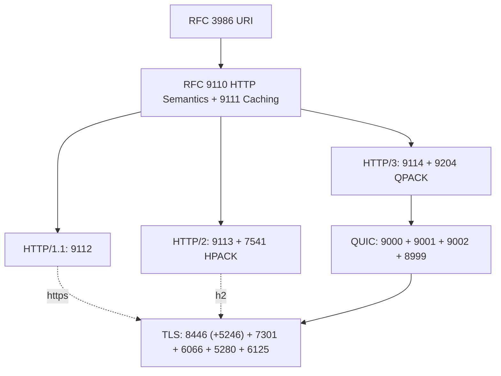

# RFC Conformance Reference

Spec source files and the MUST / MUST NOT conformance checklists derived from them, for the raw HTTP/1.1, HTTP/2, HTTP/3, and TLS engine work in 0.5.x, plus the RSA signing and response compression reference material.

Each checklist is grounded in the current-generation RFCs. Obsoleted predecessors are kept with an -obsoleted.txt suffix for diffing only, not for implementation.

## Checklists

| File | Protocol | Grounded in |
| :- | :- | :- |
| http1-conformance-must-checklist.md | HTTP/1.1 | 9112, 9110, 3986 |
| http2-conformance-must-checklist.md | HTTP/2 | 9113, 7541, 9110 |
| http3-conformance-must-checklist.md | HTTP/3 | 9114, 9204, 9000, 9001, 9002, 8999 |
| tls-conformance-must-checklist.md | TLS 1.3 (https, h2) | 8446, 7301, 6066, 5280, 6125 |

TLS is a shared layer. The three HTTP checklists reference tls-conformance-must-checklist.md rather than repeating it. HTTP/3 uses the same TLS 1.3 handshake but replaces the TLS record layer with QUIC packet protection (RFC 9001).

## Dependency map

## Active RFC inventory

| Layer | RFC | Title |
| :- | :- | :- |
| Foundational | 3986 | URI Generic Syntax |
| | 5234 | ABNF |
| HTTP semantics | 9110 | HTTP Semantics |
| | 9111 | HTTP Caching |
| HTTP/1.1 | 9112 | HTTP/1.1 |
| HTTP/2 | 9113 | HTTP/2 |
| | 7541 | HPACK |
| HTTP/3 | 9114 | HTTP/3 |
| | 9204 | QPACK |
| QUIC | 9000 | QUIC transport |
| | 9001 | QUIC-TLS |
| | 9002 | QUIC Loss Detection and Congestion Control |
| | 8999 | Version-Independent Properties of QUIC |
| TLS | 8446 | TLS 1.3 |
| | 5246 | TLS 1.2 (optional fallback) |
| | 7301 | ALPN |
| | 6066 | TLS Extensions (SNI) |
| | 5280 | X.509 PKIX certificate path validation |
| | 6125 | Service Identity |
| Crypto / RSA | 8017 | PKCS#1 v2.2 (RSA primitives, PSS, PKCS1-v1_5, OAEP) |
| | 4055 | RSASSA-PSS / OAEP algorithm identifiers in X.509 |
| | 5756 | Updates to 4055 (RSA-PSS / OAEP parameters) |
| | 3279 | RSA key and signature identifiers in X.509 |
| JOSE | 7518 | JWA (RS256 / PS256 / ES256 signature algorithms) |
| | 7517 | JWK key representation |
| Compression | 1951 | DEFLATE Compressed Data Format |
| | 7932 | Brotli Compressed Data Format (format + static dictionary in Appendix A) |

## Obsoleted (reference only)

| File | Superseded by |
| :- | :- |
| rfc2818-obsoleted.txt | 9110 (https binding moved to 4.2.2) |
| rfc7230-obsoleted.txt | 9112 |
| rfc7540-obsoleted.txt | 9113 |

## Notes

- Strict surface totals: HTTP/1.1 about 130 MUST, HTTP/2 about 216, the HTTP/3 + QUIC path about 619 across five specs, TLS 1.3 about 330 in RFC 8446 alone.
- The gating prerequisite for HTTP/3 and for any https or h2 is the TLS 1.3 handshake engine (RFC 8446) plus X.509 path validation (RFC 5280). The QUIC packet, header, and Retry protection math is pure-Zig on std.crypto, but the handshake state machine is what realistically forces binding a C TLS library.
- Out-of-scope extensions, only if a feature lands: 7617 / 7616 / 6750 (auth schemes), 6265 (cookies), 8441 / 9220 (Extended CONNECT for WebSocket over h2 / h3).
- TLS version policy: zix offers TLS 1.3 (RFC 8446, default) and optionally TLS 1.2 (RFC 5246) only. TLS 1.0 and 1.1 are deprecated by RFC 8996 (March 2021, "MUST NOT be used"), SSL 3.0 by RFC 7568, SSL 2.0 by RFC 6176. These deprecation memos are policy authorities, not implementation specs, so they are not vendored as .txt here. Offering TLS 1.0 / 1.1 caps an SSL Labs grade at B, so they are never put on the wire (rnd/roadmap-0.5.x.md, the A+ target).
- Compression rows are reference for the gzip / deflate / brotli response compression item (rnd/roadmap-0.5.x.md). gzip and deflate ride `std.compress.flate` (the DEFLATE algorithm is RFC 1951, here for grounding), so RFC 1951 is informational, not authored. The container framing RFCs are NOT vendored because std handles them: zlib (RFC 1950, the on-the-wire `deflate` token wrapper) and gzip (RFC 1952). RFC 7932 IS the one that matters: brotli is a std-gap, so it is authored from this spec, dictionary and all (Appendix A).
- The Crypto / RSA and JOSE rows are reference material, not a conformance checklist target. They ground the RSA signing roadmap item (rnd/roadmap-0.5.x.md): std verifies RSA but cannot sign with an RSA private key, so PKCS#1 v2.2 (8017) is the spec to author from if an RSA certificate or RS256 issuance is ever required. RFC 8017 is the canonical one. 4055 / 5756 / 3279 cover the X.509 identifiers, 7518 / 7517 the JWS / JWK use.
