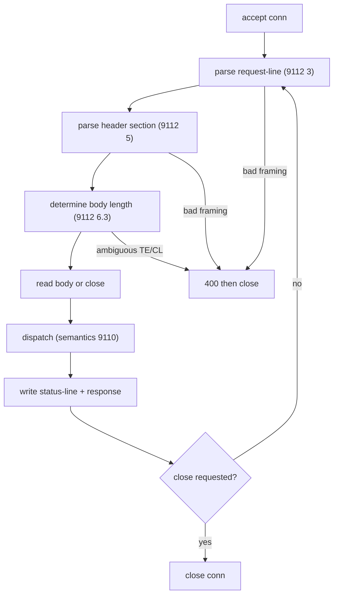

# HTTP/1.1 Raw Server Conformance Checklist (MUST / MUST NOT)

Specs (current generation):
- RFC 9112 (HTTP/1.1 message syntax, obsoletes RFC 7230)
- RFC 9110 (HTTP Semantics, obsoletes RFC 7231 and others)
- RFC 3986 (URI Generic Syntax) for request-target and authority parsing

Obsoleted source kept for reference: rfc7230-obsoleted.txt.

Citation convention: each cite is prefixed with the RFC, for example (9112 6.3) or (9110 7.2) or (3986 3.2).

## 1. Message parsing and framing
- [ ] Parse the message as octets in a US-ASCII superset. MUST NOT parse as a Unicode character stream (9112 2.2)
- [ ] A bare CR (CR not followed by LF) in any element other than content MUST be treated as invalid, or each bare CR replaced with SP before processing (9112 2.2)
- [ ] Whitespace between the start-line and the first header field MUST be rejected, or each whitespace-prefixed line consumed without processing (9112 2.2)
- [ ] request-target too long MUST get 414 (URI Too Long) (9112 3, 9110 15.5.15)
- [ ] Accept all four request-target forms: origin-form, absolute-form, authority-form (CONNECT only, host:port), asterisk-form (server-wide OPTIONS) (9112 3.2)
- [ ] On absolute-form, the origin server MUST ignore any Host field and use the request-target authority (9112 3.2.2)
- [ ] Parse authority into userinfo / host / port per the URI grammar (3986 3.2)
- [ ] Generic grammar violation beyond robustness allowances SHOULD get 400 then close (9112 2.2)

## 2. Header field parsing
- [ ] field-name is a token, case-insensitive. No whitespace allowed before the colon. A request with whitespace between field-name and colon MUST be rejected with 400 (9112 5.1)
- [ ] Leading and trailing OWS around the field value MUST be excluded before evaluating (9112 5.1, 9110 5.5)
- [ ] A field value containing CR, LF, or NUL MUST be rejected, or each such char replaced with SP, before processing (9110 5.5)
- [ ] obs-fold outside a message/http container MUST be rejected with 400, or each obs-fold replaced with one or more SP before interpreting (9112 5.2)

## 3. Body length determination (request-smuggling precedence, 9112 6.3)
Apply the first matching rule (request-relevant cases):
- [ ] Both Transfer-Encoding and Content-Length present: Transfer-Encoding wins, but this ought to be an error. The server MAY reject, and in either case MUST close the connection after responding (9112 6.1, 6.3)
- [ ] T-E present with chunked NOT the final coding (request): length undeterminable, MUST respond 400 then close (9112 6.3)
- [ ] No T-E with an invalid Content-Length (request): framing invalid, MUST respond 400 then close. A comma-list of identical valid values MAY be collapsed to one (9112 6.3)
- [ ] Valid Content-Length without T-E: that value is the body length. If the connection closes or times out before that many octets arrive, treat the message as incomplete and close (9112 6.3)
- [ ] Request with none of the above: body length is zero (9112 6.3)
- [ ] Content-Length is non-negative 1*DIGIT. MUST anticipate large values and prevent integer-overflow parse errors (9110 8.6)
- [ ] MAY reject a body-without-Content-Length request with 411 (Length Required) (9112 6.3)

Delta vs RFC 7230: 9112 now mandates MUST close after responding to a T-E + C-L message, and frames the whole precedence list explicitly as smuggling mitigation (9112 6.1, Appendix C.3).

## 4. Transfer-Encoding and chunked
- [ ] Recipient MUST be able to parse and decode the chunked transfer coding (9112 6.1, 7.1)
- [ ] chunked MUST NOT be applied more than once. If any coding is applied to a request body, chunked MUST be the final coding (9112 6.1)
- [ ] An HTTP/1.0 message carrying Transfer-Encoding MUST be treated as faulty framing and the connection closed after processing (9112 6.1)
- [ ] MUST anticipate large hex chunk-size values and prevent integer overflow (9112 7.1)
- [ ] Ignore unrecognized chunk extensions (9112 7.1.1)
- [ ] A received trailer field MUST NOT be merged into the header section unless its definition explicitly permits. Otherwise store or forward separately, or discard (9112 7.1.2)
- [ ] Server receiving an unknown transfer coding SHOULD respond 501 (9112 6.1)
- [ ] MUST NOT send Transfer-Encoding in any 1xx or 204 response, nor in a 2xx response to CONNECT, nor unless the request is HTTP/1.1 or later (9112 6.1, 9110 8.6)

## 5. Host and authority handling
- [ ] MUST respond 400 to any HTTP/1.1 request that lacks a Host field, carries more than one Host field line, or has an invalid Host value (9112 3.2)
- [ ] Host grammar is uri-host with optional port (9110 7.2). Validate against the host/port grammar (3986 3.2.2, 3.2.3)
- [ ] Reconstruct the target URI: authority from request-target authority-form, else from the Host value (9112 3.3)
- [ ] An https request MUST be rejected unless received over a connection secured by a certificate valid for that origin, otherwise 421 (Misdirected Request) (9110 7.4, 15.5.20)

## 6. Connection management
- [ ] Persistent connections are the HTTP/1.1 default. Determine persistence from version plus the Connection field: close present is not persistent, HTTP/1.1+ is persistent, HTTP/1.0 is persistent only with keep-alive (9112 9.3)
- [ ] A server that does not support persistent connections MUST send "close" in every non-1xx response (9112 9.3)
- [ ] Read the entire request body or close the connection after responding, to avoid reading leftover octets as the next request (9112 9.3)
- [ ] After receiving or sending "close": initiate closure after the final response and process no further requests on that connection (9112 9.6)
- [ ] Pipelined safe-method requests MAY be processed in parallel but responses MUST be sent in request order (9112 9.3.2)
- [ ] A non-tunnel intermediary MUST implement Connection and strip hop-by-hop fields it names (9110 7.6.1)

## 7. Response generation
- [ ] status-line is HTTP-version SP status-code SP optional-reason. status-code is 3DIGIT. The SP after status-code MUST be sent even when the reason-phrase is absent (9112 4)
- [ ] HTTP-name is case-sensitive "HTTP". Unsupported major version gets 505 (9112 2.3, 9110 15.6.6)
- [ ] MUST NOT send Content-Length in any 1xx or 204 response, nor in a 2xx response to CONNECT. HEAD response MUST NOT send a C-L unless it equals what a GET would produce. 304 MUST NOT send a C-L unless it equals what a 200 would produce (9110 8.6)
- [ ] An origin server with a clock MUST generate a Date field in all 2xx, 3xx, 4xx responses. A server without a clock MUST NOT generate Date (9110 6.6.1)
- [ ] Application data MUST NOT be allowed to inject CR or LF into the header section, to prevent response splitting (9112 11.1)

## 8. Must reject or must close (consolidated)
| Condition | Action | Cite |
| :- | :- | :- |
| Missing, multiple, or invalid Host | 400 | 9112 3.2 |
| Whitespace before colon | 400 | 9112 5.1 |
| obs-fold outside message/http | 400 or unfold to SP | 9112 5.2 |
| CR/LF/NUL in field value | reject or replace with SP | 9110 5.5 |
| Bare CR outside content | invalid or replace with SP | 9112 2.2 |
| chunked not final (request) | 400 then close | 9112 6.3 |
| invalid Content-Length (request) | 400 then close | 9112 6.3 |
| T-E and C-L both present | MAY reject, MUST close after responding | 9112 6.1 |
| HTTP/1.0 with Transfer-Encoding | faulty framing, close | 9112 6.1 |
| incomplete body (close before C-L, or unterminated chunked) | incomplete, close | 9112 6.3, 8 |
| request-target too long | 414 | 9112 3 |
| unknown transfer coding | SHOULD 501 | 9112 6.1 |
| https without valid-cert connection | 421 | 9110 7.4 |
| "close" sent or received | no further requests, close | 9112 9.6 |

## TLS dependency (https)
HTTPS for HTTP/1.1 is HTTP over TLS, defined outside 9112. See tls-conformance-must-checklist.md for the TLS 1.3 server requirements (RFC 8446) plus ALPN (7301), SNI (6066), X.509 (5280), and identity (6125). ALPN identifies "http/1.1". The TLS 1.3 handshake engine is the gating prerequisite and is not pure-Zig today.
