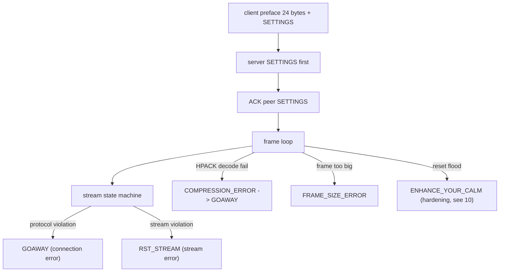

# HTTP/2 Raw Server Conformance Checklist (MUST / MUST NOT)

Specs (current generation):
- RFC 9113 (HTTP/2, obsoletes RFC 7540)
- RFC 7541 (HPACK header compression)
- RFC 9110 (HTTP Semantics) for field name and value grammar

Obsoleted source kept for reference: rfc7540-obsoleted.txt.

Citation convention: each cite is prefixed with the RFC, for example (9113 5.1), (7541 6.3), (9110 5.5).

## 1. Connection preface (9113 3.4)
- [ ] Client preface MUST be exactly the 24 octets "PRI * HTTP/2.0\r\n\r\nSM\r\n\r\n", followed by a SETTINGS frame which MAY be empty
- [ ] The server first frame MUST be a SETTINGS frame (may be empty), the server preface
- [ ] Acknowledge the peer preface SETTINGS after sending your own (9113 6.5.3)
- [ ] An invalid preface MUST be a connection error PROTOCOL_ERROR
- [ ] h2c upgrade and the HTTP2-Settings header are deprecated. Over TLS, the negotiated protocol is "h2" (9113 3.1, 3.2)

## 2. Frame format (9113 4.1, 4.2)
- [ ] Length over 2^14 (16384) MUST NOT be sent unless the peer advertised a larger SETTINGS_MAX_FRAME_SIZE
- [ ] MUST receive and minimally process frames up to 2^14 plus the 9-octet header
- [ ] Frame over MAX_FRAME_SIZE, over a type limit, or too small MUST be FRAME_SIZE_ERROR. If it could alter whole-connection state (field-block frame, SETTINGS, or any stream-0 frame) it MUST be a connection error
- [ ] Reserved bit MUST be unset on send and ignored on receipt
- [ ] Undefined flags MUST be ignored on receipt and unset on send
- [ ] Unknown frame types MUST be ignored and discarded, except an extension frame in the middle of a field block MUST be a connection error PROTOCOL_ERROR (9113 5.5)

## 3. Stream state machine (9113 5.1)
- [ ] idle: any frame other than HEADERS or PRIORITY MUST be a connection error PROTOCOL_ERROR. A server receiving HEADERS on an even stream id MUST be a connection error PROTOCOL_ERROR
- [ ] half-closed(remote): any frame other than WINDOW_UPDATE, PRIORITY, RST_STREAM MUST be a stream error STREAM_CLOSED
- [ ] closed: MUST NOT send frames other than PRIORITY. Receipt of a non-PRIORITY frame MAY be a connection error STREAM_CLOSED
- [ ] After sending RST_STREAM, minimally process then discard inbound frames (update HPACK state, count DATA toward connection flow control) (9113 5.4.2)
- [ ] DATA on a stream not open or half-closed(local) MUST be a stream error STREAM_CLOSED (9113 6.1)
- [ ] RST_STREAM MUST NOT be sent for an idle stream. Received RST_STREAM on idle MUST be a connection error PROTOCOL_ERROR (9113 6.4)
- [ ] MUST NOT send RST_STREAM in response to RST_STREAM (9113 5.4.2)

## 4. Stream identifiers (9113 5.1.1)
- [ ] Client streams MUST be odd, server-initiated even, 0x0 cannot open a stream
- [ ] A new stream id MUST be numerically greater than all streams the initiator opened or reserved. An unexpected id MUST be a connection error PROTOCOL_ERROR
- [ ] Opening a higher id implicitly closes lower idle streams. Stream identifiers MUST NOT be reused

## 5. Flow control (9113 5.2, 6.9)
- [ ] Initial window is 65535 octets for new streams and the connection
- [ ] Only DATA is flow-controlled. Other frames MUST be accepted and processed
- [ ] As receiver, account every flow-controlled frame against the connection window even if in error
- [ ] As sender, MUST NOT send a flow-controlled frame exceeding the stream or connection window
- [ ] A window MUST NOT exceed 2^31-1. An overflowing WINDOW_UPDATE MUST trigger RST_STREAM FLOW_CONTROL_ERROR (stream) or GOAWAY FLOW_CONTROL_ERROR (connection)
- [ ] WINDOW_UPDATE increment of 0 MUST be a stream error PROTOCOL_ERROR (connection error on stream 0). Length not 4 MUST be a connection error FRAME_SIZE_ERROR
- [ ] WINDOW_UPDATE on a half-closed(remote) or closed stream MUST NOT be treated as an error
- [ ] On SETTINGS_INITIAL_WINDOW_SIZE change, adjust all stream windows by the delta and track resulting negative windows. A change pushing any window over the max MUST be a connection error FLOW_CONTROL_ERROR
- [ ] MUST read and process frames from the transport promptly to avoid deadlock (9113 5.2.2)

## 6. SETTINGS (9113 6.5)
- [ ] Both endpoints MUST send a SETTINGS frame at connection start and MUST support all defined settings
- [ ] Stream id MUST be 0x0, else connection error PROTOCOL_ERROR
- [ ] Length not a multiple of 6 MUST be a connection error FRAME_SIZE_ERROR. Otherwise a badly formed SETTINGS is PROTOCOL_ERROR
- [ ] ACK with non-zero length MUST be a connection error FRAME_SIZE_ERROR
- [ ] On a non-ACK SETTINGS: apply ASAP, process values in order with no intervening frame, ignore unknown identifiers, then immediately emit a SETTINGS with ACK
- [ ] SETTINGS_ENABLE_PUSH: a server MUST NOT set it to 1. A value other than 0 or 1 MUST be a connection error PROTOCOL_ERROR (9113 6.5.2)
- [ ] SETTINGS_INITIAL_WINDOW_SIZE over 2^31-1 MUST be FLOW_CONTROL_ERROR. SETTINGS_MAX_FRAME_SIZE outside [2^14, 2^24-1] MUST be PROTOCOL_ERROR
- [ ] MUST NOT exceed the peer SETTINGS_MAX_CONCURRENT_STREAMS. A HEADERS over the limit MUST be a stream error PROTOCOL_ERROR or REFUSED_STREAM (9113 5.1.2)

## 7. HPACK and header block

Framing and contiguity (9113):
- [ ] Field blocks MUST be a contiguous frame sequence, no interleaved frames of any type or any other stream (9113 4.3, 8.1)
- [ ] HEADERS or PUSH_PROMISE without END_HEADERS MUST be followed by CONTINUATION on the same stream. Any other frame or a different stream MUST be a connection error PROTOCOL_ERROR (9113 6.2, 6.10)
- [ ] Any field-block decoding failure MUST be a connection error COMPRESSION_ERROR (9113 4.3)
- [ ] Dynamic table starts at 4096 bytes. After ACKing a reduced SETTINGS_HEADER_TABLE_SIZE, the next field block MUST begin with a conformant Dynamic Table Size Update, else COMPRESSION_ERROR (9113 4.3.1)

HPACK-specific (7541), all decode errors map to COMPRESSION_ERROR:
- [ ] A Dynamic Table Size Update MUST occur at the start of the first field block after a size change (7541 4.2, 6.3)
- [ ] A new max size in a size update MUST be at most the protocol limit (SETTINGS_HEADER_TABLE_SIZE). Exceeding it MUST be a decode error (7541 6.3)
- [ ] On size reduction, evict oldest entries until size is within max. Before inserting, evict until size is at most max minus new entry size. Adding an entry larger than max empties the table and is not an error (7541 4.3, 4.4)
- [ ] Indexed representation with index 0 MUST be a decode error (7541 6.1, 2.4)
- [ ] An index over (static + dynamic) length MUST be a decode error (7541 2.3.3)
- [ ] Integer encoding exceeding implementation limits MUST be a decode error (7541 5.1)
- [ ] Huffman: padding longer than 7 bits, padding not matching the EOS prefix, or a literal containing the EOS symbol MUST each be a decode error (7541 5.2)
- [ ] Decoded representations MUST be processed in order to reconstruct the field list (7541 3.2)

Pseudo-headers and field validity (9113 8, 9110 5):
- [ ] Field names MUST be lowercase. Uppercase is malformed (9113 8.2.1)
- [ ] Name MUST NOT contain 0x00-0x20, uppercase, or 0x7f-0xff. Only pseudo-headers begin with ":". Values MUST NOT contain NUL, LF, CR, and MUST NOT start or end with SP or HTAB (9113 8.2.1)
- [ ] MUST NOT generate undefined pseudo-headers. Request pseudo-headers MUST NOT appear in responses and vice versa, none in trailers. All pseudo-headers MUST precede regular fields. A pseudo-header name MUST NOT appear more than once. Violations are malformed (9113 8.3)
- [ ] Requests MUST include exactly one valid :method, :scheme, :path (except CONNECT). :path MUST NOT be empty for http or https. :authority MUST NOT include userinfo, and Host and :authority MUST NOT disagree (9113 8.3.1)
- [ ] content-length not equal to the summed DATA payload length (where content is allowed) is malformed (9113 8.1.1)
- [ ] A malformed request MUST be a stream error PROTOCOL_ERROR. The server MAY send a 400 before resetting (9113 8.1.1)

## 8. Connection (GOAWAY) vs stream (RST_STREAM) errors (9113 5.4)
- [ ] Connection error: SHOULD send GOAWAY with the last good stream id and error code, then MUST close the TCP connection
- [ ] Stream error: send RST_STREAM with the stream id and error code
- [ ] GOAWAY stream id MUST be 0x0, else PROTOCOL_ERROR. A later GOAWAY MUST NOT raise the last-stream-id (9113 6.8)
- [ ] RST_STREAM stream id 0x0 MUST be PROTOCOL_ERROR. Length not 4 MUST be FRAME_SIZE_ERROR (9113 6.4)
- [ ] PING stream id not 0x0 MUST be PROTOCOL_ERROR. Length not 8 MUST be FRAME_SIZE_ERROR. A non-ACK PING MUST be answered with an ACK echoing the 8 octets (9113 6.7)
- [ ] PRIORITY length not 5 MUST be FRAME_SIZE_ERROR. PRIORITY stream id 0x0 MUST be PROTOCOL_ERROR (9113 6.3)

Error codes (9113 7): PROTOCOL_ERROR 0x01, FLOW_CONTROL_ERROR 0x03, SETTINGS_TIMEOUT 0x04, STREAM_CLOSED 0x05, FRAME_SIZE_ERROR 0x06, REFUSED_STREAM 0x07, COMPRESSION_ERROR 0x09, ENHANCE_YOUR_CALM 0x0b. Unknown received error codes MUST NOT trigger special behavior.

## 9. Forbidden and restricted (9113 8.2.2)
- [ ] MUST NOT generate connection-specific fields (Connection, Proxy-Connection, Keep-Alive, Transfer-Encoding, Upgrade). Any message containing them is malformed
- [ ] TE MAY be present but MUST NOT contain any value other than "trailers"
- [ ] chunked transfer-coding cannot be used. DATA frames carry content
- [ ] 101 Switching Protocols and Upgrade are not supported (9113 8.6)
- [ ] A server MUST treat a received PUSH_PROMISE as a connection error PROTOCOL_ERROR (clients cannot push) (9113 8.4)
- [ ] Generic compression such as TLS compression MUST NOT be used (9113 10.6, 9.2)

## 10. What RFC 9113 changed vs RFC 7540 (read before reusing old notes)

(a) Rapid Reset (CVE-2023-44487):
- [ ] IMPORTANT: RFC 9113 (June 2022) predates the attack and contains NO "Rapid Reset" text and NO normative reset-counting MUST. Do not cite a 9113 section for it
- [ ] The spec basis for mitigation is generic DoS guidance: 9113 10.5 names client-triggered RST_STREAM as a DoS vector, says implementations SHOULD limit such activity and MAY treat it as a connection error ENHANCE_YOUR_CALM (0x0b), torn down via GOAWAY (9113 6.8)
- [ ] Implement per-connection reset/cancel accounting as your own hardening on top of 10.5 + 6.8. It is needed precisely because reserved and reset streams do not count against SETTINGS_MAX_CONCURRENT_STREAMS (9113 5.1.2)

(b) PRIORITY deprecation:
- [ ] The RFC 7540 priority signaling scheme is deprecated (9113 5.3). The PRIORITY frame and HEADERS priority fields are retained for interop but their semantics live only in 7540. Prefer the RFC 9218 priority scheme. The length and stream-0 handling rules above still apply

(c) Other tightened items (9113 Appendix B):
- [ ] Field name and value validation is now precisely specified (9113 8.2.1)
- [ ] Connection-specific header prohibition is fully enumerated (9113 8.2.2)
- [ ] Host and :authority MUST NOT disagree (9113 8.3.1)
- [ ] TLS 1.3 incorporated (obsoletes RFC 8740): no post-handshake CertificateRequest, no generic TLS compression (9113 9.2.3, 10.6)
- [ ] h2c upgrade and HTTP2-Settings deprecated (9113 3.1)

## TLS dependency (h2 over TLS)
zix targets h2c (cleartext), which needs none of this. For h2 over TLS, see tls-conformance-must-checklist.md. RFC 9113 section 9.2 additionally requires: TLS 1.3 mandatory-to-implement, ALPN identifying "h2" (RFC 7301), SNI support (RFC 6066), TLS compression disabled, renegotiation disabled, no post-handshake CertificateRequest. The TLS 1.3 handshake engine (RFC 8446) is the gating prerequisite.
