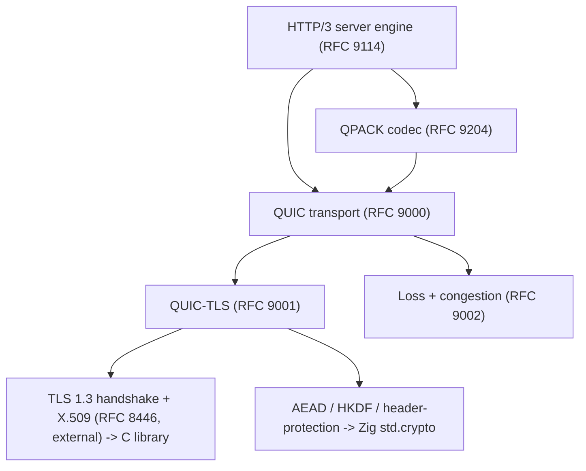

# HTTP/3 Raw Server Conformance Checklist (MUST / MUST NOT)

HTTP/3 is a stack of five normative specs plus a TLS cluster. This file covers all five layers present in this directory.

| Layer | Spec | Strict surface (MUST / MUST NOT) | File |
| :- | :- | :- | :- |
| HTTP/3 application | RFC 9114 | 154 / 53 | rfc9114.txt |
| Header compression | RFC 9204 (QPACK) | 41 / 12 | rfc9204.txt |
| Transport | RFC 9000 (QUIC) | 304 / 85 | rfc9000.txt |
| Crypto | RFC 9001 (QUIC-TLS) | 85 / 25 | rfc9001.txt |
| Loss and congestion | RFC 9002 | 35 / 9 | rfc9002.txt |

Total strict surface for the QUIC path: about 619 MUST plus 184 MUST NOT. For comparison, HTTP/1.1 is 130 MUST and HTTP/2 is 216 MUST.

Citation convention: each parenthetical is prefixed with the RFC number, for example (9000 8.1) means RFC 9000 section 8.1.

## Layer 1: HTTP/3 application (RFC 9114)

### Stream mapping
- [ ] Each side MUST open exactly one control stream (uni type 0x00) at connection start, SETTINGS as its first frame (9114 6.2.1)
- [ ] A second control stream MUST be a connection error H3_STREAM_CREATION_ERROR (9114 6.2.1)
- [ ] Neither side may close the control stream. Closure at any point MUST be H3_CLOSED_CRITICAL_STREAM (9114 6.2.1)
- [ ] Transport parameters MUST allow the peer at least three uni-streams (control plus the two QPACK streams) (9114 6.2)
- [ ] Unknown uni-stream types MUST be aborted or discarded, never treated as a connection error (9114 6.2)
- [ ] Server receiving a client-initiated push stream MUST treat it as H3_STREAM_CREATION_ERROR (9114 6.2.2)
- [ ] Reserved stream types (0x1f*N+0x21) MUST NOT be assigned meaning on receipt (9114 6.2.3)

### Framing
- [ ] Each frame payload MUST contain exactly its defined fields. Extra or missing bytes, inconsistent redundant lengths, or a truncated final frame on clean close MUST be H3_FRAME_ERROR (9114 7.1, 10.8)
- [ ] Frame-per-stream matrix: control allows SETTINGS, CANCEL_PUSH, GOAWAY, MAX_PUSH_ID. Request and push allow DATA, HEADERS, PUSH_PROMISE (request only). Wrong placement MUST be H3_FRAME_UNEXPECTED (9114 7)
- [ ] DATA before HEADERS, or HEADERS/DATA after trailing HEADERS, MUST be H3_FRAME_UNEXPECTED (9114 4.1)
- [ ] HTTP/2-only frame types (0x02, 0x06, 0x08, 0x09) MUST NOT be sent. Receipt MUST be H3_FRAME_UNEXPECTED (9114 7.2.8)
- [ ] Unknown frame types MAY appear and MUST NOT be assigned meaning, but do not satisfy a required-first-frame position (9114 4.1, 9)

### SETTINGS
- [ ] SETTINGS MUST be the first frame on the control stream. A different first frame MUST be H3_MISSING_SETTINGS (9114 6.2.1)
- [ ] SETTINGS MUST NOT be sent again. A second SETTINGS MUST be H3_FRAME_UNEXPECTED (9114 7.2.4)
- [ ] SETTINGS MUST NOT appear on a non-control stream (H3_FRAME_UNEXPECTED) (9114 7.2.4)
- [ ] A duplicate setting identifier MAY be H3_SETTINGS_ERROR. Unknown identifiers MUST be ignored (9114 7.2.4)
- [ ] Reserved HTTP/2 settings MUST NOT be sent. Receipt MUST be H3_SETTINGS_ERROR (9114 7.2.4.1)
- [ ] MUST NOT require any peer data before sending SETTINGS, send it as soon as transport is ready (9114 7.2.4.2)
- [ ] 0-RTT: an accepting server MUST NOT reduce limits the client could already have used, MUST include all non-default settings, and MUST NOT accept 0-RTT if remembered settings are not known compatible (9114 7.2.4.2)

### Request and response semantics
- [ ] Field names MUST be lowercase. Uppercase names MUST be treated as malformed (9114 4.2)
- [ ] MUST NOT generate connection-specific fields. Their presence makes a message malformed (9114 4.2)
- [ ] TE if present MUST NOT contain any value other than "trailers" (9114 4.2)
- [ ] Pseudo-header rules: only defined ones, request-only not in responses and vice versa, none in trailers, all before regular fields. Violations are malformed (9114 4.3)
- [ ] Requests MUST include exactly one :method, :scheme, :path (unless CONNECT). :path MUST NOT be empty for http or https. :authority MUST NOT include userinfo (9114 4.3.1)
- [ ] Responses MUST include :status, else malformed (9114 4.3.2)
- [ ] content-length not equal to the sum of DATA frame lengths MUST be malformed (9114 4.1.2)
- [ ] Malformed message MUST be a stream error H3_MESSAGE_ERROR. Intermediaries MUST NOT forward malformed messages (9114 4.1.2)
- [ ] After the final response the server MUST close the stream for sending (9114 4.1)
- [ ] HTTP Upgrade and 101 (Switching Protocols) are not supported (9114 4.5)

### Shutdown
- [ ] After receiving GOAWAY, MUST NOT initiate new requests or promise new pushes (9114 5.2)
- [ ] Each GOAWAY identifier MUST NOT be greater than any previous one. A larger received id MUST be H3_ID_ERROR (9114 5.2)
- [ ] Server GOAWAY MUST carry a client-initiated bidirectional stream id (9114 7.2.6)
- [ ] Server MUST NOT send MAX_PUSH_ID. Client MUST NOT send PUSH_PROMISE (9114 7.2.7, 7.2.5)

### Error codes (conditions that MUST raise them)
| Code | Trigger |
| :- | :- |
| H3_FRAME_UNEXPECTED (0x0105) | wrong frame for stream, second SETTINGS, server-received PUSH_PROMISE, HTTP/2 frame types |
| H3_FRAME_ERROR (0x0106) | malformed frame length or truncated final frame |
| H3_MISSING_SETTINGS (0x010a) | first control-stream frame is not SETTINGS |
| H3_CLOSED_CRITICAL_STREAM (0x0104) | control or QPACK stream closed or reset |
| H3_ID_ERROR (0x0108) | GOAWAY id grows, MAX_PUSH_ID shrinks, push id out of range |
| H3_STREAM_CREATION_ERROR (0x0103) | second control stream, client push stream received by server |
| H3_SETTINGS_ERROR (0x0109) | duplicate setting, reserved HTTP/2 setting, incompatible 0-RTT settings |
| H3_MESSAGE_ERROR (0x010e) | malformed request or response (stream error) |
| unknown code or known code in wrong context | treat as H3_NO_ERROR (9114 8) |

## Layer 2: QPACK header compression (RFC 9204)

### The two critical streams
- [ ] Encoder stream is uni type 0x02, decoder stream is uni type 0x03. At most one each per endpoint (9204 4.2)
- [ ] A second instance of either MUST be a connection error H3_STREAM_CREATION_ERROR (9204 4.2)
- [ ] Neither side may close either stream. Closure MUST be H3_CLOSED_CRITICAL_STREAM (9204 4.2)
- [ ] Each endpoint MUST allow the peer to create both streams even if settings prevent use (9204 4.2)

### Dynamic table
- [ ] Entry size is name length plus value length plus 32, lengths without Huffman (9204 3.2.1)
- [ ] Encoder MUST NOT set a capacity exceeding SETTINGS_QPACK_MAX_TABLE_CAPACITY (9204 3.2.3)
- [ ] When max table capacity is 0, the encoder MUST NOT insert entries or send encoder instructions (9204 3.2.3)
- [ ] Encoder MUST NOT cause eviction of a non-evictable entry (referenced or not yet acknowledged) (9204 2.1.1, 3.2.2)
- [ ] Adding an entry larger than the dynamic table capacity MUST be QPACK_ENCODER_STREAM_ERROR (9204 3.2.2)
- [ ] Invalid static index in a representation MUST be QPACK_DECOMPRESSION_FAILED. On the encoder stream it MUST be QPACK_ENCODER_STREAM_ERROR (9204 3.1)

### Required Insert Count, Base, blocked streams (the synchronization core)
- [ ] A HEADERS frame can arrive before the encoder-stream insertions it references. The decoder MUST block that stream until Insert Count is at least the Required Insert Count, never decode against incomplete table state (9204 2.2.1, 2.2.3)
- [ ] Encoder MUST limit potentially-blocked streams to SETTINGS_QPACK_BLOCKED_STREAMS at all times (9204 2.1.2)
- [ ] A decoder seeing more blocked streams than promised MUST raise QPACK_DECOMPRESSION_FAILED (9204 2.1.2)
- [ ] Encoded Insert Count that no conformant encoder could produce MUST be QPACK_DECOMPRESSION_FAILED (9204 4.5.1.1)
- [ ] Base MUST NOT be negative. Sign bit set with Required Insert Count not greater than Delta Base is invalid (9204 4.5.1.2)
- [ ] Representation indices anchor to the Base in the section prefix, so out-of-order processing stays consistent (9204 3.2.5)
- [ ] Apply encoder-stream inserts strictly in stream order to keep absolute indices consistent with the encoder (9204 2.1.1, 3.2.5)

### Required decoder feedback (decoder stream)
- [ ] Emit Section Acknowledgment after decoding any field section with non-zero Required Insert Count (9204 4.4.1)
- [ ] Emit Stream Cancellation on stream reset or abandoned read (9204 4.4.2)
- [ ] Emit Insert Count Increment to advance Known Received Count. Without this feedback the shared table desynchronizes (9204 2.2.2, 4.4.3)

### QPACK error codes (all connection errors, 9204 6)
| Code | Trigger |
| :- | :- |
| QPACK_DECOMPRESSION_FAILED (0x0200) | bad reference in a field section, Required Insert Count too small, too many blocked streams, non-reconstructible Encoded Insert Count |
| QPACK_ENCODER_STREAM_ERROR (0x0201) | encoder instruction references evicted or invalid entry, entry larger than capacity, capacity over the SETTINGS limit |
| QPACK_DECODER_STREAM_ERROR (0x0202) | stray Section Acknowledgment, Insert Count Increment of 0 or beyond what was sent |

## Layer 3: QUIC transport (RFC 9000)

### Packets and framing
- [ ] Fixed Bit MUST be 1 except for Version Negotiation. Packets with Fixed Bit 0 MUST be discarded (9000 17.2)
- [ ] Connection ID length MUST NOT exceed 20 in v1. A longer one MUST be dropped (9000 17.2)
- [ ] Reserved bits nonzero after header protection removal MUST be PROTOCOL_VIOLATION (9000 17.2, 17.3.1)
- [ ] Packet number MUST NOT be reused in a number space. Discard duplicate packet numbers after deprotection (9000 12.3)
- [ ] Receivers MUST process coalesced packets and ack each individually. MUST NOT coalesce packets with different DCIDs (9000 12.2)
- [ ] Payload MUST contain at least one frame. Empty payload MUST be PROTOCOL_VIOLATION (9000 12.4)
- [ ] Unknown frame type MUST be FRAME_ENCODING_ERROR. A frame in a disallowed packet type MUST be PROTOCOL_VIOLATION (9000 12.4)

### Connection IDs
- [ ] The same CID MUST NOT be issued twice. NEW_CONNECTION_ID sequence numbers MUST increase by 1 (9000 5.1, 5.1.1)
- [ ] MUST NOT provide more CIDs than the peer active_connection_id_limit, else CONNECTION_ID_LIMIT_ERROR (9000 5.1.1)
- [ ] The client first Initial DCID MUST be at least 8 bytes and stay constant until a server packet arrives (9000 7.2)
- [ ] An endpoint with a zero-length CID MUST treat NEW_CONNECTION_ID or RETIRE_CONNECTION_ID as PROTOCOL_VIOLATION (9000 19.15, 19.16)

### Streams
- [ ] Stream id is a 62-bit varint, two low bits encode initiator and direction, ids MUST NOT be reused (9000 2.1)
- [ ] MUST deliver an ordered byte stream and buffer reordered data up to the flow-control limit (9000 2.2)
- [ ] MUST NOT send data beyond the peer flow-control limit or at or past the final size (9000 2.2, 4.5)
- [ ] Final size cannot change once known. Both sides MUST agree, mismatch is FINAL_SIZE_ERROR (9000 4.5)
- [ ] Wrong-direction frames (for example STOP_SENDING on a receive-only stream) MUST be STREAM_STATE_ERROR (9000 19.x)
- [ ] MUST NOT exceed the peer stream limit, else STREAM_LIMIT_ERROR. Non-increasing MAX_STREAMS MUST be ignored (9000 4.6, 19.11)

### Flow control
- [ ] Senders MUST NOT exceed per-stream or connection limits. Violation MUST be FLOW_CONTROL_ERROR (9000 4.1)
- [ ] MUST ignore MAX_DATA or MAX_STREAM_DATA that does not increase the limit (9000 4.1)
- [ ] MUST NOT wait for a *_BLOCKED frame before granting credit (9000 4.2)

### Frames and ACK
- [ ] All core frame types MUST be parseable. A frame in a disallowed packet type MUST be PROTOCOL_VIOLATION (9000 12.4, 12.5)
- [ ] A packet MUST NOT be acked until protection is removed and all its frames are processed (9000 13.1)
- [ ] MUST ack ack-eliciting Initial and Handshake immediately, and 0-RTT/1-RTT within max_ack_delay (9000 13.2.1)
- [ ] PATH_CHALLENGE recipient MUST reply with a matching PATH_RESPONSE without delay (9000 8.2.2, 19.17)
- [ ] HANDSHAKE_DONE is server-only and MUST be retransmitted until acked (9000 13.3, 19.20)

### Error handling
- [ ] Connection-fatal errors MUST be signaled via CONNECTION_CLOSE (0x1c transport, 0x1d application) (9000 11.1)
- [ ] CONNECTION_CLOSE 0x1d MUST NOT appear outside the application data space. In Initial or Handshake it MUST be 0x1c with cleared Reason Phrase (9000 10.2.3, 12.5)
- [ ] A draining endpoint MUST NOT send packets (9000 10.2.2)
- [ ] Stateless reset MUST NOT be used by an endpoint that can still send a frame (9000 10.3, 11.1)
- [ ] On a stateless reset match (constant-time compare of the last 16 bytes), MUST enter draining and stop sending (9000 10.3.1)

### Security-mandatory
- [ ] Before validating the peer address, MUST limit sent bytes to at most 3 times received bytes (9000 8, 8.1)
- [ ] QUIC MUST NOT run if the path cannot carry a 1200-byte datagram. UDP datagrams MUST NOT be IP-fragmented (DF set) (9000 14, 14.1)
- [ ] Client MUST pad Initial-carrying datagrams to at least 1200. Server MUST pad ack-eliciting Initial datagrams to at least 1200 and MUST discard Initial in a smaller datagram (9000 14.1)
- [ ] MUST ignore ICMP claiming a PMTU below 1200 and MUST NOT raise PMTU from ICMP (9000 14.2.1)
- [ ] All packets except Version Negotiation MUST be AEAD-protected (9000 12.1, see RFC 9001)
- [ ] Retry: client MUST discard a Retry with a bad integrity tag, zero-length token, or SCID equal to its Initial DCID, and MUST process at most one Retry (9000 17.2.5)

## Layer 4: QUIC-TLS crypto (RFC 9001)

Split: the protection math is pure-Zig, the handshake engine is not. See the TLS dependency section at the end.

### Handshake carriage and keys
- [ ] TLS handshake data is carried only in CRYPTO frames. TLS record protection is not used (9001 4.1.3)
- [ ] MUST terminate the connection if a TLS version older than 1.3 is negotiated (9001 4.2)
- [ ] A CRYPTO frame MUST NOT contain data past the end of previously received data at its level, else PROTOCOL_VIOLATION (9001 4.1.3)
- [ ] Initial secrets: HKDF-Extract with the v1 salt 0x38762cf7f55934b34d179ae6a4c80cadccbb7f0a, IKM is the client first Initial DCID, then labels "client in" / "server in", hash SHA-256 (9001 5.2)
- [ ] Per-level keys via HKDF-Expand-Label with labels "quic key", "quic iv", "quic hp" (9001 5.1)
- [ ] Server MUST discard Initial keys after first processing a Handshake packet and MUST NOT send Initial packets after (9001 4.9.1)
- [ ] MUST discard Handshake keys when the handshake is confirmed (9001 4.9.2)

### Packet and header protection
- [ ] AEAD is the TLS-negotiated suite. AAD is the header through the packet number. Nonce is the packet number left-padded and XORed with the IV (9001 5.3)
- [ ] Header protection MUST be applied. Sample 16 bytes at packet-number offset plus 4. MUST discard packets too short to sample (9001 5.4, 5.4.2)
- [ ] A cipher suite MUST NOT be negotiated unless a header-protection scheme is defined for it (9001 5.3)
- [ ] Send and receive paths MUST be free of side channels (9001 9.5)

### Key update and limits
- [ ] MUST NOT initiate a key update before the handshake is confirmed, or before an ack arrives for the current key phase (9001 6.1)
- [ ] MUST retain old keys until a packet protected with new keys is unprotected, and retain two receive-key sets (9001 6.1, 6.3)
- [ ] A TLS KeyUpdate message MUST be treated as a connection error 0x010a (9001 6)
- [ ] MUST count protected packets per key and initiate update before the AEAD confidentiality limit. On the integrity limit, MUST immediately close with AEAD_LIMIT_REACHED (9001 6.6)

### Transport parameters and 0-RTT
- [ ] MUST send the quic_transport_parameters extension (0x39). Absence MUST close with 0x016d (9001 8.2)
- [ ] Server MUST NOT use post-handshake client authentication (9001 4.4)
- [ ] ALPN MUST be used. Failure MUST close with no_application_protocol 0x0178 (9001 8.1)
- [ ] When rejecting 0-RTT, the server MUST NOT process any 0-RTT packets (9001 4.6.2)
- [ ] Server MUST treat a CRYPTO frame in a 0-RTT packet as PROTOCOL_VIOLATION (9001 8.3)

### Retry integrity tag and errors
- [ ] Retry tag is AEAD-AES-128-GCM over the Retry pseudo-packet with the fixed v1 key and nonce (9001 5.8)
- [ ] TLS alert maps to QUIC error 0x0100 plus the alert description, sent in CONNECTION_CLOSE, treated as fatal (9001 4.8)

## Layer 5: loss detection and congestion (RFC 9002)

Smaller than the others but interop-critical. A wrong sender breaks the connection or the network.

### RTT and loss
- [ ] No RTT sample unless an ack newly acks at least one ack-eliciting packet (9002 5.1)
- [ ] min_rtt is the first sample, then the minimum thereafter. Subtract ack_delay (capped at peer max_ack_delay) only if the result stays at or above min_rtt (9002 5.2, 5.3)
- [ ] Declare a packet lost only if unacked, in flight, sent before an acked packet, and past the packet or time threshold (9002 6.1)
- [ ] Time threshold MUST be at least kGranularity (9002 6.1.2)

### Probe Timeout (the anti-deadlock rules)
- [ ] PTO expiry MUST NOT mark prior packets lost (9002 6.2)
- [ ] For Initial and Handshake spaces the max_ack_delay term MUST be 0 (9002 6.2.1)
- [ ] MUST NOT arm the Application Data PTO until the handshake is confirmed (9002 6.2.1)
- [ ] On PTO expiry, increase the backoff and send at least one ack-eliciting probe. All PTO probes MUST be ack-eliciting (9002 6.2.1, 6.2.4)
- [ ] Server PTO MUST NOT be armed (when no more data can be sent) until datagrams are received from the client (9002 6.2.2.1)
- [ ] Client MUST set a PTO while it has no Handshake ack and the handshake is unconfirmed, even with nothing in flight, and MUST send a 1200-byte Initial or Handshake on expiry (9002 6.2.2.1)

### Congestion
- [ ] MUST NOT send a packet that pushes bytes_in_flight over the congestion window, except on PTO or when entering recovery (9002 7)
- [ ] MUST exit slow start and enter recovery on loss or on a reported ECN-CE increase (9002 7.3.1)
- [ ] On entering recovery, set ssthresh to half the window at loss and reduce the window before exiting (9002 7.3.2)
- [ ] On persistent congestion, reduce the window to kMinimumWindow. The two trigger packets MUST be ack-eliciting (9002 7.6.2)
- [ ] Senders MUST either pace or limit bursts (9002 7.7)
- [ ] On discarding Initial or Handshake keys, MUST remove those packets from bytes_in_flight (9002 6.4)

Window and threshold constants (initial window 10x, kPacketThreshold 3, 333 ms initial RTT) are RECOMMENDED defaults, not strict MUST. Wrong-but-reasonable hurts performance, not interop.

## TLS dependency cluster

RFC 9001 defines the QUIC packet-protection math but defers the entire TLS 1.3 handshake to external specs, now all present in this directory. The TLS 1.3 server requirements themselves (handshake flow, cipher suites, certificate, ALPN, SNI, X.509) are in tls-conformance-must-checklist.md, which applies here too, except its record-layer protection (sections 3 and 9 there) is replaced by QUIC packet protection (RFC 9001).

| Spec | Provides | Pure-Zig feasible? |
| :- | :- | :- |
| RFC 8446 | TLS 1.3 handshake, key schedule, transcript hash, cert messages | handshake state machine: no (bind a C TLS library). primitives: yes |
| RFC 7301 | ALPN, identifies "h3" | yes |
| RFC 6066 | SNI (server_name) | yes |
| RFC 5280 | X.509 PKIX certificate path validation | partial, large |
| RFC 6125 | service identity verification in certificates | yes |
| RFC 8999 (QUIC Invariants) | version-independent CID and packet handling, referenced for Version Negotiation | yes |
| RFC 3986 | URI syntax for :path and :authority parsing | yes |
| RFC 9110 | HTTP semantics base for methods, status, fields | yes |

What is pure-Zig (std.crypto has the primitives): Initial secret derivation, packet protection, header protection, key update, the Retry tag. AES-128/256-GCM, ChaCha20-Poly1305, AES-ECB for the header-protection mask, HKDF, and SHA-256 are all present.

What forces a C TLS library: the TLS 1.3 handshake state machine itself (RFC 8446), X.509 chain validation, session tickets, PSK, and the quic_transport_parameters plumbing. std.crypto provides no TLS 1.3 handshake engine. TLS 1.3 is the gating prerequisite for the whole stack above QUIC, and also for any https HTTP/2.
