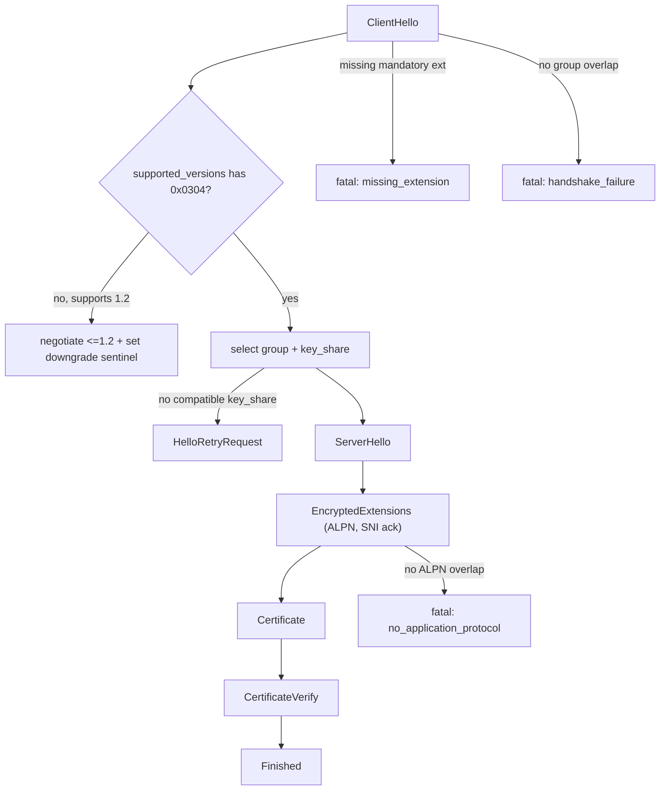

# TLS 1.3 Server Conformance Checklist (MUST / MUST NOT)

Scope: a TLS 1.3 server for HTTP over TLS (https for HTTP/1.1, h2 for HTTP/2).
HTTP/3 does NOT use this stack: it uses QUIC-TLS (RFC 9001), covered in http3-conformance-must-checklist.md.

Specs:
- RFC 8446 (TLS 1.3)
- RFC 7301 (ALPN)
- RFC 6066 (TLS Extensions, Server Name Indication)
- RFC 5280 (X.509 PKIX certificate path validation)
- RFC 6125 (service identity verification)

Citation convention: each cite is prefixed with the RFC, for example (8446 4.1.2), (7301 3.2), (6066 3).

Build note: the packet/record AEAD and HKDF primitives are pure-Zig on std.crypto, but the handshake state machine (this file) and X.509 path validation (RFC 5280) are what realistically push you to bind a C TLS library.

## 1. Handshake flow (8446 4)
- [ ] A TLS 1.3 ClientHello has legacy_version 0x0303 and a supported_versions extension listing 0x0304. Attempt 1.3 only if supported_versions is present (8446 4.1.2)
- [ ] legacy_compression_methods MUST be exactly one byte equal to 0. Any other value MUST abort with illegal_parameter (8446 4.1.2)
- [ ] MUST ignore unrecognized cipher suites, extensions, and parameters (8446 4.1.2, 9.3)
- [ ] After 1.3 is negotiated, any later ClientHello MUST terminate with unexpected_message (no renegotiation) (8446 4.1.2)
- [ ] No overlap between client and server supported_groups (non-PSK) MUST abort with handshake_failure or insufficient_security (8446 4.1.1)
- [ ] If a group is selected but the client offered no compatible key_share, the server MUST respond with HelloRetryRequest (8446 4.1.1)
- [ ] ServerHello: legacy_version MUST be 0x0303, legacy_compression_method MUST be 0, random MUST come from a secure RNG independent of ClientHello.random (8446 4.1.3)
- [ ] ServerHello extensions MUST include only those needed for crypto context and version, and MUST include supported_versions. All others go in EncryptedExtensions (8446 4.1.3)
- [ ] HelloRetryRequest MUST include supported_versions and MUST NOT contain extensions the client did not offer (except cookie). The retried ClientHello MUST negotiate the same cipher suite (8446 4.1.4)
- [ ] MUST send EncryptedExtensions immediately after ServerHello (8446 4.3.1)
- [ ] Mandatory server flight order: ServerHello, EncryptedExtensions, optional CertificateRequest, Certificate, CertificateVerify, Finished (8446 4.4)
- [ ] Handshake messages MUST NOT interleave with other record types and MUST NOT span key changes. Zero-length handshake fragments MUST NOT be sent (8446 5.1)

## 2. Mandatory-to-implement crypto (8446 9.1)
- [ ] Cipher suite: MUST implement TLS_AES_128_GCM_SHA256 (SHOULD also AES_256_GCM_SHA384 and CHACHA20_POLY1305_SHA256)
- [ ] Signature schemes: MUST support rsa_pkcs1_sha256 (certs), rsa_pss_rsae_sha256, ecdsa_secp256r1_sha256
- [ ] Key-exchange group: MUST support secp256r1 (SHOULD also X25519)
- [ ] The ServerHello cipher_suite MUST be a single suite drawn from ClientHello.cipher_suites (8446 4.1.3)

## 3. Key schedule and record protection (8446 5, 7)
- [ ] Key derivation MUST use HKDF-Expand-Label and Derive-Secret. HkdfLabel.label is "tls13 " plus the label (8446 7.1)
- [ ] All records use AEAD. Outer opaque_type MUST be application_data(23). legacy_record_version MUST be 0x0303 and MUST be ignored on receipt (8446 5.2)
- [ ] Application Data MUST NOT be written unprotected. Everything from EncryptedExtensions on MUST be encrypted under handshake traffic keys, and post-Finished records under application traffic keys (8446 5.1, 5.2)
- [ ] TLSCiphertext.length MUST NOT exceed 2^14 + 256. A larger record MUST terminate with record_overflow. AEAD deprotect failure MUST terminate with bad_record_mac (8446 5.2)
- [ ] The first record under a given key MUST use sequence number 0. On 64-bit sequence wrap the server MUST rekey or terminate (8446 5.3)
- [ ] Downgrade sentinel: when a 1.3-capable server negotiates 1.2, ServerHello.random last 8 bytes MUST be 44 4F 57 4E 47 52 44 01. For 1.1 or lower, 44 4F 57 4E 47 52 44 00 (8446 4.1.3)

## 4. Extensions the server MUST handle (8446 4.2, 9.2)
- [ ] MUST implement: supported_versions, cookie, signature_algorithms, signature_algorithms_cert, supported_groups, key_share, server_name (9.2)
- [ ] A 1.3 ClientHello without pre_shared_key MUST contain signature_algorithms and supported_groups. A noncompliant ClientHello MUST abort with missing_extension (9.2)
- [ ] When supported_versions is present, MUST NOT use legacy_version to negotiate. Select the version only from that extension (4.2.1)
- [ ] (EC)DHE: the server key_share MUST be in a group from client supported_groups, MUST NOT be for an unoffered group, and MUST NOT be sent when using psk_ke (4.2.8)
- [ ] ServerHello, EncryptedExtensions, and Certificate MUST NOT include any extension the client did not first offer (4.1.3)

## 5. ALPN (7301)
- [ ] If the server supports none of the client protocols, it MUST send a fatal no_application_protocol alert (8446 alert 120) (7301 3.2)
- [ ] The server ALPN response MUST contain exactly one ProtocolName (MUST NOT select more than one) (7301 3.1)
- [ ] The named protocol is definitive. The server MUST NOT announce one protocol then use another for application data (7301 3.2)
- [ ] ProtocolName MUST NOT be empty or truncated. For https the selectable ids are "http/1.1" and "h2" (7301 3.1)
- [ ] In TLS 1.3 the ALPN extension is carried in EncryptedExtensions, not ServerHello (8446 4.3.1)

## 6. SNI (6066 3)
- [ ] ServerNameList MUST NOT contain more than one name of the same type. Literal IP addresses are not permitted as HostName
- [ ] If the server understood the extension but does not recognize the name, it SHOULD abort with fatal unrecognized_name or continue (a warning-level alert is not recommended)
- [ ] If the server uses SNI to select certificate or policy, it MUST include an empty server_name extension in its response
- [ ] On resumption, MUST NOT accept resumption if server_name differs (do a full handshake), and when resuming MUST NOT include a server_name extension

## 7. Certificate and authentication (8446 4.4)
- [ ] MUST send a Certificate message for all certificate-based key exchange. The certificate_list MUST be non-empty (4.4.2)
- [ ] Certificate type MUST be X.509v3 unless otherwise negotiated. The end-entity key MUST be compatible with the selected signature algorithm. If a Key Usage extension is present, the digitalSignature bit MUST be set. The end-entity certificate MUST be first in the list (4.4.2, 4.4.2.2)
- [ ] MUST send CertificateVerify when authenticating by certificate, after Certificate and before Finished. The signature MUST use an algorithm from client signature_algorithms, RSA MUST use RSASSA-PSS, and SHA-1 MUST NOT be used (4.4.3)
- [ ] The CertificateVerify content is the 64-byte 0x20 pad, the context string "TLS 1.3, server CertificateVerify", a 0x00 separator, then the Transcript-Hash. Verify failure MUST terminate with decrypt_error (4.4.3)
- [ ] MUST send Finished. finished_key is HKDF-Expand-Label(BaseKey, "finished", "", Hash.length). verify_data failure MUST terminate with decrypt_error (4.4.4)
- [ ] A certificate requiring an MD5-based signature to validate MUST abort with bad_certificate. SHA-1 is recommended to reject (4.4.2.4)

## 8. Certificate path validation (5280) and identity (6125)
Applies to validating a client certificate under mutual TLS, and is the same logic a peer applies to the server chain.
- [ ] For each cert in the path: the signature MUST verify under the working public key, the validity period MUST include the current time, the cert MUST NOT be revoked, and issuer MUST equal the working issuer name (5280 6.1.3)
- [ ] subject and subjectAltName names MUST be within permitted_subtrees and MUST NOT be within excluded_subtrees (5280 6.1.3)
- [ ] A v3 intermediate MUST carry basicConstraints with cA TRUE. If Key Usage is present on an intermediate, keyCertSign MUST be set (5280 6.1.4)
- [ ] Honor pathLenConstraint. For a non-self-issued cert the remaining path length MUST be greater than 0 then decremented (5280 6.1.4)
- [ ] Any unrecognized critical extension MUST cause rejection (5280 6.1.4)
- [ ] DNS-ID matching: labels compared case-insensitive ASCII, IDN U-labels converted to A-labels first. If a subjectAltName dNSName is present it MUST be used, and CN-ID is only a last resort when no DNS-ID, SRV-ID, or URI-ID is present (6125 6.4)
- [ ] On no match and no pinning, an automated client SHOULD terminate with a bad-certificate error, and that default MUST be enabled (6125 6.6)

## 9. Alerts and error handling (8446 6)
- [ ] On send or receipt of any fatal alert, both parties MUST immediately close the connection without further data. All alerts in 6.2 are fatal, and unknown alert types MUST be treated as errors
- [ ] Secrets and keys from a failed connection MUST be forgotten (session-ticket PSKs SHOULD be discarded)
- [ ] Each party MUST send close_notify before closing its write side unless an error alert was already sent. Data after a closure alert MUST be ignored (8446 6.1)
- [ ] An unparseable message MUST terminate with decode_error. A syntactically valid but semantically invalid value MUST terminate with illegal_parameter

Condition to fatal-alert summary (all fatal):
| Condition | Alert |
| :- | :- |
| Unsupported version | protocol_version |
| Missing mandatory extension | missing_extension |
| Prohibited or unoffered extension | unsupported_extension |
| No group or parameter overlap | handshake_failure or insufficient_security |
| AEAD deprotect failure | bad_record_mac |
| Oversize record | record_overflow |
| Signature, Finished, or binder verify failure | decrypt_error |
| Bad or MD5 certificate | bad_certificate |
| Missing client cert when required | certificate_required |
| No ALPN overlap | no_application_protocol |
| Unknown SNI | unrecognized_name |

## 10. 0-RTT, early data, and downgrade MUST NOTs (8446 4.2.10, 8)
- [ ] On an early_data extension the server MUST do exactly one of: ignore it, send HelloRetryRequest, or accept by echoing early_data in EncryptedExtensions. It cannot accept a subset
- [ ] To accept early data the server MUST have selected the first offered PSK and MUST verify the version, cipher suite, and ALPN all match those bound to the PSK
- [ ] The server MUST ensure any single serving instance accepts a given 0-RTT handshake at most once. Cross-instance replay MUST be handled by the application, since TLS does not replay-protect 0-RTT data (8446 8)
- [ ] If supported_versions is absent and the server supports 1.2, it MUST negotiate at most 1.2 and MUST NOT use legacy_version when supported_versions is present (8446 4.2.1)
- [ ] Application Data MUST NOT be sent unprotected (8446 5.1, 5.2)
- [ ] A 1.3 server MUST NOT send status_request_v2 and MUST NOT act on its presence (8446 4.4.2.1)

## Note: HTTP/3 uses a different TLS binding
For HTTP/3 the TLS 1.3 handshake is carried in QUIC CRYPTO frames and packet protection is QUIC-native (RFC 9001), not the TLS record layer above. The handshake messages, key schedule, certificate, and ALPN rules here still apply, but the record protection in sections 3 and 9 is replaced by QUIC packet protection. See http3-conformance-must-checklist.md.
