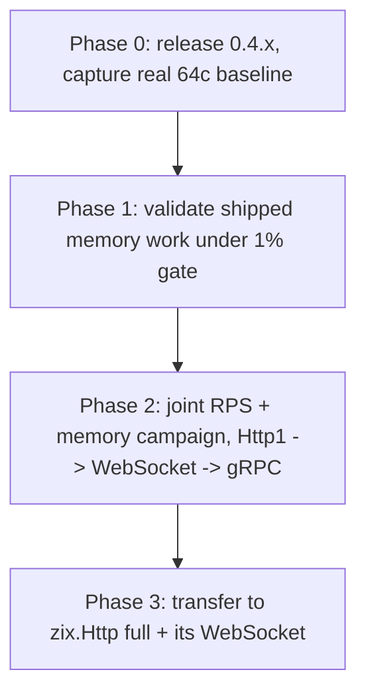
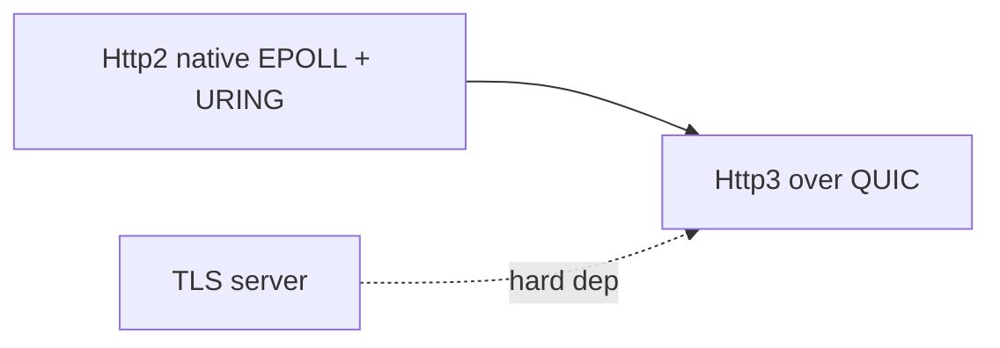

# Roadmap 0.5.x: RPS and memory-efficiency leadership

> Goal: zix stands out in BOTH requests-per-second and memory efficiency across
> baseline, pipelined, and short-lived (limited-conn) cells, without sacrificing
> json. Engine order: Http1 first (EPOLL and URING), then WebSocket, then gRPC.
> After all three lead, transfer the same work to zix.Http full plus its WebSocket.

## Why this milestone exists

The 0.4.x memory work (slot and slab demand-paging) was developed and
memory-validated on the laptop isolate bench, which has a 2 to 3% whole-run
variance. That variance cannot resolve a sub-1% throughput change. 0.4.x ships
the current memory work as-is so the project gets ACTUAL 64-core HttpArena data,
then 0.5.x runs the targeted campaign on that real signal.

The board is loopback (about 85% kernel-bound). On that board:

- io_uring NIC features (send_zc, fixed buffers) do not help, they target a real
  NIC, not loopback.
- the RPS differentiator is per-request CPU and cache-locality.
- memory efficiency is the most defensible axis to lead, because RPS clusters
  (kernel-bound) while memory varies widely between engines.

## Hard gate (carried from 0.4.x)

A performance downgrade of MORE THAN 1% on the URING benchmark is NOT
ACCEPTABLE. Scope: zix_http_uring (Http1 URING), zix_ws_uring (Http1 WebSocket
URING), zix_grpc_uring (gRPC URING). Any cell that regresses >1% on the 64-core
run must be double-checked, then fixed or reverted, no exceptions. The 0.5.x
campaign adds a second side to the gate: a memory lever must not give back RPS,
and an RPS lever must not give back memory.

The gate already worked once: the gRPC mmap-bodies squeeze was caught at -20 to
-22% RPS on unary-grpc for zero memory gain, and was reverted. That is the model.

## Work lanes

The milestone runs two lanes in parallel:

- Gated lane (the perf campaign): Phases 0-3 plus the Init-time size knobs. Every lever
  is measured against the 64-core HttpArena benchmark under the hard gate, so this lane
  only advances when a real 64c run is available (the laptop cannot resolve a sub-1%
  change).
- Do-now lane (benchmark-independent implementation): the Protocol track (Http2 native
  dispatch, TLS server, HTTP/3, RSA) and the Compression tail (brotli, per-(key,
  encoding) cache). These are implementation, not measurement, so they land without the
  64c box. They still ride the hard gate wherever they touch shared engine code (no
  greater than 1% URING regression, no memory given back), but they are not blocked on
  it.

So the do-now items are not a new track: they are the implementation lane already spread
across the Protocol track and the Response compression section below. The two sections
already say "parallel, not sequenced", this names which of their items can start now.

## Zig version decision (resolved, ADR-044)

RESOLVED 2026-06-21 (ADR-044): zix supports BOTH
Zig 0.16 and 0.17 via comptime `ZIG_SEMVER` gating, so 0.5.0 does not pick one. The
0.16-to-0.17 regression is closed (green on 0.16.0 and 0.17.0-dev across all build
steps, including the 56-protocol test-runner). This no longer blocks Phase 1: the perf
campaign baselines on whichever version the 64-core image ships, and the gating keeps
both green. The std.Io interface difference (the std.Io.Uring abstraction versus the
raw linux.IoUring used today) is absorbed by the gate, not a fork in the io_uring path.

## Phases



### Phase 0: ground truth

Release 0.4.x with the current memory work. Capture the first real 64-core
HttpArena numbers for every engine on BOTH URING and EPOLL. This is the baseline
every later decision is measured against. No more inference from the 6-core
laptop.

### Phase 1: validate what shipped

Confirm A0 (release-on-close), A5 (demand-paged slots), and the shared-slab
propagation are within 1% on the URING benchmark. If a cell regresses, apply the
recovery ladder and keep the rung that retains the most memory:

1. batch the madvise (one call over the dead tail every N closes, instead of one
   per close), to cut the per-close TLB shootdown cost on a many-core host.
2. switch MADV_DONTNEED to MADV_FREE (lazy reclaim, no immediate fault on reuse).
3. revert the lever on the engine where it does not pay.

Note: EPOLL A0 is the one lever URING cannot see (URING has no slab). It still
needs its own EPOLL sign-off, and it is the candidate for the batched variant.

### Phase 2: joint RPS + memory campaign

For each engine (Http1 first, then WebSocket, then gRPC), for each cell, find the
lever that moves one axis without regressing the other. The gate is two-sided.

| Cell | RPS lever | Memory lever |
| :- | :- | :- |
| baseline | per-request CPU: baked response prefix, integer-compare parse (ADR-040 family), fewer syscalls | demand-paged slots (shipped) |
| pipelined | response coalescing (RespSink, shipped) plus recv-batch sizing | recv buffer right-sizing |
| short-lived | fast accept and close, idle-conn object pool on EPOLL (URING already has it) | A0 slab-release (shipped), released-on-close |
| json | guard only: keep response cache and RespSink grow, do not regress | keep arena reset capped |

json is a regression guard in every change, not a target. The response cache
already gives a large win on heavy json. The risk in chasing baseline and
pipelined is regressing json buffers, so every lever is checked against json.

#### Ln CPU cache utilization

The loopback board is kernel-bound, so RPS clusters and the engine-side
differentiator is cache behaviour. The CPU-cache budget per worker (64c box): L1d
32 KiB/core, L2 512 KiB/core, L3 16 MiB per
4-core CCX. Per-conn cost is approx 32 KiB (recv plus send buffers).

Measurement on 2026-06-20 split "cache utilization" into two distinct questions with
different answers (perf record + perf stat localization, raw in
`rnd/0.5.x/perf-per-request-uring-vs-epoll-0.4.x.md` and
`rnd/0.5.x/perf-localize-http1-0.4.x.md`):

| Question | Finding | Lever |
| :- | :- | :- |
| Per-request L1d misses (the hot path) | approx 95% are KERNEL (syscall entry/exit, TCP send/recv/ack, skb alloc). The only zix symbol in the top 30 is serveEpollConn / UringWorker.run at under 1%, and it holds the whole user path (parse, RespSink, slot lookup) | syscall count per request. The EPOLL to URING gap (approx 548 to 359 misses/req) is ONE bucket: entry_SYSRETQ_unsafe_stack 9.15% to 2.86%. `.URING` batches the syscalls and already ships this. No EPOLL user-space layout change can move it (the @prefetch attempt was null, confirmed by attribution) |
| Cache residency of the live connection set (the c512 to c4096 spill) | a memory-footprint question: fit (conns/worker x approx 32 KiB) under the CCX L3 share. 64c: 64 conns/worker = 2 MiB fits. Laptop 6-worker, 4096c is approx 683 conns/worker = 22 MiB and spills to DRAM | shrink the per-conn footprint so more connections stay resident: the A2 idle-pool reclaim and the URING_SEND_BUF_SIZE / max_recv_buf size knobs in the section below. This is the one with remaining headroom |

Already captured (do not re-pitch as new levers): contiguous slots plus slab, inline
Conn, response cache plus cached Date plus baked response prefixes, integer-compare
parse, comptime-baked handler, RespSink coalescing, MSG_TRUNC zero-copy drain,
shared-nothing plus pinToCpu (no false sharing), URING zero-copy recv.

So the cache work is not a new hot-path lever, it is the memory axis: shrinking the
per-conn footprint to raise L3 residency of the live set, which is exactly the
Init-time size knobs and A2 below. Measure per-request L1-dcache-load-misses with
perf stat (works without sudo at paranoid=2), and use perf record by hand for symbol
attribution (the agent sandbox blocks perf record). The L3-residency axis (the c512
to c4096 cliff) needs L3 miss counters that this consumer laptop does not expose, so
its sign-off belongs to the 64-core run.

### Phase 3: transfer to zix.Http full plus its WebSocket

Once Http1, WebSocket, and gRPC lead, carry the proven levers into zix.Http full
and its WebSocket. Same gate, same two axes.

## Init-time size knobs (promote selected constants to config)

Several per-connection and per-worker sizes are comptime `const` in
`src/tcp/http1/server.zig` today, not config. Promoting the safe ones to
`Http1ServerConfig` makes the memory and throughput envelope init-tunable per
deployment without a rebuild, the natural companion to the Phase 2 memory levers:
a memory-tight host dials the per-conn footprint down, a big-response host dials
send headroom up. The handler is not exposed to any of these, the only
handler-visible size is the request body, already bounded by max_recv_buf.

The runtime knobs that already exist (the A set, already in config): kernel_backlog,
max_recv_buf, ws_recv_buf, workers, pool_size, cache_max_entries,
cache_max_value_bytes, cache_max_total_bytes, send_date_header, compression,
compression_min_size, compression_max_out.

Candidates to promote (the B set), with the split that decides feasibility:

| Constant | Default | Model | Promote? |
| :- | -: | :- | :- |
| URING_SEND_BUF_SIZE | 16 KiB | URING | yes, top priority: the per-conn send half of the footprint (max_recv_buf already covers recv) |
| URING_IDLE_POOL_FLOOR | 64 | URING | yes, easiest: already a per-worker field, only needs config threaded to init |
| URING_SEND_BUF_MAX | 1 MiB | URING | yes: per-conn send grow ceiling |
| EPOLL_OUT_BUF_SIZE | 64 KiB | EPOLL | yes: one per worker, cheap |
| URING_CQ_ENTRIES / URING_ENTRIES | 16384 / 4096 | URING | yes: ring depth |
| MAX_FD | 65536 | EPOLL, URING | yes, but it sizes the slab virtual (MAX_FD x buf_size), confirm demand-paging holds |
| WS_RING_BUF_SIZE / COUNT | 4096 / 256 | URING WS | yes: WS provided-buffer ring depth |
| EPOLL_MAX_EVENTS | 4096 | EPOLL | no: sizes a fixed stack array, must stay comptime |
| URING_CQE_BATCH | 512 | URING | no: sizes a fixed stack array, must stay comptime |

First slice: URING_SEND_BUF_SIZE plus URING_IDLE_POOL_FLOOR. Together with the
existing max_recv_buf they make the full per-connection URING cost (recv plus send
plus warm pool) init-tunable, which is the whole per-conn memory envelope the c512
to c4096 footprint comes from.

Cost and gate:

- Flat-config rule: every new field is added across all 8 engine configs, not just
  Http1. That sweep is the bulk of the work.
- The two-sided gate still applies: URING_IDLE_POOL_FLOOR is the A2 gate knob, so
  its default and any exposed range are validated on the 64-core run before it
  ships.
- This is ergonomics and tunability, not a perf change by itself: the defaults
  stay exactly as today, so promoting a knob is gate-neutral until a value is
  actually changed.

## Metric for "standing out"

The headline axis is memory-per-RPS at competitive throughput, the axis no other
engine on the board is contesting. Secondary RPS evidence is per-request L1-miss
count (the one place URING genuinely beats EPOLL, -20 to -33% on this box), which
is the engine-side win that survives the loopback ceiling.

## Open questions for the user

1. Loopback only, or also real-NIC? If real-NIC matters, the lever set changes
   (send_zc and fixed buffers come back into scope).
2. "Stand out" = lead the RPS board (hard, kernel-bound clustering) or lead
   memory efficiency at competitive RPS (very winnable)?
3. ~~Zig 0.16 or 0.17 for 0.5.0?~~ RESOLVED (ADR-044): support both via comptime
   `ZIG_SEMVER` gating, no single version is picked.
4. Memory metric: cgroup RSS (peak or steady), per-connection, or per-RPS?

## Protocol track (Http2, Http3, TLS)

A separate track from the perf campaign above: that campaign deepens HOW fast and
lean zix serves, this widens WHAT it serves. It runs parallel, not sequenced after
the phases. The same hard gate applies wherever it touches shared engine code: no
>1% URING regression, and no memory given back.



### Http2: native EPOLL and URING dispatch

zix.Http2 already speaks h2c cleartext, but the standalone
engine still falls back to .POOL: it never got the
native EPOLL and URING dispatch the other engines have. gRPC already proved the h2
state machine runs multiplexed on epoll and uring with a resumable per-stream frame
loop, so this is porting that approach into
zix.Http2 itself: comptime route table, per-stream state carried on the ring, all
four dispatch models. Bringing Http2 to parity with Http1 and gRPC is the
lowest-risk item here because the pattern is proven.

### Http3: QUIC over UDP

The large item. HTTP/3 is QUIC (a UDP transport, std provides none) plus a new
framing and header layer (QPACK). It needs UDP datagram I/O (zix.Udp exists,
recvmmsg and sendmmsg are present), QUIC connection and stream multiplexing, loss
recovery and congestion control, and TLS 1.3 baked into the handshake (QUIC mandates
it). Feasible pure-Zig and a full
0.5.x target, built in phases within the milestone: first a datagram path plus a
minimal handshake, then the QUIC connection and stream state machine, then QPACK and
HTTP/3 framing. It is the one item with a hard prerequisite (TLS).

### TLS (added, not prior)

TLS is in the roadmap but is NOT a prior item: it does not gate the perf campaign and
is not sequenced ahead of the Http2 work. A TLS PoC already passed all four tiers,
though no TLS code is in src/ yet (std ships a client only, a server
needs an ECDSA or Ed25519 certificate path, reachable pure-Zig without OpenSSL). The
caveat that fixes its ordering: TLS is OPTIONAL for Http1 and Http2 (both keep a
cleartext path) but a HARD dependency for Http3. So TLS stays low priority until Http3
is actually picked up, at which point it becomes that item's prerequisite, not before.

TLS client (its OWN milestone): zix.Tls is server-only today. A native TLS 1.3 CLIENT (making
https requests) is now a distinct milestone, promoted because the h2-over-TLS server runner is
blocked on it: verifying ALPN h2 needs a client that OFFERS ALPN h2, and neither std.crypto.tls
Client (its ClientHello has a fixed extension list with NO application_layer_protocol_negotiation
and no option to add one) nor zix (server handshake only) can offer ALPN. The client adds the
client-side handshake (ClientHello with supported_versions / signature_algorithms /
supported_groups / key_share / server_name AND an ALPN offer, ServerHello parse, client-side key
derivation, the client Finished) plus the part the server never needs: X.509 path validation (RFC
5280) and identity matching (RFC 6125) against a CA bundle. The crypto building blocks already
exist and are shared with the server (src/tls wire / key_schedule / record / certificate), so the
new surface is the client flow and cert verification, not the primitives. It is configurable from
the EXISTING client config, the flat HttpClientConfig in src/tcp/http/client_config.zig (the same
struct passed to zix.Http.Client.init, which already gained tls_ca_path for the std-backed http1
TLS path). An https:// URL opts in, with flat trust fields mirroring the server's tls_* shape (for
example tls_verify: bool = true, tls_ca_path for a custom root, tls_alpn). Once it lands it is
reused by (a) the deferred test-runner-tls-http2 native runner and (b) a future http_version=2
zix.Http.Client backend. The cleartext client path stays the default and untouched. Until this
lands the server's interop peers are openssl s_client and curl (a manual curl --http2 returned
http_version=2 + HTTP 200 against the h2 server, which is TLS 1.3-only; the body bytes and a
repeatable assertion await the runner), and it is NOT part of the TLS server conformance checklist.

h2-over-TLS runner (TRACKED, depends on the TLS client above): the server works (manual curl gave
http_version=2 + 200) but there is no in-build runner, because a runner must be a CLIENT that offers
ALPN h2, which only the zix.Tls client will provide. The plan, once that client lands:
- tests/runner/tls_http2_basic_runner.zig spawns example-tls_http2_basic (port 9061), then the
  zix.Tls client TCP-connects to localhost:9061, runs the TLS 1.3 handshake OFFERING ALPN h2 and
  trusting the fixture cert (tls_ca_path), and asserts the negotiated ALPN is h2.
- over that TLS stream it speaks a minimal h2 client, reusing the existing zix.Http2 frame + HPACK
  primitives: send the connection preface + SETTINGS, send HPACK-encoded HEADERS (GET / :scheme
  https :authority localhost) with END_STREAM, read SETTINGS + ack, then assert the response HEADERS
  carry :status 200 and the DATA frame carries the body "hello over h2 tls 1.3".
- add a port-9061 row to zix-build-test_runner.zig for test-runner-tls-http2, and fold it into
  test-runner-all (57 -> 58) once the client + h2-read path are stable.
Interim option, only if h2 coverage is wanted BEFORE the full verifying client: a test-only client
handshake in the runner that offers ALPN h2 but skips X.509 verification (reusing the shared zix.Tls
primitives), later swapped for the real verifying client. Recommended path is to build it directly on
the real client, so there is no throwaway code.

Version policy: TLS 1.3 is the default and the only required version, with TLS 1.2
as an OPTIONAL non-deprecated fallback for older clients. Everything below 1.2 is
deprecated or prohibited and is never put on the wire, which is both a security
stance and the SSL Labs requirement (offering TLS 1.0 or 1.1 caps the grade at B):

| Version | zix policy | Status |
| :- | :- | :- |
| TLS 1.3 | default, required | current (RFC 8446) |
| TLS 1.2 | optional fallback | current (RFC 5246, allowed) |
| TLS 1.1 | never offered | deprecated (RFC 8996, March 2021) |
| TLS 1.0 | never offered | deprecated (RFC 8996, March 2021) |
| SSL 3.0 | never offered | deprecated (RFC 7568) |
| SSL 2.0 | never offered | prohibited (RFC 6176) |

TLS 1.2 support (TRACKED, OPTIONAL, not started): zix is TLS 1.3-only by IMPLEMENTATION scope, NOT
because 1.2 is obsolete. TLS 1.2 (RFC 5246) is NOT deprecated (only 1.0 / 1.1 are, RFC 8996) and is
still widely deployed, so supporting it is a product decision driven by the target client population
(older Android, legacy OpenSSL, some embedded / enterprise stacks need it; modern browsers and
clients do not). It buys nothing for the A+ grade or RFC 8446 conformance, so it stays deferred until
a concrete legacy-client need appears. The work, when scheduled, is a separate track, not a small
add: a SHA-256 / SHA-384 PRF key schedule (distinct from the 1.3 HKDF one), the 1.2 record layer
(AEAD, plus optionally CBC-HMAC), the 1.2 handshake shape (ServerKeyExchange ECDHE + ServerHelloDone,
no EncryptedExtensions, the 1.2 Finished / verify_data), cipher-suite negotiation across both
versions, AND the downgrade-protection sentinel in ServerHello.random (RFC 8446 4.1.3), which only
becomes REQUIRED once the server offers both 1.3 and 1.2 (see the Layer H checklist box, currently
N/A while 1.3-only). Tracked here so the decision is explicit, not implicit.

Target when TLS does land: an SSL Labs (Qualys) A+ grade, the top of the ladder (A+
down to F, there is no A++). The A+ requirements fall out of the design already
chosen, so it is a target, not extra work:

| A+ requirement | How zix meets it |
| :- | :- |
| Protocols: TLS 1.3 only (no SSL2/3, no TLS 1.0/1.1) | the TLS 1.3 handshake is the only path written. TLS 1.0/1.1 would cap the grade at B, so they are never offered |
| Forward secrecy on every suite | TLS 1.3 mandates ECDHE, so it is automatic |
| AEAD ciphers only (AES-GCM, ChaCha20-Poly1305) | TLS 1.3 mandates AEAD, so it is automatic. std.crypto provides both |
| Trusted certificate, strong key | ECDSA P-256 or Ed25519 cert (the std-supported signing path). Scores identically to RSA 2048 here, so RSA is not needed for A+ |
| HSTS header, max-age >= 15552000 (180 days) | application-layer: the engine writes one `Strict-Transport-Security` response header. No crypto. This is the single A to A+ bump |

The point: TLS 1.3-only maxes the three numeric SSL Labs categories (protocol, key
exchange, cipher) by construction, then the HSTS header turns the resulting A into
A+. The ECDSA / Ed25519 certificate reaches A+ without ever closing the RSA
std-gap below, which is exactly why RSA signing is marked OPTIONAL.

### RSA signing (the one crypto std-gap)

The crypto story has exactly one place std hands you nothing: RSA private-key
signing. `std.crypto.sign` ships ECDSA (P-256) and Ed25519 signing, and std can
VERIFY RSA (certificate path validation, and RS256 token verify), but it cannot
SIGN with an RSA private key. That single gap is what blocks an RSA server
certificate for TLS (the cert caveat on subjects 1 and 2 of proposal-features.md)
and full RS256 JWT issuance in the auth middleware (subject 9, verify-only today).

> The lone std-gap in an otherwise pure-Zig crypto surface. Optional, but it closes
> the last "cannot, without authoring it" footnote in the feasibility summary.

The work is authoring PKCS#1 v2.2 on std's big-integer modular arithmetic plus the
existing hash primitives: RSASSA-PKCS1-v1_5 and RSASSA-PSS with their EMSA
encodings. The reference material is already vendored, it is just not catalogued in
`rnd/rfc/README.md` yet:

| RFC | File | Covers |
| :- | :- | :- |
| 8017 | `rnd/rfc/rfc8017.txt` | PKCS#1 v2.2, the canonical RSA spec (primitives, PSS, PKCS1-v1_5, OAEP) |
| 4055 (+5756) | `rnd/rfc/rfc4055.txt` | RSASSA-PSS / OAEP algorithm identifiers in X.509 |
| 3279 | `rnd/rfc/rfc3279.txt` | RSA key and signature identifiers in X.509 |
| 7518 | `rnd/rfc/rfc7518.txt` | JWS RSA algorithms (RS256 / PS256) |

Scope and priority: OPTIONAL, on no critical path. An ECDSA or Ed25519 certificate
avoids RSA entirely for TLS and stays the standing recommendation, so RSA earns its
place only where an external CA or a client mandates an RSA certificate, or where
RS256 (not ES256) token issuance is required. It is a security-sensitive primitive
(constant-time, padding-oracle aware), so it ships behind its own test surface and
is gated, not folded into the TLS item. The two-sided perf gate does not apply (it
is off the request hot path), but the standard test-discovery gate does (a new
`src/` file needs its own `refAllDecls` line, or its tests silently never run).

## Response compression (gzip / deflate)

A feature track parallel to the protocol work: it widens WHAT zix serves rather
than how fast. The item is `Accept-Encoding` negotiation with gzip and deflate
response compression (proposal-features.md subject 3, promoted from `candidate` to a
0.5.x item here). It is pure-Zig with no std-gap: `std.compress.flate.Compress` with
`Container.gzip` already gives both, and zix.Http1 already shipped an early gzip
codec as a handler helper (`writeGzip` in `src/tcp/http1/core.zig`). brotli and zstd
stay OUT (brotli is absent from std, zstd is
decompress-only, and brotli also drags a roughly 120 KB static dictionary), so the
scope is gzip and deflate only to stay dependency-free.

> High bandwidth payoff, and it strengthens the cache story instead of competing
> with it.

Status (2026-06-22): the gzip and deflate codecs and the engine-level wiring landed
for both HTTP-response engines, ahead of the Phase 3 transfer.

DONE:
- the gzip and deflate codecs in `src/utils/compression/flate.zig` (container-
  parameterized over `std.compress.flate`: gzip = RFC 1952, deflate = zlib-wrapped
  RFC 1950, NOT raw, with a python `zlib.compress` interop vector test), and the
  `Accept-Encoding` facade in `src/utils/compression/compression.zig` (`negotiate`
  with q-values / `identity` / wildcard / `q=0`, the size floor, the
  already-compressed media-type skip, and encode/decode dispatch). `supported_default`
  = gzip then deflate (gzip preferred).
- engine wiring on zix.Http1 (`core.writeNegotiated`, fd-direct) and zix.Http
  (`Response.sendNegotiated`, the Response object), both setting `Content-Encoding`
  and `Vary: Accept-Encoding`, installed under `.EPOLL` and `.URING`. gRPC keeps its
  own per-message `grpc-encoding` (`src/tcp/http2/grpc/frame.zig`); WebSocket
  permessage-deflate (RFC 7692) is out of scope for this item.

- the `http1_compression` (port 9058) and `http_compression` (port 9059) examples plus
  the `test-runner-http1-compression` and `test-runner-http-compression` runners
  (raw-socket, exercising gzip / deflate / identity / size-floor) and a changelog entry,
  all landed. A worker that compresses spawns with a 2 MiB stack since
  `std.compress.flate.Compress` is about 230 KB and is built on the handler stack frame.
- enum casing aligned to the UPPER_CASE convention: `Encoding` (IDENTITY / GZIP /
  DEFLATE / BR) and flate `Level` (FASTEST / DEFAULT), `.token()` still returns the
  lowercase wire string.

REMAINING:
- brotli (`brotli.zig`, the deferred std-gap), still OUT of the gzip+deflate scope.
- per (key, encoding) cache integration: the cache key does not yet include the
  coding, so writeNegotiated / sendNegotiated do not cache. That is the slice that
  brings compression inside the two-sided gate below.
- the 64-core perf validation (loopback shows only the CPU cost, the bandwidth win
  needs a real NIC).

Cache integration is what keeps it inside the hard gate: cache the COMPRESSED bytes
once per (key, encoding) and replay them with no re-encode, so the hot path stays
the ADR-036 cache replay and the flate pass is the cold or miss path only.
Two-sided gate: an uncompressed or cache-hit response must not regress (negotiation
is one header check on the hot path), and the cache memory must not balloon from
storing both plain and compressed variants, so the compressed bytes are the cached
representation and identity is produced only when a client explicitly asks for it.

Config: the `compression` enable, the `compression_min_size` floor, and the
codec-agnostic `compression_max_out` cap (renamed from the gzip-specific
`max_gzip_out`). Scoped "where applicable" to the HTTP-response engines that
negotiate Accept-Encoding, zix.Http1 and zix.Http, matching the response_cache
footprint rather than all 8 configs. gRPC keeps
its own per-message coding; the raw transports have no HTTP negotiation.

No PoC or RnD needed, direct-to-implementation: the codec is already proven in-tree
(`writeGzip` on Http1, plus `flate.Compress` / `Decompress` in the gRPC framing), so
the feasibility unknown an RnD spike would answer is already closed. The
implementation has since landed under the standard test gate (negotiation parser and
gzip / deflate decode-roundtrip tests in, cache-hit replay pending the cache slice)
plus the 64-core perf gate, not a research item. RnD effort stays reserved for TLS, HTTP/3, and RSA where feasibility
is genuinely open. The one guarded interop point is now settled in code: the
`deflate` Content-Encoding token means zlib-wrapped (RFC 1950), not raw DEFLATE, so
`flate.zig` maps `deflate` to the `.zlib` container (raw left as the rarer, separate
case), verified by decoding a python `zlib.compress` vector.

Placement (landed): the codec was consolidated into one shared folder under
`src/utils/`, the same cross-engine-helper home as `response_cache.zig`. gRPC keeps
its own flate calls in `src/tcp/http2/grpc/frame.zig` for now. A folder, not a single
file, because brotli is a std-gap of a different weight class (an authored encoder
plus a roughly 120 KB static dictionary) and must not bloat the thin gzip / deflate
wrapper:

```
src
|
|___/utils
|   |___/compression
|   |   |___compression.zig    (facade: Encoding enum, negotiate(Accept-Encoding), encode/decode dispatch)
|   |   |___flate.zig          (gzip + deflate = zlib/raw, thin std.compress.flate wrappers)
|   |   |___brotli.zig         (authored encoder + ~120 KB static dict, optional, deferrable)
|   |
|   |___file.zig
|   |___response_cache.zig
```

Layering: the byte codec is transport-agnostic and lives in the folder, the q-value
`Accept-Encoding` negotiation stays in `compression.zig` (it is coupled to the
`Encoding` enum), and the per-engine wiring (`Content-Encoding` / `Vary` headers,
the `(key, encoding)` cache key) stays in each engine write path. gRPC reuses the
codec (`flate.zig`) but keeps its own `grpc-encoding` per-message negotiation, a
different protocol layer from HTTP `Content-Encoding`. Each new file needs its own
`refAllDecls` line in `src/lib.zig`. brotli stays a
single deferrable file so shipping gzip and deflate only does not touch it.

## Cross-references

- The 0.5.x milestone and the hard perf gate.
- The A2 idle-pool work and the URING_IDLE_POOL_FLOOR knob.
- The isolate bench tooling and per-lever record (rnd/isolate_benchmark.md).
- The 64-core box topology.
- Why io_uring NIC features do not help on loopback.
- rnd/proposal-zix_epoll_and_uring-optimization-issue.md plus comment-1..5: the
  0.4.x memory work that this milestone re-validates and extends.
- The protocol status table and the TLS, HTTP/3, gRPC-h2 dependency chain.
- The shipped zix.Http2 (h2c, comptime route table).
- The TLS PoC and its four passing tiers.
- Pure-Zig feasibility of TLS server and HTTP/3 versus the std library.
- proposal-features.md: the candidate-feature catalogue these two tracks promote
  (subjects 1 and 2 carry the RSA certificate caveat, subject 3 is the compression
  candidate).
- rnd/rfc/rfc8017.txt (plus 4055, 3279, 7518): the RSA / PKCS#1 reference material
  for the signing item, alongside rnd/rfc/README.md for the HTTP and TLS conformance
  checklists.
- The refAllDecls test-discovery gate for any new src/ file (RSA primitive,
  compression negotiation).
